> **Reconstructed by a model.** `lectures/02-slides.pdf` from [ocw-7091j](https://ocw.mit.edu/courses/7-91j-foundations-of-computational-and-systems-biology-spring-2014/) — ocw-7091j, licensed CC BY-NC-SA 4.0. Converted 2026-09-20 from `.pdf`. The original is a PDF with no usable text layer. A model read the pages and wrote this markdown: the prose is a paraphrase in places and **every equation is unverified**. Treat it as a pointer into the original, never as a citable source.

# Local Alignment (BLAST) and Statistics

Split into 2 sections.

1. [Local Alignment (BLAST) and Statistics](01-local-alignment-blast-and-statistics.md)
2. [Comparison of Platforms](02-comparison-of-platforms.md)

## Figures

Extracted from the original PDF. They are listed by the page they came from rather
than placed in the text: the conversion does not record where on the page each one
sat.

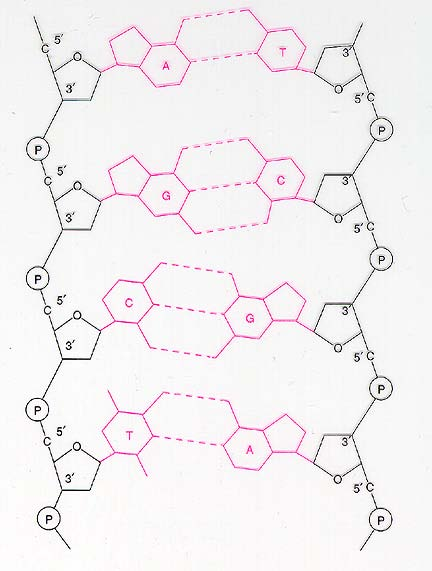

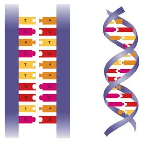

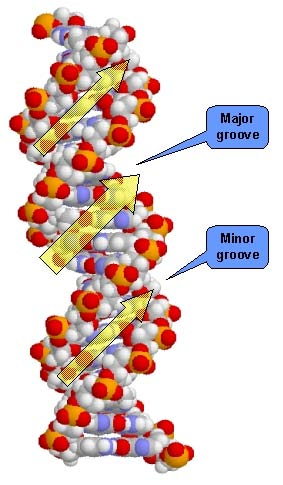

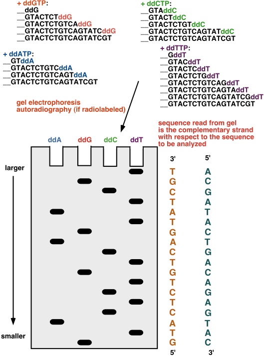

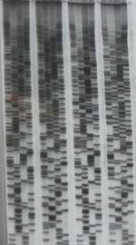

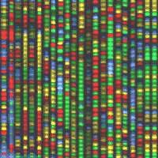

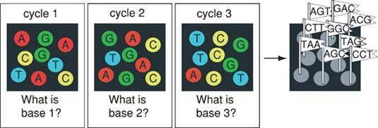

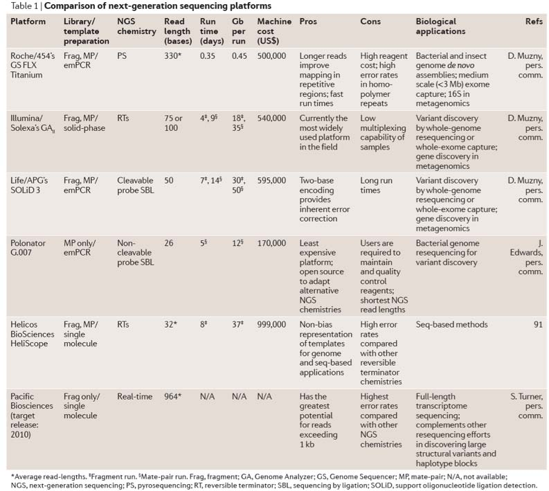

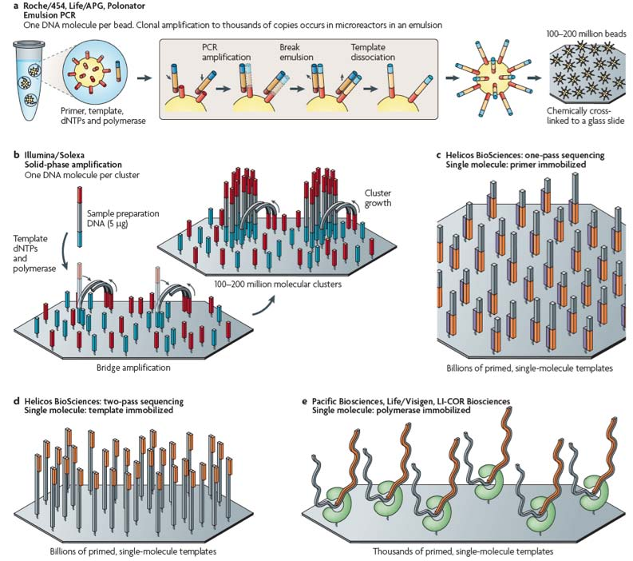

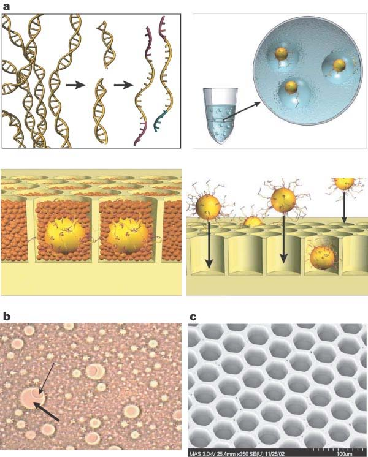

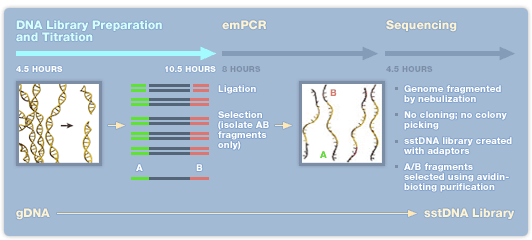

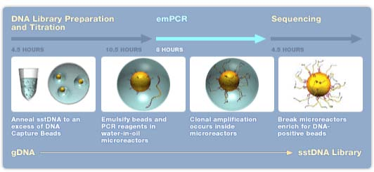

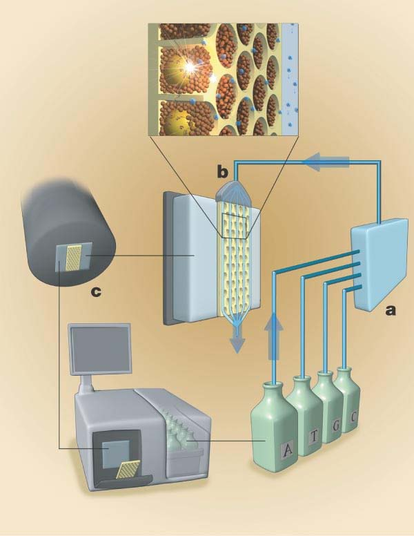

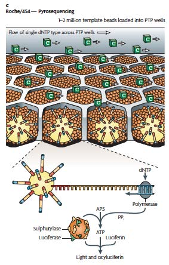

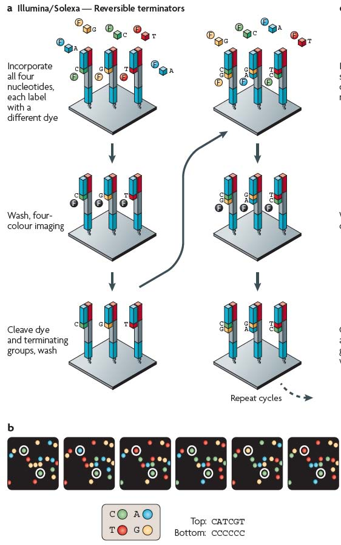

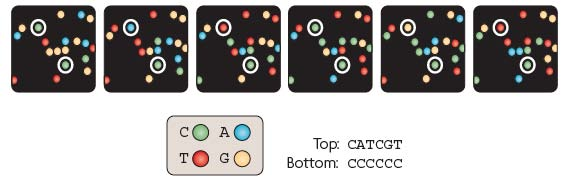

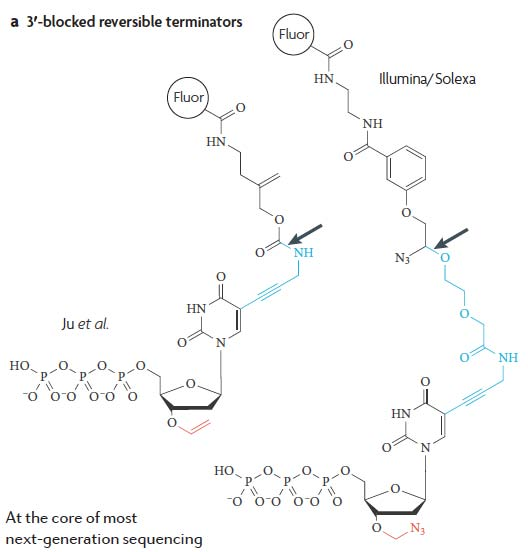

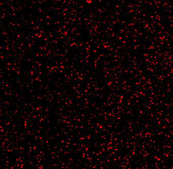

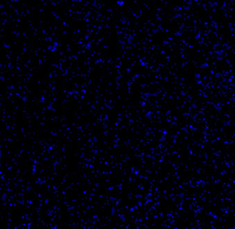

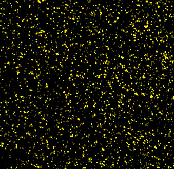

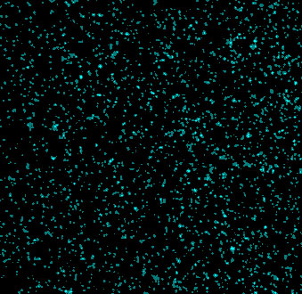

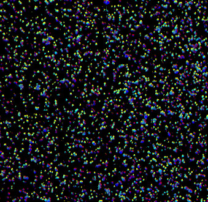

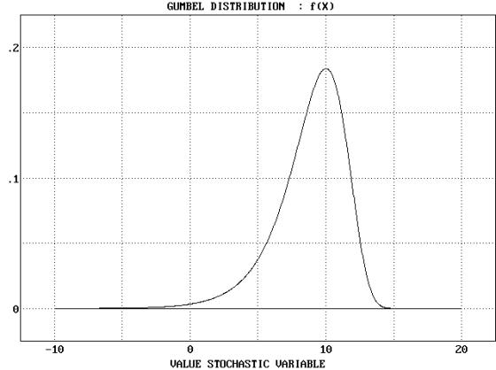

---

[Up: contents](../../index.md)
