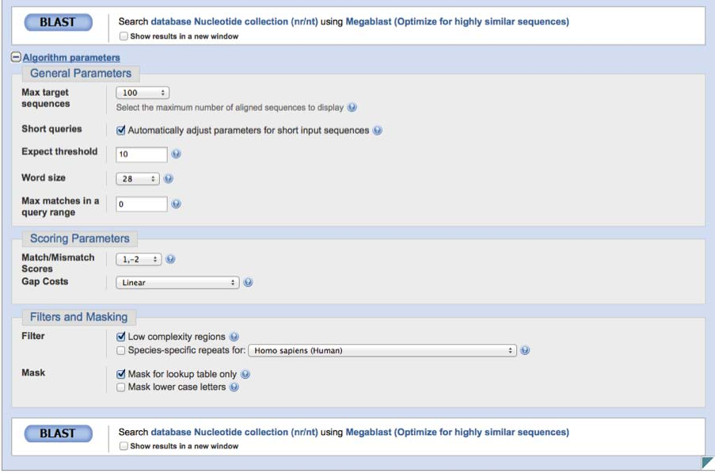
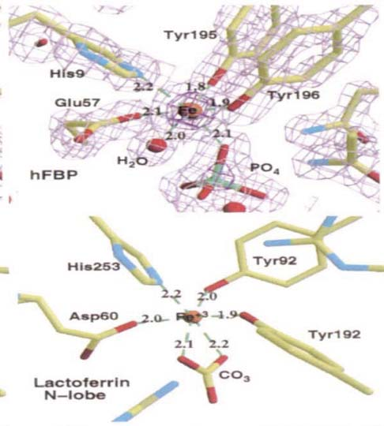
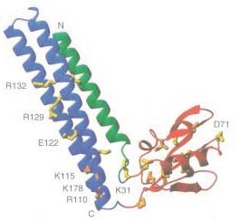
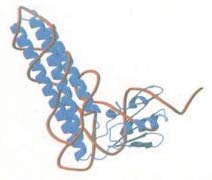
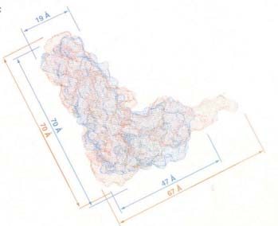
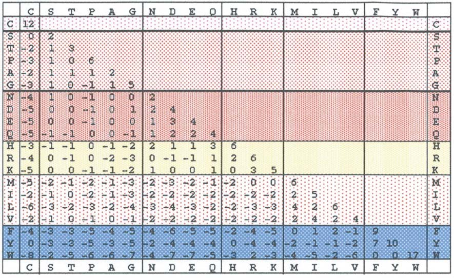

> **Reconstructed by a model.** `lectures/03-slides.pdf` from [ocw-7091j](https://ocw.mit.edu/courses/7-91j-foundations-of-computational-and-systems-biology-spring-2014/) — ocw-7091j, licensed CC BY-NC-SA 4.0. Converted 2026-09-20 from `.pdf`. The original is a PDF with no usable text layer. A model read the pages and wrote this markdown: the prose is a paraphrase in places and **every equation is unverified**. Treat it as a pointer into the original, never as a citable source.

# 03 slides

## 7.91 / 20.490 / 6.874 / HST.506

Lecture #3

C. Burge

Feb. 11, 2014

Global Alignment of Protein Sequences

(NW, SW, PAM, BLOSUM)

---

## Topic 1 Info

- Overview slide has blue background - readings for upcoming lectures are listed at bottom of overview slide
- Review slides will have purple background
- Send your background/interests to TA for posting if reg'd for grad version
- PS1 is posted. BLAST tutorial may be helpful
- PS2 is posted. Look at the programming problem

---

## Local Alignment (BLAST) and Statistics

- Sequencing
  - Conventional
  - 2nd generation
- Local Alignment:
  - a simple BLAST-like algorithm
  - Statistics of matching
  - Target frequencies and mismatch penalties for nucleotide alignments

Background for 2/7, 2/12 lectures: Z&B Ch. 4 & 5, BLAST tutorial

---

## Questions: Chemistry / Library Prep

Dye terminator chemistry: dye is attached to base

How to put different adapters on the two ends?

At least three ways:

1) RNA ligation
$$\text{——OH} \quad \text{p——OH} \quad \text{p——}$$

2) polyA tailing/polyTVN-ad2priming/circularization (PMID 19213877)

3) ligation of Y-shaped adapters

---

## DNA Sequence Alignment I: Motivation

You are studying a recently discovered human non-coding RNA.

You search it against the mouse genome using BLASTN (N for nucleotide) and obtain the following alignment:

```
Q:   1 ttgacctagatgagatgtcgttcacttttactcaggtacagaaaa 45
       |||| |||||||||||| | |||||||||||| || |||||||||
S: 403 ttgatctagatgagatgccattcacttttactgagctacagaaaa 447
```

Is this alignment significant?
Is this likely to represent a homologous RNA?

How to find alignments?

---

## DNA Sequence Alignment II

Identify high scoring segments whose score **S** exceeds a cutoff **x** using a **local alignment** algorithm (e.g., BLAST)

Scores follow an extreme value (aka Gumbel) distribution:

$$P(S > x) = 1 - \exp[-KMN e^{-\lambda x}]$$

For sequences/databases of length M, N where K, $\lambda$ are positive parameters that depend on the score matrix and the composition of the sequences being compared

Conditions: expected score is negative, but positive scores possible

**Alternate algorithm**

Karlin & Altschul 1990

---

## Computational Efficiency

Measure efficiency in cpu run time and memory

O() = "big-oh" notation (computational **O**rder of problem)

Consider the number of individual computations required to run algorithm as a function of the number of 'units' in the problem (e.g., base pairs, amino acid residues)

Analyze the asymptotic worst-case running time or sometimes just do the experiment and measure run time

If problem scales as square of the number of units it is
$$O(n^2) \quad \text{“order n-squared”}$$

---

## DNA Sequence Alignment III

How is $\lambda$ related to the score matrix?

$\lambda$ is the unique positive solution to the equation*:

$$\sum_{i,j} p_i r_j e^{\lambda s_{ij}} = 1$$

$p_i$ = freq. of nt i in query, $r_j$ = freq. of nt j in subject

$s_{ij}$ = score for aligning an i,j pair

"Target frequencies"*: $q_{ij} = p_i r_j e^{\lambda s_{ij}}$

\*Karlin & Altschul, 1990

---

## DNA Sequence Alignment VI

Optimal mismatch penalty **m** for given target identity fraction **r**

$$m = \ln(4(1-r)/3)/\ln(4r)$$

Examples:

| r | 0.75 | 0.95 | 0.99 |
|---|---|---|---|
| m | -1 | -2 | -3 |

r = expected fraction of identities in high-scoring BLAST hits

---

## DNA Sequence Alignment VII

### Meaning of mismatch penalty equation

$$m = \ln(4(1-r)/3)/\ln(4r)$$

Examples:

| r | 0.75 | 0.95 | 0.99 |
|---|---|---|---|
| m | -1 | -2 | -3 |

So why is m = -3 better for finding matches with 99% identity?

Does it mean that you can only find 99% identical matches with a mismatch score of -3?

Answer: No. It's also possible to find 99% matches with m = -1 or -2.

But m changes the match length required to achieve statistical significance

$\lambda$ is the unique positive solution to the equation

$$\sum_{i,j} p_i p_j e^{\lambda s_{ij}} = 1 \quad p_i = \text{frequency of nt i}, s_{ij} = \text{score for aligning an i,j pair}$$

and

$$P(S > x) = 1 - \exp[-KMN e^{-\lambda x}]$$

If we change the mismatch score from -1 to -3, $\lambda$ will increase. Therefore, the score required to achieve a given level of significance will decrease, i.e. shorter hits will be significant.

So why would you ever want to use m = -1?

---

Google: **blastn**

Courtesy of National Library of Medicine. In the public domain.

---

Courtesy of National Library of Medicine. In the public domain.

---

## DNA Sequence Alignment VIII

Translating searches:
- translate in all possible reading frames
- search peptides against protein database (BLASTP)

```
t t g a c c t a g a t g a g a t g t c g t t c a c t t t t a c t g a g c t a c a g a a a a
```

```
ttg|acc|tag|atg|aga|tgt|cgt|tca|ctt|tta|ctg|agc|tac|aga|aaa
 L   T   x   M   R   C   R   S   L   L   L   S   Y   R   K
```

```
t|tga|cct|aga|tga|gat|gtc|gtt|cac|ttt|tac|tga|gct|aca|gaa|aa
   x   P   R   x   D   V   V   H   F   Y   x   S   T   E
```

```
tt|gac|cta|gat|gag|atg|tcg|ttc|act|ttt|act|gag|cta|cag|aaa|a
    D   L   D   E   M   S   F   T   F   T   E   L   Q   K
```

Also consider reading frames on complementary DNA strand

---

## DNA Sequence Alignment IX

Common flavors of BLAST:

| Program | Query | Database |
|---|---|---|
| BLASTP | aa | aa |
| BLASTN | nt | nt |
| BLASTX | nt ($\Rightarrow$ aa) | aa |
| TBLASTN | aa | nt ($\Rightarrow$ aa) |
| TBLASTX | nt ($\Rightarrow$ aa) | nt ($\Rightarrow$ aa) |
| PsiBLAST | aa (aa msa) | aa |

msa = multiple sequence alignment

Which would be best for searching ESTs against a genome?

---

## Global Alignment of Protein Sequences
### (NW, SW, PAM, BLOSUM)

- Global sequence alignment (Needleman-Wunch-Sellers)
- Gapped local sequence alignment (Smith-Waterman)
- Substitution matrices for protein comparison

Background for today: Z&B Chapters 4,5 (esp. pp. 119-125)

---

## Why align protein sequences?

- Functional predictions based on identifying homologous proteins or protein domains

### Assumes

Sequence similarity $\xrightarrow{\text{implies}}$ Similarity in function (and/or structure)

- almost always true for similarity > 30%
- 20-30% similarity is "the twilight zone"

**BUT:** Function carried out at level of folded protein, i.e. 3-D structure
Sequence conservation occurs at level of 1-D sequence

### Converse is not true

Structural similarity $\mathrel{\rlap{\quad/}\longrightarrow}$ Sequence similarity (or even homology)

---

## Convergent Evolution

hummingbird

hawk moth

Last common ancestor lived > 500 Mya and lacked wings (and probably legs and eyes)

Same idea for proteins - can result in similar structures with no significant similarity in sequence

Courtesy of Matthew Field. License: CC-BY.
© Dave Green at Butterfly Conservation. All rights reserved. This content is excluded from our Creative Commons license. For more information, see http://ocw.mit.edu/help/faq-fair-use/.

---

## Convergent Evolution of Fe3+-binding Proteins

Haemophilus Fe3+-binding protein (hFBP)

Eukaryotic lactoferrin

Last common ancestor occurred > 2Bya and bound anions

Bruns et al. Nature Struct. Biol. 1997

Courtesy of Nature Publishing Group. Used with permission.
Source: Bruns, Christopher M., Andrew J. Nowalk, et al. "Structure of Haemophilus Influenzae Fe+3-Binding Protein Reveals Convergent Evolution within a Superfamily." *Nature Structural & Molecular Biology* 4, no. 11 (1997): 919-24.

---

## Convergent Evolution of a Protein and an RNA

RRF (protein)

Yeast tRNA$^{\text{Phe}}$

Unlikely to have ever had a common molecular ancestor

*T. maritima* ribosome recycling factor (RRF)

Selmer et al. Science 286. 2349 -. 1999

© American Association for the Advancement of Science. All rights reserved. This content is excluded from our Creative Commons license. For more information, see http://ocw.mit.edu/help/faq-fair-use/.
Source: Selmer, Maria, Salam Al-Karadaghi, et al. "Crystal Structure of Thermotoga Maritima Ribosome Recycling Factor: A tRNA Mimic." *Science* 286, no. 5448 (1999): 2349-52.

---

## Types of Alignments

### Scope:
- Local
- Global
- Semiglobal

### Scoring system:
- Ungapped
- Gapped
  - linear
  - affine

---

## Dot Matrix Alignment Example

Sequence #1 (1 to n)
Sequence #2 (1 to m)

Insertion in seq2
Insertion in seq1

What type of alignment would be most appropriate for this pair of sequences? **Global**

---

## Dot Matrix Alignment Example 2

Sequence #1 (1 to n)
Sequence #2 (1 to m)

What type of alignment would be most appropriate for this pair of sequences? **Local**

---

## Gaps (aka "Indels")

```
AKHFRGCVS
AKKF--CVG
```

- **Linear Gap Penalty**
  - $\gamma(n) = nA$, $n = \text{no. of gaps}$, $A = \text{gap penalty}$

- **"Affine" gap penalty**
  $$W_n = G + n\gamma,$$
  $n = \text{no. of gaps}$, $\gamma = \text{gap extension penalty}$, and $G = \text{gap opening penalty}$

  Or:
  $$W_n = G + (n-1)\gamma$$
  with alternative definition of gap opening penalty

---

## Obtain optimal global alignment using **Dynamic Programming**:

First write one sequence across the top, and one down along the side

| | Gap | V | D | S | C | Y |
|---|---|---|---|---|---|---|
| **Gap** | 0 | 1 gap | 2 gaps | $\longrightarrow$ | | |
| **V** | 1 gap | | | | | |
| **E** | 2 gaps | | | | | |
| **S** | $\downarrow$ | | | | | |
| **L** | | | | | | |
| **C** | | | | | | |
| **Y** | | | | | | |

Note – linear gap penalty: $\gamma(n) = nA$, where $A = \text{gap penalty}$
**a negative number**

---

## Dynamic Programming:
### Initialize the alignment matrix

| $j =$ | $i = 0$
**Gap** | $1$
**V** | $2$
**D** | $3$
**S** | $4$
**

## Scores and Evolution

Any alignment scoring system brings with it an implicit evolutionary model

---

## Amino Acid Substitution Matrices

### Margaret Dayhoff, 1978, PAM Matrices

**Explicit evolutionary model**
**Assumes symmetry: A $\rightarrow$ B = B $\rightarrow$ A**
**Assumes amino acid substitutions observed over short periods of time can be extrapolated to long periods of time**

**71 groups of protein sequences, 85% similar**
**1572 amino acid changes.**

**Functional proteins $\rightarrow$ mutations "accepted" by natural selection**

**PAM1 matrix means 1% divergence between proteins - i.e. 1 amino acid change per 100 residues. Some texts re-state this as the probability of each amino acid changing into another is ~ 1% and probability of not changing is ~99%**

---

## Construction of a Dayhoff Matrix: PAM1

**Step 1: *Measure pairwise substitution frequencies* for each amino acid within families of related proteins that can be confidently aligned**

$$\begin{aligned}
\dots \text{GDS}&\mathbf{F}\text{H}\mathbf{Y}\text{FVS}\mathbf{HG}\dots \\
\dots \text{GDS}&\mathbf{F}\text{H}\mathbf{Y}\mathbf{Y}\text{VS}\mathbf{FG}\dots \\
\dots \text{GDS}&\mathbf{Y}\text{H}\mathbf{Y}\text{FVS}\mathbf{FG}\dots \\
\dots \text{GDS}&\mathbf{F}\text{H}\mathbf{Y}\text{FVS}\mathbf{FG}\dots \\
\dots \text{GDS}&\mathbf{F}\text{H}\mathbf{F}\mathbf{F}\text{VS}\mathbf{FG}\dots
\end{aligned}$$

**900 Phe (F) remained F**

**100 Phe (F) $\rightarrow$ 80 Tyr (Y), 3 Trp (W), 2 His (H)....**

**Gives $n_{\text{ab}}$, i.e.**
$$n_{\text{YF}} = 80$$
$$n_{\text{WF}} = 3$$

*$n$ indicates raw count of events*

**....in evolution**

---

## DNA Sequence Evolution

### Generation $n-1$ (grandparent)

```
5' TGGCATGCACCCTGTAAGTCAATATAAATGGCTACGCCTAGCCCATGCGA 3'
   ||||||||||||||||||||||||||||||||||||||||||||||||||
3' ACCGTACGTGGGACATTCAGTTATATTTACCGATGCGGATCGGGTACGCT 5'
```

### Generation $n$ (parent)

```
5' TGGCATGCACCCTGTAAGTCAATATAAATGGCTATGCCTAGCCCATGCGA 3'
   ||||||||||||||||||||||||||||||||||||||||||||||||||
3' ACCGTACGTGGGACATTCAGTTATATTTACCGATACGGATCGGGTACGCT 5'
```

### Generation $n+1$ (child)

```
5' TGGCATGCACCCTGTAAGTCAATATAAATGGCTATGCCTAGCCCGTGCGA 3'
   ||||||||||||||||||||||||||||||||||||||||||||||||||
3' ACCGTACGTGGGACATTCAGTTATATTTACCGATACGGATCGGGCACGCT 5'
```

Images of The Simpsons © FOX. All rights reserved. This content is excluded from our Creative Commons license. For more information, see http://ocw.mit.edu/help/faq-fair-use/.

---

## Markov Model (aka Markov Chain)

### Classical Definition

Stochastic Process:
- a random process or
- a sequence of Random Variables

A discrete stochastic process $X_1, X_2, X_3, \dots$ which has the Markov property:

$$P(X_{n+1} = j \mid X_1 = x_1, X_2 = x_2, \dots X_n = x_n) = P(X_{n+1} = j \mid X_n = x_n)$$

(for all $x_i$, all $j$, all $n$)

### In words:

A random process which has the property that the future (next state) is conditionally independent of the past given the present (current state)

Andrey Markov, a Russian mathematician (1856 - 1922)
*Image is in the public domain.*

---

MIT OpenCourseWare
http://ocw.mit.edu

7.91J / 20.490J / 20.390J / 7.36J / 6.802J / 6.874J / HST.506J Foundations of Computational and Systems Biology
Spring 2014

For information about citing these materials or our Terms of Use, visit: http://ocw.mit.edu/terms.

---

[Up: contents](../index.md)

## Figures

Extracted from the original PDF. They are listed by the page they came from rather
than placed in the text: the conversion does not record where on the page each one
sat.
















