> **Reconstructed by a model.** `lectures/05-slides.pdf` from [ocw-7091j](https://ocw.mit.edu/courses/7-91j-foundations-of-computational-and-systems-biology-spring-2014/) — ocw-7091j, licensed CC BY-NC-SA 4.0. Converted 2026-09-20 from `.pdf`. The original is a PDF with no usable text layer. A model read the pages and wrote this markdown: the prose is a paraphrase in places and **every equation is unverified**. Treat it as a pointer into the original, never as a citable source.

# Backtracking

* May not be so lucky

"g"

"t"

"c"

"a" "a"

Found this alignment (eventually):

```
acaacg
 |   |
 ag  c
```

http://www.cbcb.umd.edu/~langmead/NCBI_Nov2008.ppt

---

* Relevant alignments may lie along multiple paths
  * E.g., $Q =$ "aaa", $T =$ "acaacg"

```
acaacg
 | |
 aaa
```

```
acaacg
 |   |
 aaa
```

```
acaacg
  | |
  aaa
```

http://www.cbcb.umd.edu/~langmead/NCBI_Nov2008.ppt

---

## Bowtie backtracks to leftmost just-visited position with minimal quality

* PHRED score $= -10\log(p)$ Where $p$ is probability of error

Sequence:
| G | C | C | A | T | A | C | G | G | A | T | T | A | G | C | C |
|---|---|---|---|---|---|---|---|---|---|---|---|---|---|---|---|
| 40 | 40 | 35 | 40 | 40 | 40 | 40 | 30 | 30 | 20 | 15 | 15 | 40 | 40 | 40 | 40 |

(higher number = higher confidence)

| G | C | C | A | T | A | C | G | G | A | C | T | A | G | C | C |
|---|---|---|---|---|---|---|---|---|---|---|---|---|---|---|---|
| 40 | 40 | 35 | 40 | 40 | 40 | 40 | 30 | 30 | 20 | 15 | 15 | 40 | 40 | 40 | 40 |

| G | C | C | A | T | A | C | G | G | G | C | T | A | G | C | C |
|---|---|---|---|---|---|---|---|---|---|---|---|---|---|---|---|
| 40 | 40 | 35 | 40 | 40 | 40 | 40 | 30 | 30 | 20 | 15 | 15 | 40 | 40 | 40 | 40 |

* Greedy, depth-first, not optimal, but simple

http://www.cbcb.umd.edu/~langmead/NCBI_Nov2008.ppt

---

## Specifying match quality

* Bowtie supports a Maq*-like alignment policy
  * $\le N$ mismatches allowed in first $L$ bases on left end
  * Sum of mismatch qualities may not exceed $E$
  * $N$, $L$ and $E$ configured with `-n`, `-l`, `-e`
  * E.g.:

| G | C | C | A | T | A | C | G | G | G | C | T | A | G | C | C |
|---|---|---|---|---|---|---|---|---|---|---|---|---|---|---|---|
| 40 | 40 | 35 | 40 | 40 | 40 | 40 | 30 | 30 | 20 | 15 | 15 | 40 | 25 | 5 | 5 |

$L=12 \quad E=50, N=2$

If $N < 2$
If $E < 45$
If $L < 9$ and $N < 2$

* PHRED score $= -10\log(p)$ Where $p$ is probability of error

\* Li H, Ruan J, Durbin R: Mapping short DNA sequencing reads and calling variants using mapping quality scores. *Genome Res* 2008.

http://www.cbcb.umd.edu/~langmead/NCBI_Nov2008.ppt

---

## Bowtie can match starting from the left to limit backtracking

* But how to match left-to-right?
* Double indexing:
  * Reverse read and use "mirror index": index for reference with sequence reversed

| G | C | C | A | T | A | C | G | G | A | T | T | A | G | C | C |
|---|---|---|---|---|---|---|---|---|---|---|---|---|---|---|---|

Forward Index
No backtracks allowed

| C | C | G | A | T | T | A | G | G | C | A | T | A | C | C | G |
|---|---|---|---|---|---|---|---|---|---|---|---|---|---|---|---|

Mirror Index
No backtracks allowed

---

## Time to build a BWT/FM index

* Bowtie employs a indexing algorithm* that can trade flexibly between memory usage and running time
* For human genome (NCBI 36.3) on 2.4 GHz AMD Opteron:

| Physical memory Target | Actual peak memory footprint | Wall clock time |
|---|---|---|
| 16 GB | 14.4 GB | 4h:36m |
| 8 GB | 5.8

---

[Up: contents](../index.md)

## Figures

Extracted from the original PDF. They are listed by the page they came from rather
than placed in the text: the conversion does not record where on the page each one
sat.

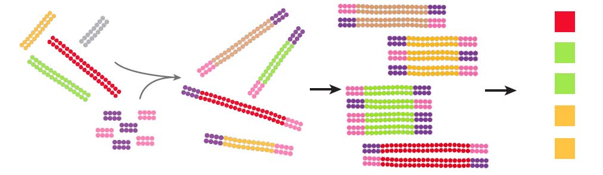


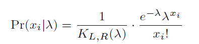

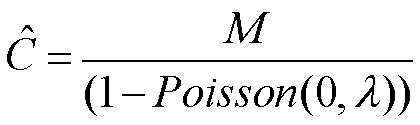


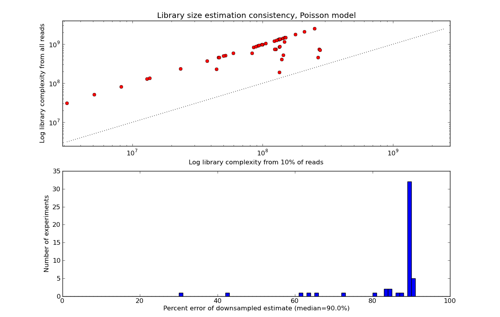


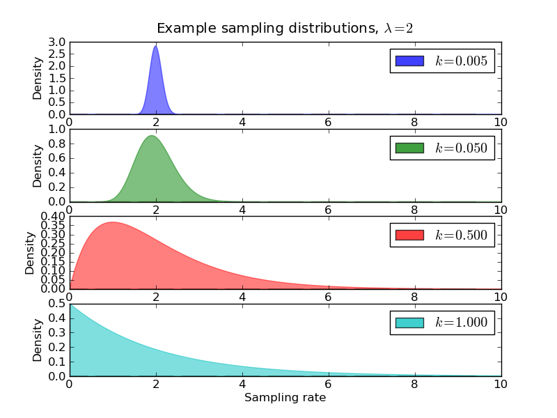

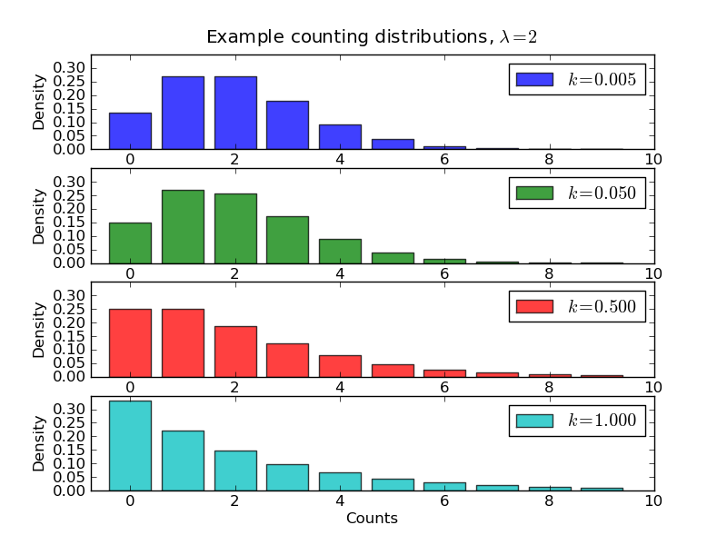

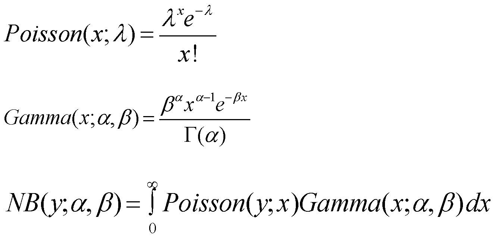

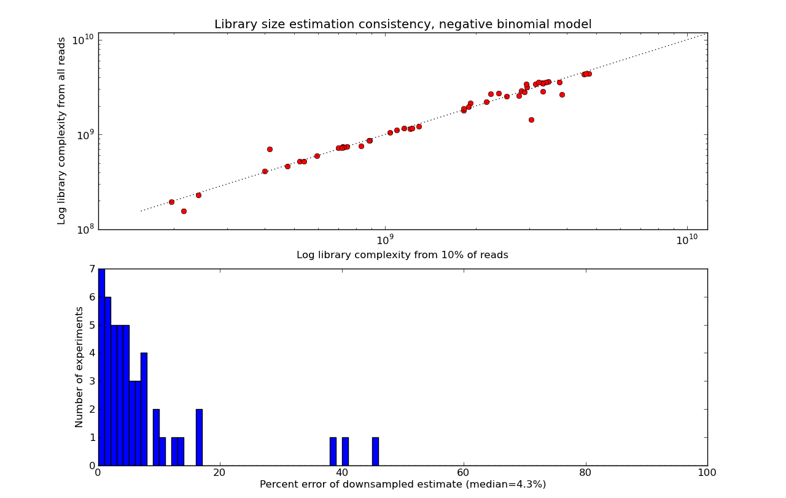

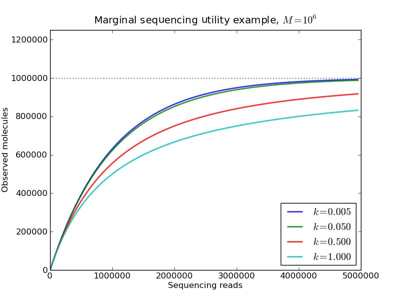


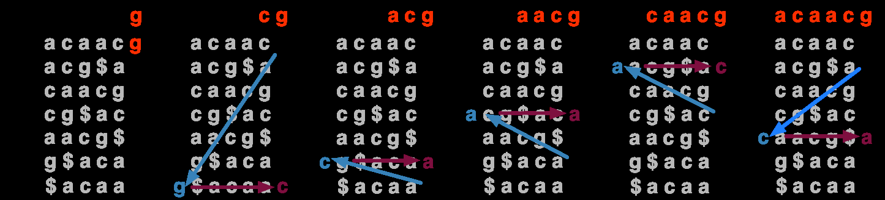


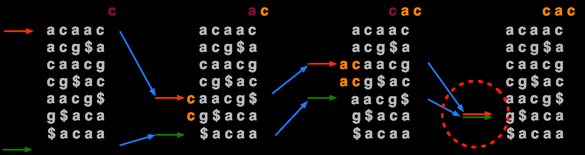

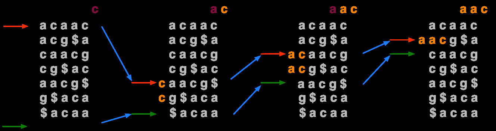

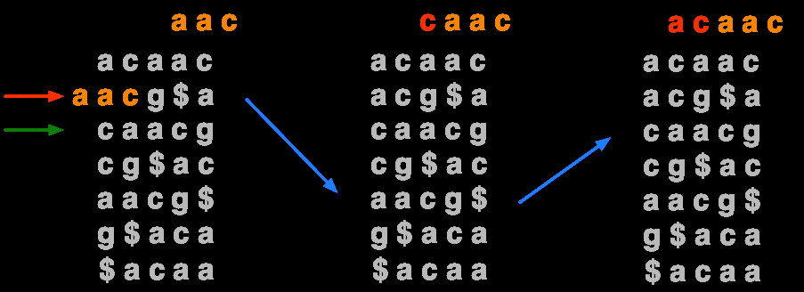

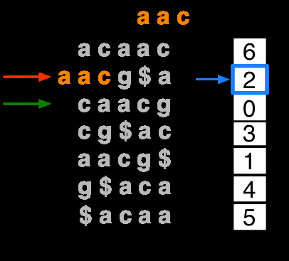

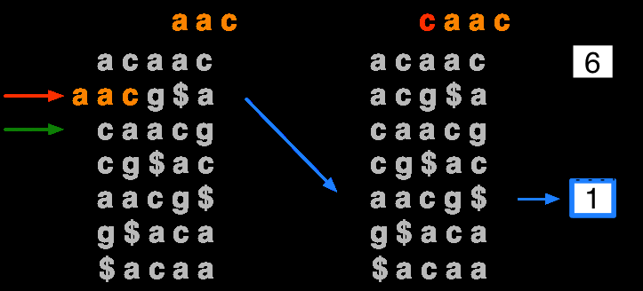

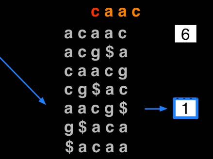


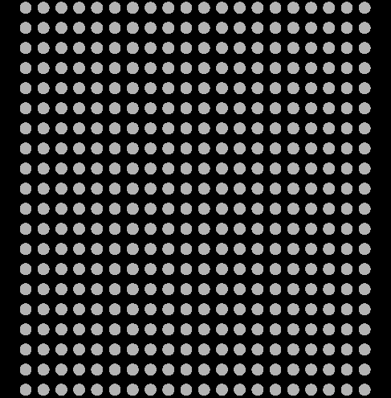

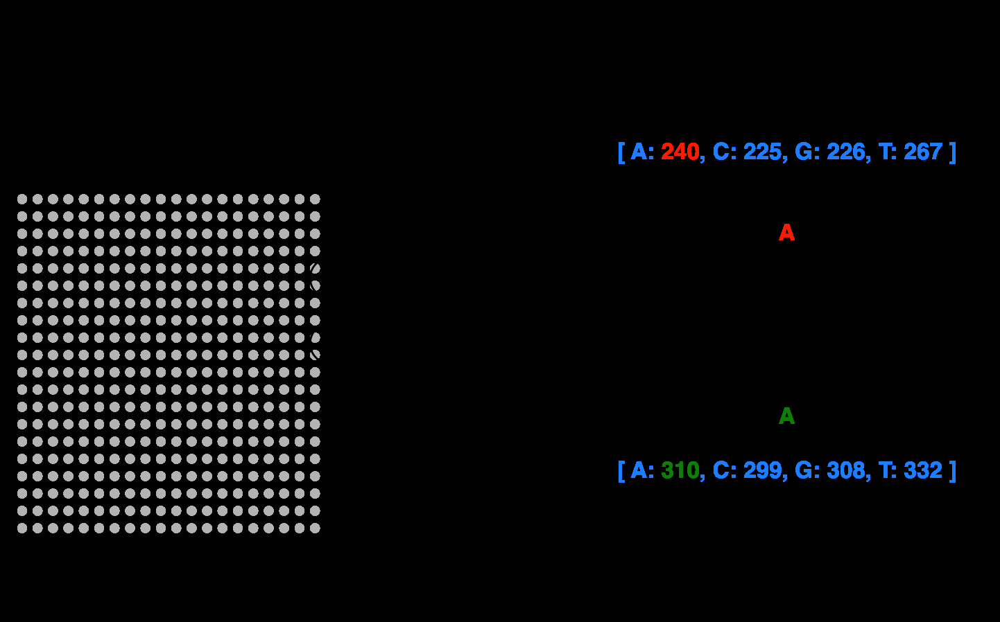

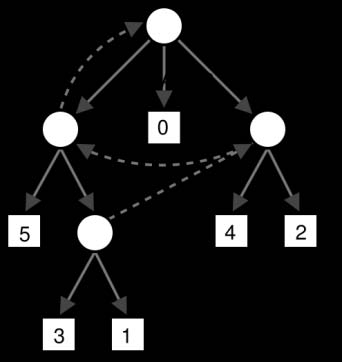

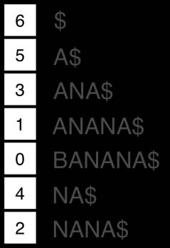

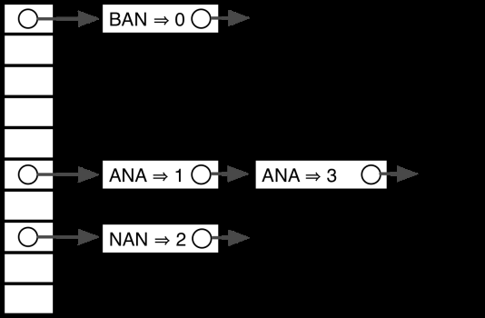


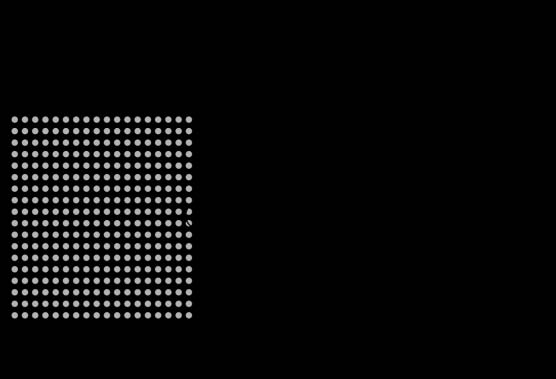


