> **Reconstructed by a model.** `lectures/11-slides.pdf` from [ocw-7091j](https://ocw.mit.edu/courses/7-91j-foundations-of-computational-and-systems-biology-spring-2014/) — ocw-7091j, licensed CC BY-NC-SA 4.0. Converted 2026-09-20 from `.pdf`. The original is a PDF with no usable text layer. A model read the pages and wrote this markdown: the prose is a paraphrase in places and **every equation is unverified**. Treat it as a pointer into the original, never as a citable source.

# 11 slides

7.91 / 20.490 / 6.874 / HST.506
7.36 / 20.390 / 6.802

C. Burge Lecture #10

March 13, 2014

## RNA Secondary Structure - Biological Functions & Prediction

---

## Hidden Markov Models of Genomic & Protein Features

- Hidden Markov Model terminology
- Viterbi algorithm
- Examples
  - CpG Island HMM
  - TMHMM (transmembrane helices)

---

## “Trellis” Diagram for Viterbi Algorithm

Position in Sequence $\rightarrow$

| 1 | $\dots$ | i-2 | i-1 | i | i+1 | i+2 | $\dots$ | L |
| :---: | :---: | :---: | :---: | :---: | :---: | :---: | :---: | :---: |
| $\bigcirc$ | $\dots$ | $\bigcirc$ | $\bigcirc$ | $\bigcirc$ | $\bigcirc$ | $\bigcirc$ | $\dots$ | $\bigcirc$ |
| $\bigcirc$ | | $\bigcirc$ | $\bigcirc$ | $\bigcirc$ | $\bigcirc$ | $\bigcirc$ | | $\bigcirc$ |
| $\bigcirc$ | | $\bigcirc$ | $\bigcirc$ | $\bigcirc$ | $\bigcirc$ | $\bigcirc$ | | $\bigcirc$ |
| $\bigcirc$ | | $\bigcirc$ | $\bigcirc$ | $\bigcirc$ | $\bigcirc$ | $\bigcirc$ | | $\bigcirc$ |
| $\bigcirc$ | | $\bigcirc$ | $\bigcirc$ | $\bigcirc$ | $\bigcirc$ | $\bigcirc$ | | $\bigcirc$ |
| T | $\dots$ | A | T | C | G | C | $\dots$ | A |

Hidden States $\rightarrow$

Full set of possible transitions from position i to i+1

---

## CpG Island HMM

### Rabiner notation

"Initiation probabilities" $\pi_j$
$P_g = 0.99, P_i = 0.01$

"Transition probabilities" $a_{ij}$
$P_{gg} = 0.99999 \quad P_{ig} = 0.001$
$P_{gi} = 0.00001 \quad P_{ii} = 0.999$
Genome $\rightleftharpoons$ Island

"Emission Probabilities" $b_j(k)$

| | **C** | **G** | **A** | **T** |
| :--- | :---: | :---: | :---: | :---: |
| CpG Island: | 0.3 | 0.3 | 0.2 | 0.2 |
| Genome: | 0.2 | 0.2 | 0.3 | 0.3 |

$\dots$ A C T C G A G T A $\dots$

---

## More Viterbi Examples

What is the optimal parse of the sequence for the CpG island HMM defined previously?

- $(\text{ACGT})_{10000}$
- $\text{A}_{1000}\text{C}_{80}\text{T}_{1000}\text{C}_{20}\text{A}_{1000}\text{G}_{60}\text{T}_{1000}$

**Powers of 1.5:**

| $N =$ | 20 | 40 | 60 | 80 |
| :--- | :---: | :---: | :---: | :---: |
| $(1.5)^N =$ | $3 \times 10^3$ | $1 \times 10^7$ | $3 \times 10^{10}$ | $1 \times 10^{14}$ |

---

## Real World HMMs

---

## “Profile HMM” with insertions/deletions

### A. Sequence alignment

```
N • F L S
N • F L S
N K Y L T
Q • W - T
```

RED POSITION REPRESENTS ALIGNMENT IN COLUMN
GREEN POSITION REPRESENTS INSERT IN COLUMN
PURPLE POSITION REPRESENTS DELETE IN COLUMN

### B. Hidden Markov model for sequence alignment

Of course, can have insertion/deletion states for HMM models of DNA/RNA as well

```
    D3 ----> D2 ----> D3 ----> D4
   ^  \     ^  \     ^  \     ^  \
  /    v   /    v   /    v   /    v
(I0)   (I1)   (I2)   (I3)   (I4)
  ^      ^      ^      ^      ^
  |      |      |      |      |
 BEG -> M1  -> M2  -> M3  -> M4  -> END
```

- match state
- insert state
- delete state
- transition probability

© Cold Spring Harbor Laboratory Press. All rights reserved. This content is excluded from our Creative Commons license. For more information, see http://ocw.mit.edu/help/faq-fair-use/.

---

## TMHMM (v. 2.0)

### Prediction of transmembrane helices in proteins

Help/Information (updated Sept 13, 2001)

One of the World Wide Web Prediction Servers from the Center for Biological Sequence Analysis

limit each submission to at most 4000 proteins.
1 each large submission.

OR by pasting sequence(s) in FASTA format:

Output format:
- Extensive, with graphics
- Extensive, no graphics
- One line per protein

Other options: Use old model (version 1)

[Submit] [Clear]

Correctly predicts ~97% of transmembrane helices according to authors

A. Krogh et al. *J. Mol. Biol.* 2001

© Center for Biological Sequence Analysis. All rights reserved. This content is excluded from our Creative Commons license. For more information, see http://ocw.mit.edu/help/faq-fair-use/.

---

## Architecture of TMHMM

(a)
- **cytoplasmic side:**
  - globular $\leftarrow$ loop cyt.
  - cap cyt. $\rightarrow$ membrane (helix core) $\rightarrow$ cap non-cyt. $\rightarrow$ short loop non-cyt. $\rightarrow$ globular non-cyt.
  - cap cyt. $\leftarrow$ membrane (helix core) $\leftarrow$ cap non-cyt. $\leftarrow$ long loop non-cyt. $\leftarrow$ globular non-cyt.
- **non-cytoplasmic side**

(c) helix core
$1 \rightarrow 2 \rightarrow 3 \rightarrow 4 \rightarrow 5 \rightarrow 6 \rightarrow 7 \rightarrow 8 \dots \rightarrow 22 \rightarrow 23 \rightarrow 24 \rightarrow 25$

Courtesy of Biomedical Informatics Publishing Group. Used with permission.
Source: Chaturvedi, Navaneet, Sudhanshu Shanker, et al. "Hidden Markov Model for the Prediction of Transmembrane Proteins using MATLAB." *Bioinformation* 7, no. 8 (2011): 418.

---

## TMHMM Output for Mouse Chloride Channel CLC6

Optimal Parse

Posterior Probability vs. Position:
- Transmembrane
- inside
- outside

---

## RNA Secondary Structure

- Biological examples of RNA structure
- Predicting $2^\circ$ structure by covariation
- Predicting $2^\circ$ structure by energy minimization

### Readings
NBT Primer on RNA folding, Z&B Ch. 11.9

---

## RNA Secondary and Tertiary Structure

### Example: tRNA

- Amino acid attachment site ($3'$, $5'$)
- Hydrogen bonds between paired bases
- Anticodon

© source unknown. All rights reserved. This content is excluded from our Creative Commons license. For more information, see http://ocw.mit.edu/help/faq-fair-use/.

---

## RNA Secondary Structure Notation

### Parentheses notation
`..(((…..)))……((((……..............)).))…`

### Arc (‘rainbow’) notation
………………………………………….

What do these structures look like?

What is the difference between these two structures?

---

## 30S 50S

SP

© American Association for the Advancement of Science. All rights reserved. This content is excluded from our Creative Commons license. For more information, see http://ocw.mit.edu/help/faq-fair-use/.
Source: Cate, Jamie H., Marat M. Yusupov, et al. "X-ray Crystal Structures of 70S Ribosome Functional Complexes." *Science* 285, no. 5436 (1999): 2095-104.

---

## Ribosome at 7 Å with tRNAs

A P E

E

Slide courtesy of Rachel Green

© American Association for the Advancement of Science. All rights reserved. This content is excluded from our Creative Commons license. For more information, see http://ocw.mit.edu/help/faq-fair-use/.
Source: Cate, Jamie H., Marat M. Yusupov, et al. "X-ray Crystal Structures of 70S Ribosome Functional Complexes." *Science* 285, no. 5436 (1999): 2095-104.

---

## Can build useful structures out of RNA

The exit channel for the growing polypeptide

Slide courtesy of Rachel Green

© American Association for the Advancement of Science. All rights reserved. This content is excluded from our Creative Commons license. For more information, see http://ocw.mit.edu/help/faq-fair-use/.
Source: Ban, Nenad, Poul Nissen, et al. "The Complete Atomic Structure of the Large Ribosomal Subunit at 2.4 Å Resolution." *Science* 289, no. 5481 (2000): 905-20.

---

## RNA/protein distribution on the 50S ribosome

linguini = protein
fettucini = RNA

© American Association for the Advancement of Science. All rights reserved. This content is excluded from our Creative Commons license. For more information, see http://ocw.mit.edu/help/faq-fair-use/.
Source: Ban, Nenad, Poul Nissen, et al. "The Complete Atomic Structure of the Large Ribosomal Subunit at 2.4 Å Resolution." *Science* 289, no. 5481 (2000): 905-20.

---

## The ribosome is a ribozyme

Nearest proteins and distances to active site (Å)

- L10e: 20.4
- L2: 23.5, 21.8
- L4
- L3: 18.4

Slide courtesy of Rachel Green

© American Association for the Advancement of Science. All rights reserved. This content is excluded from our Creative Commons license. For more information, see http://ocw.mit.edu/help/faq-fair-use/.
Source: Nissen, Poul, Jeffrey Hansen, et al. "The Structural Basis of Ribosome Activity in Peptide Bond Synthesis." *Science* 289, no. 5481 (2000): 920-30.

---

## What are the practical applications of knowing the ribosome structure?

Deinococcus radiodurans
50S ribosomal subunit

Proteins
23S RNA
5S RNA

**Antibiotics!**

© sources unknown. All rights reserved. This content is excluded from our Creative Commons license. For more information, see http://ocw.mit.edu/help/faq-fair-use/.

---

## ncRNAs: Challenges for Computational Biology

- Prediction of ncRNA structure
- Identification of ncRNA genes
- Prediction of ncRNA functions

---

## RNA $2^\circ$ structure by covariation / compensatory changes

```
Seq1:  A  C  G  A  A  A  G  U
Seq2:  U  A  G  U  A  A  U  A
Seq3:  A  G  G  U  G  A  C  U
Seq4:  C  G  G  C  A  A  U  G
Seq5:  G  U  G  G  G  A  A  C
```

$\Longrightarrow$ stem-loop structure

---

## Mutual information statistic for pair of columns in a multiple alignment

$$M_{ij} = \sum_{x,y} f_{x,y}^{(i,j)} \log_2 \frac{f_{x,y}^{(i,j)}}{f_x^{(i)} f_y^{(j)}}$$

$f_{x,y}^{(i,j)} =$ fraction of seqs w/ nt. $x$ in col. $i$, nt. $y$ in col. $j$
$f_x^{(i)} =$ fraction of seqs w/ nt. $x$ in col. $i$

sum over $x, y = \text{A, C, G, U}$

$M_{ij}$ is maximal (2 bits) if $x$ and $y$ individually appear at random (A,C,G,U equally likely), but perfectly covary (e.g., always complementary)

Could use other measure of dependence (e.g., chi-square statistic)

---

## Inferring $2^\circ$ structure from covariation

Acceptor Stem
Amino acid attachment site ($5'$, $3'$)
Hydrogen bonds between paired bases
Anticodon
C Stem

© sources unknown. All rights reserved. This content is excluded from our Creative Commons license. For more information, see http://ocw.mit.edu/help/faq-fair-use/.

---

## What is needed for accurate inference of RNA secondary structure by covariation?

- Secondary structure more highly conserved than primary sequence
- Sufficient divergence between homologs for many variations to have occurred, but not so much that can’t be aligned
- Sufficient number of homologs sequenced

---

## Classes of Non-coding RNAs

- tRNAs
- rRNAs
- UTRs
- snRNAs
- snoRNAs
- prok. terminators
- $\dots$
- RNaseP
- SRP RNA
- tmRNA
- miRNAs
- lncRNAs
- riboswitches
- $\dots$

---

## Energy Minimization Approach

$$\Delta G_{\text{folding}} = G_{\text{unfolded}} - G_{\text{folded}}$$

There are typically many possible folded states
- assumption that minimum energy state(s) will be occupied

$$\Delta G = \Delta H - T\Delta S$$

Enthalpy favors folding
Entropy favors unfolding

**What environmental variables affect RNA folding?**

---

## How Do Energy Minimization Algorithms Work?

Consider Simple Model: Base Pair Maximization

### Scoring System:
- $+1$ for base pair (C:G, A:U)
- $0$ for anything else

Maximizing score equivalent to minimizing folding free energy for a model which assigns same enthalpy to all allowed base pairs (and ignores details such as base stacking, loops, entropy)

Nussinov algorithm: recursive maximization of base pairing

---

## Recursive Maximization of Base Pairing

Given an RNA sequence of length $N$

Define $S(i,j)$ to be the score of the best structure for the subsequence $(i, j)$

Notice that $S(i,j)$ can be defined recursively in terms of optimal scores of smaller subsequences of the interval $(i,j)$

There are four possible ways that the score of the optimal structure on $(i,j)$ can relate to scores of optimal structures of nested subsequences:

1. $i,j$ pair: $S(i+1, j-1)$
2. \$i

## Function of the lysine riboswitch

![Function of the lysine riboswitch diagram: Absence of lysine (ON state) shows Anti-sequestering stem, RBS, AUG exposed, alongside stems P2, P3, P4, and 5' end. Presence of lysine (OFF state) shows bound Lysine, stems P1, P2, P3, P4, P5, and Sequestering stem masking RBS followed by AUG.]

**Absence of lysine**
ON state

**Presence of lysine**
OFF state

© source unknown. All rights reserved. This content is excluded from our Creative Commons license. For more information, see http://ocw.mit.edu/help/faq-fair-use/.

Lysine interacts with the junctional core of the riboswitch and is specifically recognized through shape-complementarity within the elongated binding pocket and through several direct and K+-mediated hydrogen bonds to its charged ends.

Controls expression of enzymes involved in biosynthesis and transport of lysine

Serganov et al. Nature 2008. Caron et al PNAS 2012

---

MIT OpenCourseWare
http://ocw.mit.edu

7.91J / 20.490J / 20.390J / 7.36J / 6.802J / 6.874J / HST.506J Foundations of Computational and Systems Biology
Spring 2014

For information about citing these materials or our Terms of Use, visit: http://ocw.mit.edu/terms.

---

[Up: contents](../index.md)

## Figures

Extracted from the original PDF. They are listed by the page they came from rather
than placed in the text: the conversion does not record where on the page each one
sat.


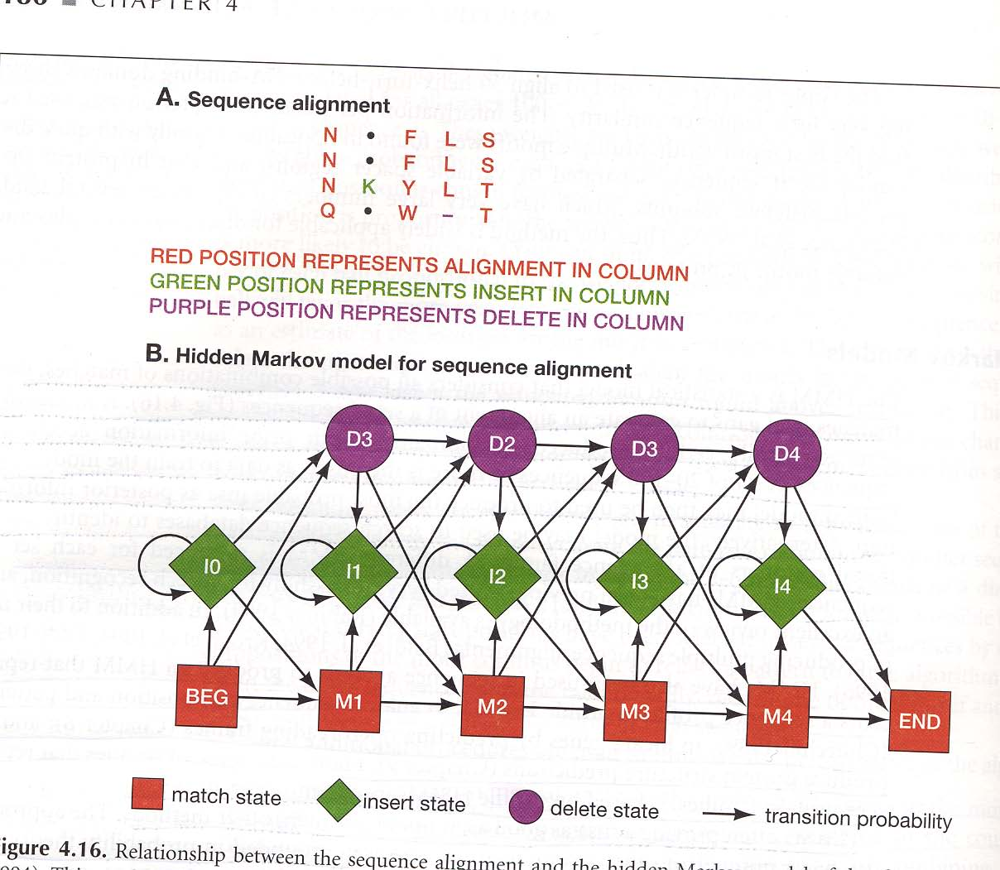


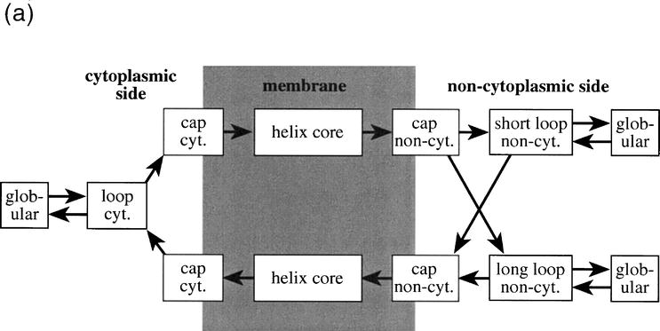

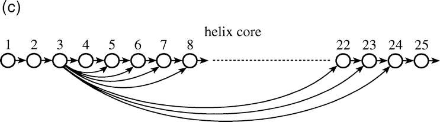


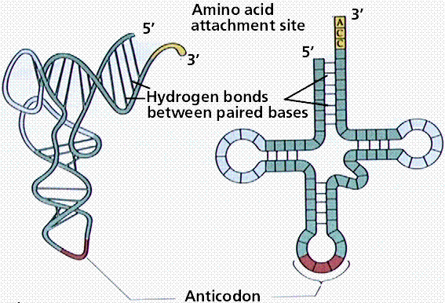

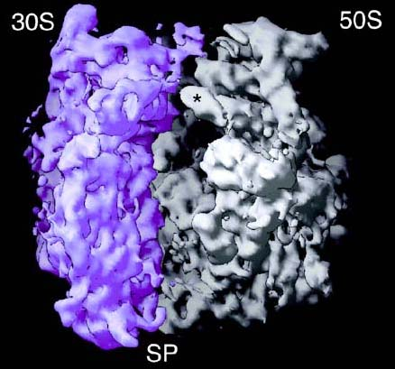

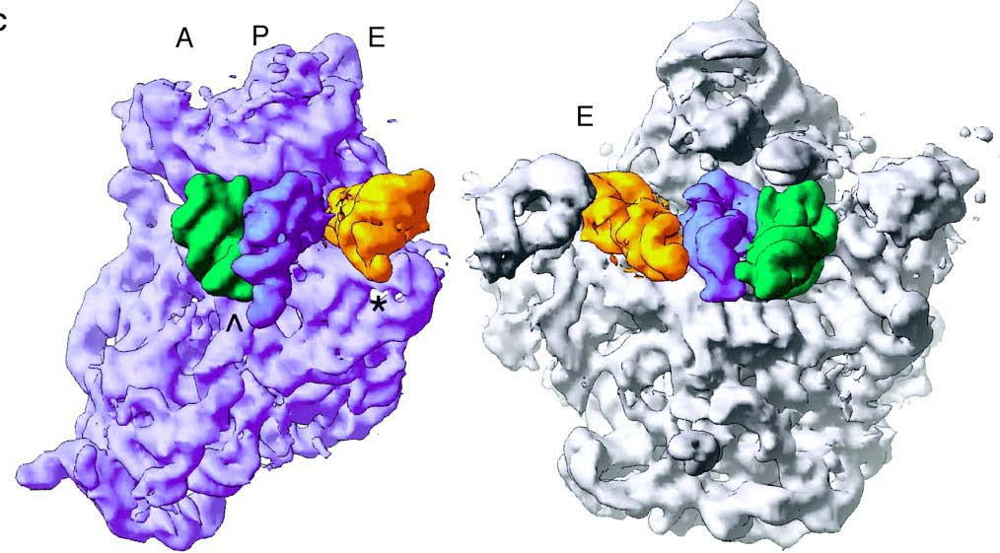

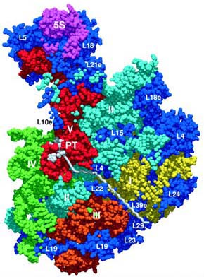

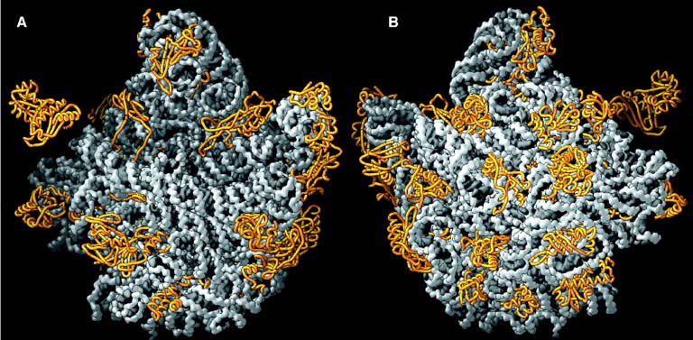

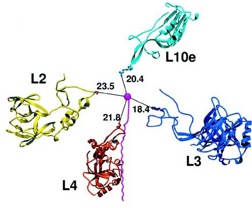

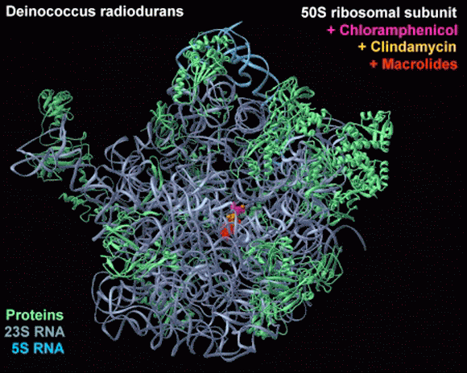


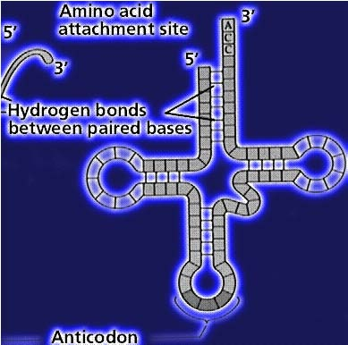


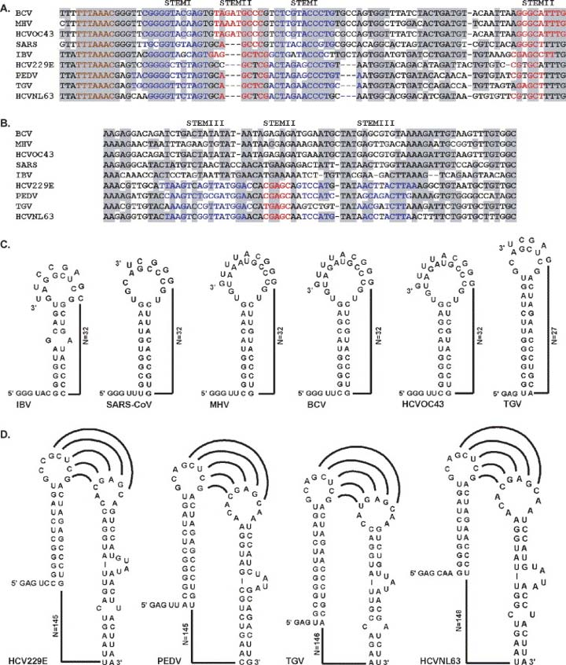

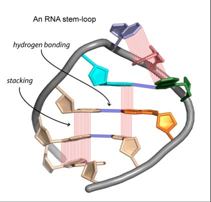

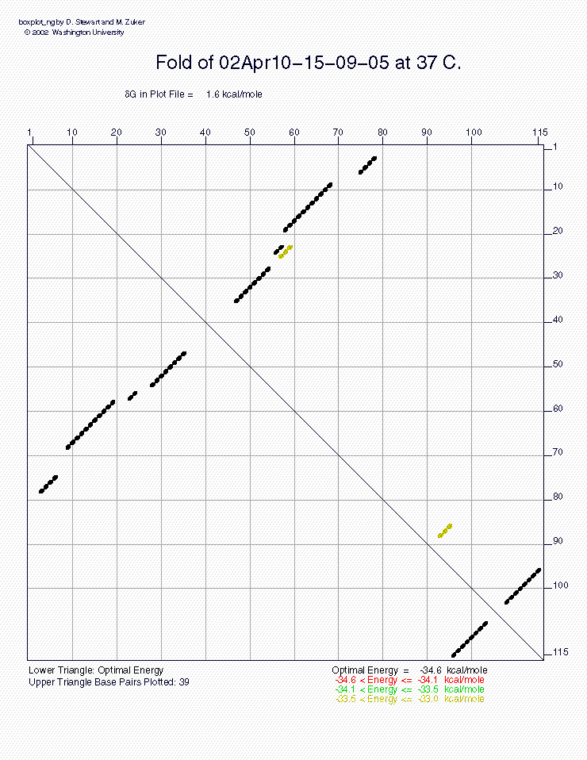


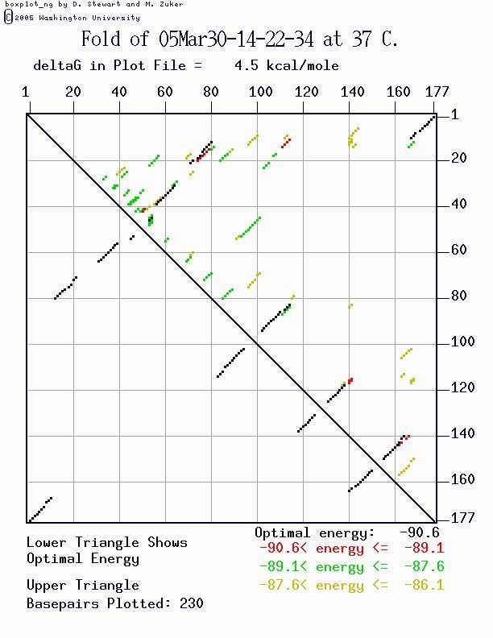

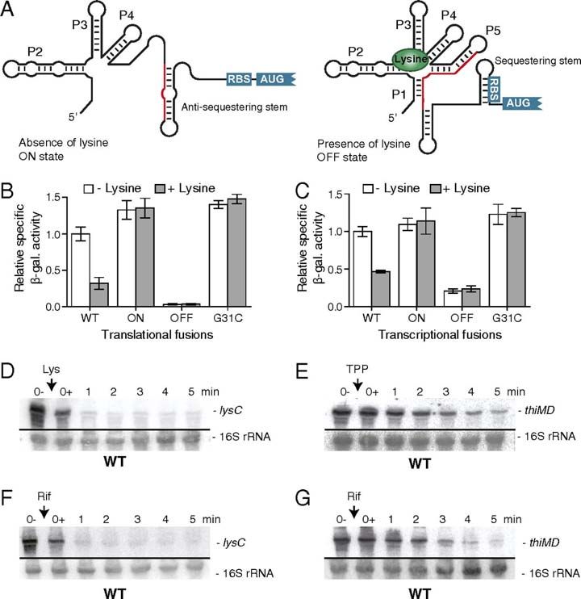

