> **Reconstructed by a model.** `lectures/19-slides.pdf` from [ocw-7091j](https://ocw.mit.edu/courses/7-91j-foundations-of-computational-and-systems-biology-spring-2014/) — ocw-7091j, licensed CC BY-NC-SA 4.0. Converted 2026-09-20 from `.pdf`. The original is a PDF with no usable text layer. A model read the pages and wrote this markdown: the prose is a paraphrase in places and **every equation is unverified**. Treat it as a pointer into the original, never as a citable source.

# Quantitative Trait Loci (QTLs) — Lecture 19

David K. Gifford

Massachusetts Institute of Technology

## 5C maps interactions between defined primers

Diagram of the 3C-to-5C workflow: cross-linking of interacting genomic loci, restriction digestion,
ligation, and reverse cross-linking, yielding the 3C library.

Source: Dostie, Josée, and Job Dekker. "Mapping Networks of Physical Interactions Between Genomic
Elements using 5C Technology." *Nature Protocols* 2, no. 4 (2007): 988-1002.

## 5C maps interactions between defined primers

Diagram continuing the workflow: the 3C library is annealed to multiplexed 5C primer pairs and
ligated, the resulting 5C library is amplified by PCR with universal T7/T3 primers, and the
products are read out by high-throughput sequencing or microarray.

Source: Dostie, Josée, and Job Dekker. "Mapping Networks of Physical Interactions Between Genomic
Elements using 5C Technology." *Nature Protocols* 2, no. 4 (2007): 988-1002.

## 5C maps interactions between defined primers

Diagram of the 5C primer design: alternating forward (T7) and reverse (T3) 5C primers tile a
genomic region, and arcs above and below the region indicate the pairwise ligation products that
can be detected between primer pairs.

Source: Dostie, Josée, and Job Dekker. "Mapping Networks of Physical Interactions Between Genomic
Elements using 5C Technology." *Nature Protocols* 2, no. 4 (2007): 988-1002.

## DNA methylation

Diagram of a DNA duplex with methyl groups (CH3) attached to cytosines within CpG dinucleotides.

"Addition of a methyl group to a cytosine within C-G dinucleotides which are frequently located in
the regulatory regions of genes."

A mechanism for gene silencing: preventing binding of regulatory factors; affecting chromatin
status.

CpG methylation is a lasting form of epigenetic modification, shown as two processes: de novo
methylation (an unmethylated CpG cluster is methylated by DNMT) and maintenance methylation (a
hemimethylated cluster produced by cell division is remethylated by DNMT).

© source unknown. All rights reserved. This content is excluded from our Creative Commons license.
For more information, see http://ocw.mit.edu/help/faq-fair-use/.

## Today's Narrative Arc

1. Usually, you are more like your relatives than random people on the planet.
2. The heritability of a trait is the fraction of phenotypic variance that can be explained by
   genotype.
3. Computational models that predict phenotype from genotype are key for understanding disease
   related genomic variants and the most effective therapy for a disease (pharmacogenomics).
4. We will computationally predict quantitative phenotypes by adding the contribution of
   individual loci (QTLs).
5. Typically our models can only predict a small fraction of phenotypic variance – the so called
   "missing heritability" problem.

## Today's Computational Approaches

1. Linear models of phenotype that use stepwise regression and forward feature selection.
2. Test statistics for discovering significant QTLs.
3. Measurement of narrow sense heritability ($h^2$), broad sense heritability ($H^2$), and
   environmental variance.

## OMIM - authoritative compendium of human genes and genetic phenotypes related to Mendelian Inheritance

Screenshot of the OMIM (Online Mendelian Inheritance in Man) website "OMIM Entry Statistics" page,
showing the number of OMIM entries by category as of 22 April 2014:

| Prefix | Autosomal | X Linked | Y Linked | Mitochondrial | Totals |
| --- | --- | --- | --- | --- | --- |
| * Gene description | 13,796 | 672 | 48 | 35 | 14,551 |
| + Gene and phenotype, combined | 99 | 2 | 0 | 2 | 103 |
| # Phenotype description, molecular basis known | 3,776 | 284 | 4 | 28 | 4,092 |
| % Phenotype description or locus, molecular basis unknown | 1,568 | 134 | 5 | 0 | 1,707 |
| Other, mainly phenotypes with suspected mendelian basis | 1,739 | 115 | 2 | 0 | 1,856 |
| Totals | 20,978 | 1,207 | 59 | 65 | 22,309 |

Courtesy of Johns Hopkins University. Used with permission.

## Statistics review

$$\mu_x = \frac{1}{N}\sum_{i=1}^{N} x_i \qquad \sigma_x^2 = \frac{1}{N}\sum_{i=1}^{N}\left(x_i-\mu_x\right)^2 = E\left[\left(X-\mu_x\right)^2\right]$$

$$\sigma_{xy}^2 = E\left[\left(X-\mu_x\right)\left(Y-\mu_y\right)\right]$$

Covariance = 0 when X and Y are independent.

## Genotype to Phenotype

- Genotype
  - Complete genome sequence (or an approximation)
  - Can be defined by markers at specific genomic sites that describe differences with a defined
    reference genome
- A phenotype is defined by one or more traits
- Non-quantitative trait (dead/alive, etc.)
- Quantitative Trait
  - Fitness (growth rate, lifespan, etc.)
  - Morphology (height, etc.)
  - Gene expression
- Quantitative Trait Loci - Marker that is associated with a quantitative trait
  - eQTL – marker associated with gene expression

## Binary haploid genetic model

Diagram of a genetic cross: a haploid parent carrying markers 1, 2, ..., N as "empty" alleles
(none necessary for phenotype) is crossed with a haploid parent carrying markers 1, 2, ..., N as
"filled" alleles (all necessary for phenotype), producing an F1 generation individual whose
markers are a mix of filled and empty alleles.

Example Phenotype: Alive/Dead in a specific environment.

## Binary haploid genetic model

Same cross diagram as the previous slide (markers necessary for phenotype vs. not, crossed to
produce an F1 generation), with the added line:

N is estimated by $\log_2$ (# F1s tested / # F1s with phenotype)

## Quantitative haploid genetic model

Diagram of the same genetic cross, now with each marker assigned an Effect Size instead of a
necessity flag: effect size 0 for the markers from one parent, effect size $1/N$ for the markers
from the other parent. Example Phenotype: Growth Rate.

## Quantitative haploid genetic model

Same cross and effect-size diagram as the previous slide, with an added binomial model of the
phenotype score:

$$p(x,N) = \binom{N}{x}(1-.5)^{N-x}.5^{x}$$

$$E[x] = .5$$

$$\sigma_x^2 = .25/N$$

Plot comparing the Binomial p.m.f. of the phenotype score (for N = 6) against the Normal p.d.f.,
showing the binomial distribution converging toward the normal approximation.

© cflm on wikipedia. Some rights reserved. License: CC-BY-SA. This content is excluded from our
Creative Commons license. For more information, see http://ocw.mit.edu/help/faq-fair-use/.

## Genetic linkage causes marker correlation

Diagram of a cross in which two closely linked markers (both labeled "1") on one chromosome are
crossed with the corresponding markers (labeled "N-1") from the other parent; because the two loci
are physically close, crossing over during meiosis is unlikely, so the F1 progeny inherit the two
linked "1" markers together rather than independently assorting.

Proximal genomic locations makes crossing over unlikely during meiosis.

## Phenotype is a function of genotype plus an environmental component

- i – individual in [1 .. N]
- g_i – genotype of individual i
- p_i – quantitative phenotype of individual i (single trait)
- e_i – environmental contribution to p_i

## Phenotype is a function of genotype plus an environmental component

- i – individual in [1 .. N]
- g_i – genotype of individual i
- p_i – quantitative phenotype of individual i (single trait)
- e_i – environmental contribution to p_i

$$p_i = f(g_i) + e_i \qquad \sigma_p^2 = \frac{1}{N}\sum_{i=1}^{N}\left(p_i-\mu_p\right)^2$$

$$\sigma_p^2 = \sigma_g^2 + \sigma_e^2 + 2\sigma_{ge}^2 \qquad E[e_i] = 0 \qquad E[e^2] = \sigma_e^2$$

g and e assumed or made independent yields

$$\sigma_p^2 = \sigma_g^2 + \sigma_e^2$$

## Why two heritabilities?

- Broad-sense
  - Describes the upper bound for phenotypic prediction by an optimal arbitrary model
  - Reveals complexity of molecular mechanism
- Narrow-sense
  - Describes the upper bound for phenotypic prediction by a linear model
  - Describes relative resemblance and utility of family disease history
  - Efficient genetic mapping studies

## Key caveats

- Heritability is a property of population (segregating allele frequencies) and environment (noise
  component)
- "Heritability" in practice may refer to either broad- or narrow-sense (or an implicit assumption
  that they are the same)
- Estimation is difficult (matching environments and avoiding confounding)

## H² - Broad Sense heritability

- Fraction of phenotypic variance explained by genetic component

$$H^2 = \frac{\sigma_g^2}{\sigma_p^2} = \frac{\sigma_p^2 - \sigma_e^2}{\sigma_p^2}$$

- Can estimate $\sigma_e^2$ from identical twins or clones.

## Broad heritability of a trait is fraction of phenotypic variance explained by genetic causes

Figure reproduced from Hartl's genetics textbook, with three panels: (A) genotypic variance
($\sigma_g^2=2.0$) — phenotype distributions for genotypes aa, Aa and AA with no environmental
variation; (B) environmental variance ($\sigma_e^2=1.0$) — phenotype distributions for each
genotype under environmental noise alone; (C) phenotypic variance ($\sigma_p^2=\sigma_g^2+\sigma_e^2=3.0$)
— the combined distribution when both genotype and environment vary.

$$H^2 = \frac{\sigma_g^2}{\sigma_p^2} = \frac{\sigma_g^2}{\sigma_g^2+\sigma_e^2} = \frac{2}{3}$$

© Jones & Bartlett Publishers. All rights reserved. This content is excluded from our Creative
Commons license. For more information, see http://ocw.mit.edu/help/faq-fair-use/.
Source: Hartl, Daniel L. *Essential Genetics: A Genomics Perspective*. Jones & Bartlett Publishers,
p. 506, 2011.

## Additive model of phenotype

$g_{ij}$ is marker j for individual i with values {0,1}. Quantitative trait loci (QTLs) are
discovered for each trait.

$$f_a(g_i) = \sum_{j \in QTL} \beta_j g_{ij} + \beta_0$$

$$E\left[f_a(g_i)\right] = \frac{f_a(p_1)}{2} + \frac{f_a(p_2)}{2}$$

Children tend to midpoint of parents for additive traits as they are expected to get an equal
number of loci from each parent.

## Historical heritability example

Figure: Galton's 1886 diagram "Rate of Regression in Hereditary Stature," plotting mid-parent
height against children's height, illustrating that the deviates of the children are to those of
their mid-parents as 2 to 3 — mid-parents taller than the mean have children who tend to be
shorter than they are, and mid-parents shorter than the mean have children who tend to be taller.

Figure is in the public domain.
Galton, "Regression towards mediocrity in hereditary stature" (1886).

## h² - Narrow Sense heritability

- Fraction of phenotypic variance explained by an additive model of markers
- $f_a(g_i)$ is additive model of genotypic components in $g_i$
- Difference between heritability explained by additive model and general model is one source of
  "missing heritability" in current studies

## h² - Narrow Sense heritability

- Fraction of phenotypic variance explained by an additive model of markers
- $f_a(g_i)$ is additive model of genotypic components in $g_i$
- Difference between heritability explained by additive model and general model is one source of
  "missing heritability" in current studies

$$p_i = f_a(g_i) + e_i \qquad \sigma_a^2 = \sigma_p^2 - \frac{1}{N}\sum_{i=1}^{N}\left(p_i-f_a(g_i)\right)^2$$

$$h^2 = \frac{\sigma_a^2}{\sigma_p^2}$$

## Example trait heritabilities – h²

Morphological Traits
- Human height ~ .8
- Cattle Yearling Weight ~ .35

Fitness Traits
- Drosophila life history ~ .2
- Wild animal life history ~ .3

$h^2$ from Visscher et al. 2008

## Example trait heritabilities

Bar chart of heritability estimates (0 to 0.9) for morphological traits (Drosophila, Daphnia,
Atlantic salmon marine- and freshwater-stage weight, bird tarsus length, wild animal morphology,
cattle yearling weight, and human height in two Finnish birth cohorts) and fitness traits
(Drosophila and Daphnia life-history/clutch size, rainbow trout alevin survival, cattle calving
success and bull fertility, pig litter size, and wild animal life-history traits), color-coded by
whether only one, a better, or a poorer environment was reported.

$h^2$ from Visscher et al. 2008
Source: Visscher, Peter M., William G. Hill, et al. "Heritability in the Genomics Era—Concepts and
Misconceptions." *Nature Reviews Genetics* 9, no. 4 (2008): 255-66.

## Today's Narrative Arc

1. Usually, you are more like your relatives than random people on the planet.
2. The heritability of a trait is the fraction of phenotypic variance that can be explained by
   genotype.
3. **Computational models that predict phenotype from genotype are key for understanding disease
   related genomic variants and the most effective therapy for a disease (pharmacogenomics)**
4. We will computationally predict quantitative phenotypes by adding the contribution of
   individual loci (QTLs).
5. Typically our models can only predict a small fraction of phenotypic variance – the so called
   "missing heritability" problem.

## Can we predict phenotype in a haploid yeast system?

Reproduction of the title and byline of: Bloom, Joshua S., Ian M. Ehrenreich, Wesley T. Loo,
Thúy-Lan Võ Lite & Leonid Kruglyak, "Finding the sources of missing heritability in a yeast cross,"
*Nature*, vol. 494, 14 February 2013.

## Study heritability of 46 traits in ~1000 segregants

Figure (Bloom et al. 2013, Figure S1): (a) crossing scheme of BY and RM haploid parents, mating,
and tetrad dissection to generate a segregant panel; (b) statistical power curves for mapping
populations of 100 vs. 1000 segregants at a genome-wide significance threshold; (c) an image of
endpoint colony growth for 384 segregants with computationally detected colony outlines; (d)
sequencing read counts at SNP sites plotted against genome position for a representative
segregant, showing parental (BY/RM) haplotype calls.

Key advance: large panel (~1000 segregants), many phenotypes (46).
BY and RM parents.
Source: Bloom, Joshua S., Ian M. Ehrenreich, et al. "Finding the Sources of Missing Heritability in

## Certain phenotypes are related

Figure (Bloom et al. 2013, Figure S2): a matrix of Spearman correlation coefficients (×100)
between all pairs of the 46 growth-condition traits (e.g. Congo Red, Zeocin, Neomycin, Cisplatin,
Caffeine, Menadione, various sugars, ethanol, etc.), color-coded from -1 to 1; a cluster of sugar
traits and ethanol (2%) is highlighted as an example of correlated phenotypes.

Source: Bloom, Joshua S., Ian M. Ehrenreich, et al. "Finding the Sources of Missing Heritability in

## Today's Narrative Arc

1. Usually, you are more like your relatives than random people on the planet.
2. The heritability of a trait is the fraction of phenotypic variance that can be explained by
   genotype.
3. Computational models that predict phenotype from genotype are key for understanding disease
   related genomic variants and the most effective therapy for a disease (pharmacogenomics).
4. **We will computationally predict quantitative phenotypes by adding the contribution of
   individual loci (QTLs)**
5. Typically our models can only predict a small fraction of phenotypic variance – the so called
   "missing heritability" problem.

## LOD scores to discover QTLs

$$LOD = \log_{10}\prod_{i=1}^{N} \frac{P\left(p_i \mid g_{ij},\mu_0,\mu_1,\sigma\right)}{P\left(p_i \mid \mu,\sigma\right)}$$

- Use trait means conditioned on marker j in individual vs. unconditioned mean for trait to test if
  marker j is a QTL
- Permute genotypes 1000 times and each time compute LOD scores to estimate null LOD distribution
- Determine null LOD score that describes FDR = 0.05
- Use this threshold on unpermuted LOD scores to find QTLs for each gene
- Fit linear model to discovered QTLs
- Repeat finding QTLs predicting residuals from existing model (3 times)

## 1005 segregants detect more QTLs than 100 segregants

Figure (Bloom et al. 2013, Figure 3): LOD score plotted against genome position for growth in E6
berbamine. (a) With 1,005 segregants, 15 statistically significant QTLs (red asterisks) are
detected, explaining 78% of narrow-sense heritability. (b) With 100 segregants, only 2 significant
QTLs are detected, explaining 21% of narrow-sense heritability.

Source: Bloom, Joshua S., Ian M. Ehrenreich, et al. "Finding the Sources of Missing Heritability in

## Phenotype prediction works well with identified QTLs

Figure (Bloom et al. 2013, Figure 4): observed phenotype (growth in lithium chloride) plotted
against phenotype predicted by a cross-validated additive model of 22 QTLs, which explains 88% of
the narrow-sense heritability; points lie close to the observed = predicted diagonal.

Source: Bloom, Joshua S., Ian M. Ehrenreich, et al. "Finding the Sources of Missing Heritability in

## Most identified QTLs have small effects

5-29 QTLs per trait (median of 12), reported at 5% FDR.

Figure (Bloom et al. 2013, Figure S3): histogram of QTL effect sizes across all 46 traits, showing
that most detected QTL have small effects, with a fitted truncated exponential distribution
overlaid.

Source: Bloom, Joshua S., Ian M. Ehrenreich, et al. "Finding the Sources of Missing Heritability in

## Identified QTLs explain most additive heritability

QTLs explain 72-100% of narrow-sense heritability.

Figure (Bloom et al. 2013, Figure 2a): phenotypic variance explained by detected QTL for each trait
plotted against narrow-sense heritability ($h^2$), with standard-error bars; points fall close to
the variance-explained = $h^2$ diagonal.

Source: Bloom, Joshua S., Ian M. Ehrenreich, et al. "Finding the Sources of Missing Heritability in

## "Missing Heritability" exists with our linear model

Vertical gap represents non-additive genetic contributions.

Figure (Bloom et al. 2013, Figure 1): narrow-sense heritability ($h^2$) plotted against
broad-sense heritability ($H^2$) for 46 yeast traits, with standard-error bars; points fall
consistently below the $h^2=H^2$ diagonal, showing a persistent gap.

Source: Bloom, Joshua S., Ian M. Ehrenreich, et al. "Finding the Sources of Missing Heritability in

## Today's Narrative Arc

1. Usually, you are more like your relatives than random people on the planet.
2. The heritability of a trait is the fraction of phenotypic variance that can be explained by
   genotype.
3. Computational models that predict phenotype from genotype are key for understanding disease
   related genomic variants and the most effective therapy for a disease (pharmacogenomics).
4. We will computationally predict quantitative phenotypes by adding the contribution of
   individual loci (QTLs).
5. **Typically our models can only predict a small fraction of phenotypic variance – the so called
   "missing heritability" problem**

## What causes missing heritability?

Possible explanations (non-exclusive):
- Incorrect heritability estimates
- Non-chromosomal elements
- Rare variants
- Structural variants
- Many common variants of low effect
- Epistasis

## What causes missing heritability?

- Consider
  - f(ab) = 0
  - f(aB) = f(Ab) = 1
  - f(AB) = 0
- A and B will not be detected as QTLs as individually they have no effect on phenotype
- Assuming no environmental noise $H^2=1$ and $h^2=0$.
- Non-additive interactions can result from gene-gene interactions (epistasis)
  - Can be more than pairwise!
  - Considering all combinations of markers is in general not tractable because of
    multi-hypothesis limits
- Broad sense heritability includes additive genetic factors, dominance effects, gene-gene
  interactions, gene-environment interactions, non genomic inheritance

## Remaining sources of heritability

- Gap between narrow- and broad-sense heritability implies genetic interactions
- For most traits, gaps not explained by found pairwise interactions
- Exception: maltose (71% of gap explained by one pairwise interaction)

Figure (Bloom et al. 2013, Figure 5): histogram of the fraction of non-additive genetic variance
explained by detected QTL-QTL interactions per trait, restricted to traits with at least 10%
non-additive genetic variance; inset shows phenotypes for growth in maltose grouped by two-locus
genotype at the interacting QTL pair on chromosomes 7 and 11, an interaction that explains 71% of
the difference between broad-sense and narrow-sense heritability for that trait.

Source: Bloom, Joshua S., Ian M. Ehrenreich, et al. "Finding the Sources of Missing Heritability in

## Non-linear models reveal missing heritability from the interaction of chromosomal and non-chromosomal elements

Figure (Edwards et al. 2014): photographs of yeast colonies carrying the [kil-k] versus [kil-0]
cytoplasmic (non-chromosomal) element; scatter plots comparing mutant vs. wild-type phenotype
under a deletion-only model, a deletion-and-non-chromosomal (linear) model, and a
deletion-and-non-chromosomal model with an interaction term, showing that only the model with an
interaction term removes the apparent gap between the mutant and wild-type distributions; a bar
chart for the gene PEP7 showing the fraction of phenotypic variance explained increasing from the
deletion-only model, to the linear deletion-and-non-chromosomal-element model, to the model with
an interaction term.

Courtesy of Edwards et al. Used with permission.
Source: Edwards, Matthew D., Anna Symbor-Nagrabska, et al. "Interactions Between Chromosomal and
Nonchromosomal Elements Reveal Missing Heritability." *Proceedings of the National Academy of
Sciences* 111, no. 21 (2014): 7719-22.

## Recent context

**Problem**: missing heritability for human diseases after hundreds of GWAS studies.

Table (Manolio et al. 2009, Table 1): Estimates of heritability and number of loci for several
complex traits.

| Disease | Number of loci | Proportion of heritability explained |
| --- | --- | --- |
| Age-related macular degeneration | 5 | 50% |
| Crohn's disease | 32 | 20% |
| Systemic lupus erythematosus | 6 | 15% |
| Type 2 diabetes | 18 | 6% |
| HDL cholesterol | 7 | 5.2% |
| Height | 40 | 5% |
| Early onset myocardial infarction | 9 | 2.8% |
| Fasting glucose | 4 | 1.5% |

Source: Manolio, Teri A., Francis S. Collins, et al. "Finding the Missing Heritability of Complex
Diseases." *Nature* 461, no. 7265 (2009): 747-53.

"Found" $h^2$ from Manolio et al. 2009

## Discovering what is missing

- Use other data to determine relevance of markers (SNPs in enhancers, non-sense mutations, etc.)
  to reduce marker search space
- When relevant marker space is simplified can consider non-linear interactions
- Consider non-chromosomal genetic elements
- Use complementary data to determine marker interactions (protein-protein interaction data, etc.)
- Your research goes here!

## FIN

## MIT OpenCourseWare

MIT OpenCourseWare, http://ocw.mit.edu

7.91J / 20.490J / 20.390J / 7.36J / 6.802J / 6.874J / HST.506J Foundations of Computational and
Systems Biology, Spring 2014.

For information about citing these materials or our Terms of Use, visit: http://ocw.mit.edu/terms.

---

[Up: contents](../index.md)

## Figures

Extracted from the original PDF. They are listed by the page they came from rather
than placed in the text: the conversion does not record where on the page each one
sat.

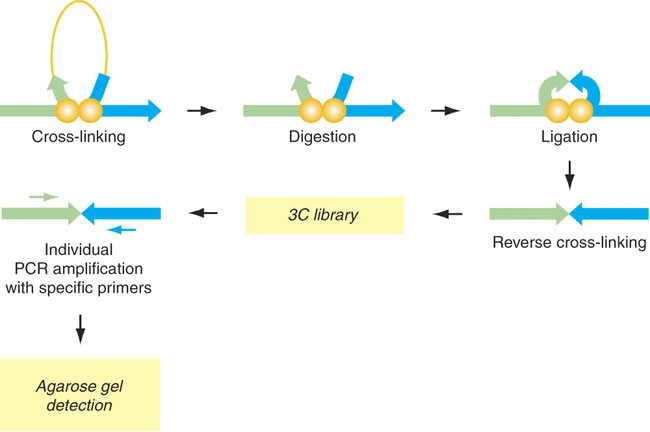

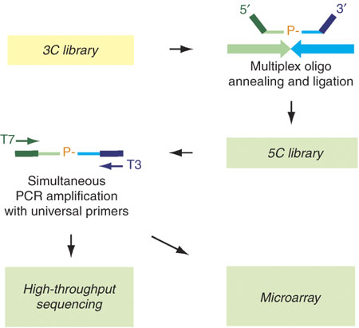

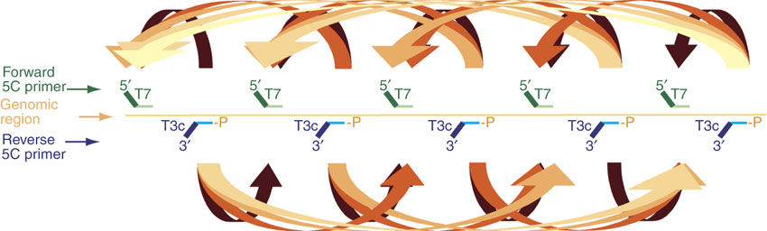

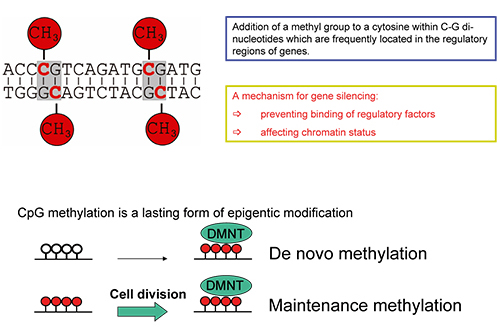

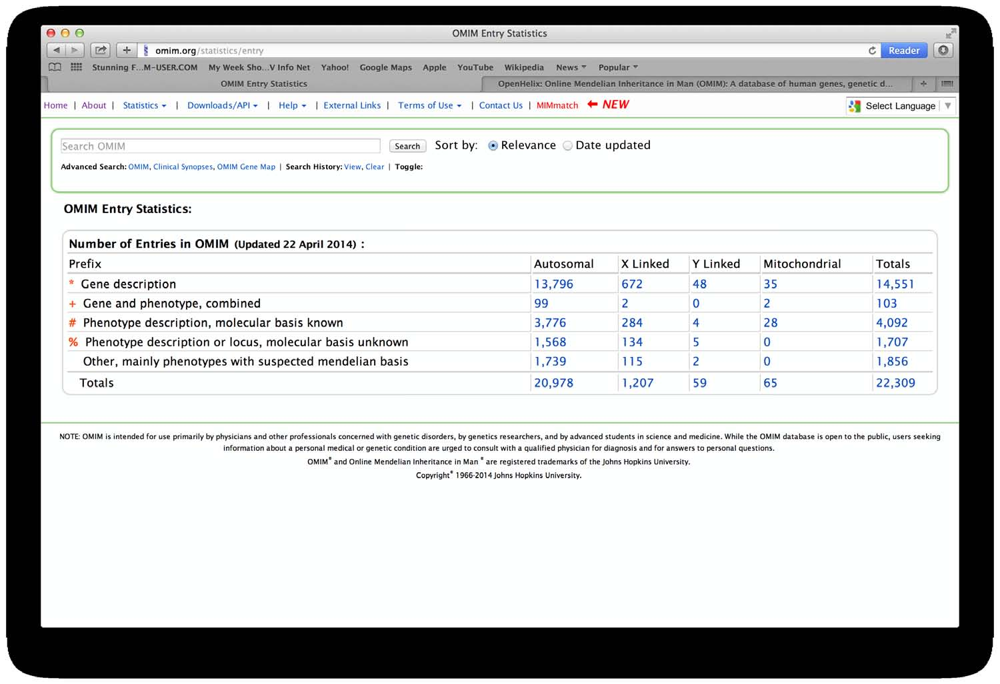

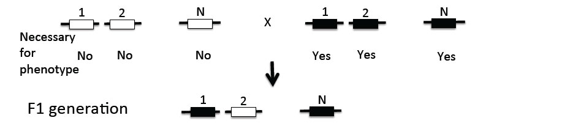

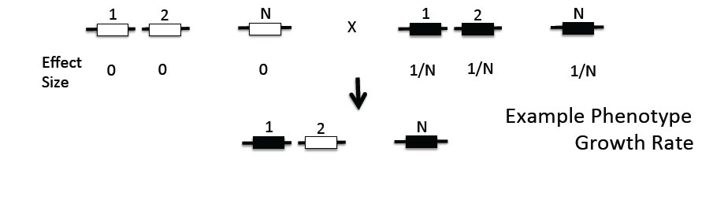

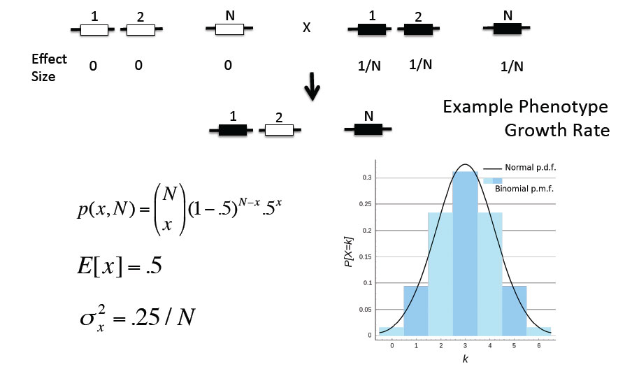

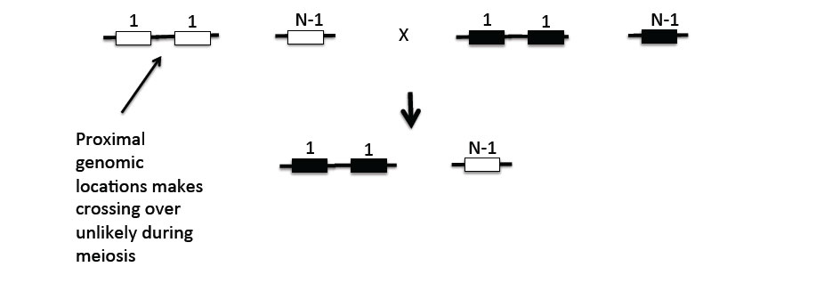

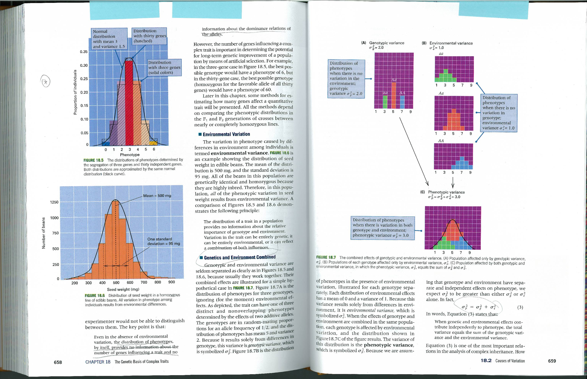

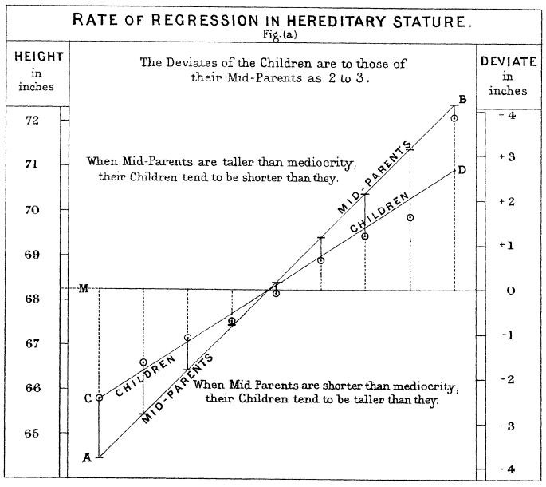

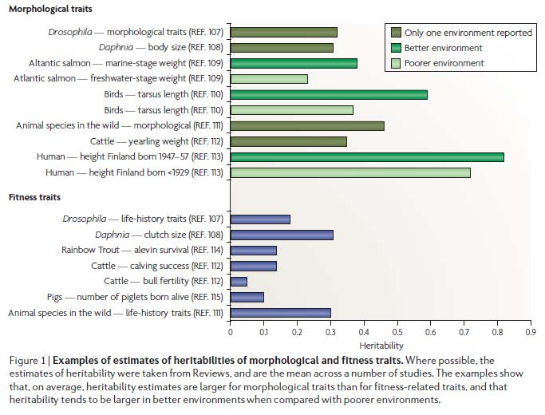

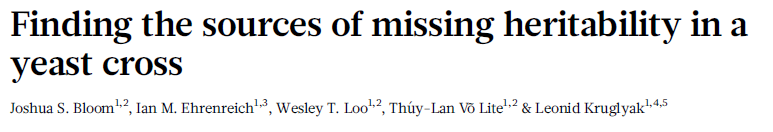

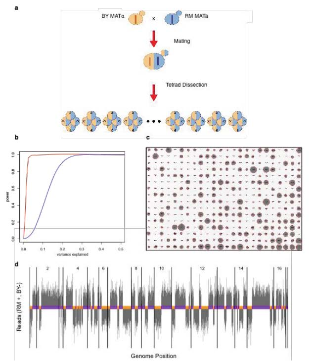

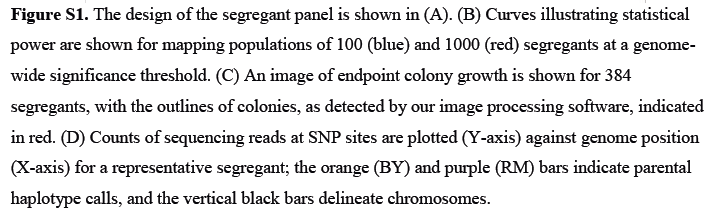

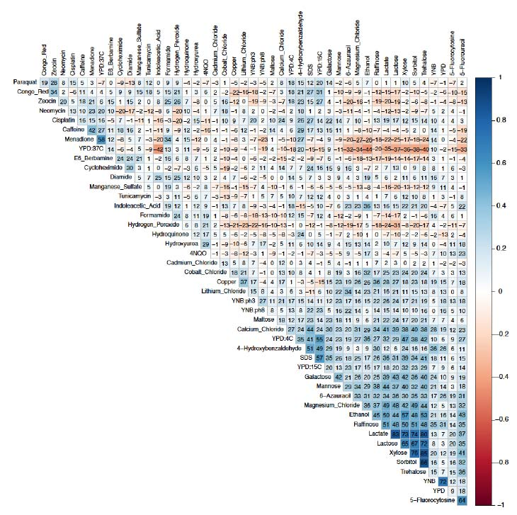

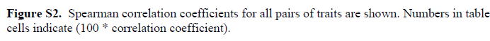

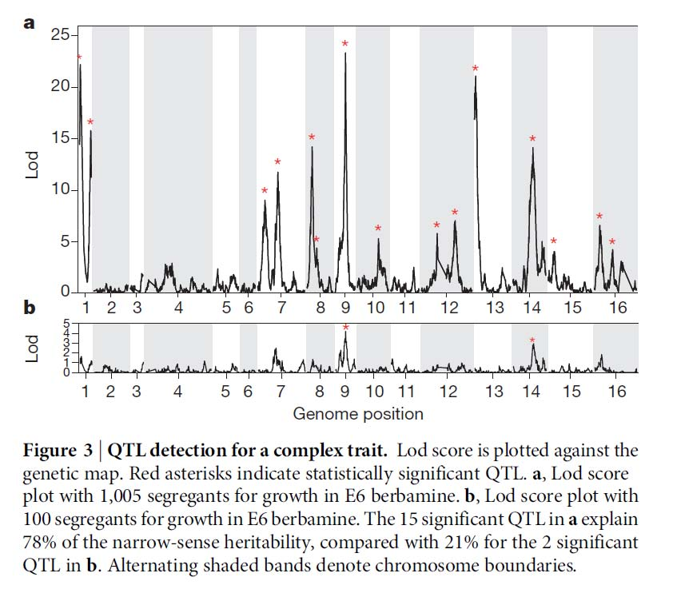

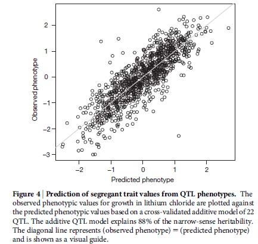

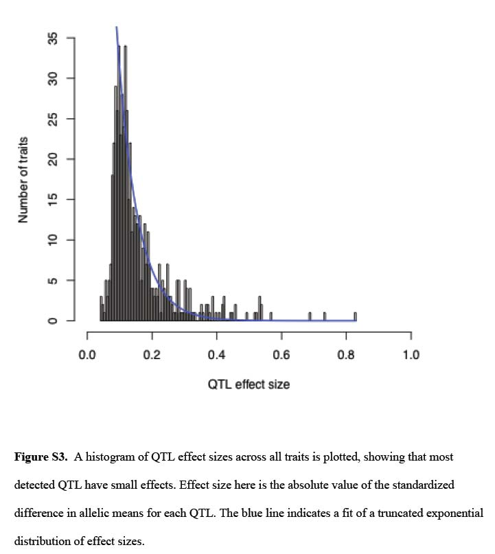

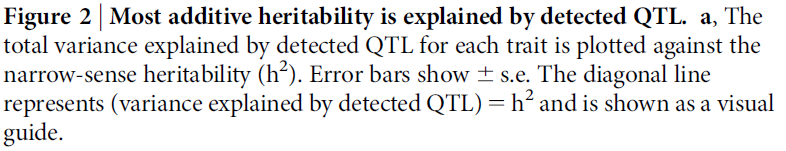

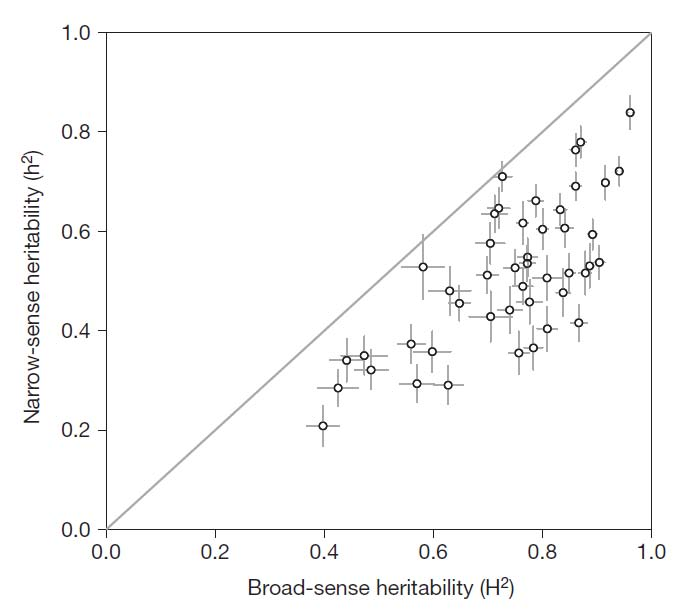

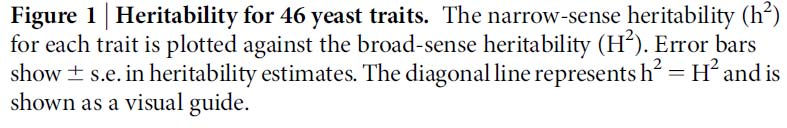

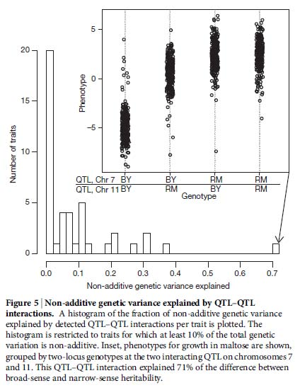

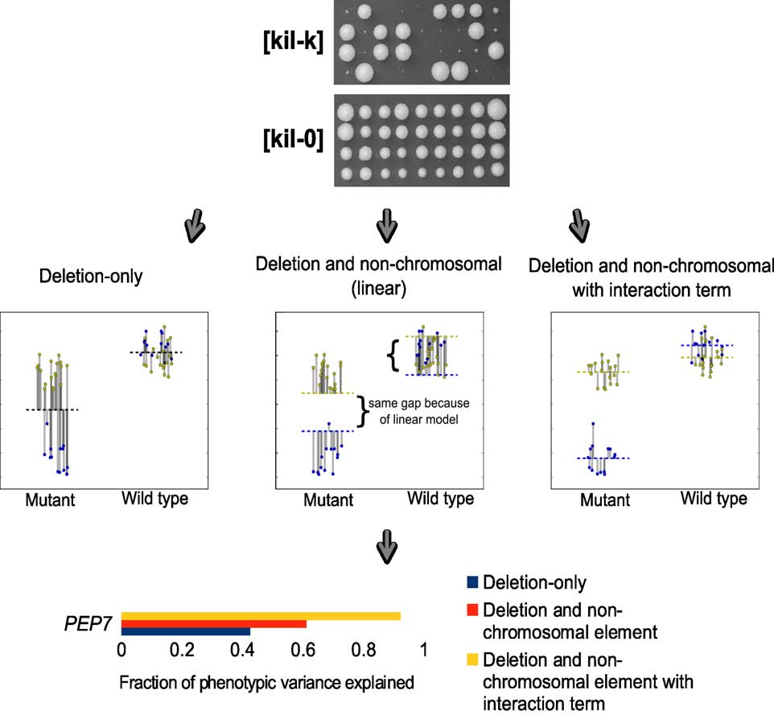

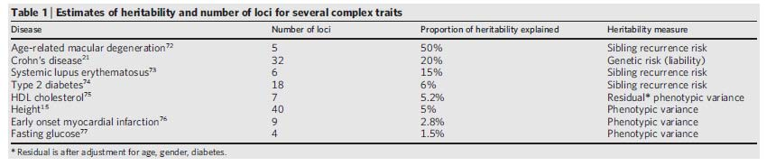

