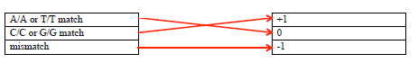

> **Reconstructed by a model.** `psets/01-questions-pset1-ans.pdf` from [ocw-7091j](https://ocw.mit.edu/courses/7-91j-foundations-of-computational-and-systems-biology-spring-2014/) — ocw-7091j, licensed CC BY-NC-SA 4.0. Converted 2026-09-20 from `.pdf`. The original is a PDF with no usable text layer. A model read the pages and wrote this markdown: the prose is a paraphrase in places and **every equation is unverified**. Treat it as a pointer into the original, never as a citable source.

# Problem 1. Sequence search (6 points)

Split into 3 sections.

1. [Problem 1. Sequence search (6 points)](01-problem-1-sequence-search-6-points.md)
2. [Problem 2. Gapped sequence alignment (6 points)](02-problem-2-gapped-sequence-alignment-6-points.md)
3. [Problem 3. Sequence similarity search statistics (7 points)](03-problem-3-sequence-similarity-search-statistics-7-points.md)

## Figures

Extracted from the original PDF. They are listed by the page they came from rather
than placed in the text: the conversion does not record where on the page each one
sat.

---

[Up: contents](../../index.md)
