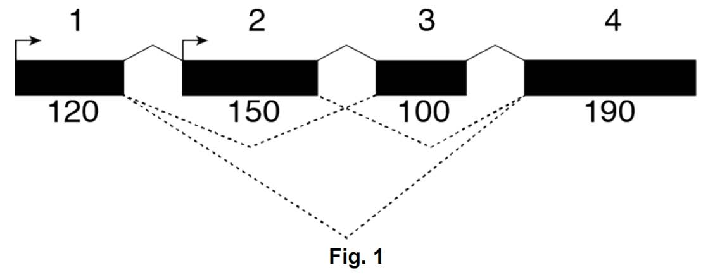

> **Reconstructed by a model.** `psets/02-questions-pset2-ques.pdf` from [ocw-7091j](https://ocw.mit.edu/courses/7-91j-foundations-of-computational-and-systems-biology-spring-2014/) — ocw-7091j, licensed CC BY-NC-SA 4.0. Converted 2026-09-20 from `.pdf`. The original is a PDF with no usable text layer. A model read the pages and wrote this markdown: the prose is a paraphrase in places and **every equation is unverified**. Treat it as a pointer into the original, never as a citable source.

# 02 questions pset2 ques

Split into 4 sections.

1. [02 questions pset2 ques Part 01 —](01-02-questions-pset2-ques-part-01.md)
2. [Problem 2. Library Complexity (5 points)](02-problem-2-library-complexity-5-points.md)
3. [Problem 6. Modeling and information content of sequence motifs (5 points).](03-problem-6-modeling-and-information-content-of-sequence-motif.md)
4. [(Extra 6.874 Problem) Multiple Hypothesis Testing (4 points)](04-extra-6-874-problem-multiple-hypothesis-testing-4-points.md)

## Figures

Extracted from the original PDF. They are listed by the page they came from rather
than placed in the text: the conversion does not record where on the page each one
sat.

---

[Up: contents](../../index.md)
