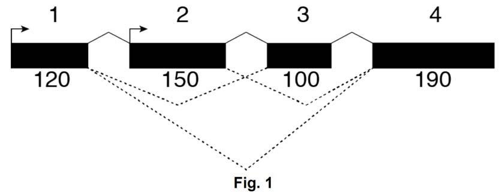
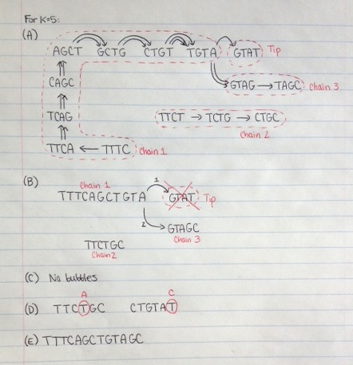

> **Reconstructed by a model.** `psets/02-questions.pdf` from [ocw-7091j](https://ocw.mit.edu/courses/7-91j-foundations-of-computational-and-systems-biology-spring-2014/) — ocw-7091j, licensed CC BY-NC-SA 4.0. Converted 2026-09-20 from `.pdf`. The original is a PDF with no usable text layer. A model read the pages and wrote this markdown: the prose is a paraphrase in places and **every equation is unverified**. Treat it as a pointer into the original, never as a citable source.

# 02 questions

7.36/7.91/20.390/20.490/6.802/6.874
PROBLEM SET 2. BWT, Library complexity, RNA-seq, Genome assembly, Motifs, Multiple hypothesis testing (31 Points)

Due: Thursday, March 13$^{\text{th}}$ at noon.

## Python Scripts
All Python scripts must work on athena using /usr/athena/bin/python. You may not assume availability of any third party modules unless you are explicitly instructed so. You are advised to test your code on Athena before submitting. Please only modify the code between the indicated bounds, with the exception of adding your name at the top, and remove any print statements that you added before submission.

Electronic submissions are subject to the same late homework policy as outlined in the syllabus and submission times are assessed according to the server clock. All python programs must be submitted electronically, as .py files on the course website using appropriate filename for

---

[Up: contents](../index.md)

## Figures

Extracted from the original PDF. They are listed by the page they came from rather
than placed in the text: the conversion does not record where on the page each one
sat.

