> **Reconstructed by a model.** `psets/03-questions.pdf` from [ocw-7091j](https://ocw.mit.edu/courses/7-91j-foundations-of-computational-and-systems-biology-spring-2014/) — ocw-7091j, licensed CC BY-NC-SA 4.0. Converted 2026-09-20 from `.pdf`. The original is a PDF with no usable text layer. A model read the pages and wrote this markdown: the prose is a paraphrase in places and **every equation is unverified**. Treat it as a pointer into the original, never as a citable source.

# 03 questions

## PROBLEM SET 3. Gibbs Sampler, RNA secondary structure, Protein Structure with PyRosetta, Connections (25 Points)

Due: Thursday, April $3^{\text{th}}$ at noon.

### Python Scripts
All Python scripts must work on athena using `/usr/athena/bin/python`. You may not assume availability of any third party modules unless you are explicitly instructed so. You are advised to test your code on Athena before submitting. Please only modify the code between the indicated bounds, with the exception of adding your name at the top, and remove any print statements that you added before submission.

Electronic submissions are subject to the same late homework policy as outlined in the syllabus and submission times are assessed according to the server clock. All python programs must be submitted electronically, as .py files on the course website using appropriate filename for the scripts as indicated in the problem set or in the skeleton scripts provided on course website.

---

### P1. Gibbs Sampler (10 Points).

You are studying longevity in two species, A and B. A study was recently published showing that a transcription factor called AGE is involved in regulating many aging- and stress-related pathways in both species A and B. AGE is known to affect transcription by binding to the promoters of its target genes. You have a list of aging-related genes whose expression changed (as measured by RNA-seq) in *age(-)* mutants relative to wild-type in species A. From a similar experiment, you obtained a list of genes whose expression changed in *age(-)* in species B. You want to look at the promoters of these genes to see if you can find any enriched sequence motif that might be a recognition site for AGE. You have two lists of sequences – `seqsA.fa` contains the 30bp upstream from the AGE target genes in A, and `seqsB.fa` contains 30bp upstream from the AGE target genes in B. To do this analysis, you will implement a Gibbs sampler!

**(A – 6 points)** Download the skeleton code `gibbsSampler.py`. The script requires two inputs: the name of a FASTA file containing sequences believed to share a common motif, and the length of the motif. The main function `run` is called at the very bottom of the script; the argument $x$ passed to `run(x)` is the number of iterations of the Gibbs sampler that will be run (initially set to 1).

You can run the script with the sequences from A as the input file and motif length 7 by running

```bash
% python gibbsSampler.py seqsA.fa 7
```

The skeleton code should run without errors, though it will mostly be telling you that various sub-functions haven't been implemented yet. Now fill out the skeleton code so that it successfully implements the Gibbs Sampler. Though you can use whatever approach you find best when completing the script, you may find the suggestions in `GibbsSamplerHelp.txt` helpful to walk you through which sub-functions you need to complete.

Once you've completed the code, set your Gibbs Sampler to run 1000 iterations and run it on the `seqsA.fa` file. Run the algorithm several (~10) times and pick the highest scoring run. For that run, report the background distribution, final weight matrix, motif score and relative entropy (you can just copy and paste from the output of the script as long as your solution is in readable table form; .doc provided on course website if helpful). Also, plot the relative entropy of the motif after each iteration. What is the shape of this graph? What is the consensus motif? (Hint: the highest scoring motif has a score over 600).

Final Matrix:

| Pos | A | C | G | T |
| :--- | :--- | :--- | :--- | :--- |
| 0 | 0.807692307692 | 0.025641025641 | 0.0897435897436 | 0.0769230769231 |
| 1 | 0.0384615384615 | 0.102564102564 | 0.179487179487 | 0.679487179487 |
| 2 | 0.0512820512821 | 0.820512820513 | 0.115384615385 | 0.0128205128205 |
| 3 | 0.0128205128205 | 0.0128205128205 | 0.025641025641 | 0.948717948718 |
| 4 | 0.0769230769231 | 0.846153846154 | 0.0384615384615 | 0.0384615384615 |
| 5 | 0.858974358974 | 0.0384615384615 | 0.0769230769231 | 0.025641025641 |
| 6 | 0.794871794872 | 0.0897435897436 | 0.025641025641 | 0.0897435897436 |

Motif score = 606.758419344

Relative entropy = 7.14156518812

Background = {'A': 0.298, 'C': 0.235, 'T': 0.288, 'G': 0.179}

The graph is sigmoidal – there's an initial "burn in" phase where the algorithm is still searching around, then a rapid rise when we start to randomly select more instances of the motif, followed by a plateau as we converge towards the motif.

The consensus motif is ATCTCAA.

**(B – 1 point)** Weight matrices are not very visually informative for understanding a motif – Sequence Logos are more human friendly. Run your code again, using the `printToLogo()` function provided in the code to print out the final motifs for each sequence after the 1000 iterations are complete (you may want to comment out the other outputs). Go to http://weblogo.berkeley.edu/logo.cgi and paste the list of aligned motifs into the input box and hit Create Logo (note that the number of bits of information at each position doesn't take into account the background distribution of the sequences). Try this at least 3 different times with different runs of your Gibbs sampler, and print off or include a screenshot of each logo as well as the relative entropy and final score of that logo. Compare the results of your various runs. Briefly explain what types of differences you observe and why the Gibbs sampler returns these different motifs.

Motif score = 617.174
Relative entropy = 7.264

Motif score = 509.04
Relative entropy = 5.997

Motif score = 501.696
Relative entropy = 5.918

Common differences include shifts – leftmost logo is "best" after several runs, but other commonly observed results were shifted either right or left (middle and rightmost above). Shifts like this happen because even the shifted pattern occurs with higher probability, and if the Gibbs sampler gets "stuck" on these shifted motifs, it is difficult for it to move away from them.

**(C – 2 points)** We now want to look for motifs in species B. Run the algorithm for length 7 and `seqsB.fa` several times and report the background distribution, final weight matrix, motif score and relative entropy (you don't need to plot RelEnt at every iteration) from a representative run. How does the relative entropy of the motif in species B compared to species A? Does this mean that the AGE motif is easier or harder to find in species B? Why?

Final matrix:

| Pos | A | C | G | T |
| :--- | :--- | :--- | :--- | :--- |
| 0 | 0.820512820513 | 0.0641025641026 | 0.0384615384615 | 0.0769230769231 |
| 1 | 0.0769230769231 | 0.0769230769231 | 0.205128205128 | 0.641025641026 |
| 2 | 0.025641025641 | 0.833333333333 | 0.128205128205 | 0.0128205128205 |
| 3 | 0.0384615384615 | 0.025641025641 | 0.025641025641 | 0.910256410256 |
| 4 | 0.115384615385 | 0.807692307692 | 0.025641025641 | 0.0512820512821 |
| 5 | 0.923076923077 | 0.0384615384615 | 0.025641025641 | 0.0128205128205 |
| 6 | 0.75641025641 | 0.128205128205 | 0.0128205128205 | 0.102564102564 |

Motif score = 795.217460446

Relative entropy = 9.6265072489

Background = {'A': 0.165, 'C': 0.358, 'T': 0.137, 'G': 0.34}

The motif was easier to find in species B because species B is G/C rich. Therefore, the motif, which is A/T rich, "sticks out" more in species B relative to the background – therefore both the motif score and relative entropy are higher.

**(D – 1 point)** Assuming there was still one occurrence of the motif in every sequence, what would happen if we increased the lengths of the sequences we are searching through? Run your Gibbs sampler on `seqsAext.fa`, which contains sequences of length 90 instead of 30. Run it several times and plot the relative entropy as a function of the number of iterations for a high scoring run. How is this plot different from part (a)? Can you explain the difference?

The plot is still generally sigmoidal, but the initial "random exploration" period is longer – it takes more iterations (on average) for the sampler to stumble onto an enriched motif. This makes sense since it has to search through sequences that are 3 times longer – the probability of randomly sampling the motif is lower. Given enough iterations, however, we will probably eventually converge to the correct motif (though it's harder).

---

### P2. RNA secondary structure prediction (5 points).

**(A - 3 points)** Use the Nussinov algorithm to find the secondary structure that maximizes the number of base-pairs in the following RNA sequence (show your work):

CGAGUCGGAGUC

Solution:

Note that dotted arrows indicate bifurcations. These were only drawn if the bifurcation had a higher score than the other possibilities (e.g. scores from the left or bottom squares, etc.). There are 3 possible tracebacks corresponding to two different structures (two of the tracebacks are equivalent, follow different bifurcations to the same substructures):

Folded structure for traceback #1:
Folded structure for tracebacks #2 and 3:

Traceback #1
Traceback #2
Traceback #3

**(B – 2 points)** Run this sequence through the mfold RNA folding server (default parameters) at:
http://mfold.rit.albany.edu/?q=mfold/RNA-Folding-Form

Examine the top two structures it produces by looking at the "pdf"s under "View Individual Structures:". Notice that they don't match the structure predicted by the Nussinov algorithm. Examining the examples of real RNA secondary structures shown in lecture (slides 12, 32, 39 of Lecture 11), generate a hypothesis for which criteria used by the mfold algorithm to describe RNA thermodynamics prevents this algorithm from predicting the structure returned by the Nussinov algorithm in part (A). Test your hypothesis by strategically inserting adenosines at locations (e.g. in loops, between stems, across from bulges) necessary in the sequence above and finding the minimum number that must be inserted so that the top mfold-predicted structure has pairs between the same bases as in your Nussinov base pair-maximization structure.

The top two structures are shown above - the loops in the two hairpins of the Nussinov algorithm-predicted structure are too short (only 1 G each) – real loops must be at least 3 bases long.

Inserting A's next to the G in the first loop reveals that 3 A's must be added for the first stem to pair all three given by the Nussinov algorithm (C/G, G/C, A/U). Because the two stems are also too close to one other (no nucleotides between the two G's at the bases of the loops), one A must be added between these two G's. Similarly, three A's must be added to the second loop so it's large enough to pair the two in that stem (G/C and A/U). With this sequence CGAGAAAUCGAGAGAAAUC, the structure that has the same two stems as the Nussinov-derived structure is:

Output of sir_graph (©)
mfold_util 4.6
Created Wed Mar 19 13:48:58 2014
dG = 2.00 [Initially 2.00] 14Mar19-13-48-56-dcddac9b93

Output of sir_graph (©)
mfold_util 4.6
Created Wed Mar 19 13:48:59 2014
dG = 3.00 [Initially 3.00] 14Mar19-13-48-56-dcddac9b93

Output of sir_graph (©)
mfold_util 4.6
Created Wed Mar 19 13:55:39 2014
dG = -3.50 [Initially -3.30] 14Mar19-13-55-37-4bcffdf8e8

---

### P3. Protein structure with PyRosetta (6 points).

In this problem, you will explore protein structure with PyRosetta, an interactive Python-based interface to the powerful Rosetta molecular modeling suite.

In the following, we will provide instructions on how to complete this problem on Athena's Dialup Service, where PyRosetta has previously been installed as a module for another class – you may install PyRosetta (http://www.pyrosetta.org/dow) locally on your own computer and complete the problem there, but we will not provide help for installation or operating system-specific Python issues, so we highly recommend you complete it on Athena.

Log onto Athena's Dialup Service (http://kb.mit.edu/confluence/pages/viewpage.action?pageId=3907166), either at a workstation on campus or from a Terminal on your personal machine:

```bash
ssh <your Kerberos username>@athena.dialup.mit.edu
```

Once logged on, load the PyRosetta module with the following 2 commands:

```bash
cd /afs/athena/course/20/20.320/PyRosetta
source SetPyRosettaEnvironment.sh
```

If you log onto Athena to complete the problem at a future time, you will have to execute these two commands again, otherwise you will get the following error:

```
ImportError: No module named rosetta
```

Now, head to the course's Athena directory, copy the `pyRosetta_materials.zip` folder of files for this problem to your home directory (~), and then unzip it in your home directory with the following commands:

```bash
cd /afs/athena/course/7/7.91/sp_2014
cp pyRosetta_materials.zip ~
cd ~
unzip pyRosetta_materials.zip
cd pyRosetta_materials
```

You should now be able to edit any of these files. Most of the code you'll need is contained in the script `pyRosetta_1YY8.py` that you'll work with below, but for any additional functions you want to use you can reference the PyRosetta documentation:
http://graylab.jhu.edu/~sid/pyrosetta/downloads/documentation/PyRosetta_Manual.pdf, particularly Units 2 (Protein Structure in PyRosetta), 3 (Calculating Energies in PyRosetta), and 6 (Side-chain Packing and Design).

**(A – 1 point)** Go to the Protein Data Bank (http://www.rcsb.org/pdb/home/home.do) and search for the protein we'll be working with – 1YY8. What is this molecule? By looking at the "3D View" tab of this protein, what is the predominant secondary structure ($\alpha$-helix or $\beta$-sheet)?

1YY8 is Cetuximab (pharmaceutical name), a chimeric mouse/human monoclonal antibody that is an epidermal growth factor receptor (EGFR) inhibitor used for the treatment of metastatic colorectal cancer and head and neck cancer. It is predominantly composed of $\beta$-sheets.

**(B – 1 point)** In order to open and edit the `pyRosetta_1YY8.py` file, you will need to use a text editor on Athena's Dialup Service, which doesn't register commands from the mouse. If you're familiar with emacs or vim, these are great options, otherwise we recommend nano, a friendly text editor that can be navigated with the arrow keys. Open the file for editing by typing:

```bash
nano pyRosetta_1YY8.py
```

You can scroll with the arrow keys, and additional commands are shown at the bottom of the Terminal, where ^ is the Control key. Once you've made any changes, to exit and save, type "Control + x" followed by "y" and then Enter to signify yes, you want to save your changes.

Look over how the code for `part_b()` loads the PDB file `1YY8.clean.pdb` (which has been cleaned to remove non-atomic annotation information) and prints out the protein's angles and energy score. Then run the script from the command line with `python pyRosetta_1YY8.py` (note that it may take up a couple of minutes to load the module the first time you run it; it will also print out many lines of initialization warnings before printing out what is in the code). What is the energy of the structure, and what categories are the primary contributors (weighted score) for and against the total energy? (describe the categories in words as on the lecture slides, not just the shortened names that appear)

Pre-packing energy of protein:

| Scores | Weight | Raw Score | Wghtd.Score |
| :--- | :--- | :--- | :--- |
| fa_atr | 0.800 | -3965.401 | -3172.321 |
| fa_rep | 0.440 | 1876.492 | 825.656 |
| fa_sol | 0.750 | 2364.222 | 1773.166 |
| fa_intra_rep | 0.004 | 2195.281 | 8.781 |
| fa_elec | 0.700 | -386.812 | -270.768 |
| pro_close | 1.000 | 56.040 | 56.040 |
| hbond_sr_bb | 1.170 | -49.849 | -58.324 |
| hbond_lr_bb | 1.170 | -264.410 | -309.359 |
| hbond_bb_sc | 1.170 | -59.720 | -69.873 |
| hbond_sc | 1.100 | -47.222 | -51.945 |
| dslf_fa13 | 1.000 | -6.461 | -6.461 |
| rama | 0.200 | -162.282 | -32.456 |
| omega | 0.500 | 41.746 | 20.873 |
| fa_dun | 0.560 | 2768.159 | 1550.169 |
| p_aa_pp | 0.320 | -266.588 | -85.308 |
| ref | 1.000 | 26.385 | 26.385 |

Total weighted score: 204.257

The largest contributor to the structure's energy is the Van der Waals net attractive energy, and the largest contributor against is Solvation.

**(C – 1 point)** In the code for `part_c()`, Monte-Carlo side-chain packing is implemented. At the indicated region, add code to print out the post-packed energy score. At the bottom of the script, uncomment `part_c()` and run the script. What is the energy of the structure after packing, and which two categories have decreased the most compared to part (b)? (describe the categories in words as on the lecture slides, not just the shortened names that appear)

Post-packing energy of protein:

| Scores | Weight | Raw Score | Wghtd.Score |
| :--- | :--- | :--- | :--- |
| fa_atr | 0.800 | -3860.365 | -3088.292 |
| fa_rep | 0.440 | 1063.022 | 467.730 |
| fa_sol | 0.750 | 2250.695 | 1688.021 |
| fa_intra_rep | 0.004 | 1729.167 | 6.917 |
| fa_elec | 0.700 | -487.361 | -341.153 |
| pro_close | 1.000 | 35.926 | 35.926 |
| hbond_sr_bb | 1.170 | -49.849 | -58.324 |
| hbond_lr_bb | 1.170 | -264.410 | -309.359 |
| hbond_bb_sc | 1.170 | -67.520 | -78.999 |
| hbond_sc | 1.100 | -63.989 | -70.388 |
| dslf_fa13 | 1.000 | -6.461 | -6.461 |
| rama | 0.200 | -162.282 | -32.456 |
| omega | 0.500 | 41.746 | 20.873 |
| fa_dun | 0.560 | 1530.485 | 857.072 |
| p_aa_pp | 0.320 | -266.588 | -85.308 |
| ref | 1.000 | 26.385 | 26.385 |

Total weighted score: -967.817

The Van der Waals net repulsive energy and the Dunbrack rotamer energy have decreased the most compared to part (b).

(Side-chain packing is a stochastic Monte Carlo process in PyRosetta, so you may get a slightly different answer each time)

**(D – 1 point)** The `1YY8.rotated.pdb` structure is the same as `1YY8.clean.pdb`, except that one residue's phi or psi angle has been changed. Fill in the code for `part_d()` to load the rotated structure and perform side-chain packing on it, printing out the energy of the structure before and after side-chain packing. What is the energy before and after? Why is the post-side-chain packing energy not the same as that of part (c)?

Pre-packing energy of rotated protein:

| Scores | Weight | Raw Score | Wghtd.Score |
| :--- | :--- | :--- | :--- |
| fa_atr | 0.800 | -4121.174 | -3296.939 |
| fa_rep | 0.440 | 137307.329 | 60415.225 |
| fa_sol | 0.750 | 2511.637 | 1883.728 |
| fa_intra_rep | 0.004 | 2195.358 | 8.781 |
| fa_elec | 0.700 | -364.049 | -254.834 |
| pro_close | 1.000 | 56.097 | 56.097 |
| hbond_sr_bb | 1.170 | -48.422 | -56.654 |
| hbond_lr_bb | 1.170 | -247.068 | -289.069 |
| hbond_bb_sc | 1.170 | -57.227 | -66.956 |
| hbond_sc | 1.100 | -44.409 | -48.850 |
| dslf_fa13 | 1.000 | -5.723 | -5.723 |
| rama | 0.200 | -154.825 | -30.965 |
| omega | 0.500 | 41.762 | 20.881 |
| fa_dun | 0.560 | 2768.340 | 1550.271 |
| p_aa_pp | 0.320 | -263.857 | -84.434 |
| ref | 1.000 | 26.385 | 26.385 |

Total weighted score: 59826.941

Post-packing energy of rotated protein:

| Scores | Weight | Raw Score | Wghtd.Score |
| :--- | :--- | :--- | :--- |
| fa_atr | 0.800 | -3965.339 | -3172.271 |
| fa_rep | 0.440 | 91477.078 | 40249.914 |
| fa_sol | 0.750 | 2351.443 | 1763.583 |
| fa_intra_rep | 0.004 | 1763.727 | 7.055 |
| fa_elec | 0.700 | -446.642 | -312.649 |
| pro_close | 1.000 | 86.866 | 86.866 |
| hbond_sr_bb | 1.170 | -48.422 | -56.654 |
| hbond_lr_bb | 1.170 | -247.068 | -289.069 |
| hbond_bb_sc | 1.170 | -58.160 | -68.047 |
| hbond_sc | 1.100 | -54.390 | -59.829 |
| dslf_fa13 | 1.000 | -5.723 | -5.723 |
| rama | 0.200 | -154.825 | -30.965 |
| omega | 0.500 | 41.762 | 20.881 |
| fa_dun | 0.560 | 1552.435 | 869.364 |
| p_aa_pp | 0.320 | -263.857 | -84.434 |
| ref | 1.000 | 26.385 | 26.385 |

Total weighted score: 38944.414

The energy after side-chain packing for the rotated protein is not the same as that of the original protein because side-chain packing only optimizes the side-chain conformations, not the protein backbone (e.g. phi and psi) angles, one of which we know is changed in the rotated protein.

**(E – 1 point)** Add code to `part_e()` to determine which angle (phi or psi, as well as which residue number this angle belongs to) is changed in the rotated structure. Which residue/angle is it?

```python
def part_e():
    pdb_protein = pose_from_pdb("1YY8.clean.pdb")
    # reload the rotated structure (without packed side-chains)
    rot_pdb_protein = pose_from_pdb("1YY8.rotated.pdb")
    #################### ADD CODE TO DETERMINE WHICH ANGLE CHANGED ####################
    # iterate through resides to determine which residue and angle (phi or psi) is changed
    for i in range(1, pdb_protein.total_residue() + 1):
        orig_phi = pdb_protein.phi(i)
        rotated_phi = rot_pdb_protein.phi(i)
        # see if the phi or psi angle is different by at least 1 degree
        if (abs(orig_phi - rotated_phi) > 1):
            print "Phi angle of residue ", i, " from ", orig_phi, " to ", rotated_phi
        orig_psi = pdb_protein.psi(i)
        rotated_psi = rot_pdb_protein.psi(i)
        if (abs(orig_psi - rotated_psi) > 1):
            print "Psi angle of residue ", i, " from ", orig_psi, " to ", rotated_psi
    #################### END CODE TO DETERMINE WHICH ANGLE CHANGED ####################
```

The phi angle of residue 50.

**(F – 1 point)** Using the residue and angle you determined in part (e), add code to `part_f()` to determine the energy of the structure with that angle changed to each of the possible angles [-180,-179,….,180]. Which of these angles has the lowest energy, and does this agree with the corresponding angle in the original structure from part (b)?

Add each of these energies to the `energies_of_angle` list, and then modify `set_title` to include the residue and angle that you changed. If you've done this correctly, an `energy_vs_angle.pdf` plot will be written to the directory where the script is. If you're at an Athena workstation, you can view this PDF directly (Home Folder > pyRosetta_materials); if you've ssh'ed into Athena from a Terminal on your local computer, you can copy this PDF to your local computer and then open it in your computer's PDF viewer with the following commands using scp (secure copy):

```bash
<in a new Terminal on your computer, cd into your local computer's directory where you want to download the PDF>
scp <your Kerberos username>@athena.dialup.mit.edu:~/pyRosetta_materials/energy_vs_angle.pdf .
```

Using the phi angle of reside 50 that we determined in part (e),

```python
def part_f():
    rot_pdb_protein = pose_from_pdb("1YY8.rotated.pdb")
    scorefxn = get_fa_scorefxn()
    # for the residue and angle you determined from (e) was changed, calculate the energy
    # of the structure with each of the 360 possible integer angles. Add these
    # energies in the list energies_of_angle so it can be plotted.
    lowest_modified_energy_so_far = 1000000
    angle_with_lowest_energy_so_far = -181
    possible_angles = range(-180, 181)
    # you'll need to fill in this list so it's the same length as possible_angles;
    # then, a plot will be created below
    energies_of_angle = []
    ### ADD CODE TO CALCULATE ENERGIES OF ALL POSSIBLE ANGLES FOR YOUR RESIDUE, ANGLE ###
    for angle in possible_angles:
        rot_pdb_protein.set_phi( 50, angle )
        energy = scorefxn( rot_pdb_protein )
        energies_of_angle.append(energy)
        if (energy < lowest_modified_energy_so_far):
            lowest_modified_energy_so_far = energy
            angle_with_lowest_energy_so_far = angle

    print "Angle with lowest energy is: ", angle_with_lowest_energy_so_far
    print "\t Energy is:", lowest_modified_energy_so_far
    ### END CODE TO CALCULATE ENERGIES OF ALL POSSIBLE ANGLES FOR YOUR RESIDUE, ANGLE ###
```

The energy minimum occurs at $\phi = 53^\circ$ (energy = 505.297). For the original residue 50 angles from the structure in part (b), $\phi = 52.84$, so our $\phi$ minimum matches the original structure as expected.

Energy of 1YY8 by Residue 50 $\phi$ degree

---

### P4. Queuing theory/connections (4 points).

A small bank hires a management consultant to figure out if they can afford to advertise free checking for one year (a $150 value) to any customer who has to wait in line more than 15 minutes. The consultant observes that, each minute that the bank is open, the waiting line gets longer by one customer with probability ¼, and – if there is a line – the line gets shorter by one customer (because a customer is served by a teller) with probability ¾. Let $X$ be the probability that the line never gets longer than 10 people in a 12-week period (this is a reference case, whose empirical frequency is known to the bank), and let $Y$ be the probability that the line never gets longer than 15 people in a 12-week period (the proposed duration of the promotion). The bank is open 2400 minutes every week.

Use an equation that was covered in class to calculate $\frac{\ln(X)}{\ln(Y)}$.

This scenario is analogous to finding local alignment of unrelated sequences of uniform composition, in which we expect a match with probability ¼ and a mismatch with probability ¾. That the bank line cannot go below 0 people is equivalent to resetting the local alignment score to 0 if the score becomes negative. The bank line getting longer by 1 and shorter by 1 corresponds to a match score of +1 and a mismatch score of -1, respectively.

In the Gumbel distribution for BLAST statistics, $MN = (\text{length of database})(\text{length of query})$ is the total size of the search space because in local alignment you consider starting a match at every position in the database vs. every position in the query. In the bank scenario, the "high scoring" run of the line increasing to over 10 or 15 people could begin at any minute, so the search spaces ($=MN$ in the Gumbel distribution) are each (12 weeks\*2400 minutes), respectively.

Recall that $\lambda$ is the unique positive solution to:

$\frac{1}{4}e^{\lambda} + \frac{3}{4}e^{-\lambda} = 1$, which corresponds to $\lambda = \ln(3)$ (Problem Set 1, Q3(a)).

As indicated in the BLAST tutorial, $K$ and $\lambda$ can be thought of simply as natural scales for the search space size and the scoring system, respectively; because the search space and scoring system are the same for $X$ and $Y$, $K$ will cancel out (see below).

In local alignment, the P-value is the probability that we achieve a score at least $x$ or greater; here were are interested in the complement of that, the probability that the score (length of the line) never reaches above $x$: (1-Gumbel Distribution) $= \exp[-KMNe^{-\lambda x}]\$.

Thus, we have:

$$\frac{\ln(X)}{\ln(Y)} = \frac{\ln\left(\exp[-K(12*2400)e^{-10\cdot\ln(3)}]\right)}{\ln\left(\exp[-K(12*2400)e^{-15\cdot\ln(3)}]\right)} = \frac{-K(12*2400)e^{-10\cdot\ln(3)}}{-K(12*2400)e^{-15\cdot\ln(3)}} = \frac{3^{-10}}{3^{-15}} = 243.$$

---

MIT OpenCourseWare
http://ocw.mit.edu

7.91J / 20.490J / 20.390J / 7.36J / 6.802J / 6.874J / HST.506J Foundations of Computational and Systems Biology
Spring 2014

For information about citing these materials or our Terms of Use, visit: http://ocw.mit.edu/terms.

---

[Up: contents](../index.md)

## Figures

Extracted from the original PDF. They are listed by the page they came from rather
than placed in the text: the conversion does not record where on the page each one
sat.

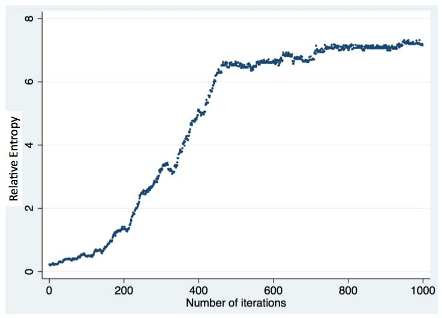

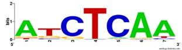

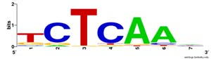

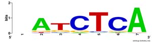

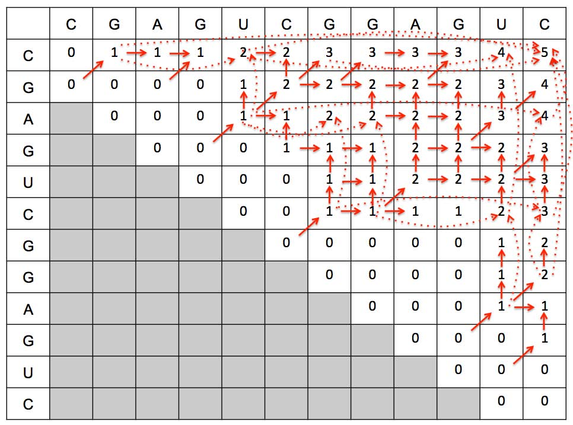

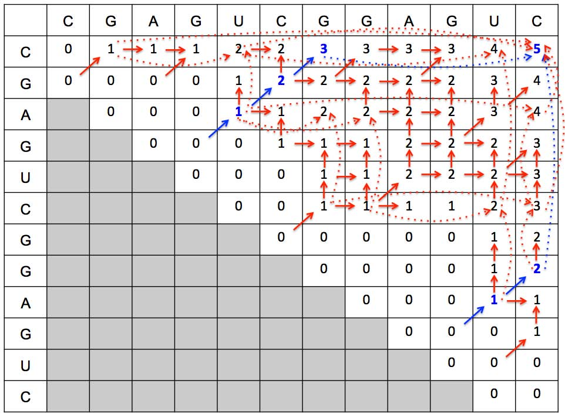

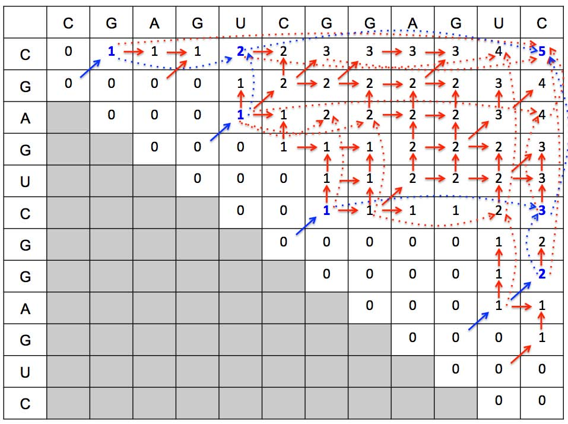

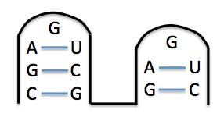

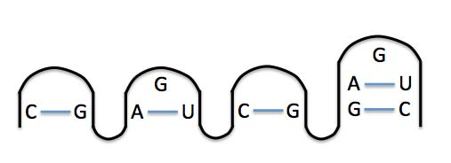

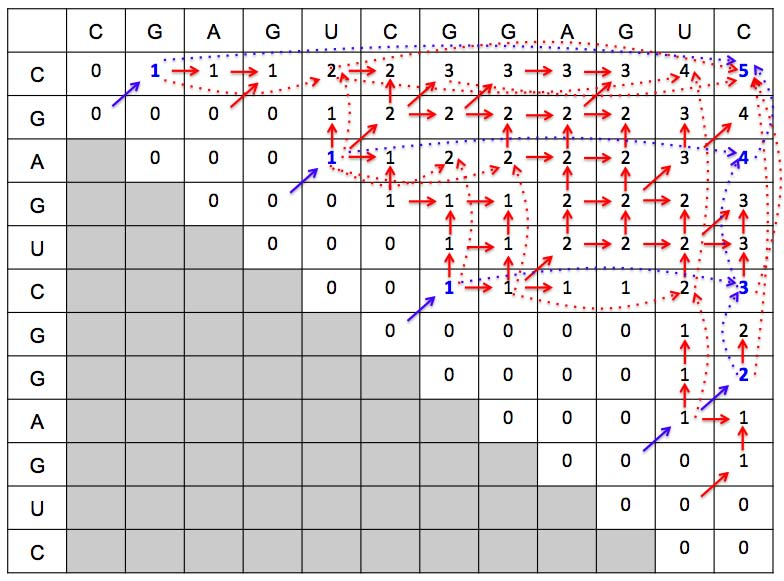

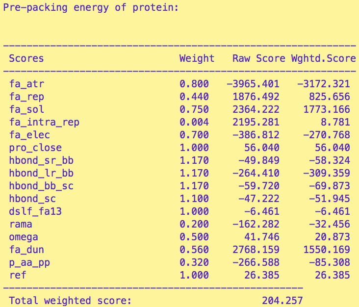

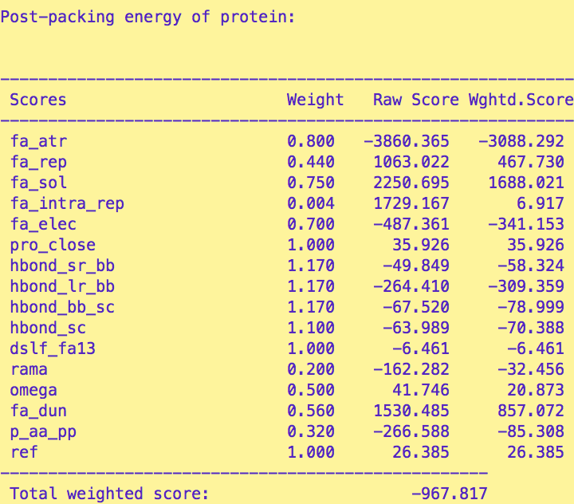

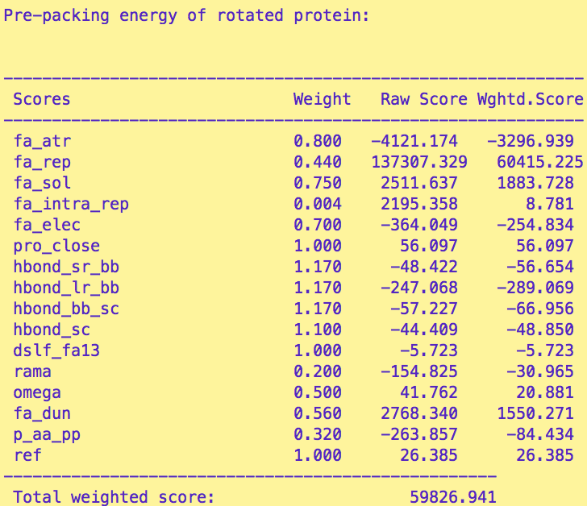

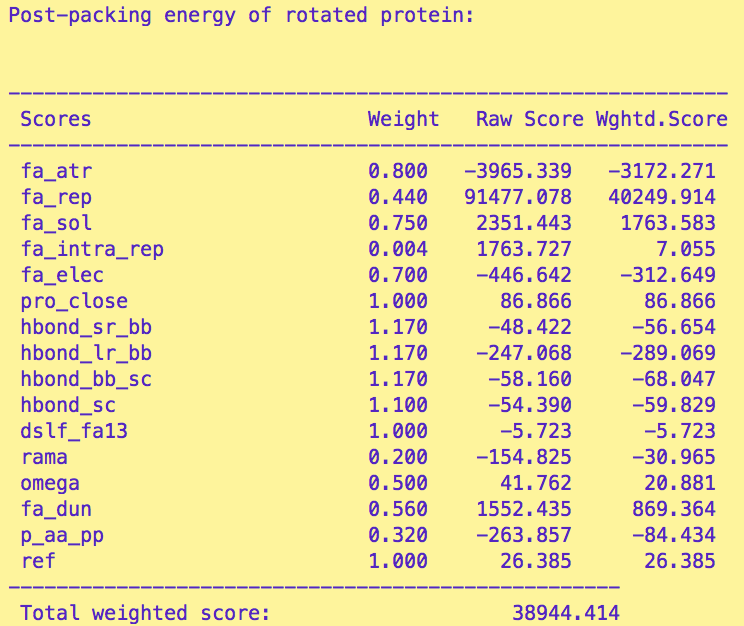

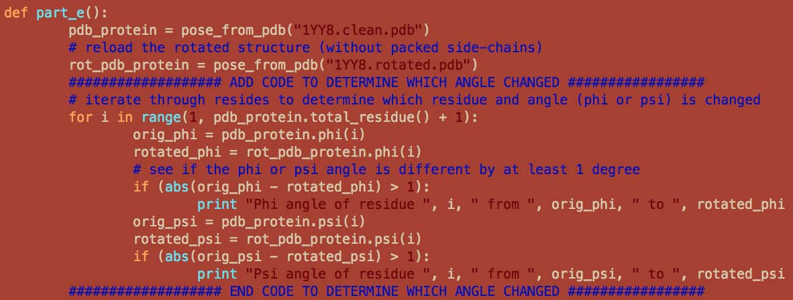

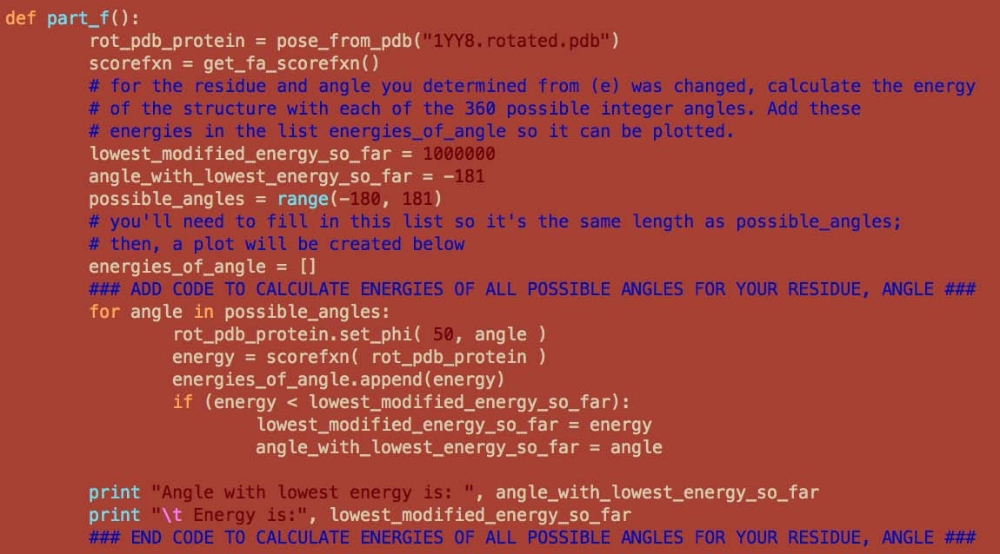

