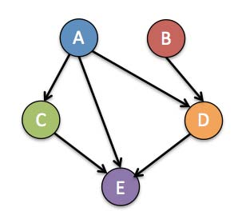
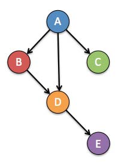
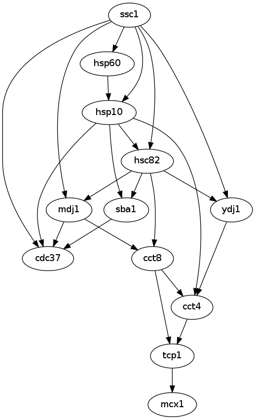
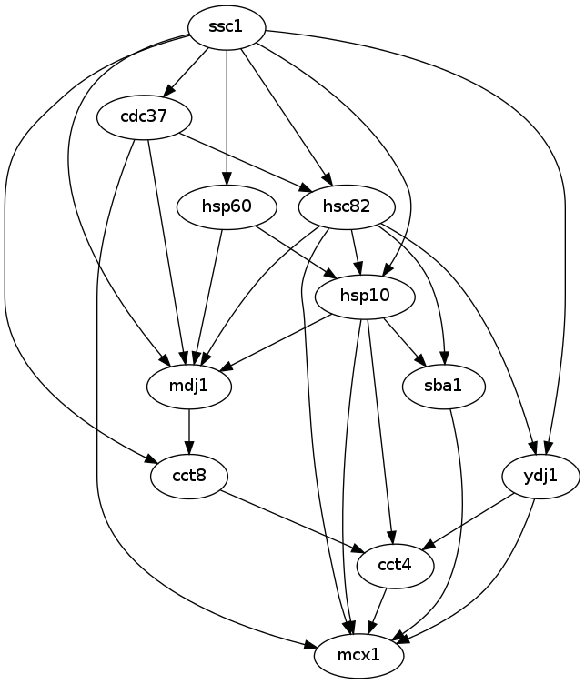
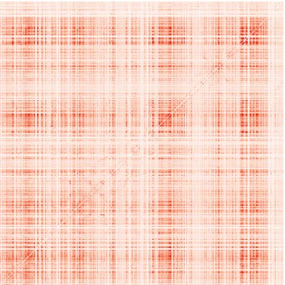
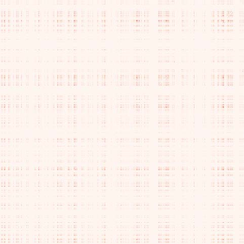

> **Reconstructed by a model.** `psets/04-questions.pdf` from [ocw-7091j](https://ocw.mit.edu/courses/7-91j-foundations-of-computational-and-systems-biology-spring-2014/) — ocw-7091j, licensed CC BY-NC-SA 4.0. Converted 2026-09-20 from `.pdf`. The original is a PDF with no usable text layer. A model read the pages and wrote this markdown: the prose is a paraphrase in places and **every equation is unverified**. Treat it as a pointer into the original, never as a citable source.

# P1 - Bayesian Networks (7 points)

Split into 3 sections.

1. [P1 - Bayesian Networks (7 points)](01-p1---bayesian-networks-7-points.md)
2. [P2 – Refining Protein Structures in PyRosetta (7 points)](02-p2-refining-protein-structures-in-pyrosetta-7-points.md)
3. [P3. Mutual information of protein residues (7 points).](03-p3-mutual-information-of-protein-residues-7-points.md)

## Figures

Extracted from the original PDF. They are listed by the page they came from rather
than placed in the text: the conversion does not record where on the page each one
sat.

---

[Up: contents](../../index.md)
