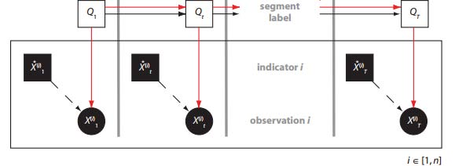

> **Reconstructed by a model.** `psets/05-questions.pdf` from [ocw-7091j](https://ocw.mit.edu/courses/7-91j-foundations-of-computational-and-systems-biology-spring-2014/) — ocw-7091j, licensed CC BY-NC-SA 4.0. Converted 2026-09-20 from `.pdf`. The original is a PDF with no usable text layer. A model read the pages and wrote this markdown: the prose is a paraphrase in places and **every equation is unverified**. Treat it as a pointer into the original, never as a citable source.

# P1 – Network Statistics (10 points)

Split into 4 sections.

1. [P1 – Network Statistics (10 points)](01-p1-network-statistics-10-points.md)
2. [P2 – Analysis of Chromatin Structure (5 points)](02-p2-analysis-of-chromatin-structure-5-points.md)
3. [P3 – Heritability (5 points)](03-p3-heritability-5-points.md)
4. [P4 – Association Studies (5 points)](04-p4-association-studies-5-points.md)

## Figures

Extracted from the original PDF. They are listed by the page they came from rather
than placed in the text: the conversion does not record where on the page each one
sat.

---

[Up: contents](../../index.md)
