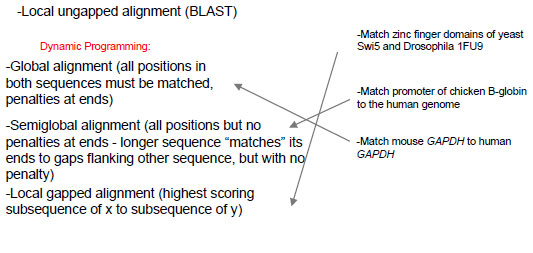
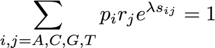
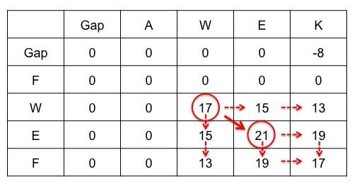
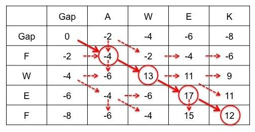
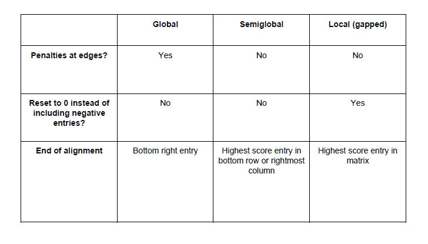

> **Reconstructed by a model.** `recitations/2014-02-12-slides.pdf` from [ocw-7091j](https://ocw.mit.edu/courses/7-91j-foundations-of-computational-and-systems-biology-spring-2014/) — ocw-7091j, licensed CC BY-NC-SA 4.0. Converted 2026-09-20 from `.pdf`. The original is a PDF with no usable text layer. A model read the pages and wrote this markdown: the prose is a paraphrase in places and **every equation is unverified**. Treat it as a pointer into the original, never as a citable source.

# 2014 02 12 slides Part 01 —

2-12-14 Recitation
CB Lectures #2 and 3

---

## Reminders

- Pset #1 due Feb. 20 at noon

- Pset #2 is posted - if you are new to programming in Python, be sure to start early

---

## 7.36/7.91 recitation

- Wed. 4-5 (Peter) or Thurs. 4-5 (Colette)

- We will go over material covered in lecture and work through practice problems

- Fri. 4-5 recitation (6.874) has extra AI material
- Today:
  - basic probability and statistics
  - next gen sequencing
  - dynamic programming and alignment

---

## P-values

- The P-value is the probability of observing, *under the null hypothesis*, a test statistic at least as extreme as the one that was observed

- What is the null model?
  - a basic or default position (e.g. two phenomena are not related, a coin is fair, etc.)
  - if there is no canonical distribution that captures behavior under the null, you can generate a null model by shuffling observed data (e.g. when aligning a query to a database, shuffle the database and see how often alignments occur by chance; shuffle sample labels)

---

## P-value example

- You flip a coin 10 times and observe the following:
  8 heads
  2 tails

- Is this coin biased towards heads? How would you decide?

- Different null hypotheses require different tests
  - $\text{H}_0$: Coin is not biased toward heads (one-tailed test)
  - $\text{H}_0$: Coin is not biased (two-tailed test)

---

## P-value example

- let $x = \text{# of heads} = 8$, $n = \text{# of trials} = 10$

- Calculate the probability of observing *at least* 8 heads, 2 tails under the *null model* $\text{H}_0$ that $p = P(\text{heads}) = P(\text{tails}) = 0.5$ (one-tailed test)

- Under the null model, the number of heads $x$ out of $n$ trials follows a Binomial Distribution with $p = 0.5$:

$$P(x; n, p) = \binom{n}{x} p^x (1 - p)^{n-x}$$

---

## P-value example

- let $x = \text{# of heads} = 8$, $n = \text{# of trials} = 10$

- Calculate the probability of observing *at least* 8 heads, 2 tails under the *null model* $\text{H}_0$ that $p = P(\text{heads}) = P(\text{tails}) = 0.5$ (one-tailed test)

$$P(x \ge 8; n = 10, p = 0.5) = \sum_{x=8}^{10} \binom{10}{x} (0.5)^x (1 - 0.5)^{10-x} = 0.05469$$

- We conclude that there is not enough evidence to reject the null hypothesis that coin is not biased towards heads at a significance level of 0.05 (since P-val > 0.05)

- If we were doing a two-sided test:

$$P(x \ge 8 \text{ or } x \le 2; n = 10, p = 0.5) = \sum_{x=0,1,2,8,9,10} \binom{10}{x} (0.5)^x (1 - 0.5)^{10-x} = 0.109$$

---

## Next-generation (2nd generation) sequencing

- Sequencing is always of DNA
  - need to convert RNA into DNA through reverse transcription (RT)

- Illumina is currently dominating the field: 8 lanes on a flow cell, each lane can sequence ~200 million reads of length 100bp (or ~100 million 100bp paired-end reads)
  - can mix samples by introducing a 6nt barcode unique to each sample
  - requires (heterogeneous) population of cells to get enough DNA for sample

- Single molecule sequencing (PacBio and Oxford Nanopore) with long reads (kb) has great potential, but technologies are still being developed

---

## Sequence Alignments

- Local ungapped alignment (BLAST)

Dynamic Programming:
- Global alignment (all positions in both sequences must be matched, penalties at ends) $\leftarrow$ Match mouse GAPDH to human GAPDH
- Semiglobal alignment (all positions but no penalties at ends - longer sequence "matches" its ends to gaps flanking other sequence, but with no penalty) $\leftarrow$ Match promoter of chicken B-globin to the human genome
- Local gapped alignment (highest scoring subsequence of x to subsequence of y) $\leftarrow$ Match zinc finger domains of yeast Swi5 and Drosophila 1FU9

---

## Local ungapped alignment statistics (BLAST)

$$P(S > x) = 1 - e^{-KMNe^{-\lambda x}}$$

S: raw score (corresponding bit score - see BLAST tutorial)
M: (length of **full** query, regardless of match length)
N: (length of database)
x: score of match (match length indirectly affects this variable)
$K, \lambda$ depend on score matrix & sequence composition
- We will give you $K$; $\lambda$ is a parameter that scales inversely with magnitude of scoring system

---

## Local ungapped alignment statistics (BLAST)

$$P(S > x) = 1 - e^{-KMNe^{-\lambda x}}$$

- The P-value for a score is the probability of obtaining a score **at least** as extreme as that which was observed

- Since scoring system for $x$ is discrete, for a one-sided test this is:

$$P\text{-val} = P(S \ge x) = P(S > x - 1)$$

- For continuous distributions in general, no correction needed:

$$P\text{-val} = P(S \ge x) = P(S > x)$$

---

## Local ungapped alignment statistics (BLAST)

$$\sum_{i,j=A,C,G,T} p_i r_j e^{\lambda s_{ij}} = 1$$

$p_i$ : probability of nucleotide $i$ in query
$r_j$ : probability of nucleotide $j$ in target (e.g., database)

| | |
| :--- | :--- |
| If arbitrary scoring matrix, how many terms in $\lambda$? | 16 (plus a constant) - no analytic solution |
| If one score (+ for match, - for mismatch), how many terms? | 2 (plus a constant) - $y=e^x$ yields quadratic equation with analytic solution; positive $x$ gives unique solution |
| Any constraints on scoring matrix? | Expected score must be negative. Otherwise random sequences would have positive scores and statistics break down. |

---

## Dynamic Programming

- Global, semiglobal, and local gapped alignments

- DP is a very powerful algorithmic paradigm in which a problem is solved by identifying a collection of subproblems and tackling them one by one, smallest first, using the answers to small problems to help figure out larger ones, until all of them are solved

- Each subproblem is filling in one entry of the matrix - i.e., finding the best scoring alignment up to match indicated by matrix entry

- We must have immediate left, upper, and upper left diagonal entries to create a match up through new position (i+1, i+1)
  - This gives us three options when aligning a new position:
    1. add gap in sequence 1 & use best alignment up to (i, i+1) (come from left)
    2. add gap in sequence 2 & use best alignment up to (i+1, i) (come from upper)
    3. match between two positions & use best alignment up to (i, i) (come from upper left diagonal)

- Fill out matrix entry by entry; use traceback at end to find highest scoring path

---

---

Up: contents · Local alignment example →

## Figures

Extracted from the original PDF. They are listed by the page they came from rather
than placed in the text: the conversion does not record where on the page each one
sat.

