> **Reconstructed by a model.** `recitations/2014-02-26-slides.pdf` from [ocw-7091j](https://ocw.mit.edu/courses/7-91j-foundations-of-computational-and-systems-biology-spring-2014/) — ocw-7091j, licensed CC BY-NC-SA 4.0. Converted 2026-09-20 from `.pdf`. The original is a PDF with no usable text layer. A model read the pages and wrote this markdown: the prose is a paraphrase in places and **every equation is unverified**. Treat it as a pointer into the original, never as a citable source.

# Library Complexity: Naïve approach

Split into 4 sections.

1. [Library Complexity: Naïve approach](01-library-complexity-naïve-approach.md)
2. [Library Complexity: Naïve approach](02-library-complexity-naïve-approach.md)
3. [Why use the BWT?](03-why-use-the-bwt.md)
4. [Using the BWT and LF function to do exact matching](04-using-the-bwt-and-lf-function-to-do-exact-matching.md)

## Figures

Extracted from the original PDF. They are listed by the page they came from rather
than placed in the text: the conversion does not record where on the page each one
sat.

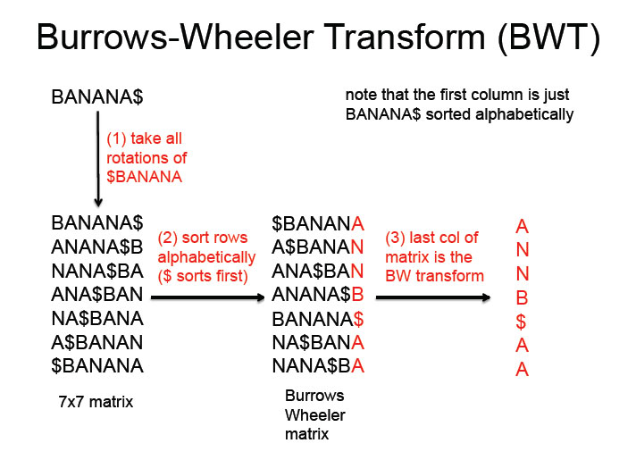

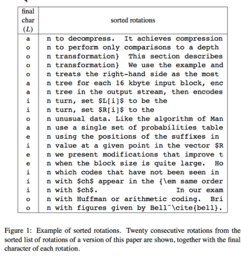

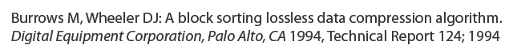

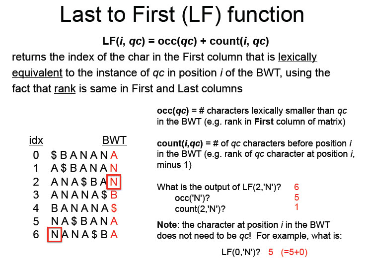

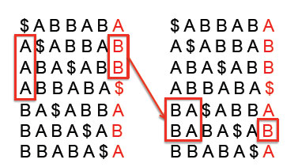

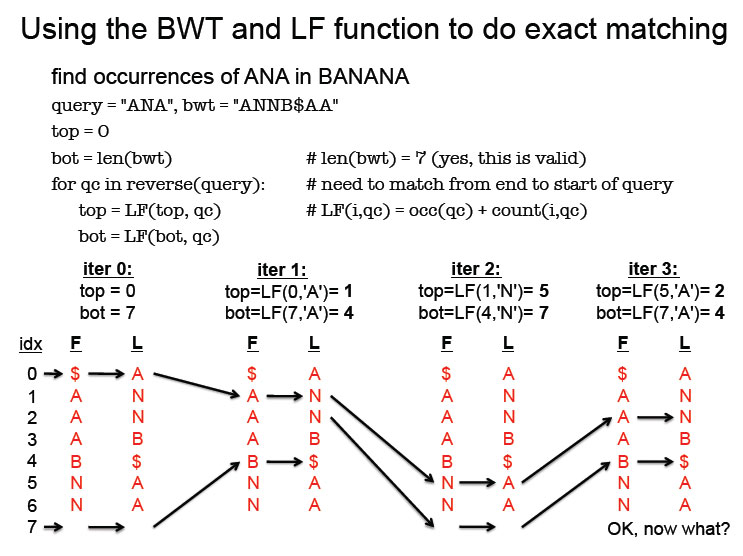

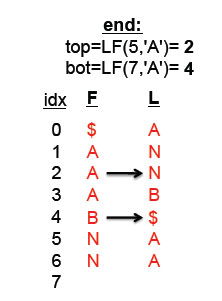

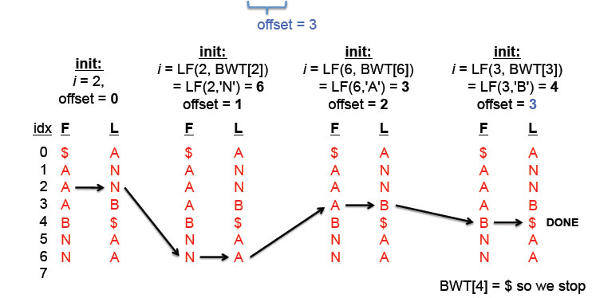

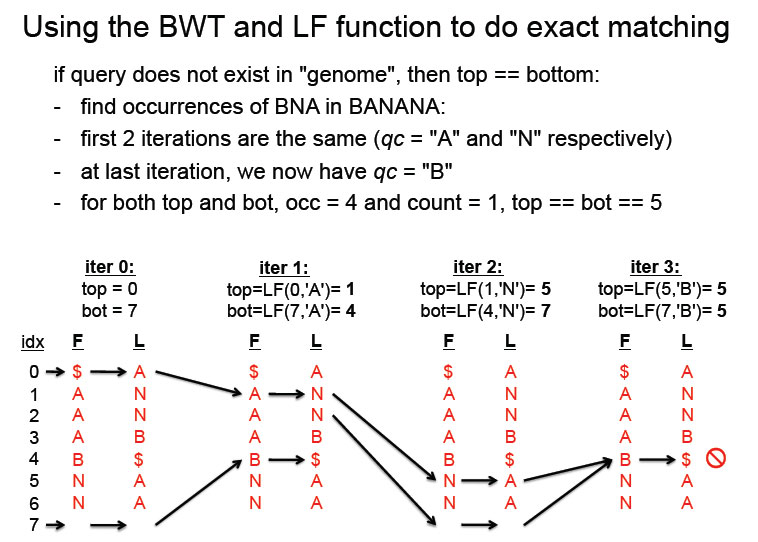

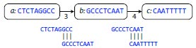

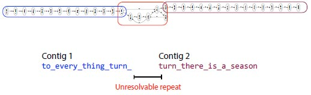

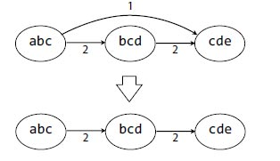

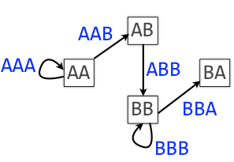

---

[Up: contents](../../index.md)
