> **Reconstructed by a model.** `recitations/2014-03-05-slides.pdf` from [ocw-7091j](https://ocw.mit.edu/courses/7-91j-foundations-of-computational-and-systems-biology-spring-2014/) — ocw-7091j, licensed CC BY-NC-SA 4.0. Converted 2026-09-20 from `.pdf`. The original is a PDF with no usable text layer. A model read the pages and wrote this markdown: the prose is a paraphrase in places and **every equation is unverified**. Treat it as a pointer into the original, never as a citable source.

# 7.36/7.91 Recitation

3-5-13
DG Lectures 7 & 8

---

## Announcements

- Project specific aims due this Friday (2/07)
  - examples will be posted this evening
- Pset #2 due in 1 week (02/13)
  - For problem 2B, Matlab and Mathematica use a (1-p) parameterization in contrast to lecture slides (p):
    - R or N = 1/k (same as in lecture slides)
    - $P = \frac{\frac{1}{k}}{\lambda + \frac{1}{k}}$ for Matlab/Mathematica vs. $\frac{\lambda}{\lambda + \frac{1}{k}}$ in lecture slides

---

## ChIP-seq

(1) crosslink proteins and DNA
$\downarrow$ tightly but reversibly binds proteins to nearby DNA

(2) fragment DNA (by sonication, etc.)
$\downarrow$

---

## ChIP-seq

(3) immunoprecipitate
$\downarrow$ use antibodies against protein of interest (here protein A)

(4) reverse crosslinks, purify DNA
$\downarrow$

(5) sequence purified DNA, align reads to genome
$\downarrow$ reference genome in black, reads in maroon

---

## ChIP-seq

(3) immunoprecipitate
$\downarrow$ use antibodies against an epitope tag fused to protein of interest

- If a high-quality antibody is not available for your protein of interest, an alternative is to introduce a construct of the protein with an epitope tag into cells and use antibody to epitope
  - Epitope is a short (5-10) amino acid sequence with antibody available (e.g. HA, His)
  - Some caveats to keep in mind:
    - Expression of your construct may not be at WT levels
    - Epitope tag could alter function and/or localization of the protein, which could lead to non-native binding locations

---

## Peak-calling applications

- ChIP-Seq
- MeDIP-Seq (Methylated DNA IP)
  - Finding methylated regions of DNA
- CLIP-Seq (CrossLinking and ImmunoPrecipitation)
  - Conceptually similar to ChIP-Seq, but for RNA instead of DNA
- MeRIP-Seq (aka M6A-Seq)
  - Post-transcriptional methylation of N6 position of adenosine in RNA

---

## GPS – genome positioning system

- Find binding sites of DNA binding proteins (e.g. transcription factors) that have sequence specificity (6-8 bp of preferred motifs)

---

[Up: contents](../index.md)

## Figures

Extracted from the original PDF. They are listed by the page they came from rather
than placed in the text: the conversion does not record where on the page each one
sat.

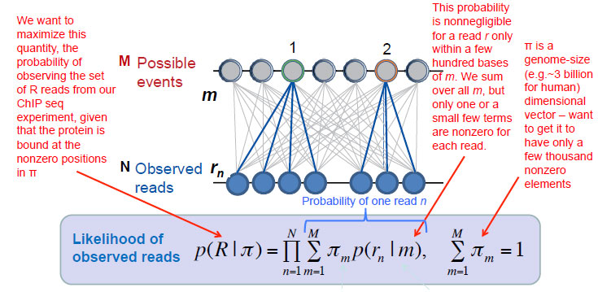

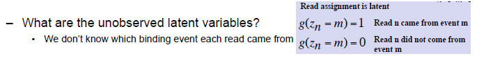

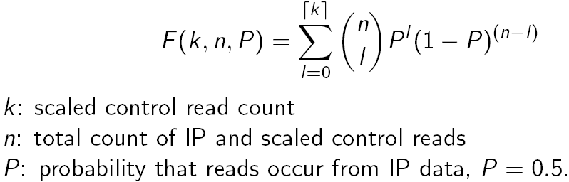

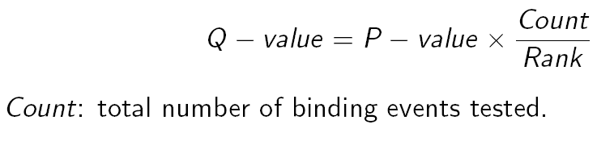

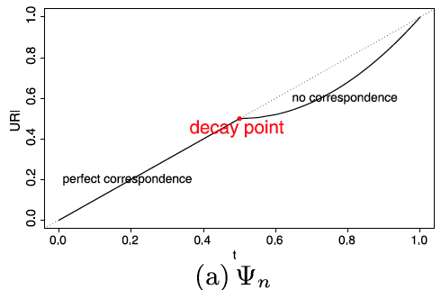

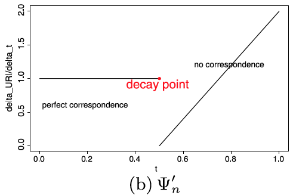

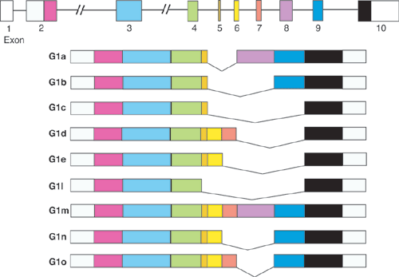

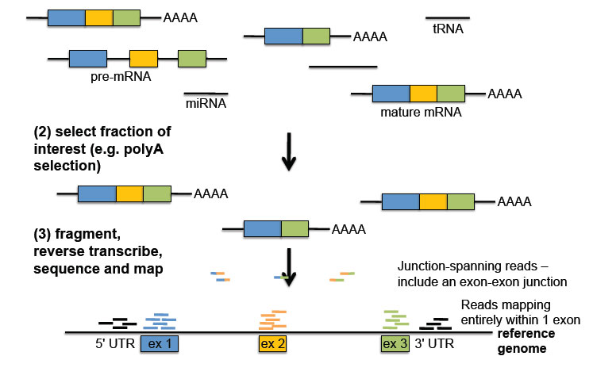

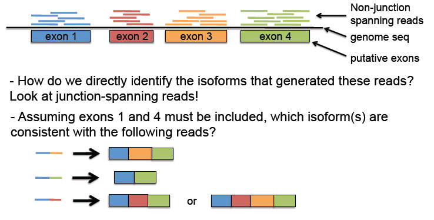

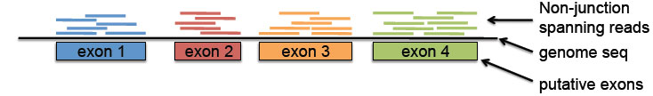

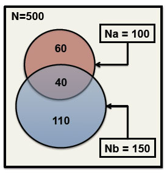

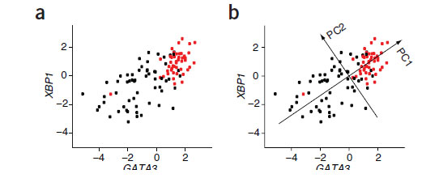

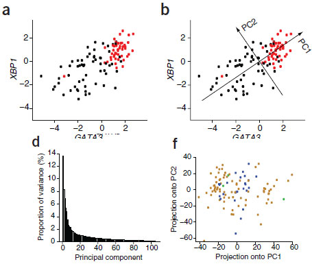

