> **Reconstructed by a model.** `recitations/2014-03-19-slides.pdf` from [ocw-7091j](https://ocw.mit.edu/courses/7-91j-foundations-of-computational-and-systems-biology-spring-2014/) — ocw-7091j, licensed CC BY-NC-SA 4.0. Converted 2026-09-20 from `.pdf`. The original is a PDF with no usable text layer. A model read the pages and wrote this markdown: the prose is a paraphrase in places and **every equation is unverified**. Treat it as a pointer into the original, never as a citable source.

# Recitation 3-19

### CB Lecture #10
### RNA Secondary Structure

---

## Announcements

* Exam 1 grades and answer key will be posted Friday afternoon
  * We will try to make exams available for pickup Friday afternoon (probably from 3:30-4pm and 5-5:30pm, before and after the Friday section)
* Pset #3 has been released, due April $3^{\text{rd}}$
  * much longer programming problem than Pset #2
  * Because of spring break, only one set of formal office hours before due date, but please email us with your questions
* Updated aims with research strategy will be due Friday April $4^{\text{th}}$

---

## RNA Secondary Structure

* Just as protein can form secondary structure ($\alpha$-helix and $\beta$-sheet), so too can single-stranded RNA by folding back on itself to form double-stranded regions

...and virtually every other RNA!

---

## RNA Secondary Structure

* RNA's secondary structure is often intimately tied with its function
  * rRNA and tRNA always adopt the same structure; function depends on it
  * mRNA may adopt different structures in different conditions – due to cell types, temperature, ion concentration, etc.
  * mRNA's processing may depend on what structure is (or is not) present
    * Can inhibit or strengthen ability of RNA binding protein to bind mRNA and affect alternative splicing
    * Can inhibit the ribosome's ability to translate through the mRNA due to sequestration of ribosome binding site or hitting structured road block

Riboswitches are metabolite-sensing RNAs, typically located in the non-coding portions of messenger RNAs, that control the synthesis of metabolite-related proteins

---

## RNA is at the catalytic site of the ribosome (which is a ribozyme)

RNA/protein distribution on the 50S ribosome

linguini = protein
fettucini = RNA

-Ribozymes – RNAs capable of catalyzing biochemical reactions - provide support for "RNA world" hypothesis – that life evolved from a world with RNAs but no DNA or protein

---

## Terminology

* Helix
* Hairpin loop
* Bulge loop
* Interior loop
* Multi-branched loop

---

## Arc Notation

a)
* hairpin
* bulge loop
* interior loop
* multiloop
* stacked bases

b)
* pseudoknot

---

## non-coding RNAs (ncRNAs)

* Any RNA molecule that doesn't code for protein (any non-mRNA molecule)
  * tRNAs, rRNAs, miRNAs, snRNAs, snoRNAs, ribozymes (RNase P), lnRNAs, riboswitches
* Due to the central role of structure in facilitating RNA's function, we'd like the determine structure
  * 2 different approaches for secondary structure
    1. Covariation and compensatory changes through evolution
    2. Energy minimization

---

## Covariation and compensatory changes

* Idea: If structure is contributing to function but actual sequence is not, we should see structure conserved but not necessarily sequence
  * So evolution allows mutations as long as secondary structure is maintained

| Seq1: | A | C | G | A | A | A | G | U |
| :--- | :-: | :-: | :-: | :-: | :-: | :-: | :-: | :-: |
| Seq2: | U | A | G | U | A | A | U | A |
| Seq3: | A | G | G | U | G | A | C | U |
| Seq4: | C | G | G | C | A | A | U | G |
| Seq5: | G | U | G | G | G | A | A | C |

---

## Covariation and compensatory changes

* Need sufficient divergence so that a decent number of mutations and compensatory mutations have occurred, but not so much that sequences can't be aligned

* Need a large number of homologs sequenced to have power to detect compensatory mutations

---

## Mutual Information (MI)

* The most common way of quantifying sequence covariation for the purpose of RNA secondary structure determination
* A measure of two variables' mutual dependence
  * Measures the information that $X$ and $Y$ share: it measures how much knowing one of these variables reduces uncertainty about the other
  * If $X$ and $Y$ are independent, then knowing $X$ does not give any information about $Y$ and vice versa, so their $\text{MI} = 0$
  * At the other extreme, if $X$ is a deterministic function of $Y$ and $Y$ is a deterministic function of $X$, then all information conveyed by $X$ is shared with $Y$: knowing $X$ determines the value of $Y$ and vice versa
    * As a result, in this case the mutual information is the same as the uncertainty contained in $Y$ (or $X$) alone, namely the entropy of $Y$ (= entropy of $X$)
  * Mutual information between aligned columns of nucleotides that are base-paired should be high
    * Knowing one of the nucleotides tells you everything about the other (if A, other is U; if C, other is G, etc.)

---

## Mutual Information (MI)

MI between two columns $i$ and $j$:

$$M_{ij} = \sum_{x=\text{A,C,G,U}} \sum_{y=\text{A,C,G,U}} f_{x,y}^{(i,j)} \log_2 \left( \frac{f_{x,y}^{(i,j)}}{f_x^{(i)} f_y^{(j)}} \right)$$

$f_{x,y}^{(i,j)}$ : fraction of sequences with $x$ in column $i$ AND $y$ in column $j$

$f_x^{(i)}$ : fraction of sequences with $x$ in column $i$

-Relative entropy of the joint distribution relative to the individual distributions of the nucleotides in columns $i$ and $j$

-MI is maximal (2 bits) if $x$ and $y$ appear at random (all 4 nts equally likely) but perfectly covary (e.g. always complementary)

---

## Mutual Information (MI)

MI is maximal (2 bits) if $x$ and $y$ appear at random (all 4 nts equally likely) but perfectly covary (e.g. always complementary)

$$M_{ij} = \sum_{x=\text{A,C,G,U}} \sum_{y=\text{A,C,G,U}} f_{x,y}^{(i,j)} \log_2 \left( \frac{f_{x,y}^{(i,j)}}{f_x^{(i)} f_y^{(j)}} \right)$$

What is $f_{x,y}^{(i,j)}$ ? Because $x$ and $y$ perfectly covary,

$f_{x,y}^{(i,j)} = \frac{1}{4}$ for the 25% of covarying events (e.g. $(x,y) = (\text{A,U})$)

$f_{x,y}^{(i,j)} = 0$ for the 75% of non-existent events (e.g. $(x,y) = (\text{A,A})$)

What is $f_x^{(i)} f_y^{(j)}$ ? $\frac{1}{4} * \frac{1}{4} = \frac{1}{16}$

---

## Mutual Information (MI)

MI is maximal (2 bits) if $x$ and $y$ appear at random (all 4 nts equally likely) but perfectly covary (e.g. always complementary)

$$M_{ij} = \sum_{x=\text{A,C,G,U}} \sum_{y=\text{A,C,G,U}} f_{x,y}^{(i,j)} \log_2 \left( \frac{f_{x,y}^{(i,j)}}{f_x^{(i)} f_y^{(j)}} \right)$$

$$= \sum_{(x,y)=(\text{A,U}),(\text{C,G}),(\text{G,C}),(\text{U,A})} f_{x,y}^{(i,j)} \log_2 \left( \frac{f_{x,y}^{(i,j)}}{f_x^{(i)} f_y^{(j)}} \right)$$

$$= \sum_{(x,y)=(\text{A,U}),(\text{C,G}),(\text{G,C}),(\text{U,A})} \frac{1}{4} \log_2 \left( \frac{1/4}{1/16} \right)$$

$$= \sum_{(x,y)=(\text{A,U}),(\text{C,G}),(\text{G,C}),(\text{U,A})} \frac{1}{4} * 2$$

$$= 2 \text{ bits}$$

---

## $2^{\text{nd}}$ approach: Energy minimization

$$\Delta G_{\text{folding}} = G_{\text{unfolded}} - G_{\text{folded}}$$

- Assume that RNA will fold to its lowest energy state
- Simplest model: all base pairs contribute equally to lowering structure's energy
  - Base Pair Maximization (ignores energy contributions of base stacking, loops, entropy, etc.): +1 for paired bases, 0 for unpaired
  - Use the Nussinov algorithm of recursive maximization of base pairing

---

## Nussinov algorithm

* Look at one contiguous sub-sequence from position $i$ to position $j$ in our complete sequence of length $N$, and calculate the score of the best structure for just that sub-sequence
* This optimal score (call it $S(i,j)$) can be defined recursively in terms of optimal scores of smaller sub-sequences
* Four possible ways that a structure of nested base pairs on $i\dots j$ can be constructed
  1. $i, j$ are a base pair, added on to a structure for $i+1 \dots j-1$
  2. $i$ is unpaired, added on to a structure for $i+1 \dots j$
  3. $j$ is unpaired, added on to a structure for $i \dots j-1$
  4. $i, j$ are paired, but not to each other; the structure for $i\dots j$ adds together sub-structures for two sub-sequences, $i \dots k$ and $k+1 \dots j$ (a bifurcation)

1. $i,j$ pair
$S(i+1,j-1)$

2. $i$ unpaired
$S(i+1,j)$

3. $j$ unpaired
$S(i,j-1)$

4. Bifurcation
$S(i,k)$
$S(k+1,j)$

---

## Nussinov algorithm

1. $i,j$ are a base pair, added on to a structure for $i+1 \dots j-1$
   - The score we add for the base pair $i,j$ is independent of any details of the optimal structure on $i+1\dots j-1$
   - Similarly, the optimal structure on $i+1\dots j-1$ and its score $S(i+1, j-1)$ are unaffected by whether $i, j$ are base paired or not (or anything else that happens in the rest of the sequence)
   - Therefore, $S(i, j)$ is just $S(i+1, j-1)$ plus one, if $i, j$ can base pair.

$$S(i,j) = S(i+1, j-1) + 1 \quad [\text{if } i,j \text{ base pair}]$$

---

## Nussinov algorithm

2. $i$ is unpaired, added on to a structure for $i+1 \dots j$
   * In case 2, the optimal score $S(i+1, j)$ is independent of the addition of an unpaired base $i$, so $S(i+1, j) + 0$ is the score of the optimal structure on $i,j$ conditional on $i$ being unpaired

3. $j$ is unpaired, added on to a structure for $i \dots j-1$
   * Case 3 is the same thing, but conditional on $j$ being unpaired

$$S(i,j) = S(i+1, j)$$

$$S(i,j) = S(i, j-1)$$

---

## Nussinov algorithm

4. $i,j$ are paired, but not to each other; the structure for $i\dots j$ adds together sub-structures for two sub-sequences, $i \dots k$ and $k+1 \dots j$ (a bifurcation)
   - We deal with putting two independent sub-structures together, the optimal score $S(i,k)$ is independent of anything going on in $k+1 \dots j$, and vice versa
   - Must consider all possible $k$'s between $i$ and $j$

$$S(i,j) = \max_{i < k < j} S(i,k) + S(k+1, j)$$

---

## Nussinov algorithm

* Since these are the only four possible cases, the optimal score $S(i, j)$ is just the maximum of the four possibilities
* We've thus defined the optimal score $S(i,j)$ recursively as a function only of optimal scores of smaller sub-sequences, so we only need to remember these scores, not the combinatorial explosion of possible structures

$$S(i,j) = \max \begin{cases} S(i+1, j-1) + 1 \quad [\text{if } i,j \text{ base pair}] \\ S(i+1, j) \\ S(i, j-1) \\ \max_{i < k < j} S(i,k) + S(k+1, j) \end{cases}$$

---

## Nussinov algorithm

* To run this recursion efficiently, we need to make sure that whenever we try to compute an $S(i,j)$, we already have calculated the scores for smaller sub-sequences.
  * This sets up a dynamic programming algorithm.
* We tabulate the scores $S(i, j)$ in a triangular matrix. We initialize on the diagonal; subsequences of length 0 or 1 have no base pairs, so $S(i,i) = S(i, i-1) = 0$ (by convention, the $i, i-1$ cells represent zero length sequences; the recursion must never access an empty matrix cell).
* Work outwards on larger and larger sub-sequences, until we reach the upper right corner.
  * This corner is $S(1, N)$, the score of the optimal structure for the complete sequence from $i=1$ to $j=N$.
  * From that point, recover the optimal structure by tracing back the optimal path that got us into the upper corner, one step in the structure at a time.

---

## Nussinov algorithm

* Storing the $S(i, j)$ matrix requires memory proportional to $N^2$, similar to what sequence alignment algorithms need
* However, the innermost loop of having to find optimal potential bifurcation points $k$ means that the folding algorithm requires time proportional to $N^3$, a factor of $N$ more time-intensive than sequence alignment
  * RNA folding calculations often require a large amount of computer power

---

## Nussinov Algorithm Example

We want to fold the following RNA sequence:
**AAGUUCG**

(1) Write the sequence along the top and left side of the matrix

(2) Initialize the diagonal of the matrix and one-below to zero

(3) Fill in $i, j^{\text{th}}$ entries according to

$$S(i,j) = \max \begin{cases} S(i+1, j-1) + 1 \quad [\text{if } i,j \text{ base pair}] \\ S(i+1, j) \\ S(i, j-1) \\ \max_{i < k < j} S(i,k) + S(k+1, j) \end{cases}$$

---

## Nussinov Algorithm - initialization

| | A | A | G | U | U | C | G |
| :---: | :---: | :---: | :---: | :---: | :---: | :---: | :---: |
| **A** | 0 | | | | | | |
| **A** | 0 | 0 | | | | | |
| **G** | | 0 | 0 | | | | |
| **U** | | | 0 | 0 | | | |
| **U** | | | | 0 | 0 | | |
| **C** | | | | | 0 | 0 | |
| **G** | | | | | | 0 | 0 |

---

## Nussinov Algorithm

$(i=1, j=2)$

$$S(i,j) = \max \begin{cases} S(i+1, j-1) + 1 \quad [\text{if } i,j \text{ base pair}] & \text{A-A don't base pair} \\ S(i+1, j) & = 0 \\ S(i, j-1) & = 0 \\ \max_{i < k < j} S(i,k) + S(k+1, j) & \text{Since } i=1, j=2\text{, no } k \text{ such that } i < k < j \end{cases}$$

---

## Nussinov Algorithm

$(i=2, j=3)$

$$S(i,j) = \max \begin{cases} S(i+1, j-1) + 1 \quad [\text{if } i,j \text{ base pair}] & \text{A-G don't base pair} \\ S(i+1, j) & = 0 \\ S(i, j-1) & = 0 \\ \max_{i < k < j} S(i,k) + S(k+1, j) & \text{Since } i=2, j=3\text{, no } k \text{ such that } i < k < j \end{cases}$$

Fill in the rest of this diagonal!

---

## Nussinov Algorithm

$(i=1, j=3)$

$$S(i,j) = \max \begin{cases} S(i+1, j-1) + 1 \quad [\text{if } i,j \text{ base pair}] & \text{A-G don't base pair} \\ S(i+1, j) & = 0 \\ S(i, j-1) & = 0 \\ \max_{i < k < j} S(i,k) + S(k+1, j) & k=2: S(1,2) + S(3,3) = 0 + 0 \end{cases}$$

---

## Nussinov Algorithm

$(i=2, j=4)$

$$S(i,j) = \max \begin{cases} S(i+1, j-1) + 1 \quad [\text{if } i,j \text{ base pair}] & \text{A-U do base pair: } 0 + 1 \\ S(i+1, j) & = 0 \\ S(i, j-1) & = 0 \\ \max_{i < k < j} S(i,k) + S(k+1, j) & k=3: S(2,3) + S(4,4) = 0 + 0 \end{cases}$$

Fill in the rest of this diagonal and the one above it

---

## Nussinov Algorithm

$(i=1, j=5)$

Only need to draw arrows between nonzero entries

$$S(i,j) = \max \begin{cases} S(i+1, j-1) + 1 \quad [\text{if } i,j \text{ base pair}] & \text{A-U do base pair: } 1 + 1 = 2 \\ S(i+1, j) & = 1 \\ S(i, j-1) & = 1 \\ \max_{i < k < j} S(i,k) + S(k+1, j) & k=2: S(1,2) + S(3,5) = 0 + 0 \\ & k=3: S(1,3) + S(4,5) = 0 + 0 \\ & k=4: S(1,4) + S(5,5) = 1 + 0 = 1 \end{cases}$$

---

## Nussinov Algorithm

$(i=2, j=6)$

$$S(i,j) = \max \begin{cases} S(i+1, j-1) + 1 \quad [\text{if } i,j \text{ base pair}] & \text{A-C don't base pair} \\ S(i+1, j) & = 1 \\ S(i, j-1) & = 1 \\ \max_{i < k < j} S(i,k) + S(k+1, j) & k=3: S(2,3) + S(4,6) = 0 + 0 \\ & k=4: S(2,4) + S(5,6) = 1 + 0 = 1 \\ & k=5: S(2,5) + S(6,6) = 1 + 0 = 1 \end{cases}$$

---

## Nussinov Algorithm

$(i=1, j=6)$

$$S(i,j) = \max \begin{cases} S(i+1, j-1) + 1 \quad [\text{if } i,j \text{ base pair}] & \text{A-C don't base pair} \\ S(i+1, j) & = 1 \\ S(i, j-1) & = 2 \\ \max_{i < k < j} S(i,k) + S(k+1, j) & k=2: S(1,2) + S(3,6) = 0 + 1 = 1 \\ & k=3: S(1,3) + S(4,6) = 0 + 0 = 0 \\ & k=4: S(1,4) + S(5,6) = 1 + 0 = 1 \\ & k=5: S(1,5) + S(6,6) = 2 + 0 = 2 \end{cases}$$

---

## Nussinov Algorithm

$(i=1, j=7)$

$$S(i,j) = \max \begin{cases} S(i+1, j-1) + 1 \quad [\text{if } i,j \text{ base pair}] & \text{A-G don't base pair} \\ S(i+1, j) & = 1 \\ S(i, j-1) & = 2 \\ \max_{i < k < j} S(i,k) + S(k+1, j) & k=2: S(1,2) + S(3,7) = 0 + 1 = 1 \\ & k=3: S(1,3) + S(4,7) = 0 + 1 = 1 \\ & k=4: S(1,4) + S(5,7) = 1 + 1 = 2 \\ & k=5: S(1,5) + S(6,7) = 2 + 1 = 3 \\ & k=6: S(1,6) + S(7,7) = 2 + 0 = 2 \end{cases}$$

Result: 3

---

## Nussinov Algorithm -traceback

start here at $(1, 7)$

Can you draw this folded RNA?

$k=5: S(1,5) + S(6,7) = 2 + 1 = 3$
* Optimal sub-structure from 1-5 (with 2 matches)
* Optimal sub-structure from 6-7 (with 1 match)

---

## Nussinov Algorithm -traceback

Can you draw this folded RNA?

- note that in reality, stems can't form if the loop is less than 3bp due to restrictions on backbone angles

---

## Improvements on Nussinov algorithm

* Nussinov is the "core" of most RNA folding programs, but they all have bells & whistles
  * Take into account that loop must be 3 or more nucleotides
  * Not all base pairs are equal in reality (we treated them all at +1 in Nussinov)
  * Base stacking interactions

* **base pairing:**
$$\text{G} \cdot \text{C} > \text{A} \cdot \text{U} > \text{G} \cdot \text{U}$$

* **base stacking:**
$$\begin{matrix} \text{G} & \text{p} & \text{A} \\ | & & | \\ \text{C} & \text{p} & \text{U} \end{matrix}$$

Base stacking contributes more to free energy than base pairing

---

## Improvements on Nussinov algorithm

* Nussinov is the "core" of most RNA folding programs, but they all have bells & whistles
  * Take into account that loop must be 3 or more nucleotides
  * Not all base pairs are equal in reality (we treated them all at +1 in Nussinov)
  * Base stacking interactions
  * Penalizes interior bulges
  * Extra terms at terminal ends of RNA exposed to solvent
  * -Nussinov algorithm cannot detect pseudoknots, since these do not satisfy the recursive assumption that each structure can be split into smaller self-contained sub-structures -- more advanced algorithms
  * With all these additions, mfold gets ~70% of bases correctly folded; pretty good on average but would likely want to do *in vivo* structure profiling of your RNA if you really want to know its structure

---

## Happy Spring Break!

---

MIT OpenCourseWare
http://ocw.mit.edu

7.91J / 20.490J / 20.390J / 7.36J / 6.802J / 6.874J / HST.506J Foundations of Computational and Systems Biology
Spring 2014

For information about citing these materials or our Terms of Use, visit: http://ocw.mit.edu/terms.

---

[Up: contents](../index.md)

## Figures

Extracted from the original PDF. They are listed by the page they came from rather
than placed in the text: the conversion does not record where on the page each one
sat.

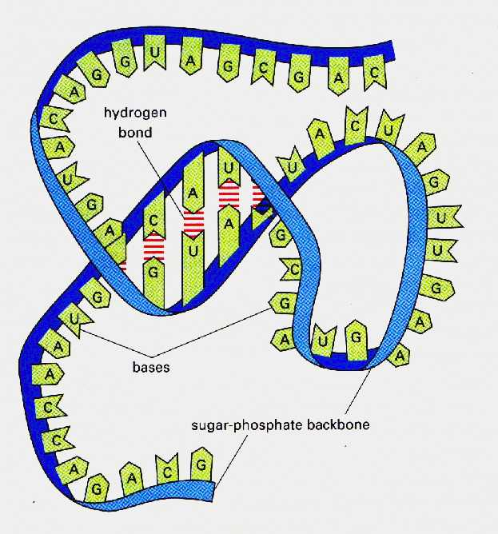

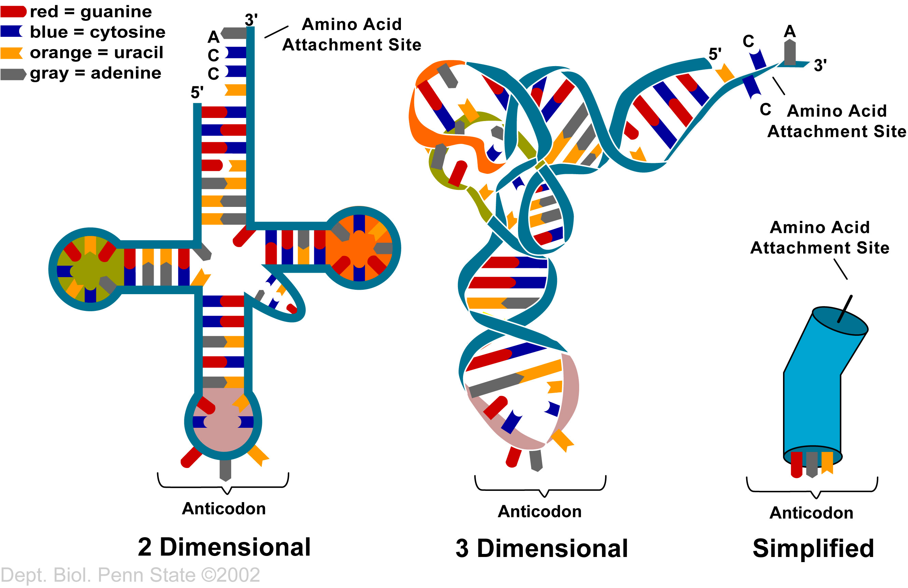

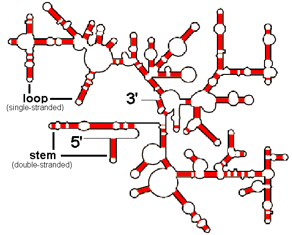

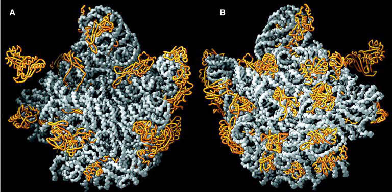

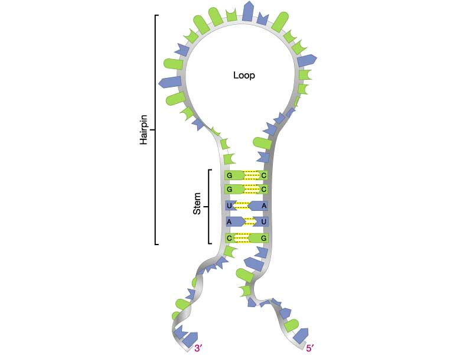

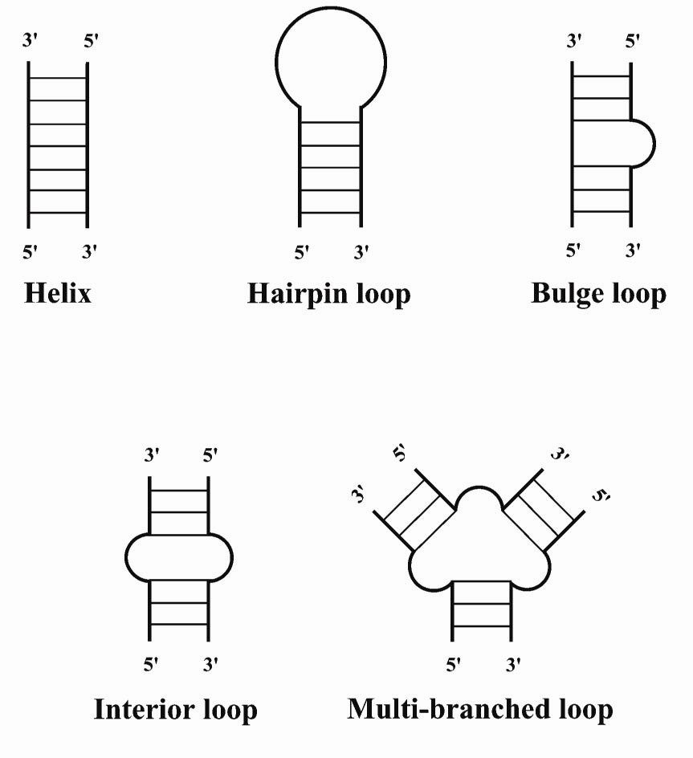

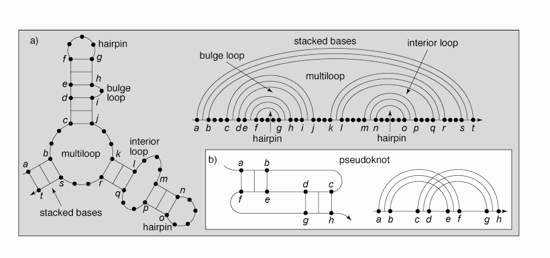

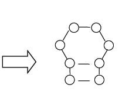

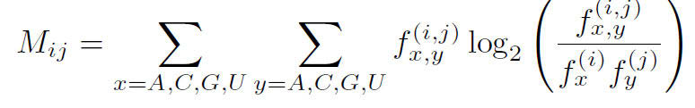

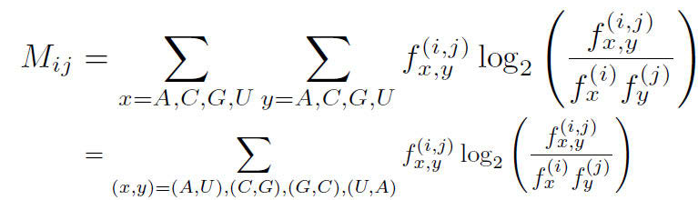

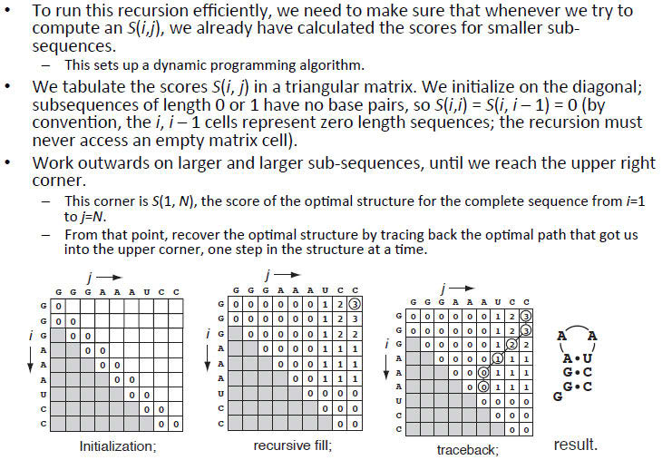

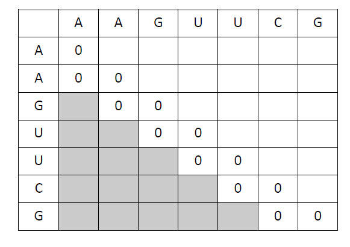

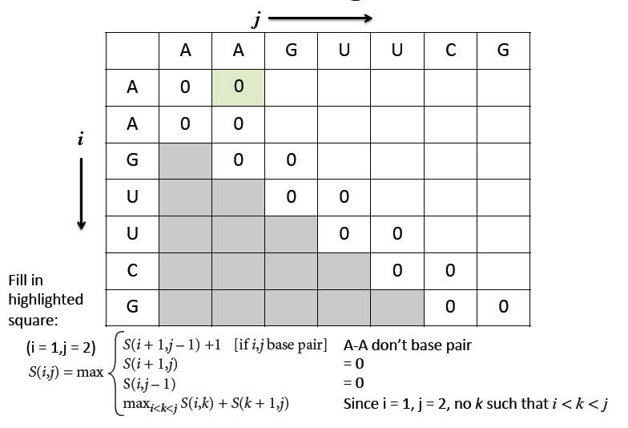

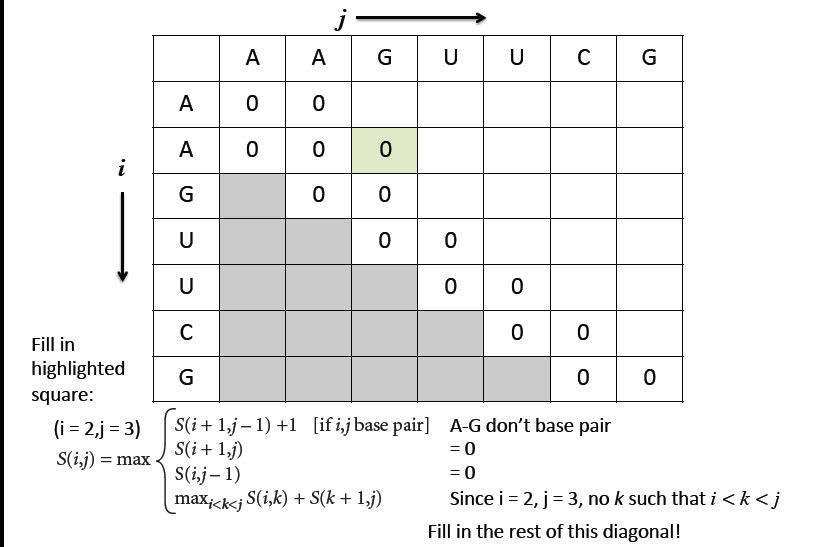

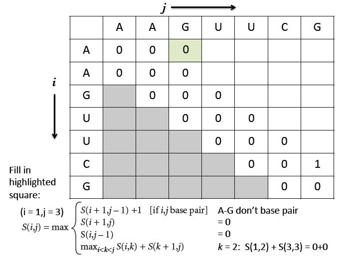

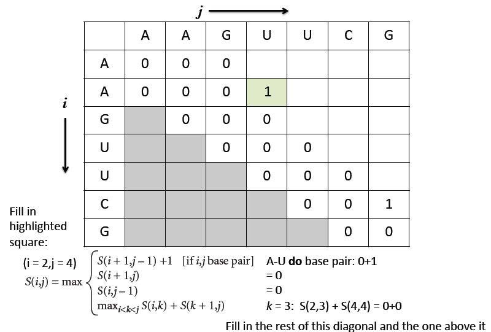

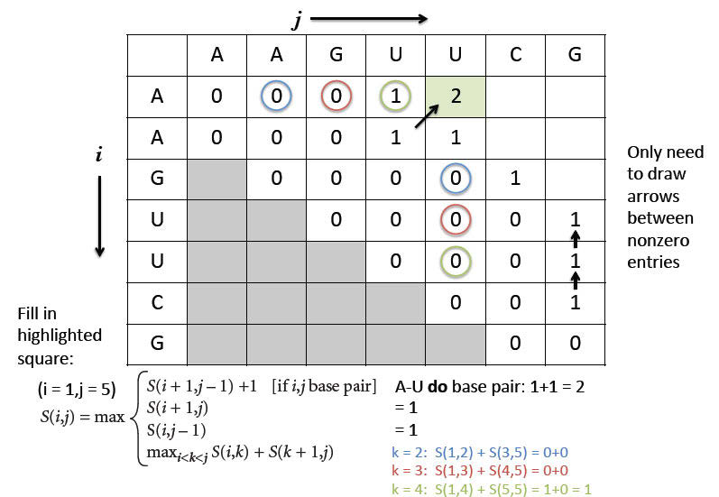

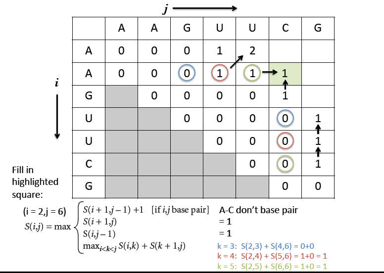

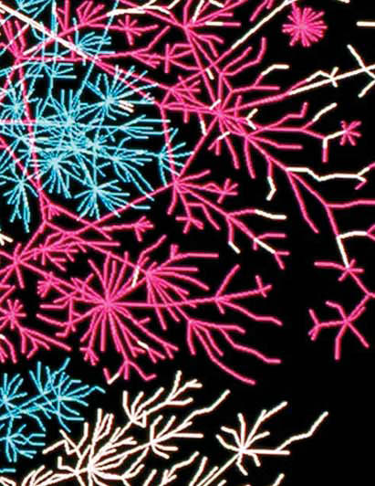

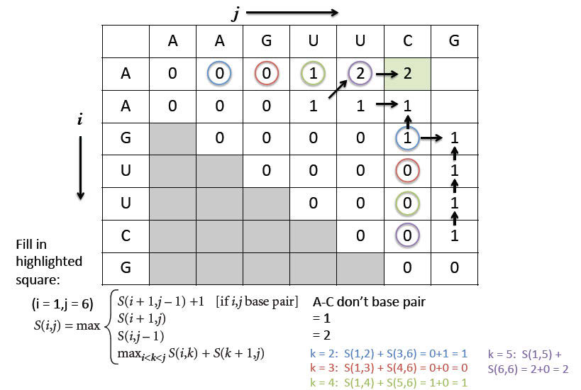

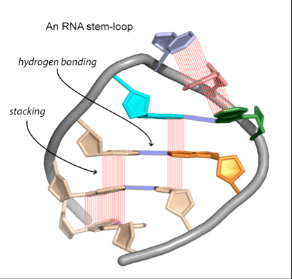

