> **Reconstructed by a model.** `recitations/2014-04-09-slides.pdf` from [ocw-7091j](https://ocw.mit.edu/courses/7-91j-foundations-of-computational-and-systems-biology-spring-2014/) — ocw-7091j, licensed CC BY-NC-SA 4.0. Converted 2026-09-20 from `.pdf`. The original is a PDF with no usable text layer. A model read the pages and wrote this markdown: the prose is a paraphrase in places and **every equation is unverified**. Treat it as a pointer into the original, never as a citable source.

# Recitation 4-9-14

EF Lectures #14 & 15
Protein Interactions & Gene Networks

---

## Announcements

- Problem Set 4 due next Thursday (April 17)
- Project write-up due Tuesday, April 22

---

## Outline

- Experimental methods to detect protein interactions
  - Affinity Purification
  - Tandem Affinity Purification (TAP)
  - Mass Spectrometry
  - Yeast two-hybrid
- Bayesian Networks
- Clustering methods
  - Hierarchical clustering
  - K-means clustering
- Linear Regression / Mutual information

---

## Affinity Purification

- To detect interaction partners of a protein of interest (bait), the bait is tagged by introducing protein-tag DNA construct into cells. Once the construct is expressed and incorporated into cellular complexes, the tag is used to pull down other interacting proteins, by Mass Spectrometry.
- Can do this for every protein to analyze proteins on a proteome-wide scale.
- Fairly high (~30% for 200

---

[Up: contents](../index.md)

## Figures

Extracted from the original PDF. They are listed by the page they came from rather
than placed in the text: the conversion does not record where on the page each one
sat.

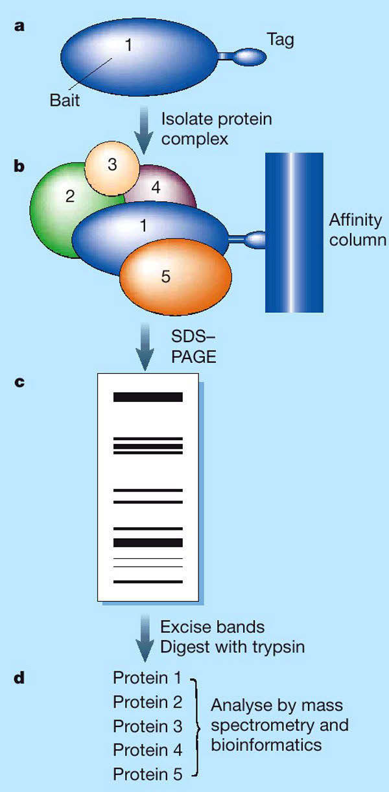

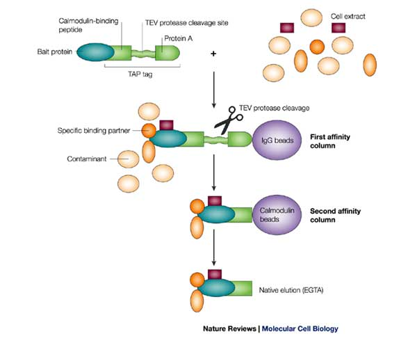

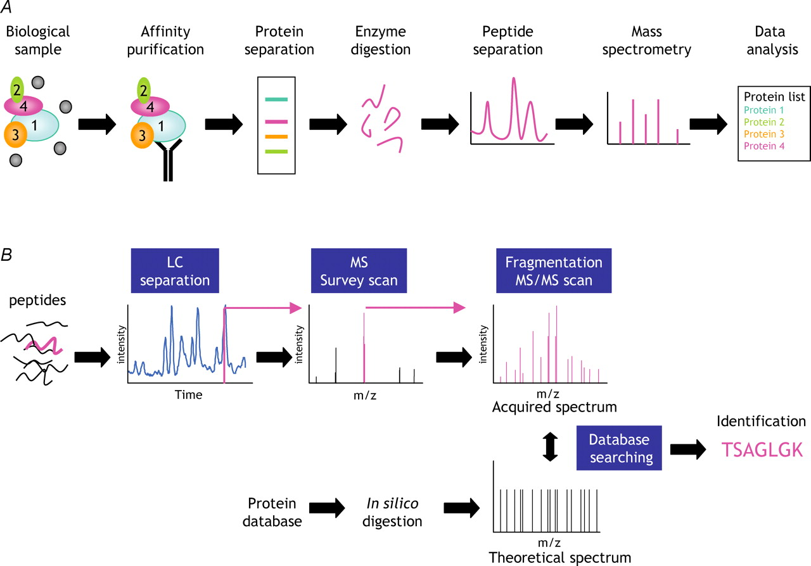

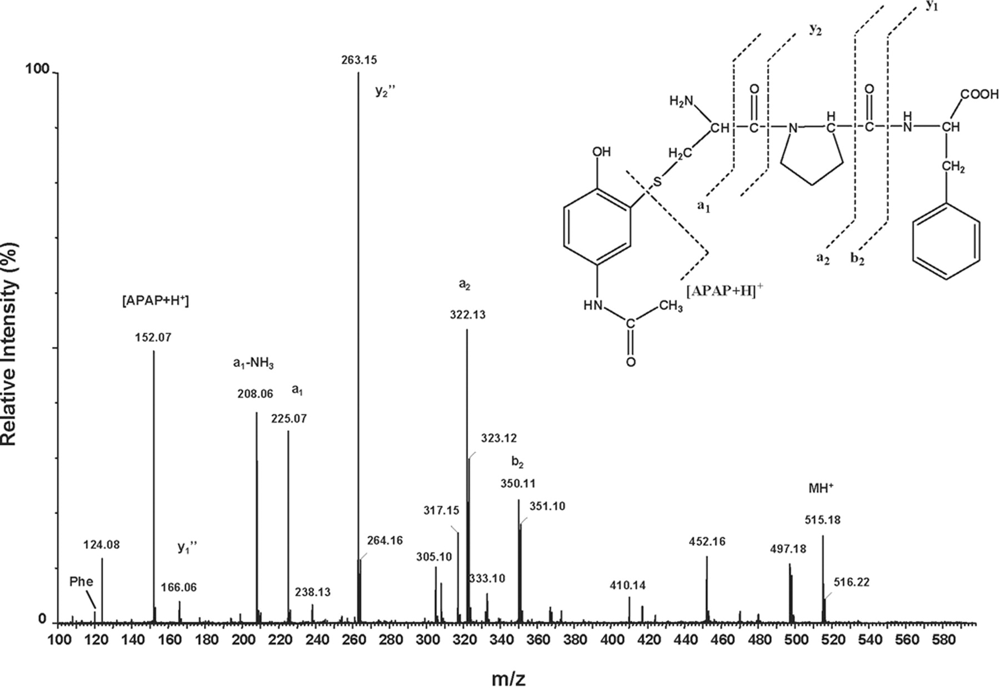

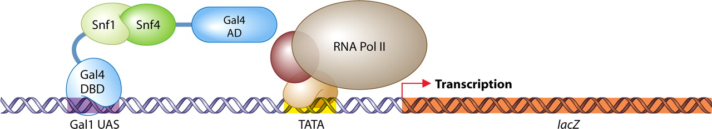

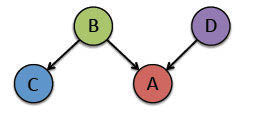

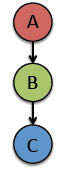

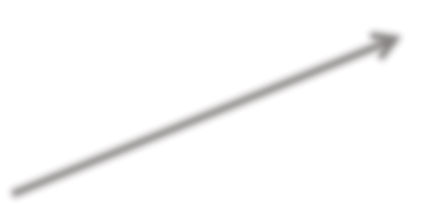

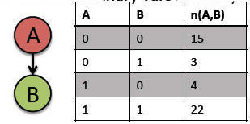

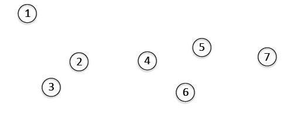

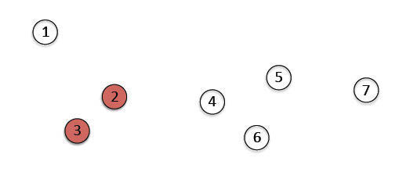

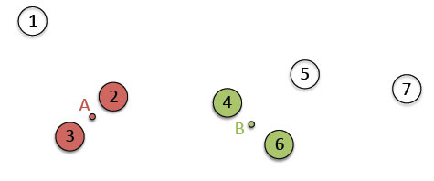

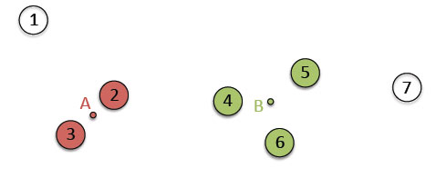

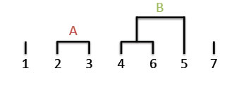

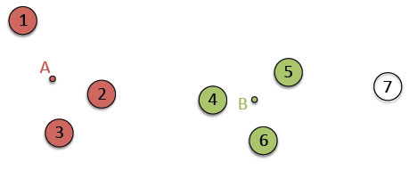

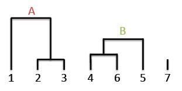

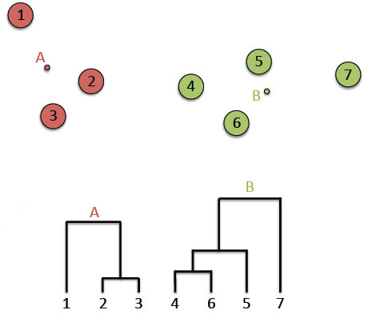

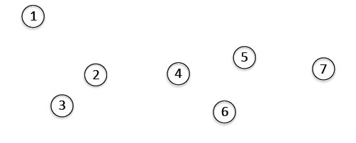

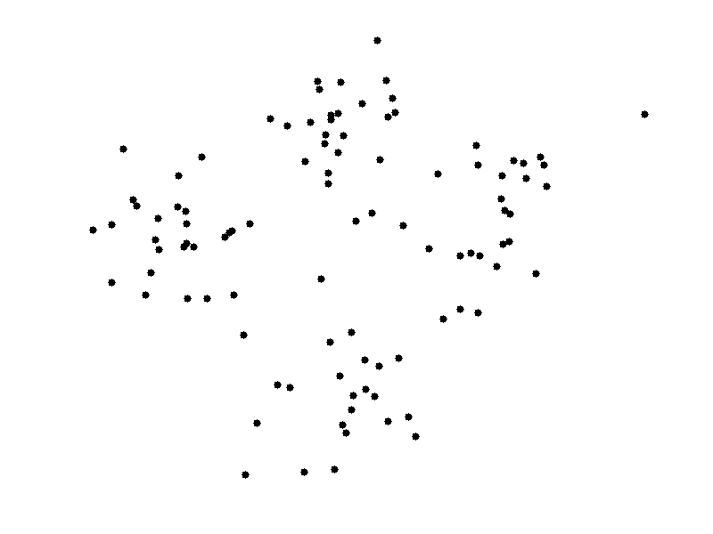

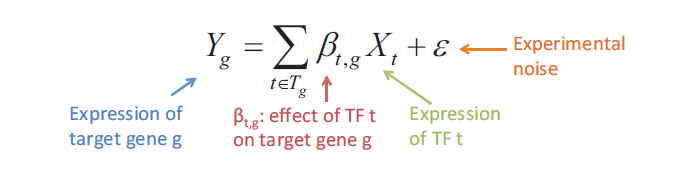

