> **Reconstructed by a model.** `recitations/2014-04-23-slides.pdf` from [ocw-7091j](https://ocw.mit.edu/courses/7-91j-foundations-of-computational-and-systems-biology-spring-2014/) — ocw-7091j, licensed CC BY-NC-SA 4.0. Converted 2026-09-20 from `.pdf`. The original is a PDF with no usable text layer. A model read the pages and wrote this markdown: the prose is a paraphrase in places and **every equation is unverified**. Treat it as a pointer into the original, never as a citable source.

# 4-23 Recitation

Prof. Gifford L18

Analysis of Chromatin Structure

---

## Announcements

- Problem Set 5 due next Thursday (May $1^{\text{st}}$)
- 2 more lectures from Prof. Gifford (including today), then 2 guest lectures - Ron Weiss from MIT (Synthetic Bio), George Church from Harvard (Genome Engineering & Systems Biology)
- $2^{\text{nd}}$ exam – Tuesday, May $6^{\text{th}}$

---

## Outline

- Chromatin Structure
- Dynamic Bayesian Networks / Segway
- DNAse-seq & Protein Interaction Quantitation (PIQ)
- ChIA-PET reveals 3D interactions in the genome

---

## Introduction to Chromatin

- DNA in one cell is 3 meters long, yet fits into a tiny nucleus
- To facilitate the packaging, DNA is wrapped around nucleosomes, and this fiber is wrapped into higher order structures up to the level of a chromosome
  - "chromatin" refers to the structure of DNA + nucleosomes
  - Each nucleosome is an octamer composed of 4 pairs of different histone proteins: H2A, H2B, H3, and H4

---

## Histone modifications

- Particular residues on the tails of these histones commonly undergo post-translational chemical modifications

- Some of these modifications are associated with functions – different combinations of marks and their meaning compose the "histone code"

| Histone modification or variant | Signal characteristics | Putative functions |
| :--- | :--- | :--- |
| H2A.Z | Peak | Histone protein variant (H2A.Z) associated with regulatory elements with dynamic chromatin |
| H3K4me1 | Peak/region | Mark of regulatory elements associated with enhancers and other distal elements, but also enriched downstream of transcription starts |
| H3K4me2 | Peak | Mark of regulatory elements associated with promoters and enhancers |
| H3K4me3 | Peak | Mark of regulatory elements primarily associated with promoters/transcription starts |
| H3K9ac | Peak | Mark of active regulatory elements with preference for promoters |
| H3K9me1 | Region | Preference for the $5'$ end of genes |
| H3K9me3 | Peak/region | Repressive mark associated with constitutive heterochromatin and repetitive elements |
| H3K27ac | Peak | Mark of active regulatory elements; may distinguish active enhancers and promoters from their inactive counterparts |
| H3K27me3 | Region | Repressive mark established by polycomb complex activity associated with repressive domains and silent developmental genes |
| H3K36me3 | Region | Elongation mark associated with transcribed portions of genes, with preference for $3'$ regions after intron 1 |
| H3K79me2 | Region | Transcription-associated mark, with preference for $5'$ end of genes |
| H4K20me1 | Region | Preference for $5'$ end of genes |

ENCODE Consortium Nature 2012

Most common in papers: H3K4me1, H3K4me3, H3K9me3, H3K27ac, H3K27me3

---

## Histone code & DNA methylation regulate gene expression

- In addition to histone modifications, gene expression can be affected by DNA methylation: the 5 carbon of cytosines in DNA can be methylated.
  - In metazoans, only C's before G's can be methylated (the C's of CpG). Hundred or thousands of base-long stretches rich in methylated cytosines form "CpG islands" at some promoters to repress gene expression

- "Epigenetic" changes are changes to DNA not at the level of primary sequence which are reversible & heritable

- Epigenetic marks are often cell-type and/or disease state-specific
  - For example, the pluripotency gene *Nanog* is demethylated during reprogramming of differentiated cells into iPSCs

- Enzymes actively regulate the epigenetic marks
  - Chromatin modifiers and nucleosome remodelers are enzymes that actively regulate chromatin marks, nucleosome positioning & turnover
  - DNA methyltransferases to methylate DNA

---

## Profiling histone modifications

- ChIP-seq w/ antibodies specific to a particular type of modified nucleosome can map histone modifications genome-wide

- We'd like to come up with a way to combine these combinations of histone marks throughout the genome into functional annotations
  - Based on an observed pattern of marks at a locus, we'd like to label it w/ 'enhancer', 'promoter', 'inactive' or 'active gene body region', etc.

- 2 approaches to functional annotation of the genome:
  - Hidden Markov Model (ChromHMM)
  - Dynamic Bayesian Network (Segway)

---

## Dynamic Bayesian Networks

- A Bayesian network (directed graphical model where arcs/edges represent conditional dependencies) that models a dynamic process (sequential data, either temporal or spatial – e.g. along the genome)

- Similar to Hidden Markov Models, but include additional random variables that allow tuning (e.g., hard limits on segment lengths)

---

## Segway: Dynamic Bayesian Network

Variable's parents are indicated by its direct predecessor in the directed graph

Every variable is conditionally independent of all variables in the model given its parents

$n$ observation tracks
$T$: sequence length

Square: discrete random variable
Circle: continuous random variable

White: hidden variable
Black: observed variable

Black arcs (edges) = deterministic conditional dependence, red = stochastic conditional dependence

---

## Segway: Dynamic Bayesian Network

- **Segment label:** The hidden annotation you're trying to infer (e.g. promoter).
- **Indicator:** 1/0 whether or not the assay produced any results for that region (=0 if assay can't map reads to that region. In this case, the edge from $Q_t$ to $X_t^{(i)}$ is edited out)
- **Observation track:** assay output (e.g., density of H3K4me3 ChIP-seq reads – one track for each of $n$ experiments)

---

## Segway: Dynamic Bayesian Network

- **Ruler marker:**
  =1 every $10^{\text{th}}$ position, 0 otherwise (every $10^{\text{th}}$ position, we update the countdown variable as to how long we've been in that label)

- **Countdown:** Discrete variable that allows the specification of minimum or maximum segment length. Starts at initial value dependent on $Q_T$ (might want TSS to be short but intergenic region to be long) and decreases where ruler marker $M_T = 1$.

---

## Segway: Dynamic Bayesian Network

- **Transition:** binary segment transition label that either forces the segment label to change at the current position ($J_t = 1$) or prevent it from changing ($J_t = 0$).

Segway generates a conditional probability table $P(J_t = 1 \mid Q_{t-1}, C_{t-1})$ that maps each $(Q_{t-1}, C_{t-1})$ to one of three rules that determine the value of $J_t$:
1. Force: $P(J_t = 1) = 1$
2. Prevent: $P(J_t = 1) = 0$
3. Allow: $P(J_t = 1) = 1 / (1 + L)$

"Allow" rule models geometric distribution w/ expected length $L$

---

## Segway: Dynamic Bayesian Network

- Train on 1% of the Genome
  - Assign equal probability ($= 1/n$) of each label to the starting position, then use Expectation-Maximization (EM) algorithm to learn model parameters (contributions of each track (experimental assay) to each label)
  - Starting from different initial conditions (i.e., contributions of each track to a particular label) gave similar results

- Then use these parameters to segment the rest of the genome using Viterbi decoding (similar to what we discussed for HMMs)

---

## Example of Segway's segmentation for a gene

- Arbitrarily chose there to be 25 labels (so that they would remain interpretable by biologists)
- The authors gave names to the resulting 25 labels:
  - D: "dead" – no activity
  - GS: gene start
  - GM: gene middle
  - GE: gene end
  - E: enhancer

---

## Transcription Factor Binding

- Many more possible binding sites in genome than are actually occupied
- Binding sites are different in cell types and across time

**Motifs are insufficient to predict binding**
- ~650,000 TF Motifs
- ~50,000 binding sites for a typical TF

**Binding sites change across time**
- Tcf7l2 ChIP-Seq:
  - mES only: 7,633
  - Endoderm only: 14,837
  - Both: 1,468 (16%)

- One key determinant of whether or not a TF binds is the local chromatin landscape: is the DNA accessible?

---

## Dnase-seq reveals protected regions of the genome

- DNase-I cleaves at unprotected regions
  - Regions of open chromatin
  - Not wrapped around nucleosomes or bound strong by TFs

- Digest nuclei with DNase-I (concentration/exposure specific)
- Collect DNA, size separate (175 – 400bp)
- Sequence (60-100M reads)

---

## Protein Interaction Quantitation (PIQ)

- Predicts TF binding from DNase-seq + sequence motif preferences of TFs

- Can get predictions for hundreds of TFs (need a motif for that TF) – no need for antibodies specific to proteins

---

## 3 Steps of PIQ algorithm

- 1. Identification of candidate sites using TF motifs from TF databases

- 2. Smoothing of raw reads from each DNase-seq experiment. DNase-seq reads are modeled as arising from a Gaussian process to remove noise by adaptively smoothing the reads from neighboring bases

- 3. Identify binding sites of TF by iteratively combining direct evidence of binding (DNase-seq) with computer-generated model of DNaseI hypersensitivity that includes that event (uses TF-signature profile shapes and magnitudes for each TF to build a model of the expected DNaseI hypersensitivity)

- Use log-likelihood ratio to test each region for TF binding, calling those above 1% of null distribution as binary "bound" regions

---

## Pioneer Transcription Factors

- Region of "closed" chromatin that's inaccessible to most TFs can be opened by pioneer TF binding

- Then once chromatin is opened, other "settler" TFs can bind

---

## Identification of Pioneer TFs

- Apply PIQ to a developmental lineage model that involves stepwise differentiation of mouse stem cells
  - Collect DNase-seq data at six-cell states at different timepoints
  - "Pioneer index" measures motif-specific expected increase in DNaseI accessibility at sites whose binding changes at successive timepoints
  - Most motifs showed little pioneer activity, while a small number of motifs (TFs) open chromatin substantially upon binding
  - Settler TFs can bind once pioneers have opened the chromatin; loss of pioneer binding causes chromatin to return to a closed state

---

## Asymmetrical chromatin opening by directional pioneers

- For non-palindromic motifs (e.g. AATTCG), we know which strand (+/-) the motif is on and therefore in which direction the TF is binding

- Some pioneer TFs tend to open chromatin more strongly in one direction – could inform mechanisms of pathways how TFs deposit histone marks

---

## 3D structure of the genome & enhancer looping

- DNA is packaged tightly in 3D space in the nucleus
  - This structure dictates which elements far apart on the genome (Mb away) can physically interact due to close proximity in 3D space

- Important for formation of promoter-enhancer interactions
  - Enhancers: distal regulatory elements that, when bound by specific TFs, enhance the expression of an associated gene

---

## ChIA-PET reveals 3D interactions of the genome

Chromatin Interaction Analysis by Paired-End Tagging

- Crosslink DNA & proteins, ChIP on protein of interest (e.g. RNA Pol II), and shear DNA
- Attach linkers w/ restriction enzyme sites & perform ligation in dilute conditions to favor ligation within each complex
- Perform restriction digest & PCR amplify fragments, then sequence

- Two types of ligation events:
  1. Self-ligation (e.g., both tags are near the promoter) – these map near each other on the genome & we throw these out
  2. Inter-ligation (e.g., 1 tag from promoter & 1 from enhancer) reveal interactions

---

## ChIA-PET reveals 3D interactions of the genome

- ChIA-PET sequence tags that pair with tags from known promoter regions reveal RNA PolII ChIP peaks that are at enhancer regions

---

## Assessing significance of ChIA-PET interactions

- Inter-ligation events (e.g. between a putative enhancer and promoter) could arise from two sources
  - 1. Within the same cluster – these are true 3D interactions
  - 2. From ligation between 2 different clusters – these are false positives

- We need to assess if the inter-ligation events are significantly enriched for having occurred from within the same cluster (true interaction events)

---

## Assessing significance of ChIA-PET interactions

- Hypergeometric test for significance
  - $I_{A,B}$: # of inter-ligation events between loci A and B (paired-tags mapping to A & B)
  - $c_A, c_B$: total number of ligation events associated with A, B (single tags mapping to A or B)
  - $N$: total number of ligation events (total single tags)

Probability of observing exactly your observed number of inter-ligation events under null hypothesis that each sticky end has an equal probability of ligating to any other end:

$$P(I_{A,B} \mid N, c_A, c_B) = \frac{\binom{c_A}{I_{A,B}} \binom{N - c_A}{c_B - I_{A,B}}}{\binom{N}{c_B}}$$

P-value is probability of your observation plus anything more extreme:

$$p = \sum_{i=I_{A,B}}^{\min\{c_A, c_B\}} P(i \mid N, c_A, c_B)$$

---

## ChIA-PET has a high false negative rate

- Due to heterogeneous starting population of cells (transient promoter-enhancer interactions), complex protocol & stringent P-values to cut down on false-positives, ChIA-PET has a high false negative rate

- So, given an a number of promoter-enhancer interactions observed in ChIA-PET experiment 1 & in ChIA-PET experiment 2 with each capturing only a subset of the total events, we'd like to estimate the true number of interactions occurring in the cell

---

## Estimating the total number of events from overlap

- Again, we can use the hypergeometric model
  - Given two observed sample sizes $m$ & $n$ along with their overlap $k$, we'd like to estimate the total number events $N$

$$\hat{N} = \underset{N}{\operatorname{argmax}} [P(X = k;\, N, m, n)]$$

  - The maximum likelihood estimate of $N$ is approximately:

$$\hat{N}(m, n, k) = \frac{mn}{k}$$

  - Example: Experiment 1: 100 events
    Experiment 2: 200 events
    - overlap is only 20. It seems like we must be sampling only a small fraction of the total events each time!
    - Indeed, maximum likelihood estimate is 1000 total events that each sample came from

---

## Estimating the total number of events from overlap

- The previous model assumes all events were true positives, while in reality some are false positives.
  - We overestimate the total event count since the observed $m$ and $n$ are larger than they truly are without the false positives
  - Assume the overlapping events are true positives and the non-overlapping events have false positive rate $f$ (so $1-f$ of the events are true positives). Then we can update estimates of $m$ and $n$:

$$m' = (1 - f)(m - k) + k$$
$$n' = (1 - f)(n - k) + k$$

  - With the previous example (100 and 200 events w/ 20 overlapping), let's say there is a false positive rate of 5%. Then:
    - $m' = (0.95)(80) + 20 = 96$
    - $n' = (0.95)(180) + 20 = 191$
    - The modified estimate of the total # of events if therefore:
      $(96)(191)/20 \approx 869$ (vs. 1000 without considering false-positives)

---

MIT OpenCourseWare
http://ocw.mit.edu

7.91J / 20.490J / 20.390J / 7.36J / 6.802J / 6.874J / HST.506J Foundations of Computational and Systems Biology
Spring 2014

For information about citing these materials or our Terms of Use, visit: http://ocw.mit.edu/terms.

---

[Up: contents](../index.md)

## Figures

Extracted from the original PDF. They are listed by the page they came from rather
than placed in the text: the conversion does not record where on the page each one
sat.

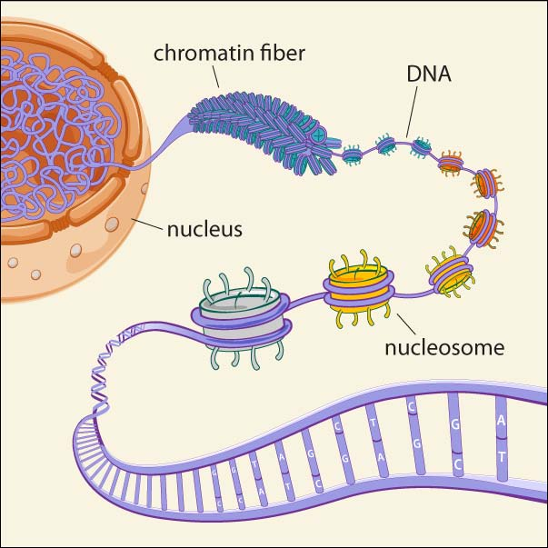

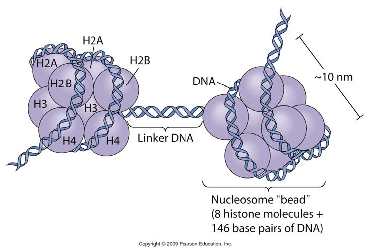

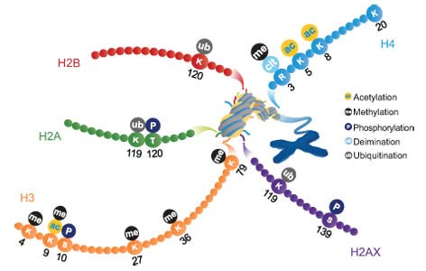

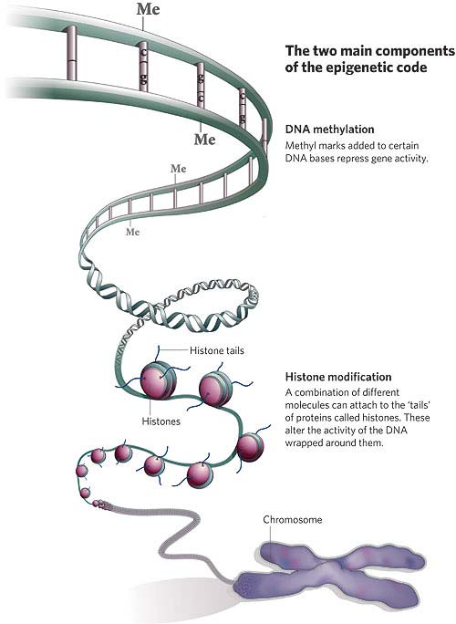

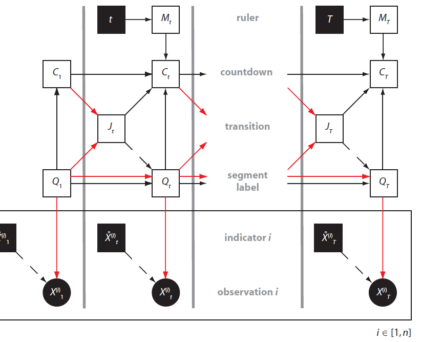

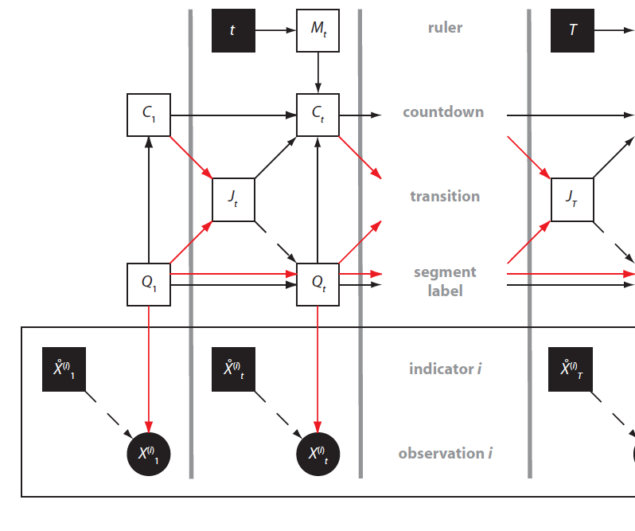

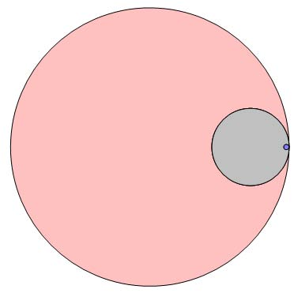

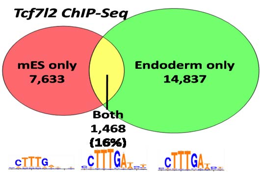

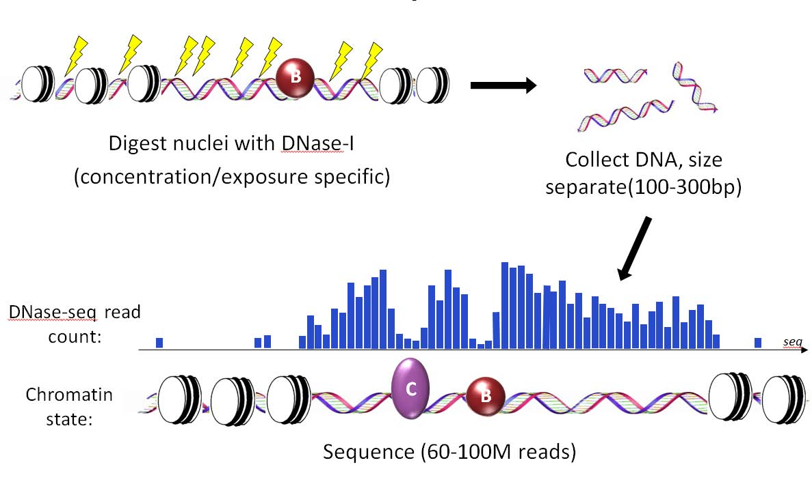

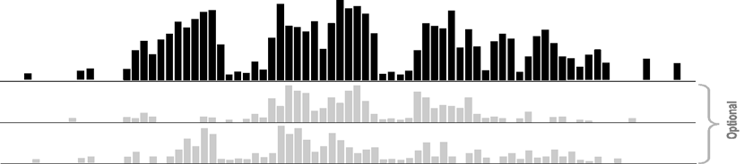

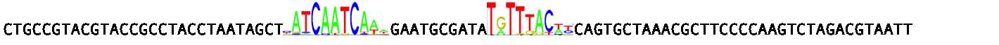

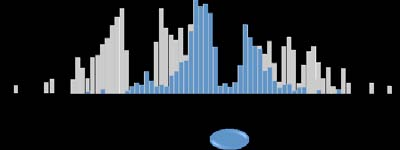

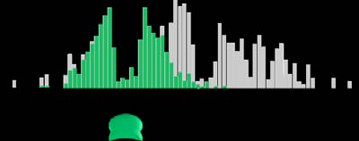

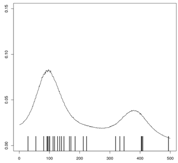

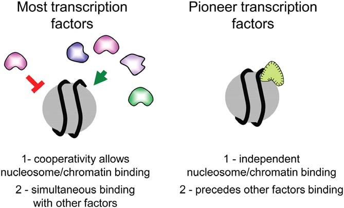

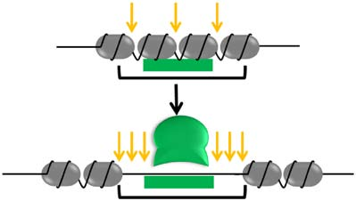

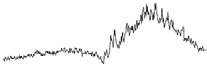

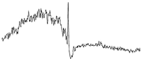

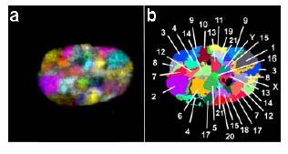

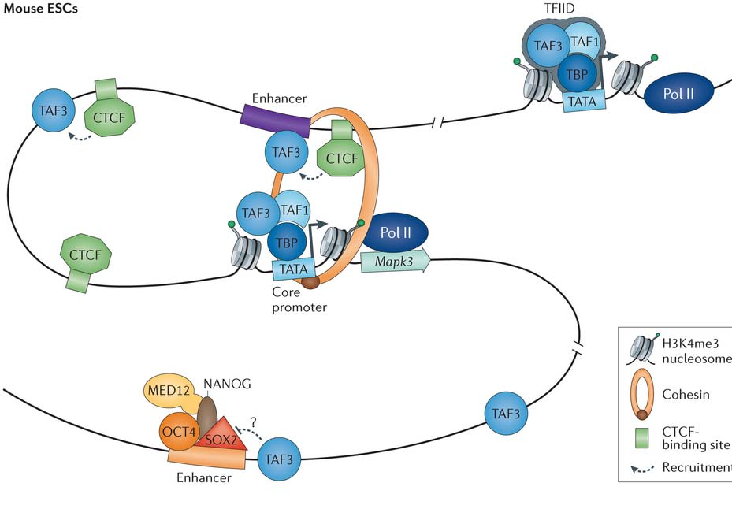

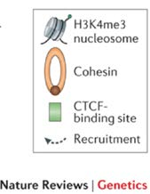

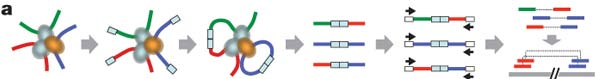

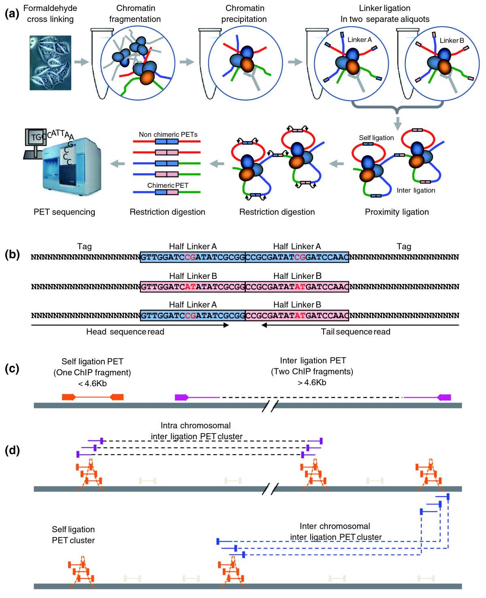

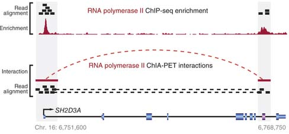

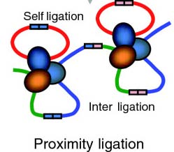

