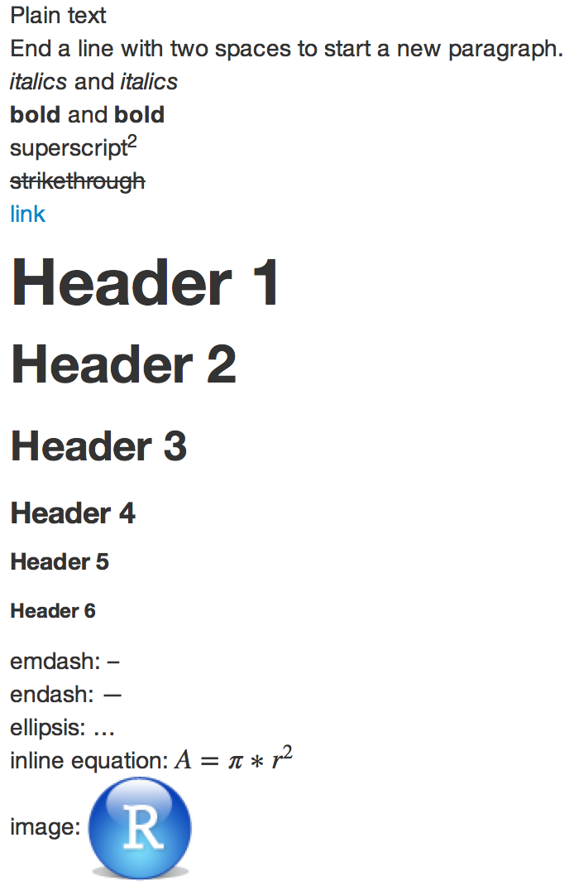
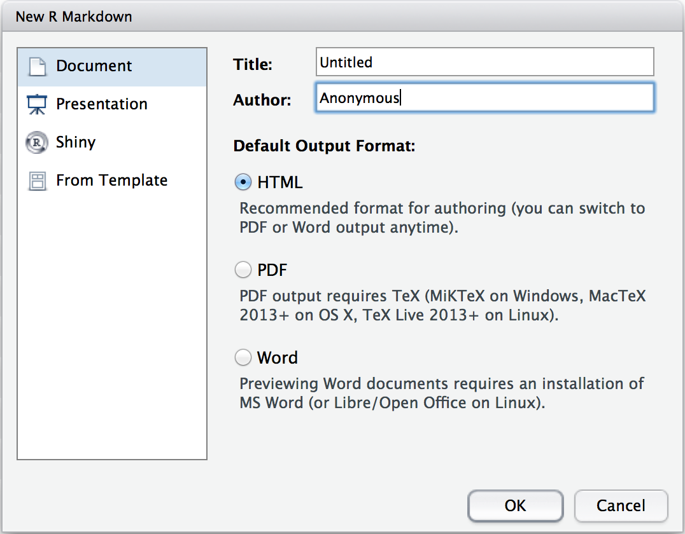
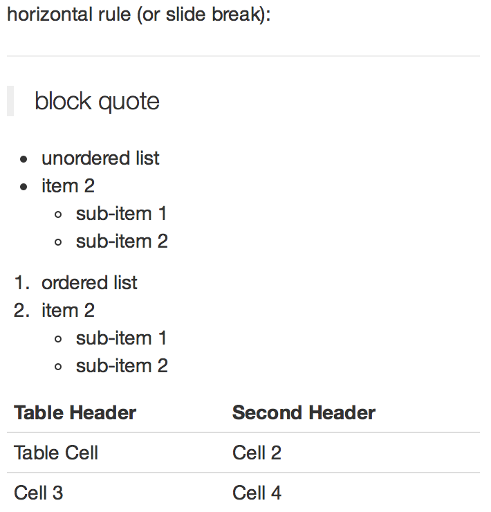
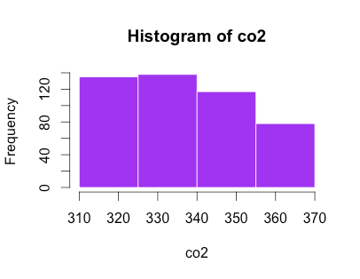
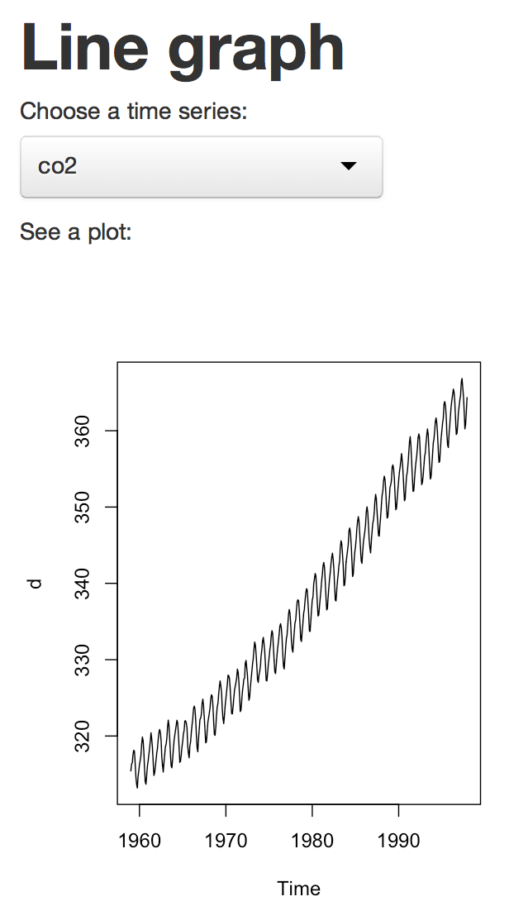
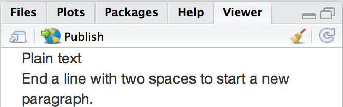
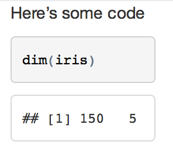
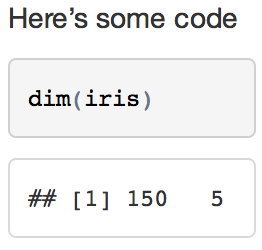
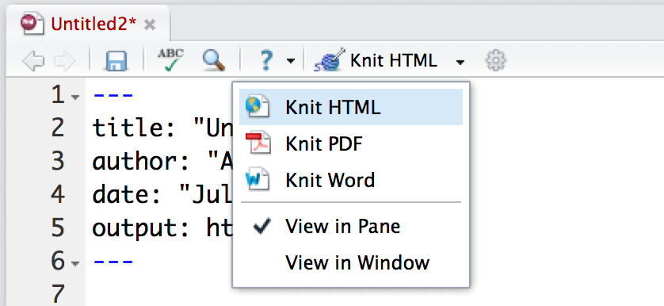
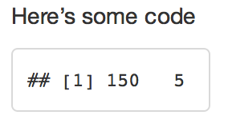

> **Reconstructed by a model.** [`background_material/rmarkdown-cheatsheet.pdf`](https://github.com/GTPB/PSLS20/blob/55acd654e639f1d5297dc0f2e46d8fd6855b5bad/background_material/rmarkdown-cheatsheet.pdf) — gtpb-psls20, licensed CC BY 4.0. Converted 2026-09-18 from `.pdf`. The original is a PDF with no usable text layer. A model read the pages and wrote this markdown: the prose is a paraphrase in places and **every equation is unverified**. Treat it as a pointer into the original, never as a citable source.

# 1. Workflow

Split into 3 sections.

1. [1. Workflow](01-1-workflow.md)
2. [3. Markdown](02-3-markdown.md)
3. [5. Embed Code](03-5-embed-code.md)

## Figures

Extracted from the original PDF. They are listed by the page they came from rather
than placed in the text: the conversion does not record where on the page each one
sat.

---

[Up: contents](../../index.md)
