> **Reconstructed by a model.** [`docs/illumina_sequencing_introduction.pdf`](https://github.com/statOmics/SGA21/blob/0ad787d4cc2bb2f4636440840a8a923cf6c09839/docs/illumina_sequencing_introduction.pdf) — statomics-sga21, licensed CC BY-NC-SA 4.0. Converted 2026-09-18 from `.pdf`. The original is a PDF with no usable text layer. A model read the pages and wrote this markdown: the prose is a paraphrase in places and **every equation is unverified**. Treat it as a pointer into the original, never as a citable source.

# I. Welcome to Next-Generation Sequencing

Split into 5 sections.

1. [I. Welcome to Next-Generation Sequencing](01-i-welcome-to-next-generation-sequencing.md)
2. [II. NGS Methods](02-ii-ngs-methods.md)
3. [III. Illumina DNA-to-Data NGS Solutions](03-iii-illumina-dna-to-data-ngs-solutions.md)
4. [IV. Glossary](04-iv-glossary.md)
5. [V. References](05-v-references.md)

## Figures

Extracted from the original PDF. They are listed by the page they came from rather
than placed in the text: the conversion does not record where on the page each one
sat.

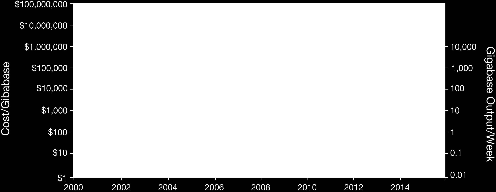

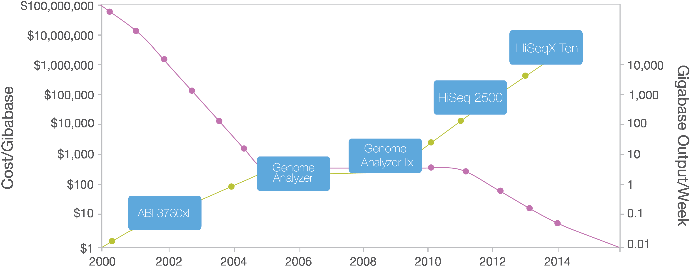

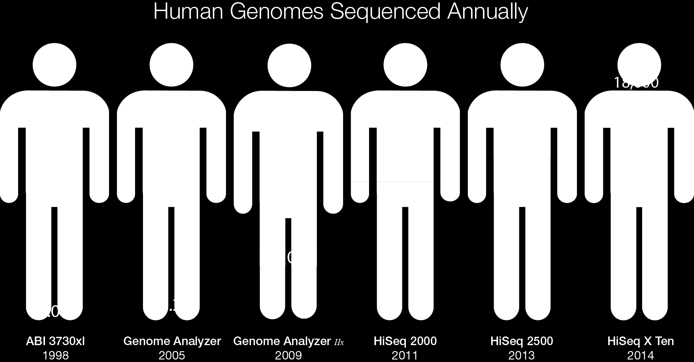

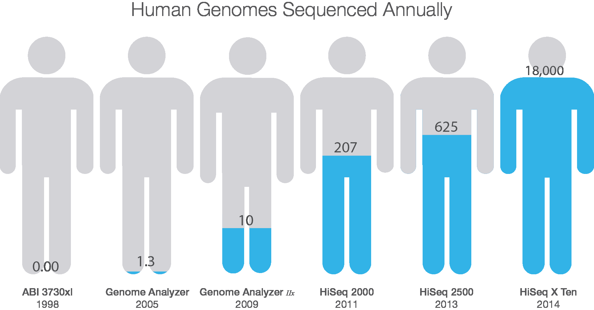

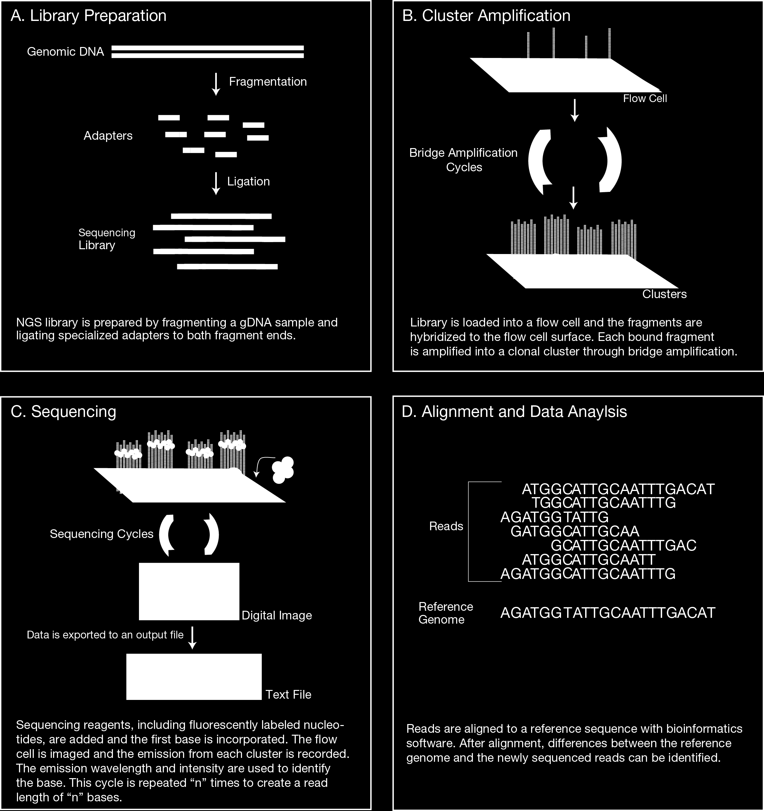

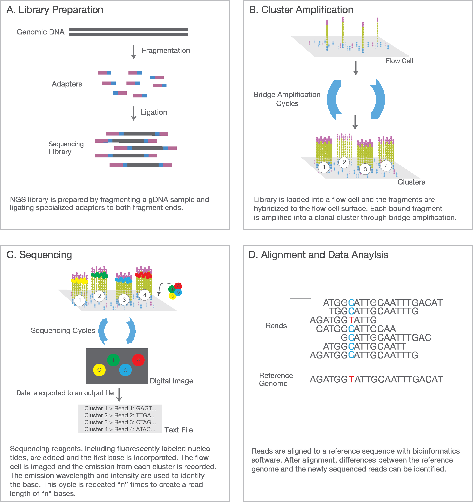

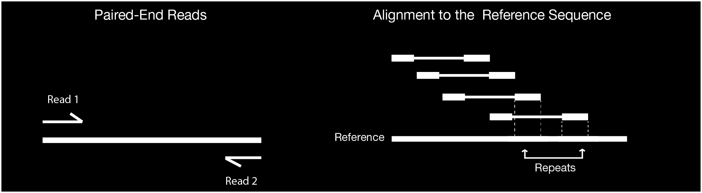

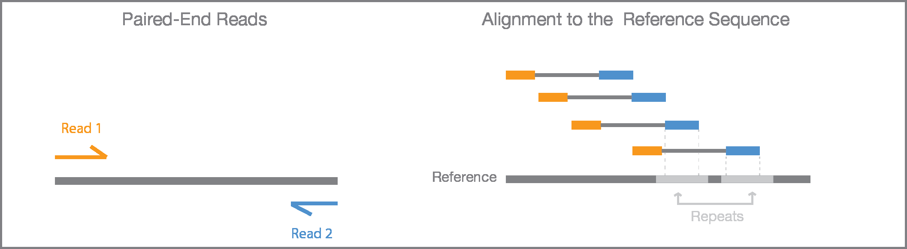

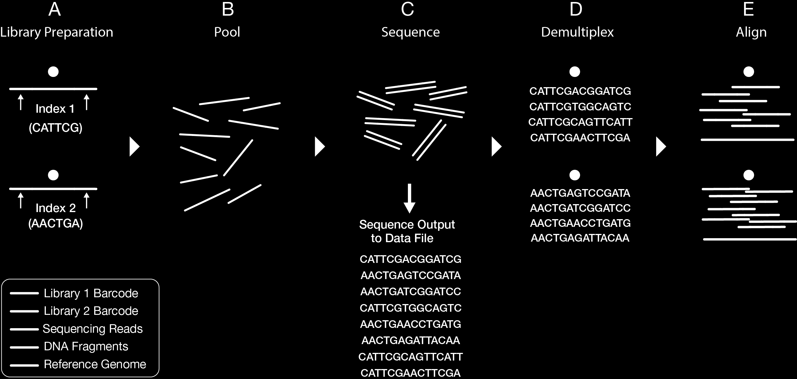

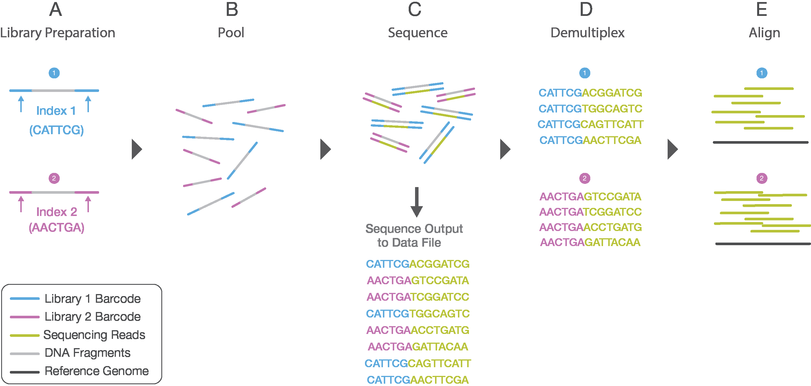

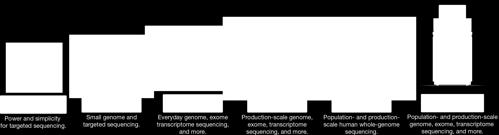

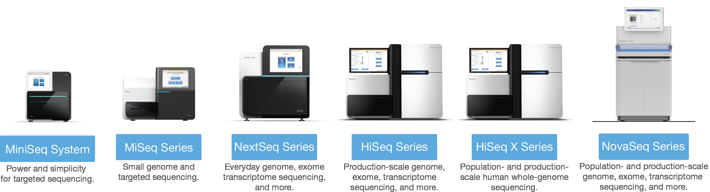

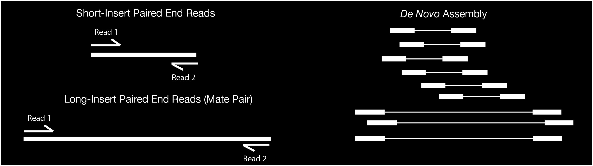

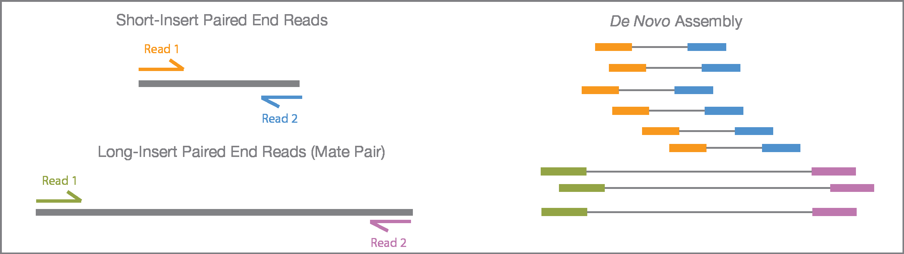

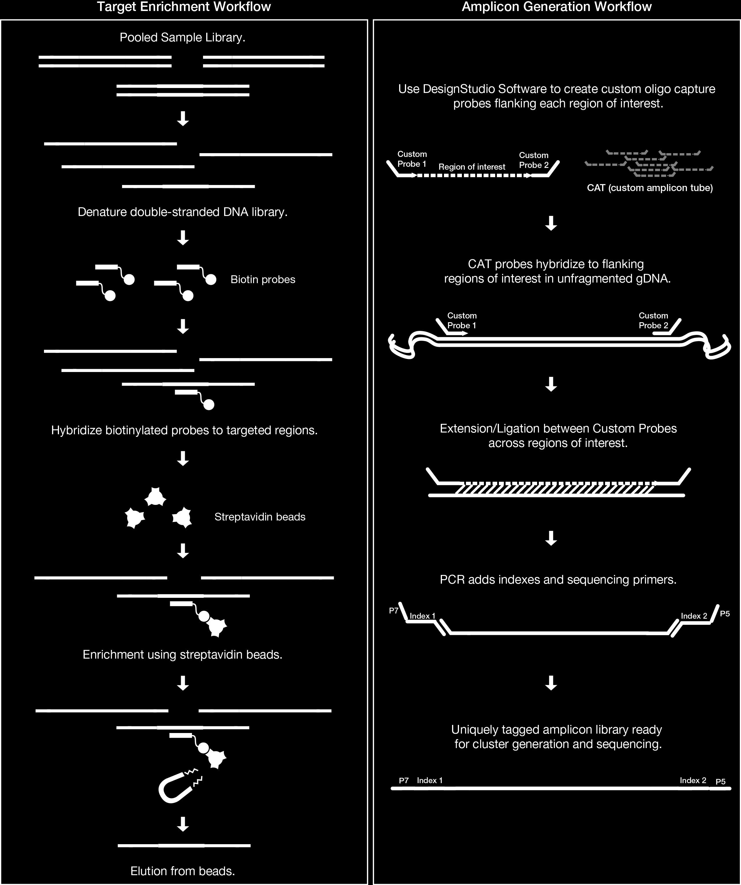

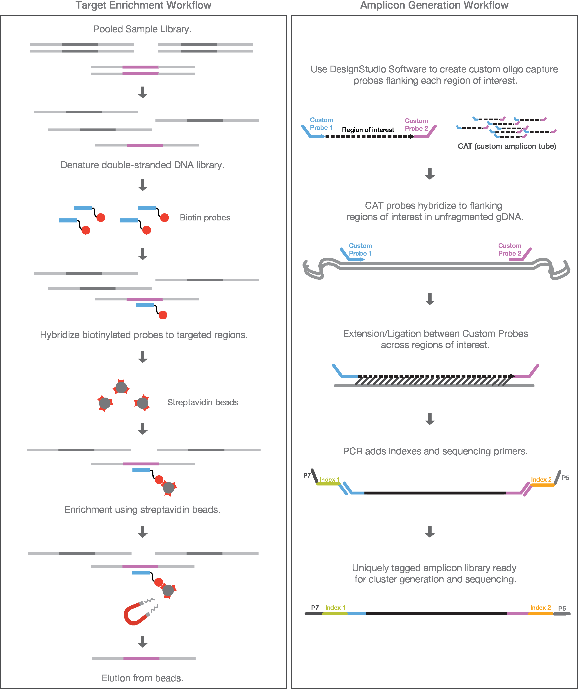

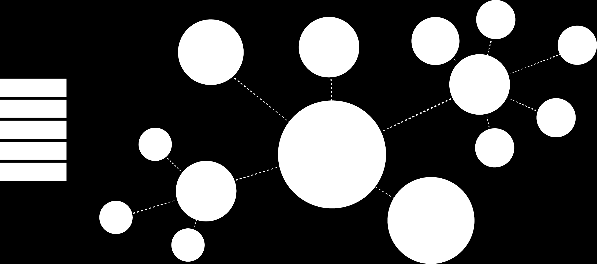

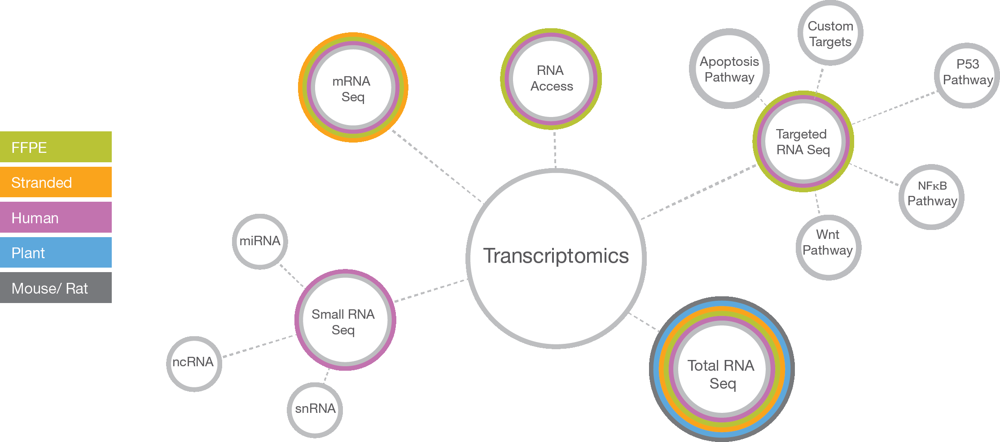

---

[Up: contents](../../index.md)
