> **Reconstructed by a model.** [`docs/intro.pdf`](https://github.com/statOmics/SGA21/blob/0ad787d4cc2bb2f4636440840a8a923cf6c09839/docs/intro.pdf) — statomics-sga21, licensed CC BY-NC-SA 4.0. Converted 2026-09-18 from `.pdf`. The original is a PDF with no usable text layer. A model read the pages and wrote this markdown: the prose is a paraphrase in places and **every equation is unverified**. Treat it as a pointer into the original, never as a citable source.

# Intro

Lieven Clement
*Ghent University, Belgium*

---

## Scientific Integrity and Reproducible Research

### Bio-informatics research is based on empirical data

$\rightarrow$ Number of observations $<<<$ number of features
$\rightarrow$ Need for statistics to distinguish real patterns from random patterns in high dimensional data

---

## Genomics

- The genome is entire hereditary information of an organism
- Contains all info needed for each function of an organism
- Most of the functions are carried out by proteins
- Gene is genomic region that directs synthesis of a **protein**
- **Genomics** studies all genetic information of an organism together: specific code, effects, functions and interactions

---

## Genome - DNA

- Is stored in DNA (DeoxyriboNucleic Acid)(for many types of viruses in RNA)
- A code of 4 nucleotides
  - purines: adenine (A) and guanine (G)
  - pyrimidines: thymine (T) and cytosine (C)
  - a phosphate group;
  - a deoxyribose sugar;
- Double helix structure (2-3 hydrogen bounds)
- Organized in chromosomes
- Most of it is in the nucleus, also a part in mitochondrion (energy organelle of the cell)

---

## DNA structure

- Polynucleotide chains are directional molecules with slightly different ends: 3' end and 5' end.
- 3' and 5' refers to carbon atom numbering in the sugar ring. (3' hydroxyl group, 5' phosphate group)
- Complementary DNA strands are antiparallel (i.e, 5' to 3' ends for each strand are opposite)
- Most of it is coiled and condensed: very stable

---

## Transcription-Translation

- Genome/DNA all genetic info in each cell: "Hard Drive". Four letter code: A, C, T, G
- Transcriptome/RNA: genetic info actively used by cell: "RAM"
- Transcription
  - Unwinding of DNA
  - RNA polymerase
  - DNA template: antisense strand
  - Single complementary RNA strand
  - Splicing

---

## Transcription-Translation

- Genome/DNA: "Hard Drive"
- Transcriptome/RNA: active genetic info in cell: "RAM"
- Proteome
- Translation RNA$\rightarrow$Protein
  - At ribosomes: factories of the cell
  - 24 amino acids (aa)
  - 3 consecutive bases codon
  - tRNA: with antisense codon, caries one type of aa
  - several codons exist for same aa
  - start codon AUG (methionine, often removed)
  - stop codon UAG, UAA, UGA
- Post-translational modification+protein folding

---

## Proteins

science daily

---

## The human genome

- Humans: $2 \times 3$ billion base pairs
- 2 meters of DNA
- $\pm$ 20.000 protein coding genes (500-4000/ chromosome)
- 99.9% in common with each-other
- Only 2% is protein coding
- 96% in common with chimp
- 50% in common with banana
- Organized in 23 pairs of chromosomes
  - 22 autosomal pairs
  - One sex chromosome pair: XX for females and XY for males
  - In each pair, one paternally other maternally inherited (cf. meiosis)

---

## All cells of organism have same genome: still huge differences between different cells and over time?

Brain vs liver cell
Development of butterfly

---

## Differential Gene Expression

- Different genes are expressed in different cells and at different times
- Genes are expressed at different levels in different cells and over time

### Human

| Tissue/Cell | Number of genes* | Fraction of genes* | Ensembl genes† |
| :--- | :--- | :--- | :--- |
| Skeletal muscle‡ | 11,276 | 0.61 | 11,953 |
| Liver‡,§ | 11,392 | 0.61 | 12,191 |
| BT474¶ | 11,844 | 0.64 | 12,808 |
| MB435¶ | 11,847 | 0.64 |

---

[Up: contents](../index.md)

## Figures

Extracted from the original PDF. They are listed by the page they came from rather
than placed in the text: the conversion does not record where on the page each one
sat.

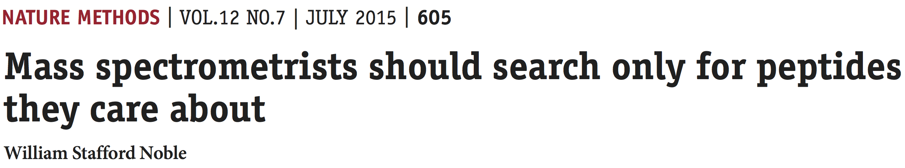

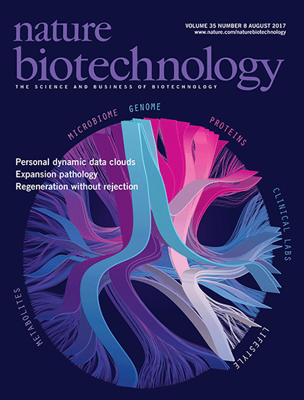

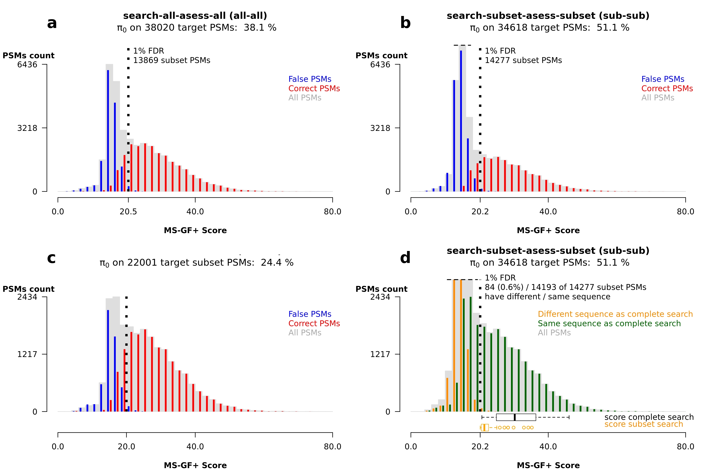

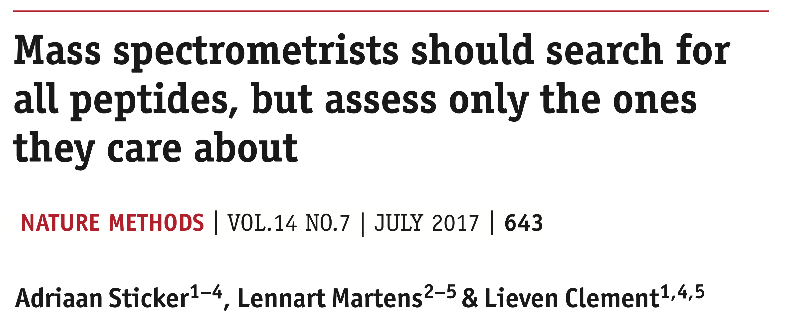

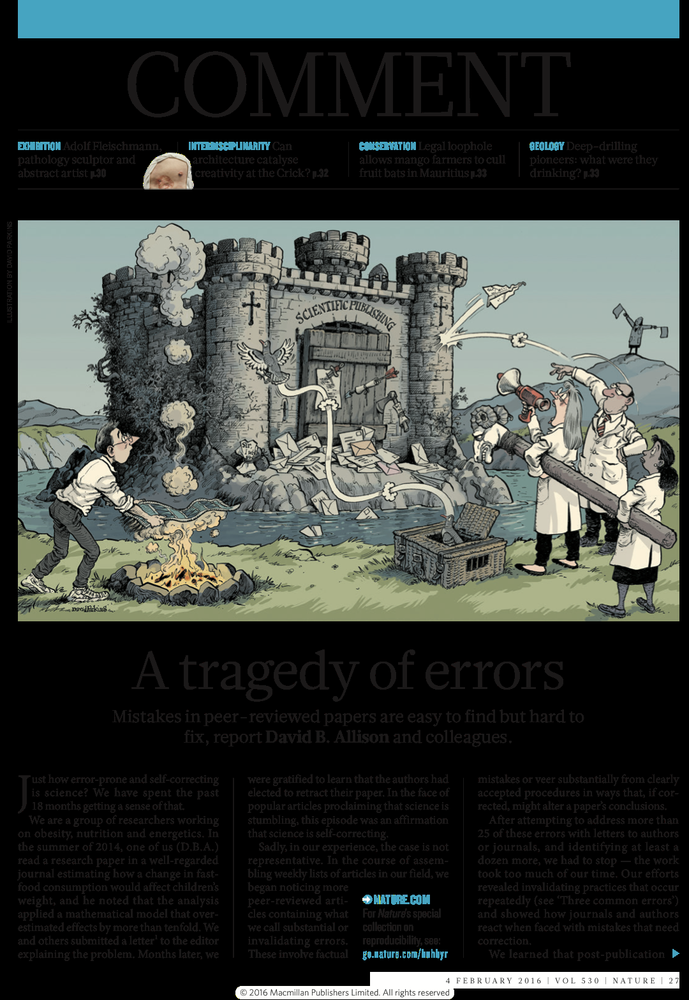

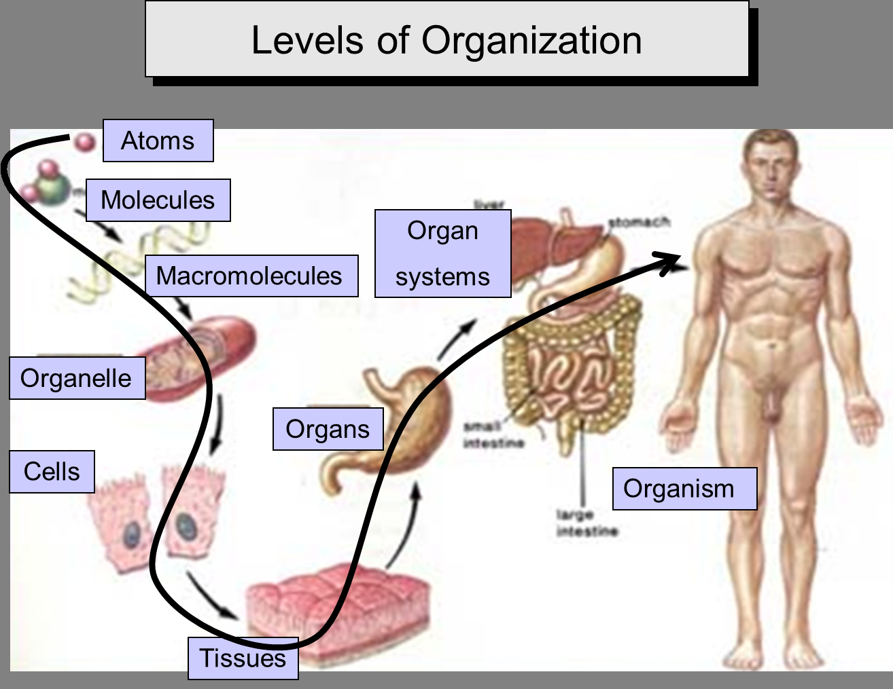

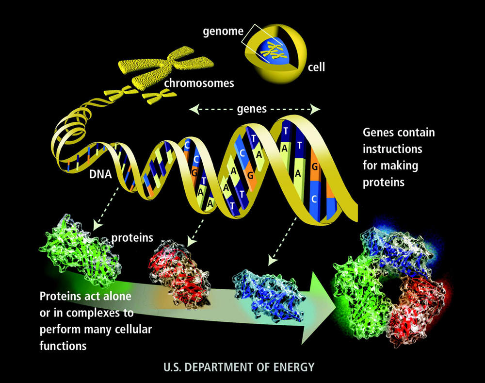

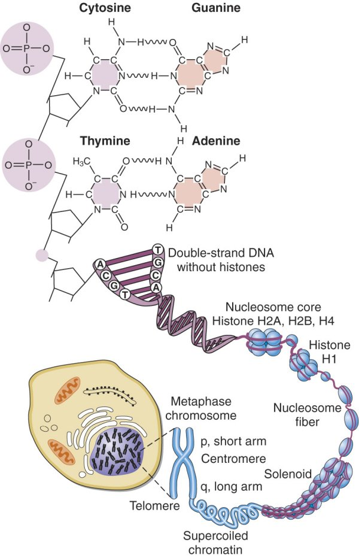

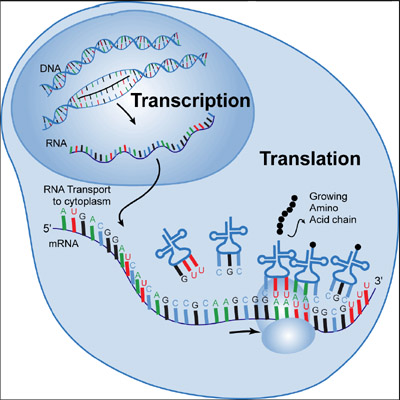

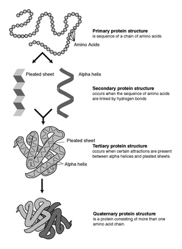

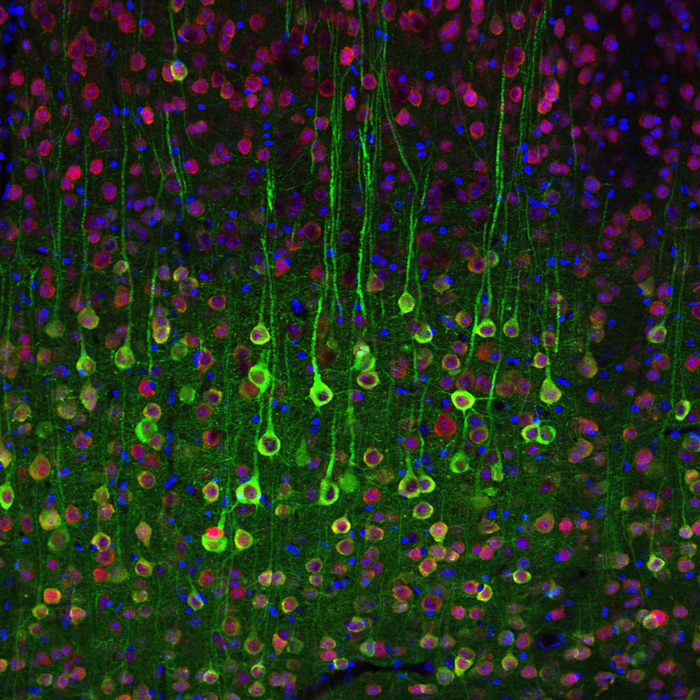

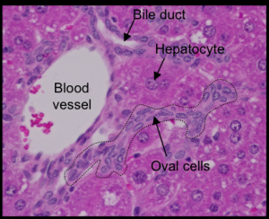

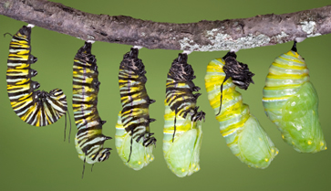

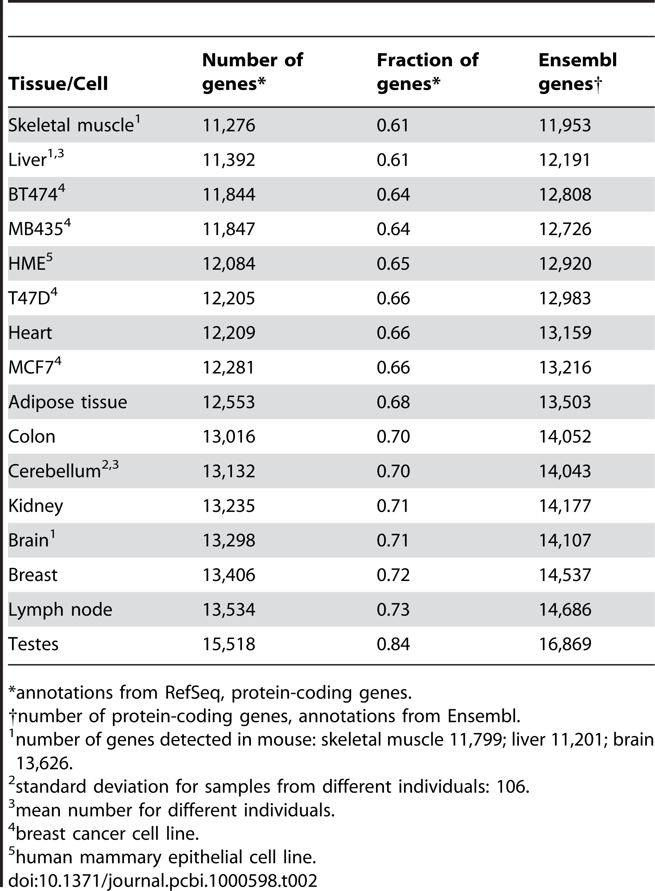

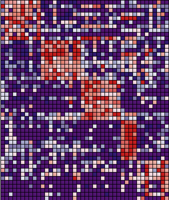

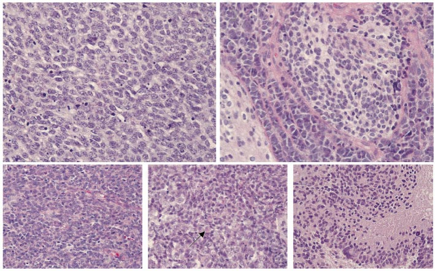

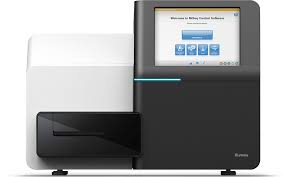

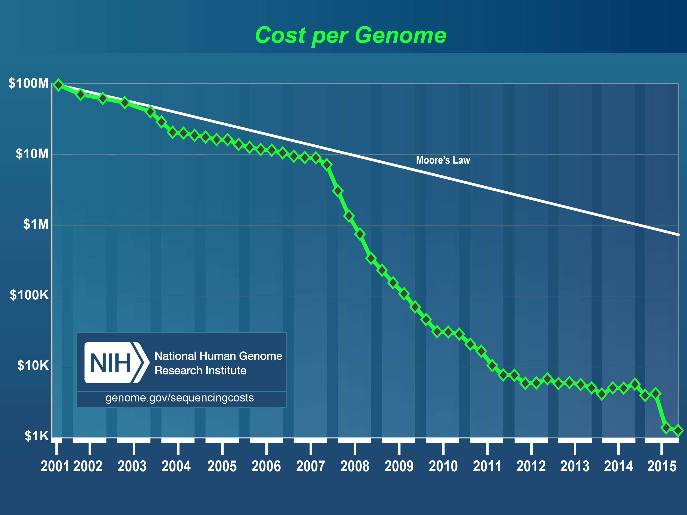

