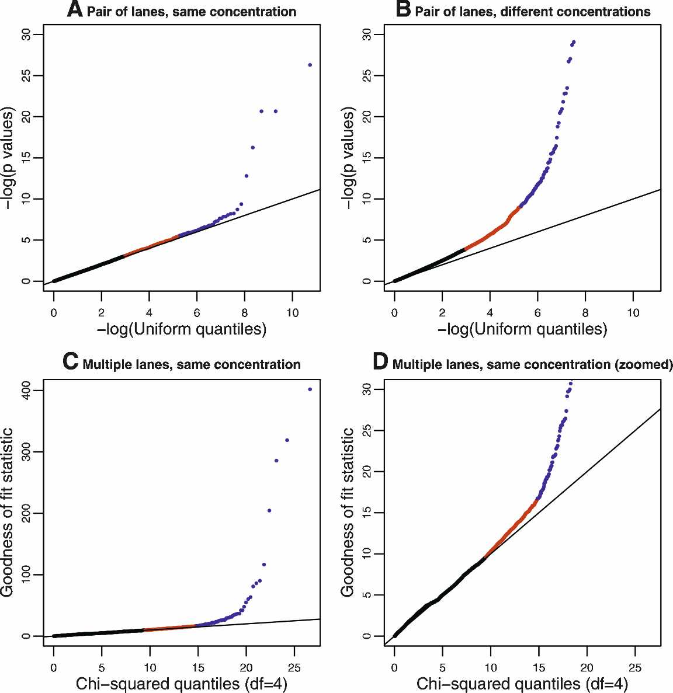

> **Reconstructed by a model.** [`images_sequencing/marioni_fig2.pdf`](https://github.com/statOmics/SGA21/blob/0ad787d4cc2bb2f4636440840a8a923cf6c09839/images_sequencing/marioni_fig2.pdf) — statomics-sga21, licensed CC BY-NC-SA 4.0. Converted 2026-09-18 from `.pdf`. The original is a PDF with no usable text layer. A model read the pages and wrote this markdown: the prose is a paraphrase in places and **every equation is unverified**. Treat it as a pointer into the original, never as a citable source.

# Marioni fig2

sortium 2007), suggesting that many
transcriptionally active regions (TARs)
are currently unannotated.

We obtained, for each lane, a measure of the "overall" expression of each
gene in the Ensembl database by summing the number of reads mapping to
exons within each gene (Supplemental
Table 2). For genes with multiple transcripts, we took the median across transcripts. Within each lane, under idealized assumptions (e.g., no alignment
errors, and no sequence-context sequencing bias), these "gene counts"
would, in expectation, be proportional
to the transcript length times the mRNA
expression level. Of the genes in the Ensembl database, 22,925 (72%) were
mapped to by at least one read. Among
these, the distribution of the number of
reads was very skewed across genes
(Supplemental Fig. 2), with many genes
having relatively few reads (median = 46
for liver, 101 for kidney).

A first (albeit rather rough) indication that sequence data are highly replicable is that, for each sample, the gene
counts are highly correlated across lanes
(average Spearman correlation = 0.96)
(Supplemental Fig. 3).

An issue of particular importance is
to what extent the data exhibit a "lane
effect," by which we mean systematic
differences between results for the same
sample, sequenced at the same concentration in different lanes, over and above
those expected from sampling error. We
examined this issue in two ways, first by
considering each pair of lanes in turn
(which allows any outlying lanes to be
identified), and then by considering
multiple lanes simultaneously (which should increase the
power to detect lane effects if they consistently affect the same
genes).

When comparing a pair of lanes, we computed, for each
gene, a $P$-value testing the null hypothesis that the gene counts
in one lane resembled a random sample from the reads in both
lanes (this is done using the fact that, in the absence of a lane
effect, after accounting for the different total gene counts in each
lane, the individual gene counts in each lane should follow a
hypergeometric distribution). In the absence of a lane effect, the
distribution of these $P$-values across genes should be uniform,
whereas deviations from uniformity (which we assessed using a
qq-plot) indicate a lane effect. Among the 22 total two-way comparisons between lanes in which the same sample was sequenced
at the same concentration, we found that only a small proportion of genes (consistently <0.5%) had very small $P$-values that
indicated clear evidence for a lane effect (Fig. 2A; Supplemental
Fig. 4). This was true for comparisons both within and across the
two different runs, although comparisons across different runs
seemed to show slightly larger proportions of genes with small
$P$-values (larger experiments will be required to assess comprehensively run-to-run variability). In contrast, using the same procedure to compare results from the same sample sequenced at
different concentrations produced $P$-values that showed much
greater deviations from uniformity (Fig. 2B; Supplemental Fig. 5).

To compare multiple lanes for a lane effect, we took a closely
related approach based on the following Poisson model. If $x_{ijk}$
represents the number of reads mapped to gene $j$ for the $k$th lane
of data from sample $i$, $x_{ijk}$ can be modeled as independent Poisson
random variables with mean $\mu_{ijk} = c_{ik}\lambda_{ijk}$, where the $\lambda_{ijk}$ are constrained to sum to 1 across genes $j$. The parameter $c_{ik}$ represents
the total rate at which lane $k$ of sample $i$ produces reads, and the
parameter $\lambda_{ijk}$ represents the rate at which reads map to gene $j$ (in
lane $k$ of sample $i$) relative to other genes. The hypothesis of no
lane effect corresponds to $\lambda_{ijk}$ being constant across lanes $k$. For
each gene, we compute a goodness-of-fit statistic across $L$ lanes to
test this hypothesis: if there is no lane effect, then this statistic
should be $\chi^2$ distributed on $L - 1$ degrees of freedom. A qq-plot
of these values (Fig. 2C,D; Supplemental Fig. 6) shows that, in
each case, only a small proportion of genes (~0.5%) show strong
evidence for a lane effect (i.e., extra-Poisson variation).

In summary, for lanes sequencing the same sample at the

**Figure 2.** Plots to assess lane effects. Each panel shows a qq-plot comparing the distribution of a
statistic ($Y$-axis) against its theoretical distribution in the absence of a lane effect ($X$-axis). Deviations
from the line $y = x$ indicate the presence of a lane effect. (Points in red) Those above the 95th
percentile; (points in blue) those above the 99.5th percentile. (*A*) A typical result when using $P$-values
derived from a hypergeometric test statistic to compare two lanes used to sequence the same sample
at the same concentration. (In this panel, data generated when the kidney sample was sequenced in
Run 1, lane 1 and Run 2, lane 2 were used; see Supplemental Fig. 4 for all pairwise comparisons.) (*B*)
Analogous results when comparing two lanes used to sequence the same sample at different concentrations. (In this panel, data generated when the kidney sample was sequenced in Run 1, lane 1 and
Run 2, lane 4 were used; see Supplemental Fig. 5 for all pairwise comparisons.) (*C*,*D*) Results (on two
different scales) when the goodness-of-fit statistic is used to assess the fit of the Poisson model to the
kidney data sequenced at a concentration of 3 pM. The liver sample showed a similar pattern (Supplemental Fig. 6).

---

[Up: contents](../index.md)

## Figures

Extracted from the original PDF. They are listed by the page they came from rather
than placed in the text: the conversion does not record where on the page each one
sat.

