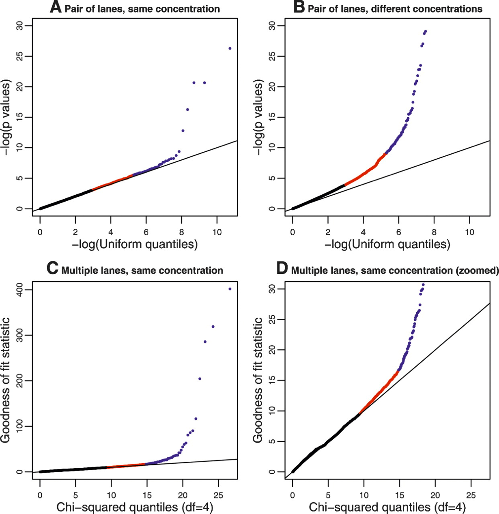
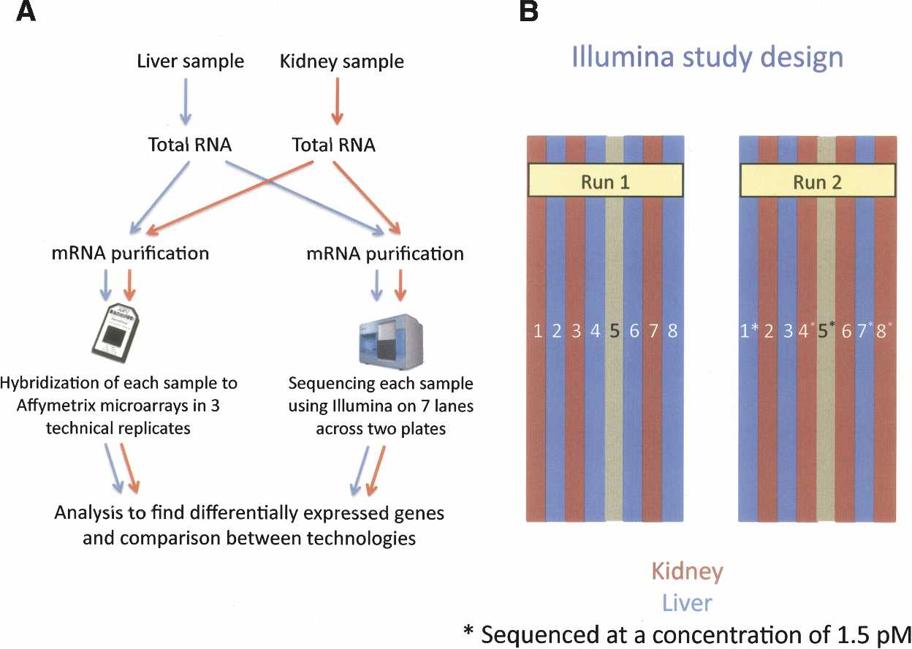

> **Reconstructed by a model.** [`images_sequencing/seqKeynote.pdf`](https://github.com/statOmics/SGA21/blob/0ad787d4cc2bb2f4636440840a8a923cf6c09839/images_sequencing/seqKeynote.pdf) — statomics-sga21, licensed CC BY-NC-SA 4.0. Converted 2026-09-18 from `.pdf`. The original is a PDF with no usable text layer. A model read the pages and wrote this markdown: the prose is a paraphrase in places and **every equation is unverified**. Treat it as a pointer into the original, never as a citable source.

# Gene-level quantification

Split into 2 sections.

1. [Gene-level quantification](01-gene-level-quantification.md)
2. [Results](02-results.md)

## Figures

Extracted from the original PDF. They are listed by the page they came from rather
than placed in the text: the conversion does not record where on the page each one
sat.

---

[Up: contents](../../index.md)
