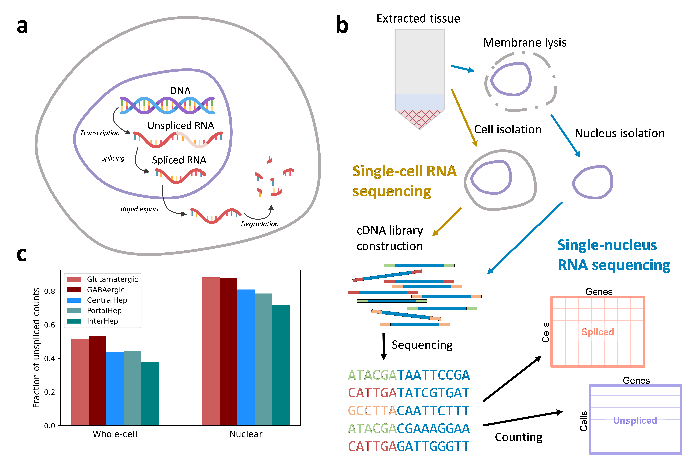
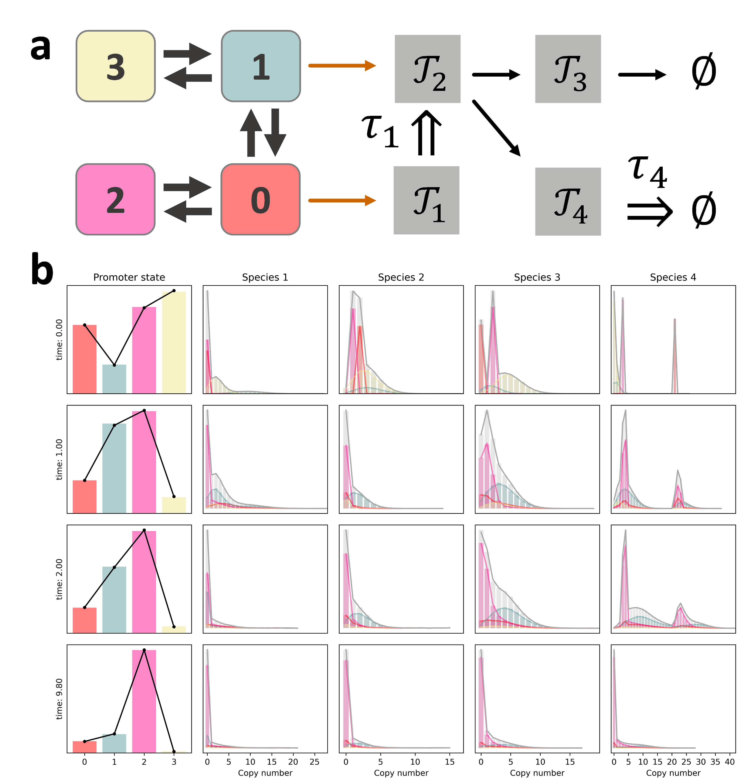
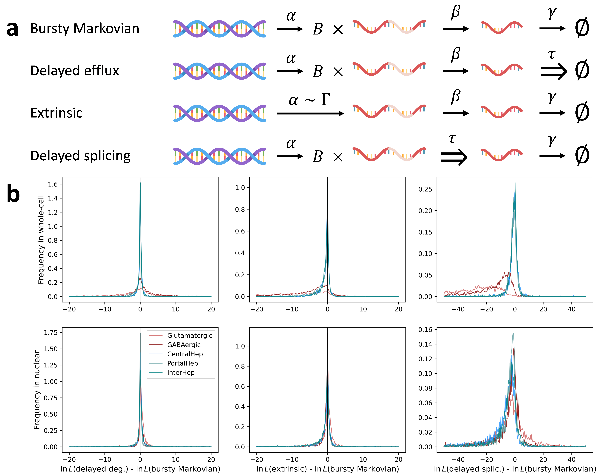

> **Reconstructed by a model.** `gorin-2022-transient-delay-cme.pdf` from [papers/gorin-2022-transient-delay-cme](https://doi.org/10.1101/2022.10.17.512599/) — papers · gorin-2022-transient-delay-cme, licensed CC BY 4.0. Converted 2026-10-02 from `.pdf`. The original is a PDF with no usable text layer. A model read the pages and wrote this markdown: the prose is a paraphrase in places and **every equation is unverified**. Treat it as a pointer into the original, never as a citable source.

# Transient and delay chemical master equations

Split into 7 sections.

1. [Transient and delay chemical master equations](01-transient-and-delay-chemical-master-equations.md)
2. [1 INTRODUCTION](02-1-introduction.md)
3. [2 THEORETICAL FRAMEWORK](03-2-theoretical-framework.md)
4. [3 RESULTS](04-3-results.md)
5. [4 METHODOLOGICAL EXTENSIONS](05-4-methodological-extensions.md)
6. [5 DISCUSSION](06-5-discussion.md)
7. [REFERENCES](07-references.md)

## Figures

Extracted from the original PDF. They are listed by the page they came from rather
than placed in the text: the conversion does not record where on the page each one
sat.

---

[Up: contents](../index.md)
