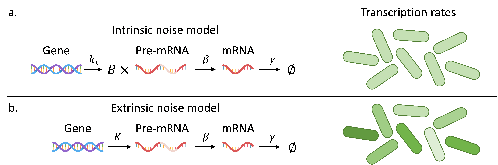
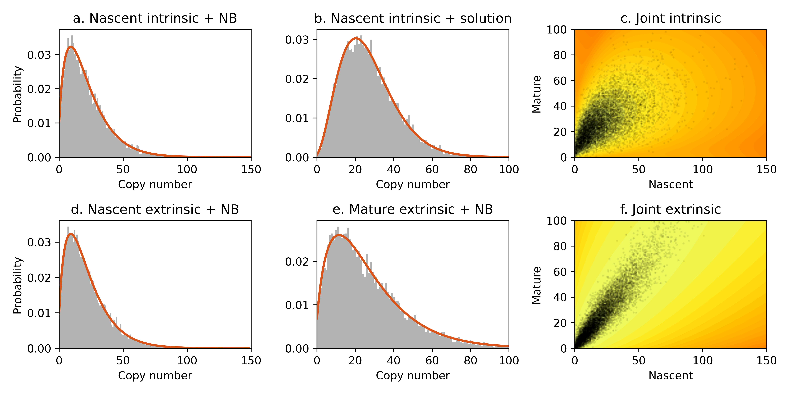

> **Reconstructed by a model.** `gorin-pachter-2020-intrinsic-extrinsic.pdf` from [papers/gorin-pachter-2020-intrinsic-extrinsic](https://doi.org/10.1101/2020.09.25.312868/) — papers · gorin-pachter-2020-intrinsic-extrinsic, licensed CC BY 4.0. Converted 2026-10-02 from `.pdf`. The original is a PDF with no usable text layer. A model read the pages and wrote this markdown: the prose is a paraphrase in places and **every equation is unverified**. Treat it as a pointer into the original, never as a citable source.

# 1 Background

Split into 8 sections.

1. [1 Background](01-1-background.md)
2. [2 Two models for gene expression](02-2-two-models-for-gene-expression.md)
3. [3 Notation](03-3-notation.md)
4. [4 Preliminaries](04-4-preliminaries.md)
5. [5 Discriminating between intrinsic and extrinsic noise models](05-5-discriminating-between-intrinsic-and-extrinsic-noise-model.md)
6. [6 Experimental opportunities and limitations](06-6-experimental-opportunities-and-limitations.md)
7. [7 Discussion](07-7-discussion.md)
8. [References](08-references.md)

## Figures

Extracted from the original PDF. They are listed by the page they came from rather
than placed in the text: the conversion does not record where on the page each one
sat.

---

[Up: contents](../index.md)
