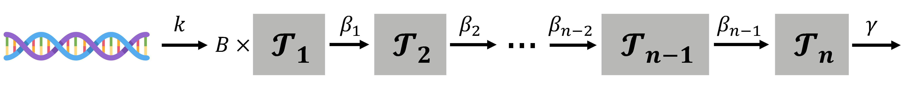
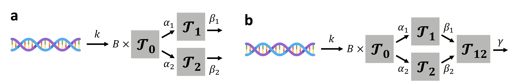
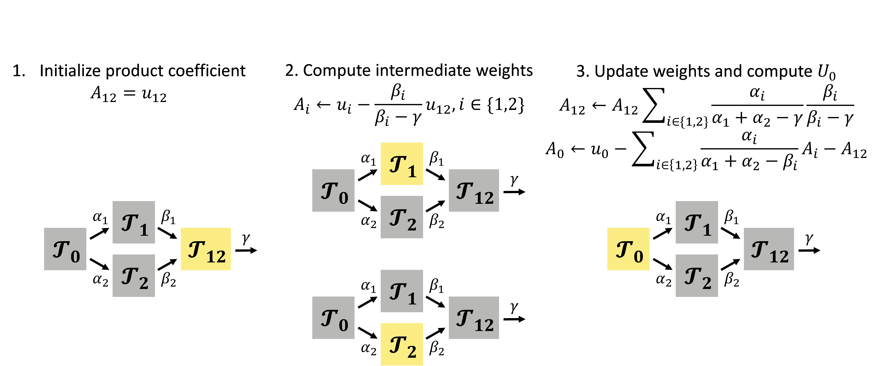
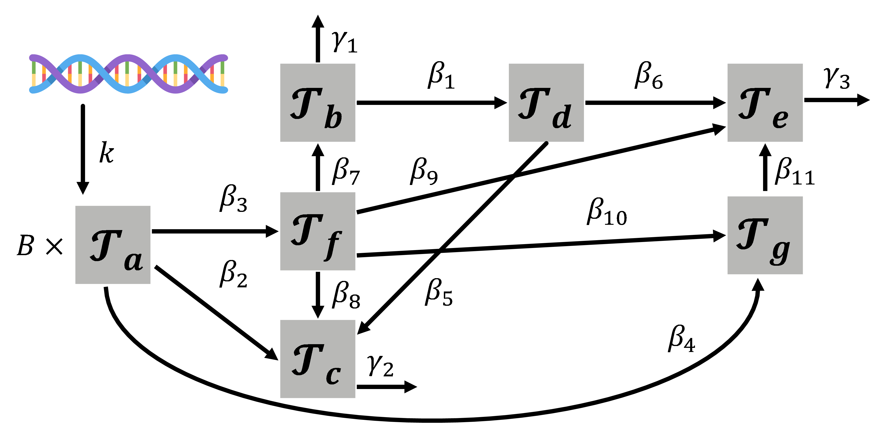
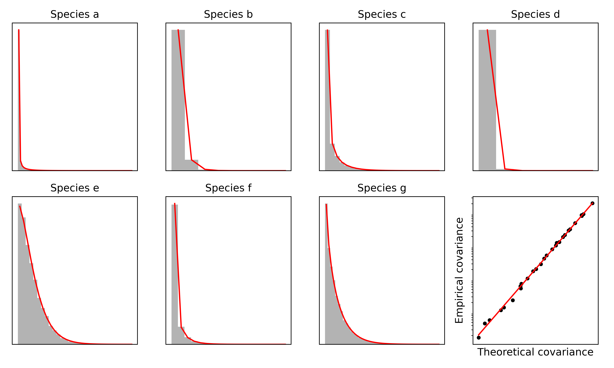
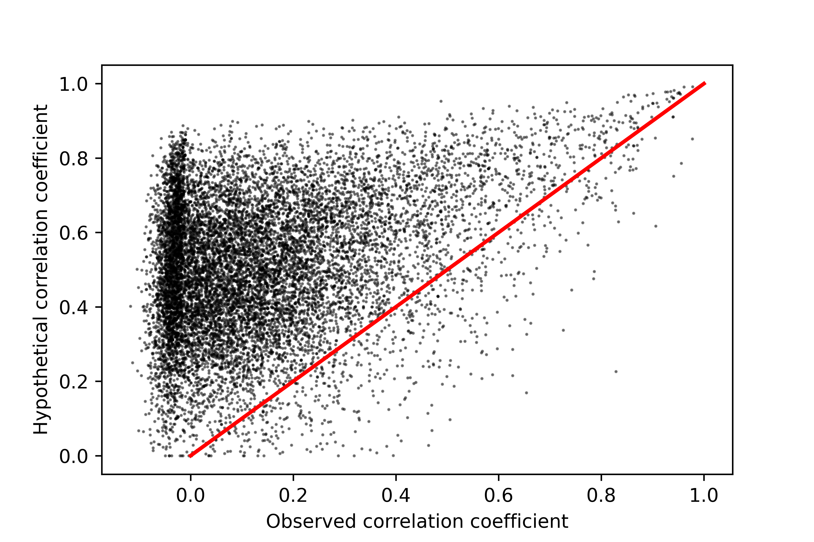

> **Reconstructed by a model.** `gorin-pachter-2022-bursty-splicing.pdf` from [papers/gorin-pachter-2022-bursty-splicing](https://doi.org/10.1101/2021.03.24.436847/) — papers · gorin-pachter-2022-bursty-splicing, licensed CC BY 4.0. Converted 2026-10-02 from `.pdf`. The original is a PDF with no usable text layer. A model read the pages and wrote this markdown: the prose is a paraphrase in places and **every equation is unverified**. Treat it as a pointer into the original, never as a citable source.

# Gorin pachter 2022 bursty splicing

Split into 7 sections.

1. [Introduction](01-introduction.md)
2. [1 Introduction](02-1-introduction.md)
3. [2 Methods](03-2-methods.md)
4. [3 Applications to sequencing data](04-3-applications-to-sequencing-data.md)
5. [4 Results and discussion](05-4-results-and-discussion.md)
6. [References](06-references.md)
7. [S1 Supplementary Note](07-s1-supplementary-note.md)

## Figures

Extracted from the original PDF. They are listed by the page they came from rather
than placed in the text: the conversion does not record where on the page each one
sat.

---

[Up: contents](../index.md)
