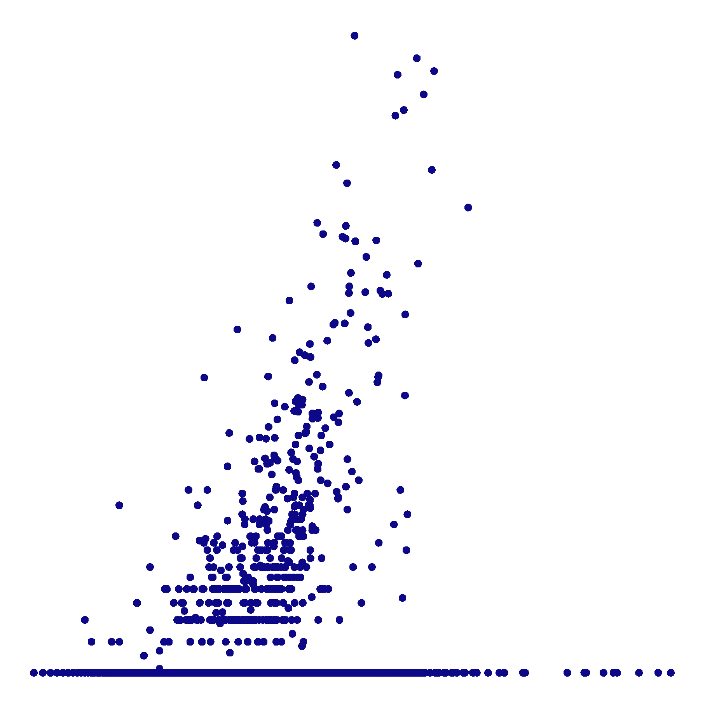
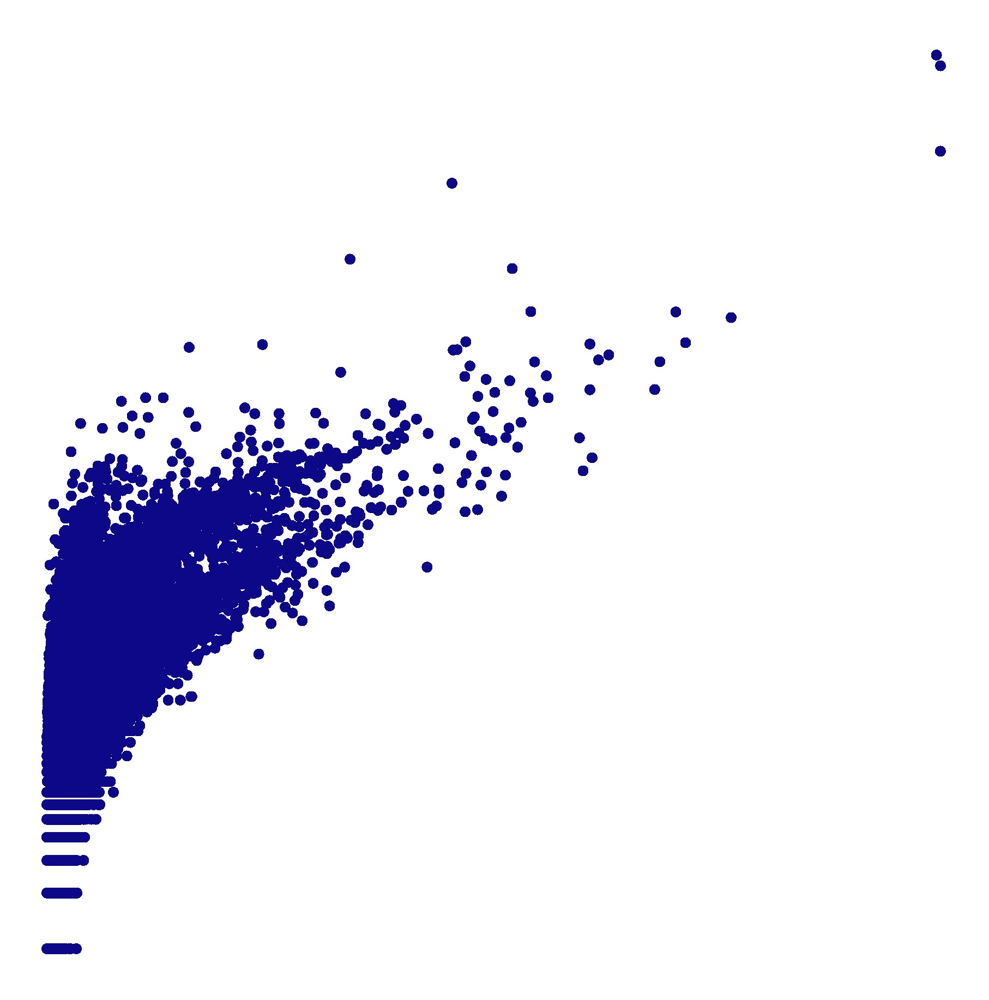
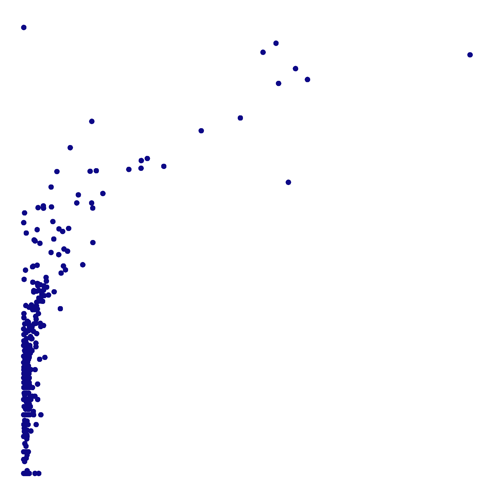

> **Reconstructed by a model.** `cargnelli-2026-benchmarking-decontamination.pdf` from [papers/cargnelli-2026-benchmarking-decontamination](https://doi.org/10.64898/2026.01.13.699237/) — papers · cargnelli-2026-benchmarking-decontamination, licensed CC BY 4.0. Converted 2026-10-02 from `.pdf`. The original is a PDF with no usable text layer. A model read the pages and wrote this markdown: the prose is a paraphrase in places and **every equation is unverified**. Treat it as a pointer into the original, never as a citable source.

# Benchmarking computational decontamination of ambient RNA

Split into 7 sections.

1. [Benchmarking computational decontamination of ambient RNA](01-benchmarking-computational-decontamination-of-ambient-rna.md)
2. [Introduction](02-introduction.md)
3. [Results](03-results.md)
4. [Discussion](04-discussion.md)
5. [References](05-references.md)
6. [Methods and materials](06-methods-and-materials.md)
7. [Figures](07-figures.md)

## Figures

Extracted from the original PDF. They are listed by the page they came from rather
than placed in the text: the conversion does not record where on the page each one
sat.

---

[Up: contents](../index.md)
