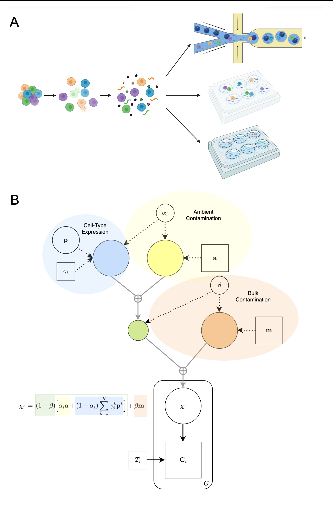
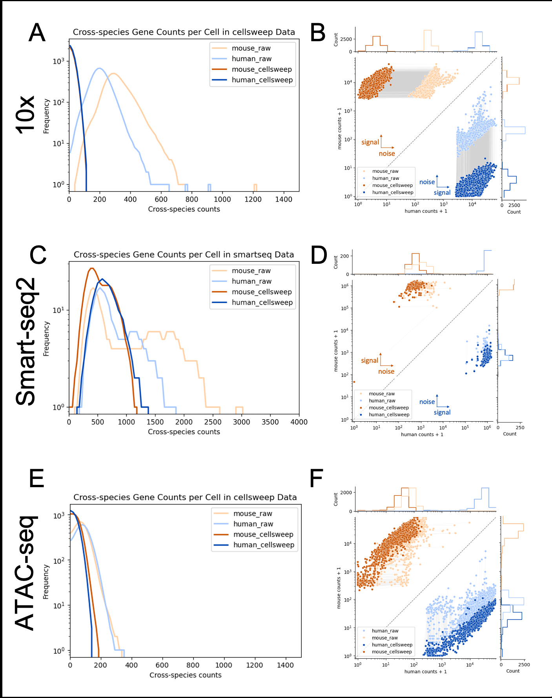
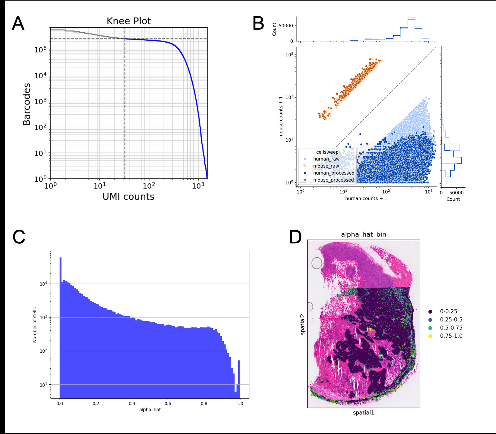
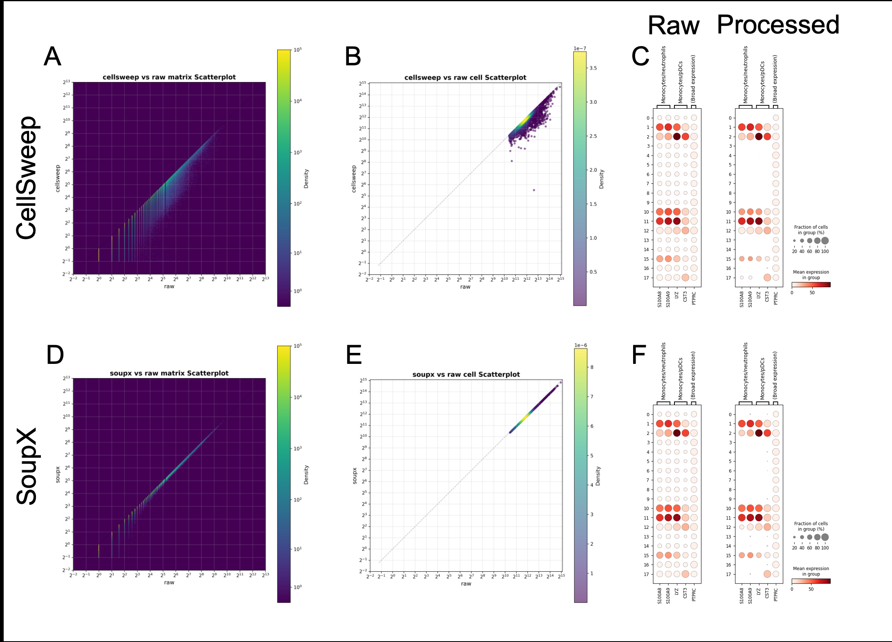
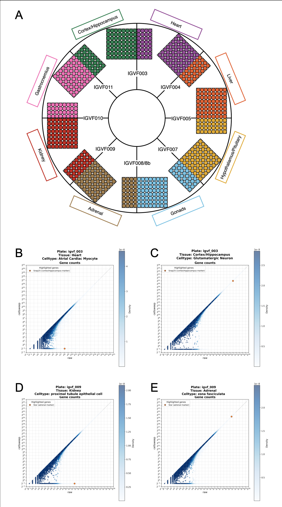
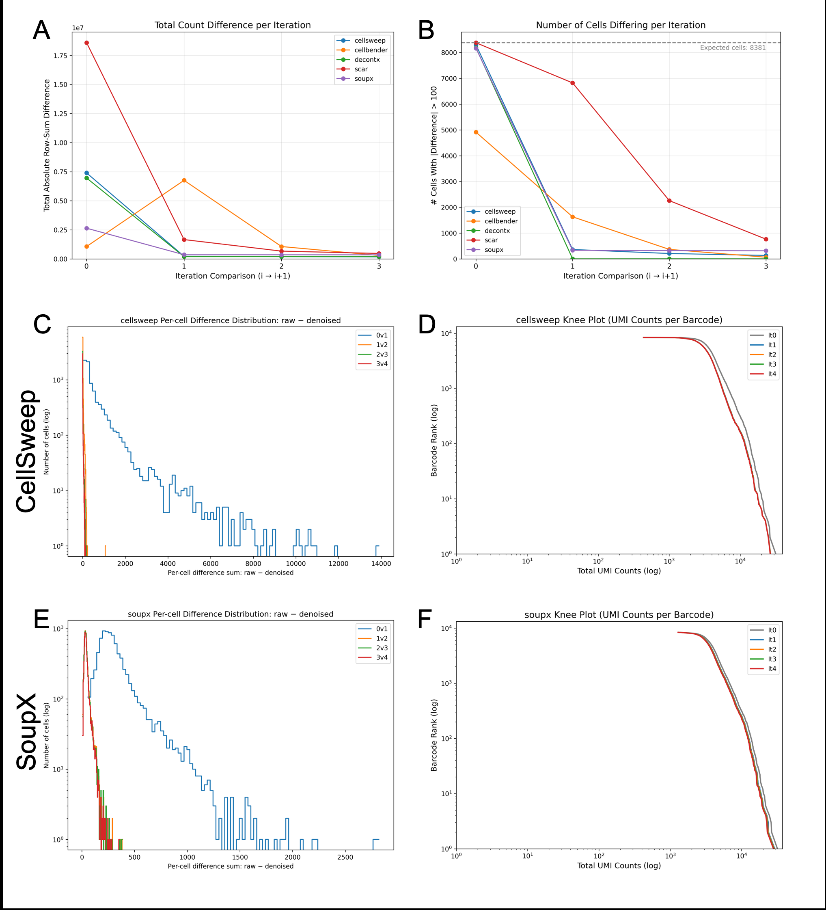
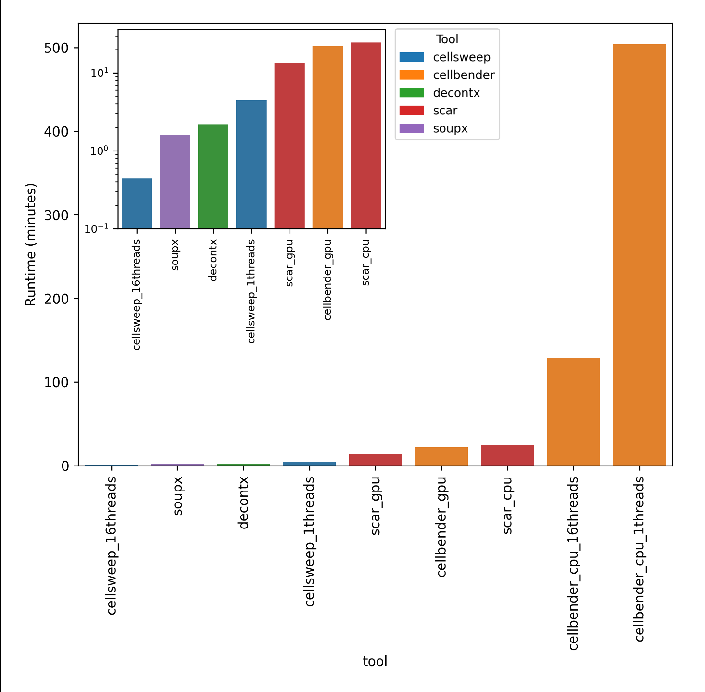
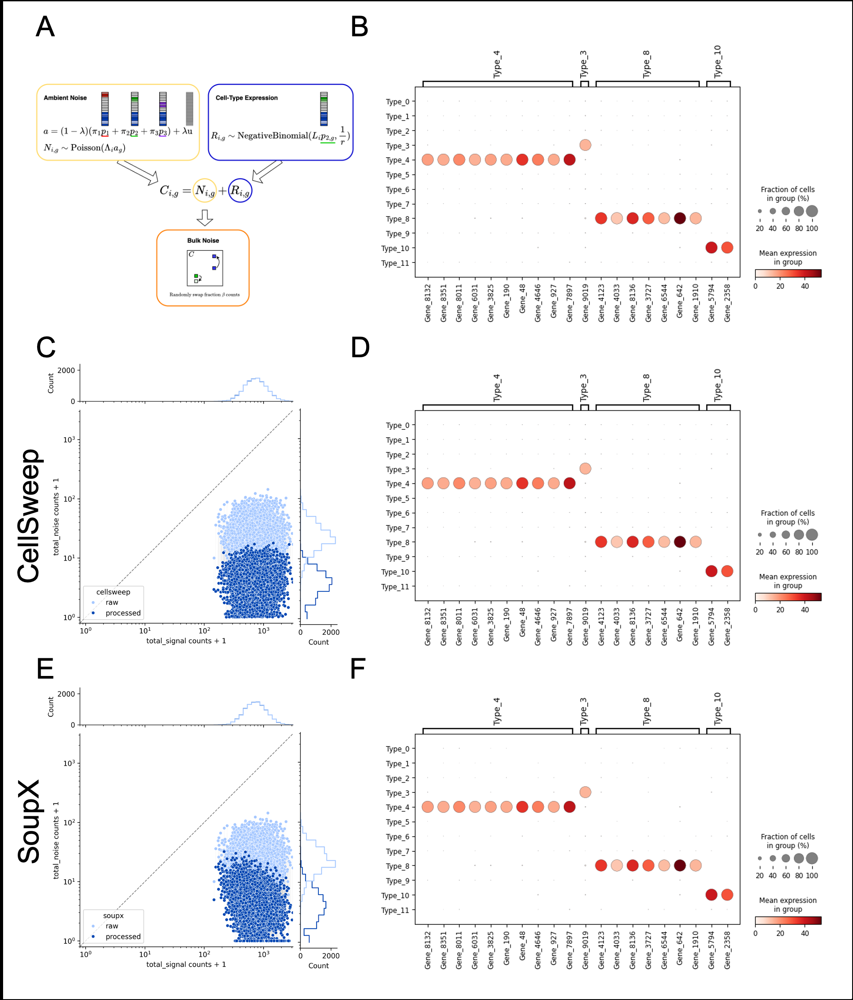

> **Reconstructed by a model.** `caskey-rich-2026-cellsweep.pdf` from [papers/caskey-rich-2026-cellsweep](https://doi.org/10.64898/2026.03.04.709349/) — papers · caskey-rich-2026-cellsweep, licensed CC BY 4.0. Converted 2026-10-02 from `.pdf`. The original is a PDF with no usable text layer. A model read the pages and wrote this markdown: the prose is a paraphrase in places and **every equation is unverified**. Treat it as a pointer into the original, never as a citable source.

# Caskey rich 2026 cellsweep

Split into 8 sections.

1. [Introduction](01-introduction.md)
2. [Introduction](02-introduction.md)
3. [Results](03-results.md)
4. [Discussion](04-discussion.md)
5. [Methods](05-methods.md)
6. [Initial Parameter Estimates](06-initial-parameter-estimates.md)
7. [Inference via Expectation–Maximization](07-inference-via-expectation-maximization.md)
8. [References](08-references.md)

## Figures

Extracted from the original PDF. They are listed by the page they came from rather
than placed in the text: the conversion does not record where on the page each one
sat.

---

[Up: contents](../index.md)
