> **Reconstructed by a model.** [`project/gilks.etal.1992.pdf`](https://github.com/berkeley-stat243/fall-2024/blob/9c62305d05fca31df0d9c6a3b68b350ad8722fee/project/gilks.etal.1992.pdf) — berkeley-stat243 · fall-2024, licensed CC BY 4.0. Converted 2026-09-18 from `.pdf`. The original is a PDF with no usable text layer. A model read the pages and wrote this markdown: the prose is a paraphrase in places and **every equation is unverified**. Treat it as a pointer into the original, never as a citable source.

# Adaptive Rejection Sampling for Gibbs Sampling

Split into 7 sections.

1. [Adaptive Rejection Sampling for Gibbs Sampling](01-adaptive-rejection-sampling-for-gibbs-sampling.md)
2. [1. Introduction](02-1-introduction.md)
3. [2. Adaptive Rejection Sampling](03-2-adaptive-rejection-sampling.md)
4. [3. Adaptive Rejection Sampling and Gibbs Sampling](04-3-adaptive-rejection-sampling-and-gibbs-sampling.md)
5. [4. Application to Monoclonal Antibody Reactivity](05-4-application-to-monoclonal-antibody-reactivity.md)
6. [5. Conclusions](06-5-conclusions.md)
7. [References](07-references.md)

## Figures

Extracted from the original PDF. They are listed by the page they came from rather
than placed in the text: the conversion does not record where on the page each one
sat.

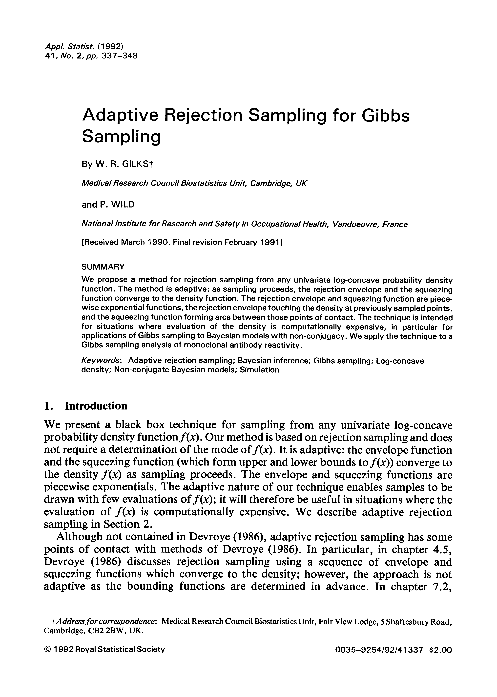

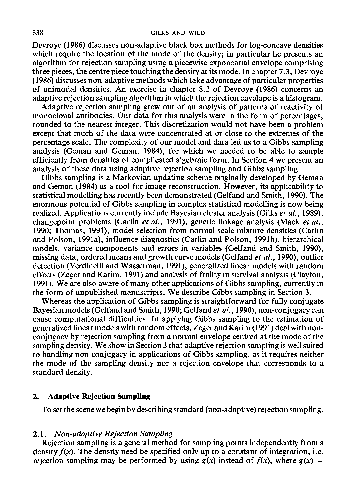

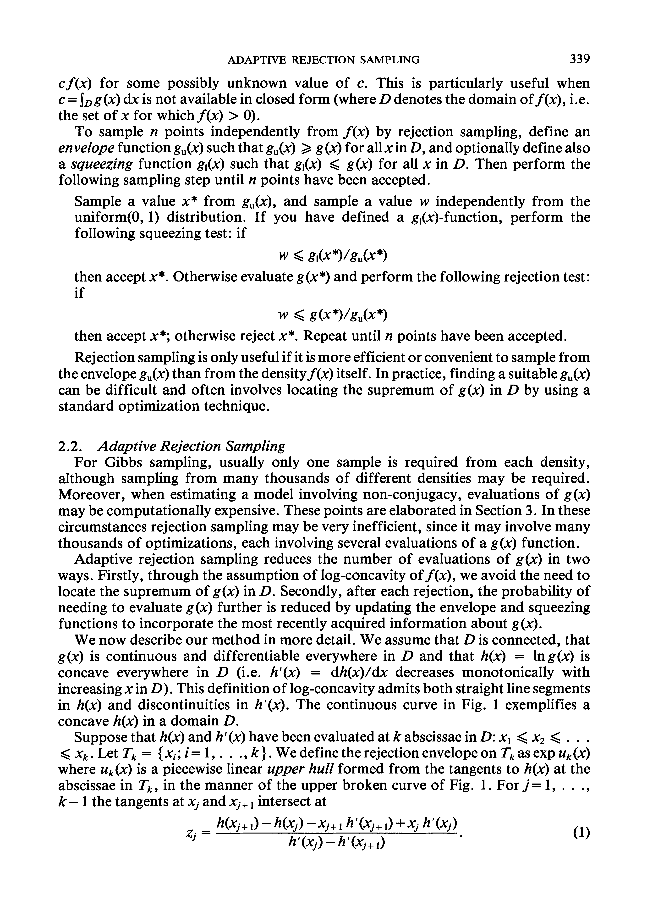

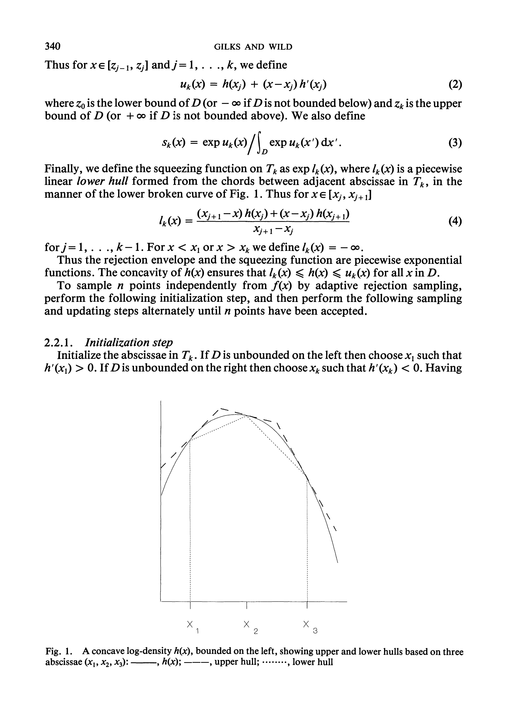

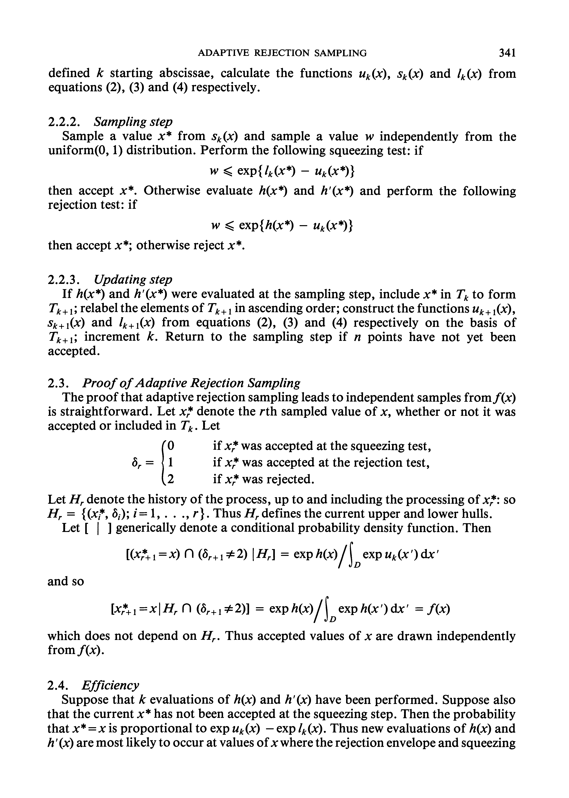

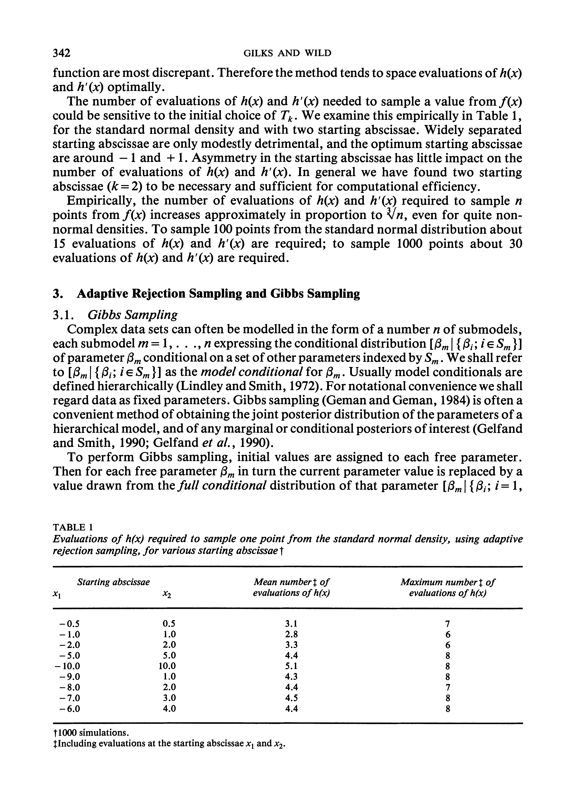

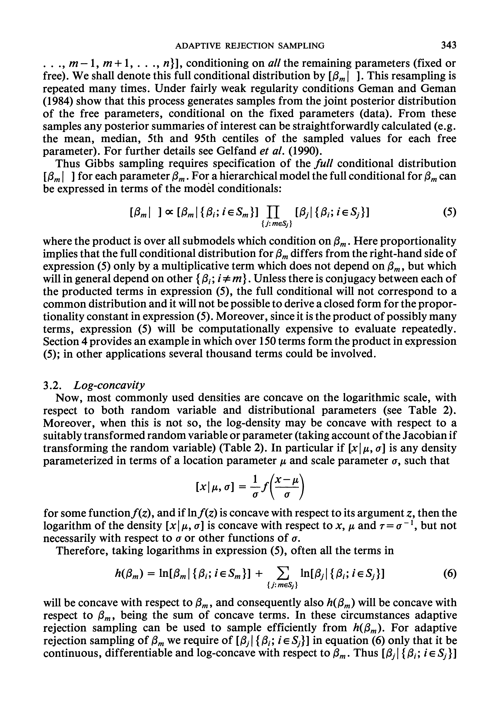

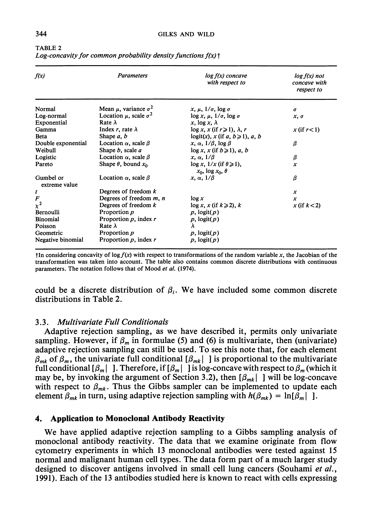

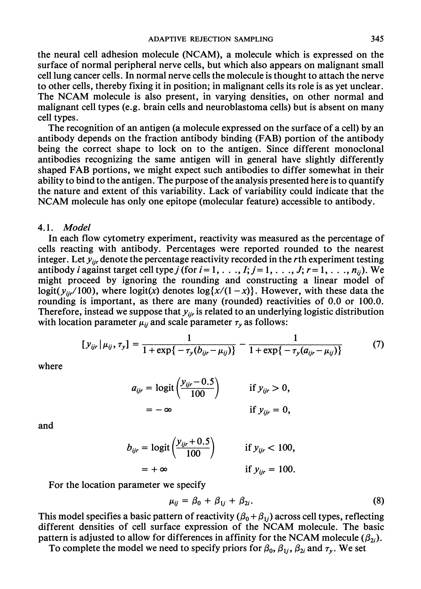

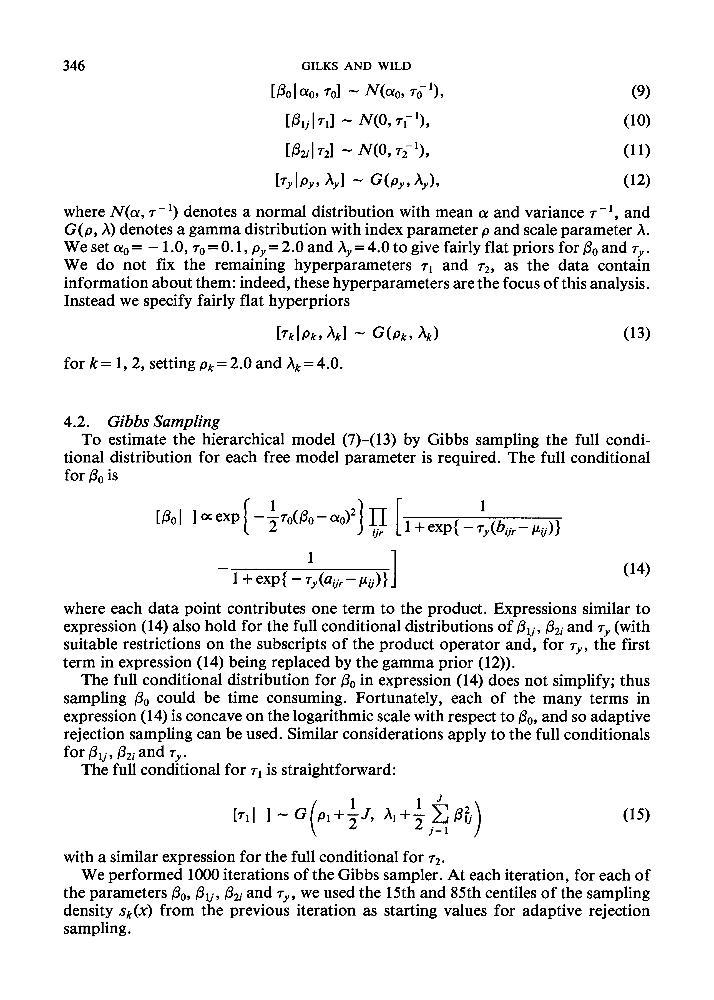

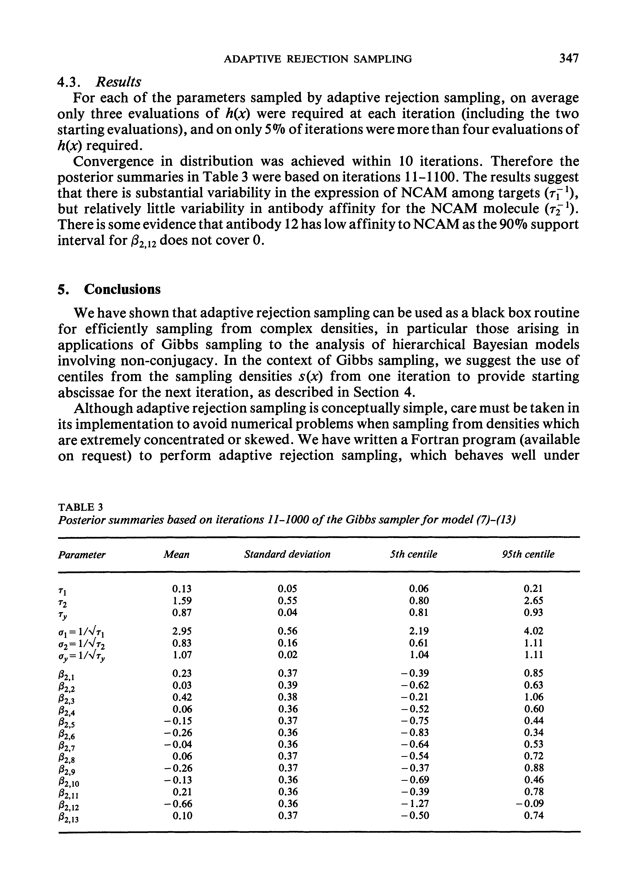

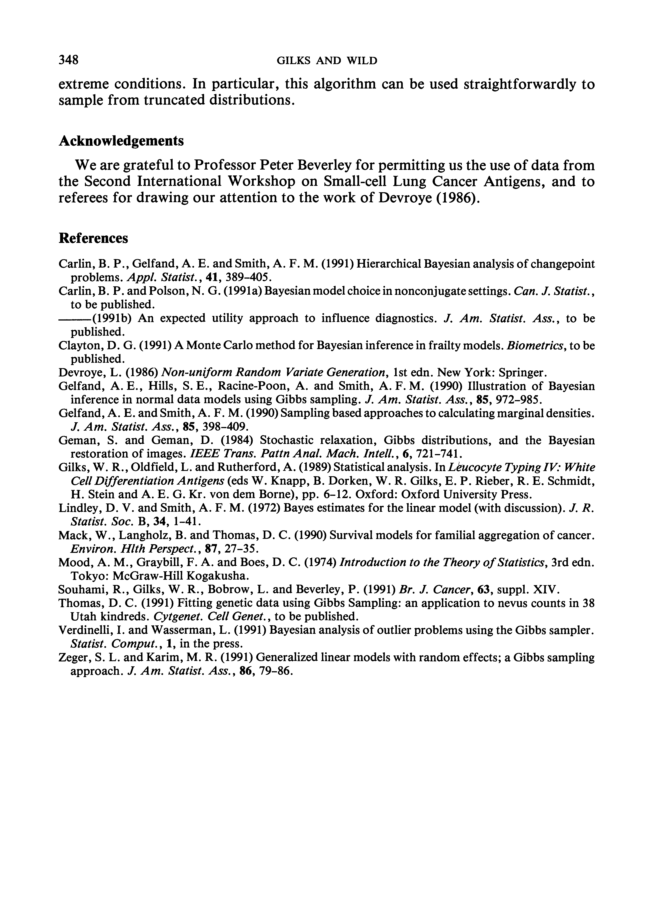

---

[Up: contents](../../index.md)
