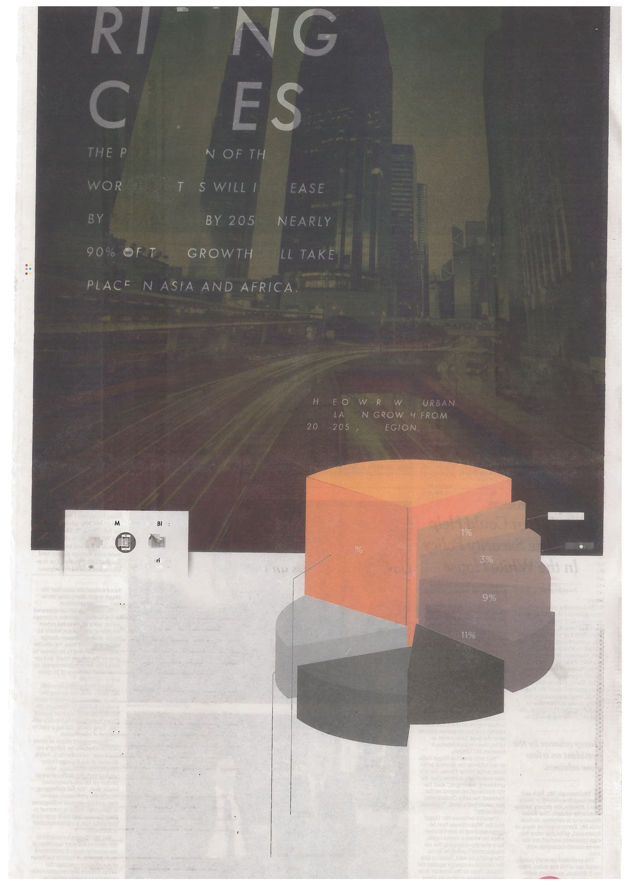
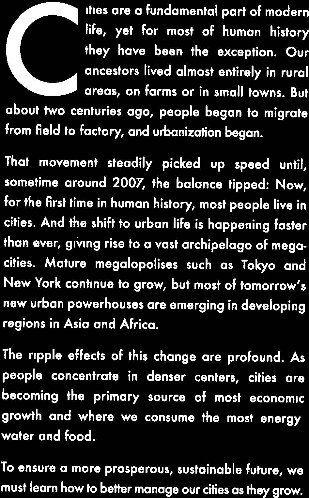

> **Reconstructed by a model.** [`units/graphics_files/shell.pdf`](https://github.com/berkeley-stat243/fall-2024/blob/9c62305d05fca31df0d9c6a3b68b350ad8722fee/units/graphics_files/shell.pdf) — berkeley-stat243 · fall-2024, licensed CC BY 4.0. Converted 2026-09-18 from `.pdf`. The original is a PDF with no usable text layer. A model read the pages and wrote this markdown: the prose is a paraphrase in places and **every equation is unverified**. Treat it as a pointer into the original, never as a citable source.

# RISING CITIES

THE POPULATION OF THE WORLD'S CITIES WILL INCREASE BY 2.7 BILLION BY 2050. NEARLY 90% OF THIS GROWTH WILL TAKE PLACE IN ASIA AND AFRICA.

SHARE OF WORLDWIDE URBAN POPULATION GROWTH FROM 2010-2050, BY REGION

DISCOVER MORE ON MOBILE

Download Blippar App
Fill Screen With Page
Experience The Future!

Cities are a fundamental part of modern life, yet for most of human history they have been the exception. Our ancestors lived almost entirely in rural areas, on farms or in small towns. But about two centuries ago, people began to migrate from field to factory, and urbanization began.

That movement steadily picked up speed until, sometime around 2007, the balance tipped: Now, for the first time in human history, most people live in cities. And the shift to urban life is happening faster than ever, giving rise to a vast archipelago of megacities. Mature megalopolises such as Tokyo and New York continue to grow, but most of tomorrow's new urban powerhouses are emerging in developing regions in Asia and Africa.

The ripple effects of this change are profound. As people concentrate in denser centers, cities are becoming the primary source of most economic growth and where we consume the most energy, water and food.

To ensure a more prosperous, sustainable future, we must learn how to better manage our cities as they grow.

* 29% SUB SAHARAN AFRICA
* 18% INDIA
* 17% OTHER ASIA & OCEANIA
* 13% CHINA
* 11% AMERICAS
* 8% MIDDLE EAST AND N. AFRICA
* 3% EUROPE
* 1% OTHERS

---

[Up: contents](../../index.md)

## Figures

Extracted from the original PDF. They are listed by the page they came from rather
than placed in the text: the conversion does not record where on the page each one
sat.

