> **Reconstructed by a model.** [`units/graphics_files/wainer1984.pdf`](https://github.com/berkeley-stat243/fall-2024/blob/9c62305d05fca31df0d9c6a3b68b350ad8722fee/units/graphics_files/wainer1984.pdf) — berkeley-stat243 · fall-2024, licensed CC BY 4.0. Converted 2026-09-18 from `.pdf`. The original is a PDF with no usable text layer. A model read the pages and wrote this markdown: the prose is a paraphrase in places and **every equation is unverified**. Treat it as a pointer into the original, never as a citable source.

# Commentaries

Commentaries are informative essays dealing with viewpoints of statistical practice, statistical education, and other topics considered to be of general interest to the board readership of *The American Statistician*. Commentaries are similar in spirit to Letters to the Editor, but they involve longer discussions of background, issues, and perspectives. All commentaries will be refereed for their merit and compatibility with these criteria.

## How to Display Data Badly

HOWARD WAINER\*

Methods for displaying data badly have been developing for many years, and a wide variety of interesting and inventive schemes have emerged. Presented here is a synthesis yielding the 12 most powerful techniques that seem to underlie many of the realizations found in practice. These 12 (the dirty dozen) are identified and illustrated.

KEY WORDS: Graphics; Data display; Data density; Data-ink ratio.

### 1. INTRODUCTION

The display of data is a topic of substantial contemporary interest and one that has occupied the thoughts of many scholars for almost 200 years. During this time there have been a number of attempts to codify standards of good practice (e.g., ASME Standards 1915; Cox 1978; Ehrenberg 1977) as well as a number of books that have illustrated them (i.e., Bertin 1973, 1977, 1981; Schmid 1954; Schmid and Schmid 1979; Tufte 1983). The last decade or so has seen a tremendous increase in the development of new display techniques and tools that have been reviewed recently (Macdonald-Ross 1977; Fienberg 1979; Cox 1978; Wainer and Thissen 1981). We wish to concentrate on methods of data display that leave the viewers as uninformed as they were before seeing the display or, worse, those that induce confusion. Although such techniques are broadly practiced, to my knowledge they have not as yet been gathered into a single source or carefully categorized. This article is the beginning of such a compendium.

The aim of good data graphics is to display data accurately and clearly. Let us use this definition as a starting point for categorizing methods of bad data display. The definition has three parts. These are (a) showing data, (b) showing data accurately, and (c) showing data clearly. Thus, if we wish to display data badly, we have three avenues to follow. Let us examine them in sequence, parse them into some of their component parts, and see if we can identify means for measuring the success of each strategy.

### 2. SHOWING DATA

Obviously, if the aim of a good display is to convey information, the less information carried in the display, the worse it is. Tufte (1983) has devised a scheme for measuring the amount of information in displays, called the data density index (ddi), which is "the number of numbers plotted per square inch." This easily calculated index is often surprisingly informative. In popular and technical media we have found a range from .1 to 362. This provides us with the first rule of bad data display.

*Rule 1—Show as Few Data as Possible (Minimize the Data Density)*

What does a data graphic with a ddi of .3 look like? Shown in Figure 1 is a graphic from the book *Social Indicators III* (*SI3*), originally done in four colors (original size 7" by 9") that contains 18 numbers ($18/63 = .3$). The median data graph in *SI3* has a data density of .6 numbers/$\text{in}^2$; this one is not an unusual choice. Shown in Figure 2 is a plot from the article by Friedman and Rafsky (1981) with a ddi of .5 (it shows 4 numbers in 8 $\text{in}^2$). This is unusual for *JASA*, where the median data graph has a ddi of 27. In defense of the producers of this plot, the point of the graph is to show that a method of analysis suggested by a critic of their paper was not fruitful. I suspect that prose would have worked pretty well also.

Although arguments can be made that high data density does not imply that a graphic will be good, nor one with low density bad, it does reflect on the efficiency of the transmission of information. Obviously, if we hold clarity and accuracy constant, more information is better than less. One of the great assets of graphical techniques is that they can convey large amounts of information in a small space.

We note that when a graph contains little or no information the plot can look quite empty (Figure 2) and thus raise suspicions in the viewer that there is nothing to be communicated. A way to avoid these suspicions is to fill up the plot with nondata figurations—what Tufte has termed "chartjunk." Figure 3 shows a plot of the labor productivity of Japan relative to that of the United States. It contains one number for each of three years. Obviously, a graph of such sparse information would have a lot of blank space, so filling the space hides the paucity of information from the reader.

A convenient measure of the extent to which this practice is in use is Tufte's "data-ink ratio." This measure is the ratio of the amount of ink used in graphing the data to the total amount of ink in the graph. The closer to zero this ratio gets, the worse the graph. The notion of the data-ink ratio brings us to the second principle of bad data display.

*Rule 2—Hide What Data You Do Show (Minimize the Data-Ink Ratio)*

One can hide data in a variety of ways. One method that occurs with some regularity is hiding the data in the grid. The grid is useful for plotting the points, but only rarely afterwards. Thus to display data badly, use a fine grid and plot the points dimly (see Tufte 1983, pp. 94–95 for one repeated version of this).

A second way to hide the data is in the scale. This corresponds to blowing up the scale (i.e., looking at the data from far away) so that any variation in the data is obscured by the magnitude of the scale. One can justify this practice by appealing to "honesty requires that we start the scale at zero," or other sorts of sophistry.

In Figure 4 is a plot that (from *SI3*) effectively hides the growth of private schools in the scale. A redrawing of the number of private schools on a different scale conveys the growth that took place during the mid-1950's (Figure 5). The relationship between this rise and *Brown vs. Topeka School Board* becomes an immediate question.

To conclude this section, we have seen that we can display data badly either by not including them (Rule 1) or by hiding them (Rule 2). We can measure the extent to which we are successful in excluding the data through the data density; we can sometimes convince viewers that we have included the data through the incorporation of chartjunk. Hiding the data can be done either by using an overabundance of chartjunk or by cleverly choosing the scale so that the data disappear. A measure of the success we have achieved in hiding the data is through the data-ink ratio.

### 3. SHOWING DATA ACCURATELY

The essence of a graphic display is that a set of numbers having both magnitudes and an order are represented by an appropriate visual metaphor—the magnitude and order of the metaphorical representation match the numbers. We can display data badly by ignoring or distorting this concept.

*Rule 3—Ignore the Visual Metaphor Altogether*

If the data are ordered and if the visual metaphor has a natural order, a bad display will surely emerge if you shuffle the relationship. In Figure 6 note that the bar labeled 14.1 is longer than the bar labeled 18. Another method is to change the meaning of the metaphor in the middle of the plot. In Figure 7 the dark shading represents imports on one side and exports on the other. This is but one of the problems of this graph; more serious still is the change of scale. There is also a difference in the time scale, but that is minor. A common theme in Playfair's (1786) work was the difference between imports and exports. In Figure 8, a 200-year-old graph tells the story clearly. Two such plots would have illustrated the story surrounding this graph quite clearly.

*Rule 4—Only Order Matters*

One frequent trick is to use length as the visual metaphor when area is what is perceived. This was used quite effectively by *The Washington Post* in Figure 9. Note that this graph also has a low data density (.1), and its data-ink ratio is close to zero. We can also calculate Tufte's (1983) measure of perceptual distortion (PD) for this graph. The PD in this instance is the perceived change in the value of the dollar from Eisenhower to Carter divided by the actual change. I read and measure thus:

$$\text{Actual} = \frac{1.00 - .44}{.44} = 1.27 \qquad \text{Measured} = \frac{22.00 - 2.06}{2.06} = 9.68$$

$$\text{PD} = 9.68 / 1.27 = 7.62$$

This distortion of over 700% is substantial but by no means a record.

A less distorted view of these data is provided in Figure 10. In addition, the spacing suggested by the presidential faces is made explicit on the time scale.

*Rule 5—Graph Data Out of Context*

Often we can modify the perception of the graph (particularly for time series data) by choosing carefully the interval displayed. A precipitous drop can disappear if we choose a starting date just after the drop. Similarly, we can turn slight meanders into sharp changes by focusing on a single meander and expanding the scale. Often the choice of scale is arbitrary but can have profound effects on the perception of the display. Figure 11 shows a famous example in which President Reagan gives an out-of-context view of the effects of his tax cut. The *Times'* alternative provides the context for a deeper understanding. Simultaneously omitting the context as well as any quantitative scale is the key to the practice of Ordinal Graphics (see also Rule 4). Automatic rules do not always work, and wisdom is always required.

In Section 3 we discussed three rules for the accurate display of data. One can compromise accuracy by ignoring visual metaphors (Rule 3), by only paying attention to the order of the numbers and not their magnitude (Rule 4), or by showing data out of context (Rule 5). We advocated the use of Tufte's measure of perceptual distortion as a way of measuring the extent to which the accuracy of the data has been compromised by the display. One can think of modifications that would allow it to be applied in other situations, but we leave such expansion to other accounts.

### 4. SHOWING DATA CLEARLY

In this section we discuss methods for badly displaying data that do not seem as serious as those described previously; that is, the data are displayed, and they might even be accurate in their portrayal. Yet subtle (and not so subtle) techniques can be used to effectively obscure the most meaningful or interesting aspects of the data. It is more difficult to provide objective measures of presentational clarity, but we rely on the reader to judge from the examples presented.

*Rule 6—Change Scales in Mid-Axis*

This is a powerful technique that can make large differences look small and make exponential changes look linear.

In Figure 12 is a graph that supports the associated story about the skyrocketing circulation of *The New York Post* compared to the plummeting *Daily News* circulation. The reason given is that New Yorkers "trust" the *Post*. It takes a careful look to note the 700,000 jump that the scale makes between the two lines.

In Figure 13 is a plot of physicians' incomes over time. It appears to be linear, with a slight tapering off in recent years. A careful look at the scale shows that it starts out plotting every eight years and ends up plotting yearly. A more regular scale (in Figure 14) tells quite a different story.

*Rule 7—Emphasize the Trivial (Ignore the Important)*

Sometimes the data that are to be displayed have one important aspect and others that are trivial. The graph can be made worse by emphasizing the trivial part. In Figure 15 we have a page from *SI3* that compares the income levels of men and women by educational levels. It reveals the not surprising result that better educated individuals are paid better than more poorly educated ones and that changes across time expressed in constant dollars are reasonably constant. The comparison of greatest interest and current concern, comparing salaries between sexes within education level, must be made clumsily by vertically transposing from one graph to another. It seems clear that Rule 7 must have been operating here, for it would have been easy to place the graphs side by side and allow the comparison of interest to be made more directly. Looking at the problem from a strictly data-analytic point of view, we note that there are two large main effects (education and sex) and a small time effect. This would have implied a plot that showed the large effects clearly and placed the smallish time trend into the background (Figure 16).

*Rule 8—Jiggle the Baseline*

Making comparisons is always aided when the quantities being compared start from a common base. Thus we can always make the graph worse by starting from different bases. Such schemes as the hanging or suspended rootogram and the residual plot are meant to facilitate comparisons. In Figure 17 is a plot of U.S. imports of red meat taken from the *Handbook of Agricultural Charts* published by the U.S. Department of Agriculture. Shading beneath each line is a convention that indicates summation, telling us that the amount of each kind of meat is added to the amounts below it. Because of the dominance of and the fluctuations in importation of beef and veal, it is hard to see what the changes are in the other kinds of meat—Is the importation of pork increasing? Decreasing? Staying constant? The only purpose for stacking is to indicate graphically the total summation. This is easily done through the addition of another line for TOTAL. Note that a TOTAL will always be clear and will never intersect the other lines on the plot. A version of these data is shown in Figure 18 with the separate amounts of each meat, as well as a summation line, shown clearly. Note how easily one can see the structure of import of each kind of meat now that the standard of comparison is a straight line (the time axis) and no longer the import amount of those meats with greater volume.

*Rule 9—Austria First!*

Ordering graphs and tables alphabetically can obscure structure in the data that would have been obvious had the display been ordered by some aspect of the data. One can defend oneself against criticisms by pointing out that alphabetizing "aids in finding entries of interest." Of course, with lists of modest length such aids are unnecessary; with longer lists the indexing schemes common in 19th century statistical atlases provide easy lookup capability.

Figure 19 is another graph from *SI3* showing life expectancies, divided by sex, in 10 industrialized nations. The order of presentation is alphabetical (with the USSR positioned as Russia). The message we get is that there is little variation and that women live longer than men. Redone as a stem-and-leaf diagram (Figure 20 is simply a reordering of the data with spacing proportional to the numerical differences), the magnitude of the sex difference leaps out at us. We also note that the USSR is an outlier for men.

*Rule 10—Label (a) Illegibly, (b) Incompletely, (c) Incorrectly, and (d) Ambiguously*

There are many instances of labels that either do not tell the whole story, tell the wrong story, tell two or more stories, or are so small that one cannot figure out what story they are telling. One of my favorite examples of small labels is from *The New York Times* (August 1978), in which the article complains that fare cuts lower commission payments to travel agents. The graph (Figure 21) supports this view until one notices the tiny label indicating that the small bar showing the decline is for just the first half of 1978. This omits such heavy travel periods as Labor Day, Thanksgiving, Christmas, and so on, so that merely doubling the first-half data is probably not enough. Nevertheless, when this bar is doubled (Figure 22), we see that the agents are doing very well indeed compared to earlier years.

*Rule 11—More Is Murkier: (a) More Decimal Places and (b) More Dimensions*

We often see tables in which the number of decimal places presented is far beyond the number that can be perceived by a reader. They are also commonly presented to show more accuracy than is justified. A display can be made clearer by presenting less. In Table 1 is a section of a table from Dhariyal and Dudewicz's (1981) JASA paper. The table entries are presented to five decimal places! In Table 2 is a heavily rounded version that shows what the authors intended clearly. It also shows that the various columns might have a substantial redundancy in them (the maximum expected gain with $b/c = 10$ is about 1/10th that of $b/c = 100$ and 1/100th that of $b/c = 1,000$). If they do, the entire table could have been reduced substantially.

Just as increasing the number of decimal places can make a table harder to understand, so can increasing the number of dimensions make a graph more confusing. We have already seen how extra dimensions can cause ambiguity (Is it length or area or volume?). In addition, human perception of areas is inconsistent. Just what is confusing and what is not is sometimes only a conjecture, yet a hint that a particular configuration will be confusing is obtained if the display confused the grapher. Shown in Figure 23 is a plot of per share earnings and dividends over a six-year period. We note (with some amusement) that 1975 is the side of a bar—the third dimension of this bar (rectangular parallelopiped?) chart has confused the artist! I suspect that 1975 is really what is labeled 1976, and the unlabeled bar at the end is probably 1977. A simple line chart with this interpretation is shown in Figure 24.

Table 1. *Optimal Selection From a Finite Sequence With Sampling Cost*

| | $b/c = 10.0$ | | $100.0$ | | $1,000.0$ | |
| :---: | :---: | :---: | :---: | :---: | :---: | :---: |
| $N$ | $r^*$ | $(G_N(r^*) - a)/c$ | $r^*$ | $(G_N(r^*) - a)/c$ | $r^*$ | $(G_N(r^*) - a)/c$ |
| 3 | 2 | .20000 | 2 | 2.22500 | 2 | 22.47499 |
| 4 | 2 | .26333 | 2 | 2.88833 | 2 | 29.13832 |
| 5 | 2 | .32333 | 3 | 3.54167 | 3 | 35.79166 |
| 6 | 3 | .38267 | 3 | 4.23767 | 3 | 42.78764 |
| 7 | 3 | .44600 | 3 | 4.90100 | 3 | 49.45097 |
| 8 | 3 | .50743 | 4 | 5.57650 | 4 | 56.33005 |
| 9 | 3 | .56743 | 4 | 6.26025 | 4 | 63.20129 |
| 10 | 4 | .62948 | 4 | 6.92358 | 4 | 69.86462 |

NOTE: $g(Xs + r - 1) = bR(Xs + r - 1) + a$, if $S = s$, and $g(Xs + r - 1) = 0$, otherwise.
Source: Dhariyal and Dudewicz (1981).

Table 2. *Optimal Selection From a Finite Sequence With Sampling Cost (revised)*

| | $b/c = 10$ | | $b/c = 100$ | | $b/c = 1,000$ | |
| :---: | :---: | :---: | :---: | :---: | :---: | :---: |
| $N$ | $r^*$ | $G$ | $r^*$ | $G$ | $r^*$ | $G$ |
| 3 | 2 | .2 | 2 | 2.2 | 2 | 22 |
| 4 | 2 | .3 | 2 | 2.9 | 2 | 29 |
| 5 | 2 | .3 | 3 | 3.5 | 3 | 36 |
| 6 | 3 | .4 | 3 | 4.2 | 3 | 43 |
| 7 | 3 | .4 | 3 | 4.9 | 3 | 49 |
| 8 | 3 | .5 | 4 | 5.6 | 4 | 56 |
| 9 | 3 | .6 | 4 | 6.3 | 4 | 63 |
| 10 | 4 | .6 | 4 | 6.9 | 4 | 70 |

NOTE: $g(Xs + r - 1) = bR(Xs + r - 1) + a$, if $S = s$, and $g(Xs + r - 1) = 0$, otherwise.

In Section 4 we illustrate six more rules for displaying data badly. These rules fall broadly under the heading of how to obscure the data. The techniques mentioned were to change the scale in mid-axis, emphasize the trivial, jiggle the baseline, order the chart by a characteristic unrelated to the data, label poorly, and include more dimensions or decimal places than are justified or needed. These methods will work separately or in combination with others to produce graphs and tables of little use. Their common effect will usually be to leave the reader uninformed about the points of interest in the data, although sometimes they will misinform us; the physicians' income plot in Figure 13 is a prime example of misinformation.

Finally, the availability of color usually means that there are additional parameters that can be misused. The U.S. Census' two-variable color map is a wonderful example of how using color in a graph can seduce us into thinking that we are communicating more than we are (see Fienberg 1979; Wainer and Francolini 1980; Wainer 1981). This leads us to the last rule.

*Rule 12—If It Has Been Done Well in the Past, Think of Another Way to Do It*

The two-variable color map was done rather well by Mayr (1874), 100 years before the U.S. Census version. He used bars of varying width and frequency to accomplish gracefully what the U.S. Census used varying saturations to do clumsily.

A particularly enlightening experience is to look carefully through the six books of graphs that William Playfair published during the period 1786–1822. One discovers clear, accurate, and data-laden graphs containing many ideas that are useful and too rarely applied today. In the course of preparing this article, I spent many hours looking at a variety of attempts to display data. Some of the horrors that I have presented were the fruits of that search. In addition, jewels sometimes emerged. I saved the best for last, and will conclude with one of those jewels—my nominee for the title of "World's Champion Graph." It was produced by Minard in 1861 and portrays the devastating losses suffered by the French army during the course of Napoleon's ill-fated Russian campaign of 1812. This graph (originally in color) appears in Figure 25 and is reproduced from Tufte's book (1983, p. 40). His narrative follows.

> Beginning at the left on the Polish-Russian border near the Niemen River, the thick band shows the size of the army (422,000 men) as it invaded Russia in June 1812. The width of the band indicates the size of the army at each place on the map. In September, the army reached Moscow, which was by then sacked and deserted, with 100,000 men. The path of Napoleon's retreat from Moscow is depicted by the darker, lower band, which is linked to a temperature scale and dates at the bottom of the chart. It was a bitterly cold winter, and many froze on the march out of Russia. As the graphic shows, the crossing of the Berezina River was a disaster, and the army finally struggled back to Poland with only 10,000 men remaining. Also shown are the movements of auxiliary troops, as they sought to protect the rear and flank of the advancing army. Minard's graphic tells a rich, coherent story with its multivariate data, far more enlightening than just a single number bouncing along over time. Six variables are plotted: the size of the army, its location on a two-dimensional surface, direction of the army's movement, and temperature on various dates during the retreat from Moscow.

It may well be the best statistical graphic ever drawn.

### 5. SUMMING UP

Although the tone of this presentation tended to be light and pointed in the wrong direction, the aim is serious. There are many paths that one can follow that will cause deteriorating quality of our data displays; the 12 rules that we described were only the beginning. Nevertheless, they point clearly toward an outlook that provides many hints for good display. The measures of display described are interlocking. The data density cannot be high if the graph is cluttered with chartjunk; the data-ink ratio grows with the amount of data displayed; perceptual distortion manifests itself most frequently when additional dimensions or worthless metaphors are included. Thus, the rules for good display are quite simple. Examine the data carefully enough to know what they have to say, and then let them say it with a minimum of adornment. Do this while following reasonable regularity practices in the depiction of scale, and label clearly and fully. Last, and perhaps most important, spend some time looking at the work of the masters of the craft. An hour spent with Playfair or Minard will not only benefit your graphical expertise but will also be enjoyable. Tukey (1977) offers 236 graphs and little chartjunk. The work of Francis Walker (1894) concerning statistical maps is clear and concise, and it is truly a mystery that their current counterparts do not make better use of the schema developed a century and more ago.

[Received September 1982. Revised September 1983.]

### REFERENCES

BERTIN, J. (1973), *Semiologie Graphique* (2nd ed.), The Hague: Mouton-Gautier.
—— (1977), *La Graphique et le Traitement Graphique de l'Information*, France: Flammarion.
—— (1981), *Graphics and the Graphical Analysis of Data*, translation, W. Berg, tech. ed., H. Wainer, Berlin: DeGruyter.
COX, D. R. (1978), "Some Remarks on the Role in Statistics of Graphical Methods," *Applied Statistics*, 27, 4–9.
DHARIYAL, I. D., and DUDEWICZ, E. J. (1981), "Optimal Selection From a Finite Sequence With Sampling Cost," *Journal of the American Statistical Association*, 76, 952–959.
EHRENBERG, A. S. C. (1977), "Rudiments of Numeracy," *Journal of the Royal Statistical Society*, Ser. A, 140, 277–297.
FIENBERG, S. E. (1979), *Graphical Methods in Statistics*, The American Statistician, 33, 165–178.
FRIEDMAN, J. H., and RAFSKY, L. C. (1981), "Graphics for the Multivariate Two-Sample Problem," *Journal of the American Statistical Association*, 76, 277–287.
JOINT COMMITTEE ON STANDARDS FOR GRAPHIC PRESENTATION, PRELIMINARY REPORT (1915), *Journal of the American Statistical Association*, 14, 790–797.
MACDONALD-ROSS, M. (1977), "How Numbers Are Shown: A Review of Research on the Presentation of Quantitative Data in Texts," *Audiovisual Communications Review*, 25, 359–409.
MAYR, G. VON (1874), "Gutachen Über die Anwendung der Graphischen und Geographischen," *Method in der Statistik*, Munich.
MINARD, C. J. (1845–1869), *Tableaus Graphiques et Cartes Figuratives de M. Minard*, Bibliothèque de l'École Nationale des Ponts et Chaussées, Paris.
PLAYFAIR, W. (1786), *The Commercial and Political Atlas*, London: Corry.
SCHMID, C. F. (1954), *Handbook of Graphic Presentation*, New York: Ronald Press.
SCHMID, C. F., and SCHMID, S. E. (1979), *Handbook of Graphic Presentation* (2nd ed.), New York: John Wiley.
TUFTE, E. R. (1977), "Improving Data Display," University of Chicago, Dept. of Statistics.
—— (1983), *The Visual Display of Quantitative Information*, Cheshire, Conn.: Graphics Press.
TUKEY, J. W. (1977), *Exploratory Data Analysis*, Reading, Mass.: Addison-Wesley.
WAINER, H. (1980), "Making Newspaper Graphs Fit to Print," in *Processing of Visible Language*, Vol. 2, eds. H. Bouma, P. A. Kolers, and M. E. Wrolsted, New York: Plenum, 125–142.
——, "Reply" to Meyer and Abt (1981), *The American Statistician*, 57.
—— (1983), "How Are We Doing? A Review of Social Indicators III," *Journal of the American Statistical Association*, 78, 492–496.
WAINER, H., and FRANCOLINI, C. (1980), "An Empirical Inquiry Concerning Human Understanding of Two-Variable Color Maps," *The American Statistician*, 34, 81–93.
WAINER, H., and THISSEN, D. (1981), "Graphical Data Analysis," *Annual Review of Psychology*, 32, 191–241.
WALKER, F. A. (1894), *Statistical Atlas of the United States Based on the Results of the Ninth Census*, Washington, D.C.: U.S. Bureau of the Census.

---

\*Howard Wainer is Senior Research Scientist, Educational Testing Service, Princeton, NJ 08541. This is the text of an invited address to the American Statistical Association. It was supported in part by the Program Statistics Research Project of the Educational Testing Service. The author would like to express his gratitude to the numerous friends and colleagues who read or heard this article and offered valuable suggestions for its improvement. Especially helpful were David Andrews, Paul Holland, Bruce Kaplan, James O. Ramsay, Edward Tufte, the participants in the Stanford Workshop on Advanced Graphical Presentation, two anonymous referees, the long-suffering associate editor, and Gary Koch.

---

[Up: contents](../../index.md)

## Figures

Extracted from the original PDF. They are listed by the page they came from rather
than placed in the text: the conversion does not record where on the page each one
sat.

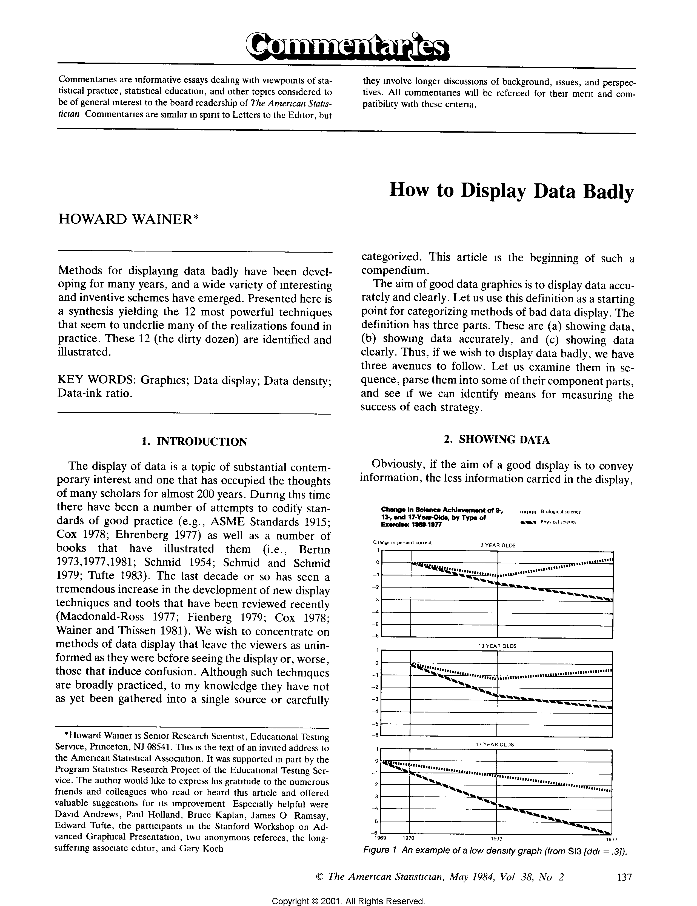

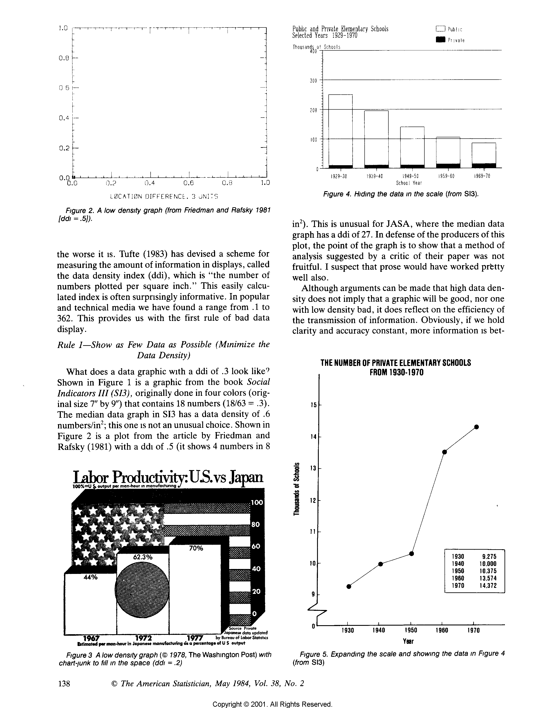

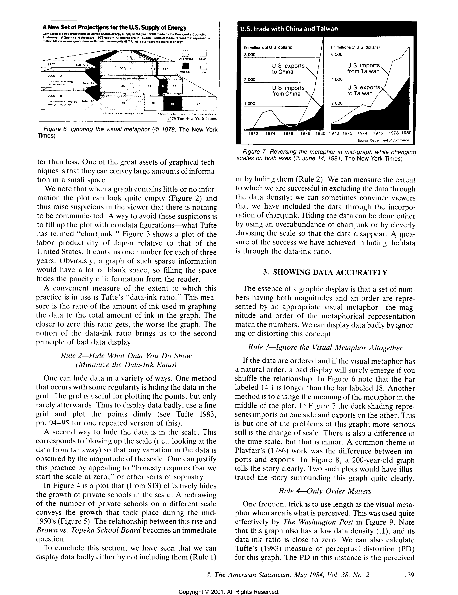

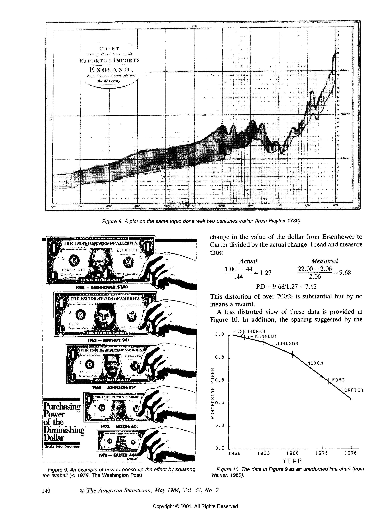

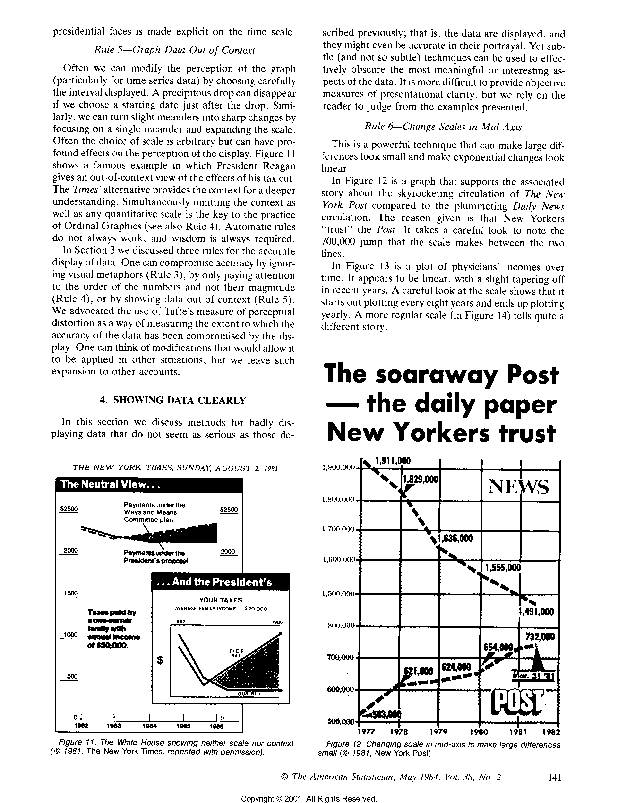

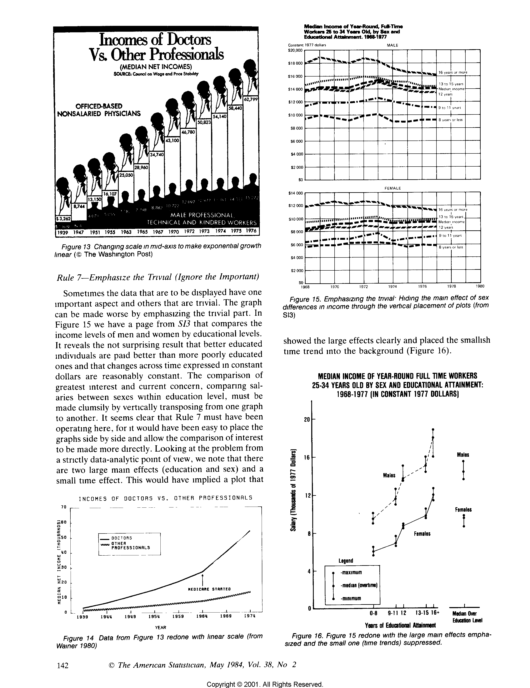

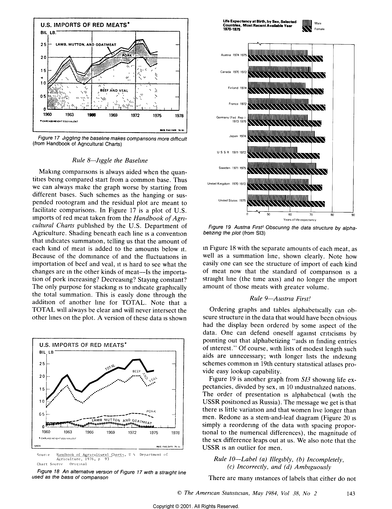

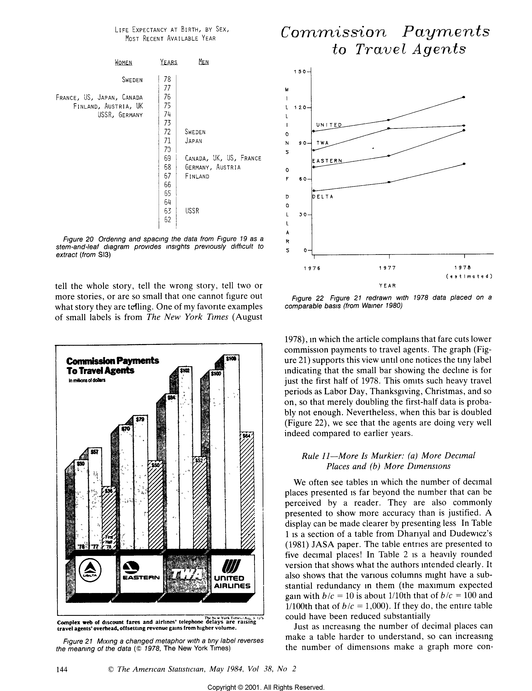

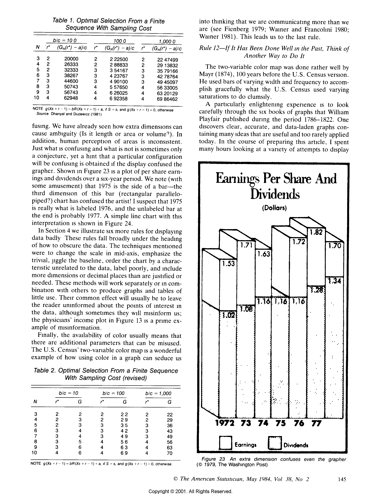

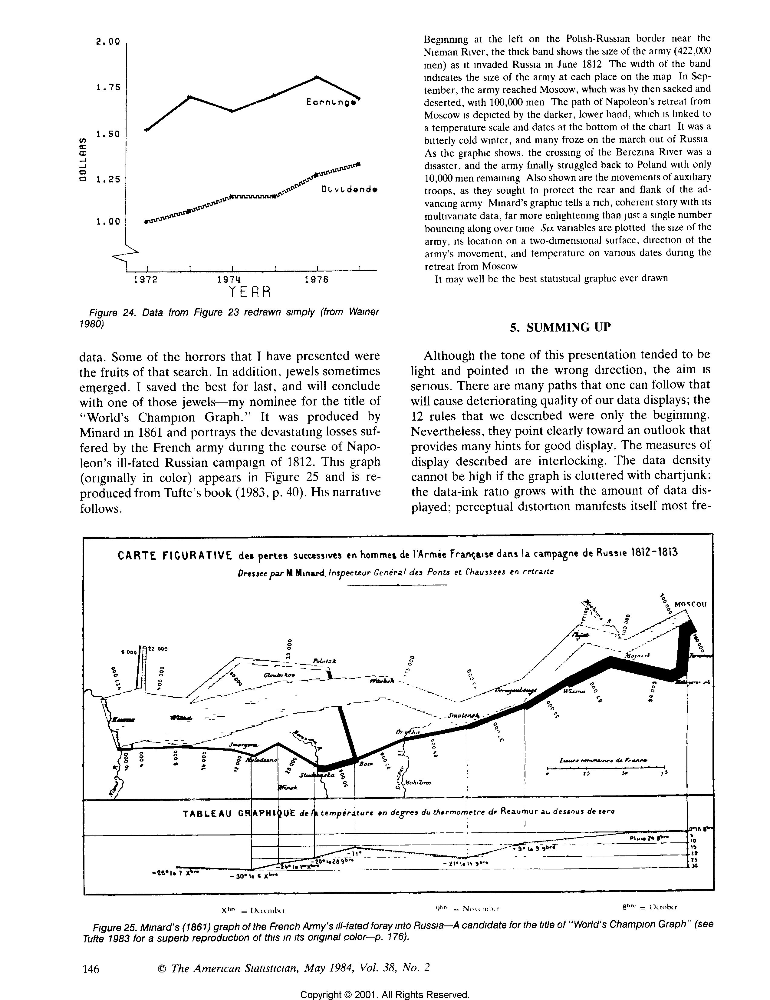

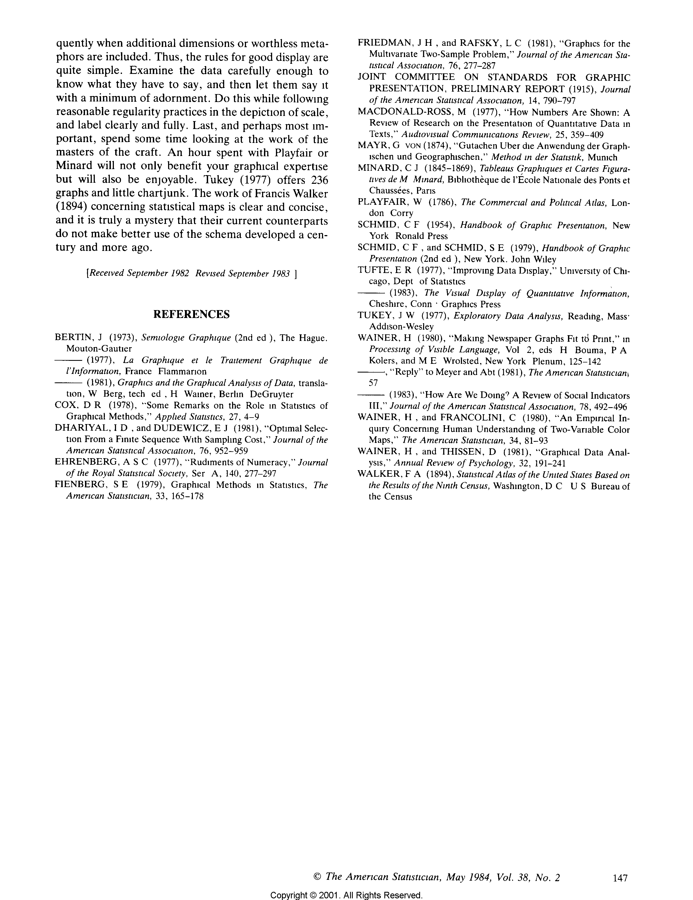

