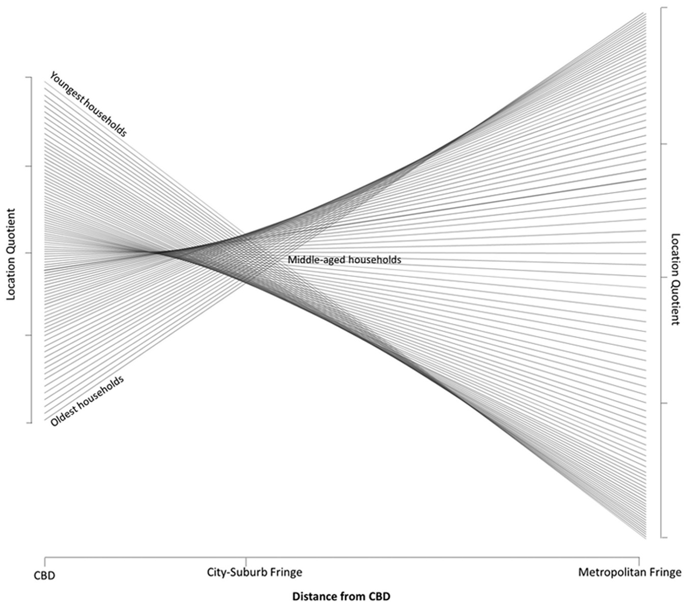
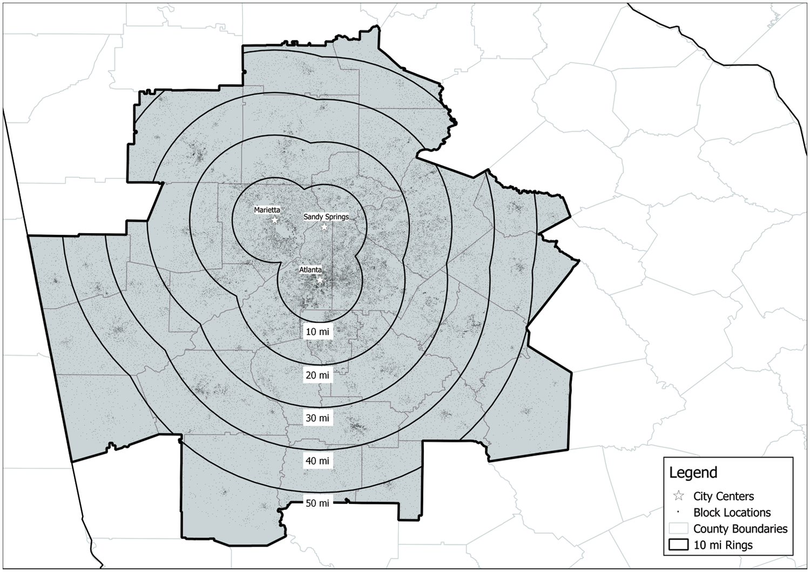
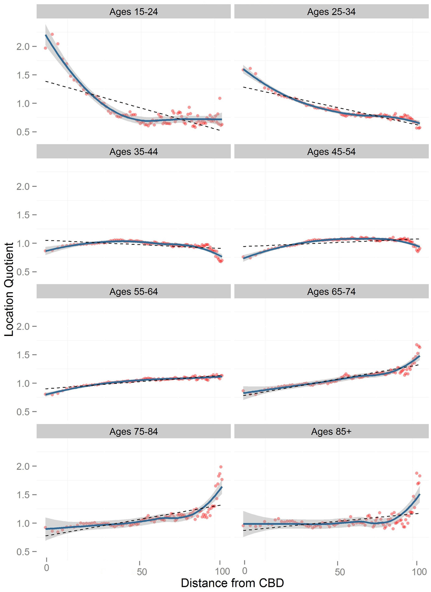
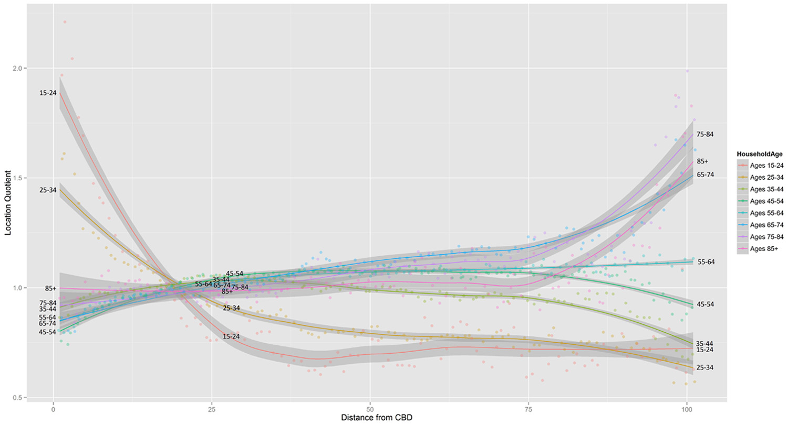
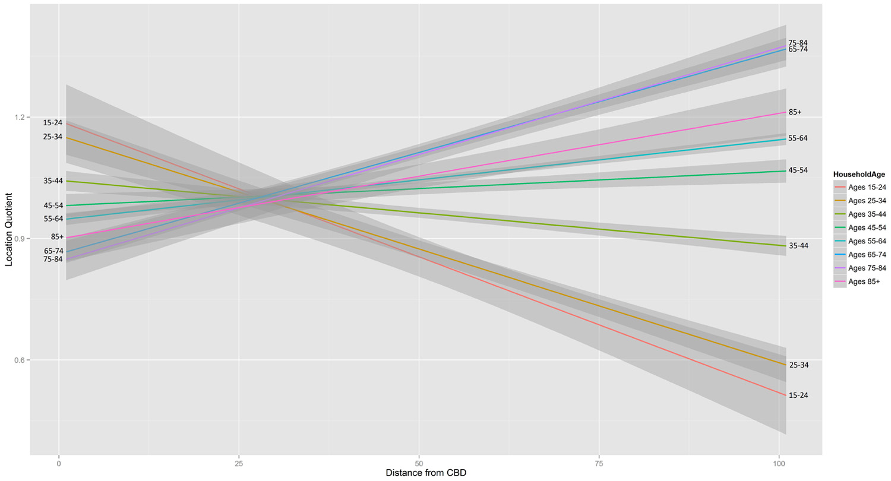

> **Reconstructed by a model.** [`ps/clm.pdf`](https://github.com/berkeley-stat243/stat243-fall-2021/blob/c918dcc56a197cc539e270f1f7d076010b175c52/ps/clm.pdf) — berkeley-stat243 · stat243-fall-2021, licensed CC0-1.0. Converted 2026-09-18 from `.pdf`. The original is a PDF with no usable text layer. A model read the pages and wrote this markdown: the prose is a paraphrase in places and **every equation is unverified**. Treat it as a pointer into the original, never as a citable source.

# Abstract

Split into 15 sections.

1. [Abstract](01-abstract.md)
2. [Introduction](02-introduction.md)
3. [Why families move](03-why-families-move.md)
4. [The lifecycle approach to residential mobility](04-the-lifecycle-approach-to-residential-mobility.md)
5. [Application of a lifecycle-inspired approach in modelling household sorting patterns](05-application-of-a-lifecycle-inspired-approach-in-modelling-ho.md)
6. [Relaxing the phasic model](06-relaxing-the-phasic-model.md)
7. [The Cohort Location Model (CLM)](07-the-cohort-location-model-clm.md)
8. [Data preparation](08-data-preparation.md)
9. [Computation of the location quotient](09-computation-of-the-location-quotient.md)
10. [Results](10-results.md)
11. [Differences in smoothed pattern lines](11-differences-in-smoothed-pattern-lines.md)
12. [Changes and differences in linear patterns](12-changes-and-differences-in-linear-patterns.md)
13. [Conclusion and discussion](13-conclusion-and-discussion.md)
14. [Reproducing this work](14-reproducing-this-work.md)
15. [References](15-references.md)

## Figures

Extracted from the original PDF. They are listed by the page they came from rather
than placed in the text: the conversion does not record where on the page each one
sat.

---

[Up: contents](../../index.md)
