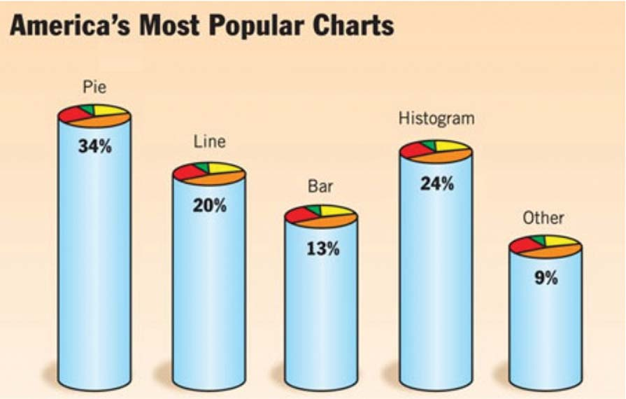
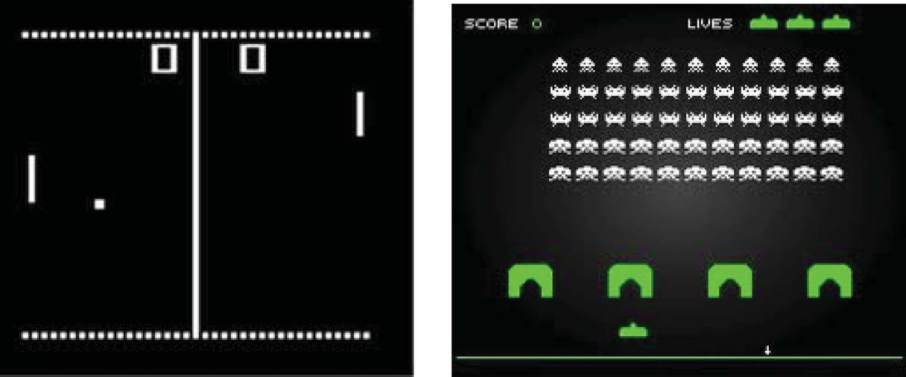
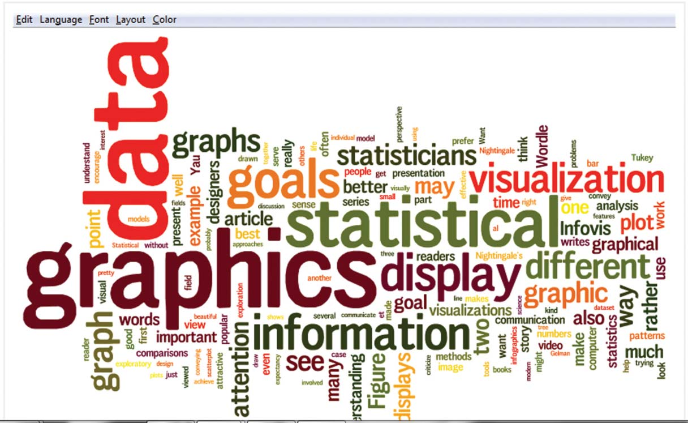
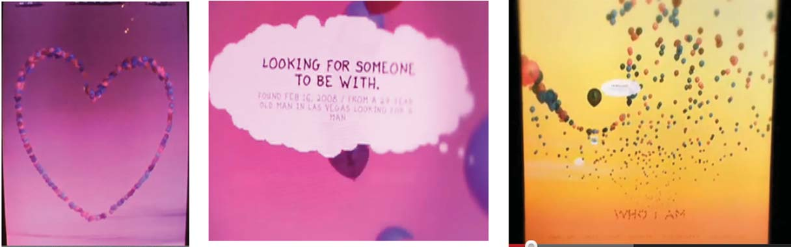
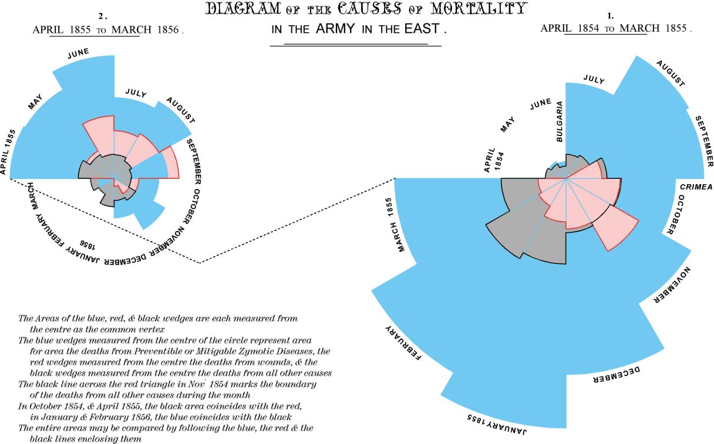
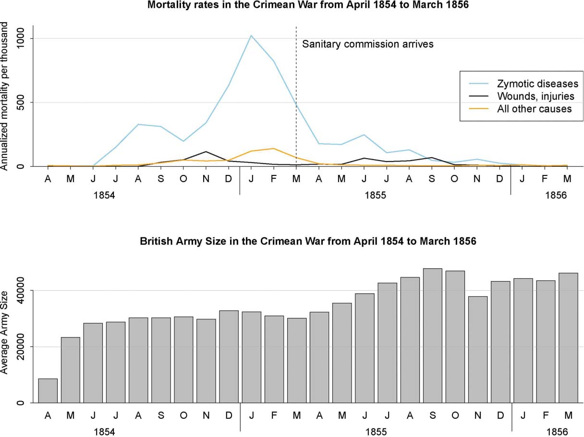
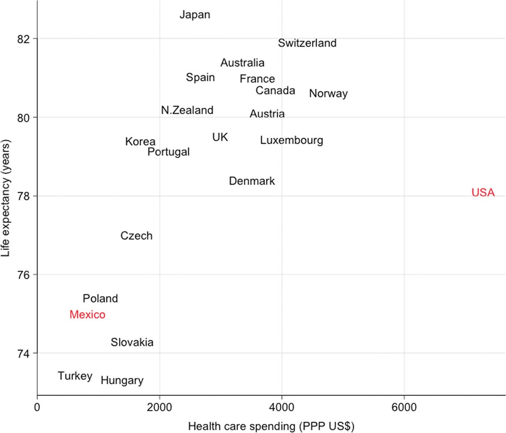
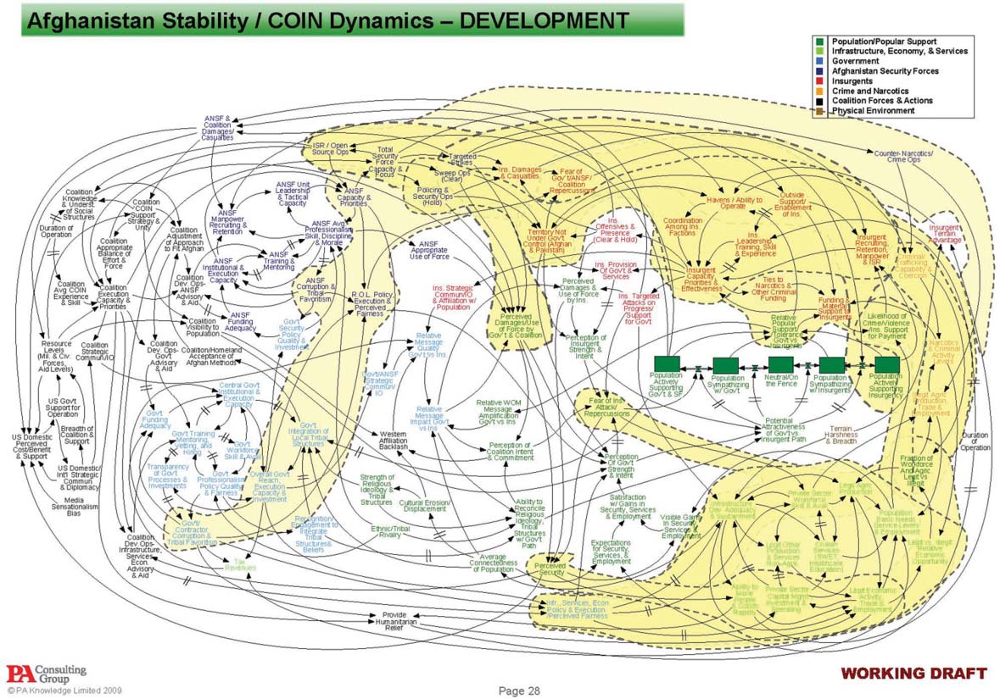
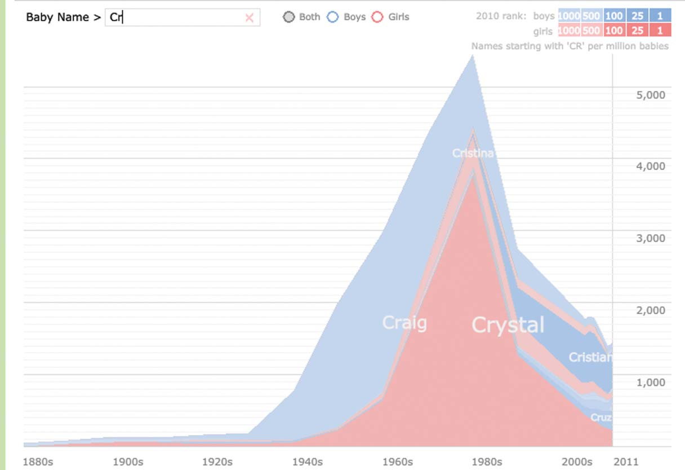

> **Reconstructed by a model.** [`units/gelmanUnwin2013.pdf`](https://github.com/berkeley-stat243/stat243-fall-2021/blob/c918dcc56a197cc539e270f1f7d076010b175c52/units/gelmanUnwin2013.pdf) — berkeley-stat243 · stat243-fall-2021, licensed CC0-1.0. Converted 2026-09-18 from `.pdf`. The original is a PDF with no usable text layer. A model read the pages and wrote this markdown: the prose is a paraphrase in places and **every equation is unverified**. Treat it as a pointer into the original, never as a citable source.

# Infovis and Statistical Graphics: Different Goals, Different Looks

Split into 13 sections.

1. [Infovis and Statistical Graphics: Different Goals, Different Looks](01-infovis-and-statistical-graphics-different-goals-different-l.md)
2. [Infovis and Statistical Graphics: Different Goals, Different Looks](02-infovis-and-statistical-graphics-different-goals-different-l.md)
3. [1. INTRODUCTION](03-1-introduction.md)
4. [2. LOOKING AT INFOVIS THROUGH STATISTICIANS’ EYES](04-2-looking-at-infovis-through-statisticians-eyes.md)
5. [3. UNDERSTANDING AND DIALOGUE RATHER THAN PURE CRITICISM](05-3-understanding-and-dialogue-rather-than-pure-criticism.md)
6. [4. SOURCES FOR THE TWO POINTS OF VIEW](06-4-sources-for-the-two-points-of-view.md)
7. [5. SOME GOALS INVOLVING THE VISUAL DISPLAY OF QUANTITATIVE INFORMATION](07-5-some-goals-involving-the-visual-display-of-quantitative-in.md)
8. [6. BACKGROUND](08-6-background.md)
9. [7. THE “5 BEST DATA VISUALIZATION PROJECTS OF THE YEAR”](09-7-the-5-best-data-visualization-projects-of-the-year.md)
10. [8. STATISTICAL PROBLEMS WITH OTHER HIGHLY PRAISED INFOGRAPHICS](10-8-statistical-problems-with-other-highly-praised-infographic.md)
11. [9. STATIC STATISTICAL GRAPHICS: TIMELESS OR SIMPLY OLD FASHIONED?](11-9-static-statistical-graphics-timeless-or-simply-old-fashion.md)
12. [10. THE BABY NAME WIZARD—AN EXAMPLE WE LIKE](12-10-the-baby-name-wizard-an-example-we-like.md)
13. [11. DISCUSSION](13-11-discussion.md)

## Figures

Extracted from the original PDF. They are listed by the page they came from rather
than placed in the text: the conversion does not record where on the page each one
sat.

---

[Up: contents](../../index.md)
