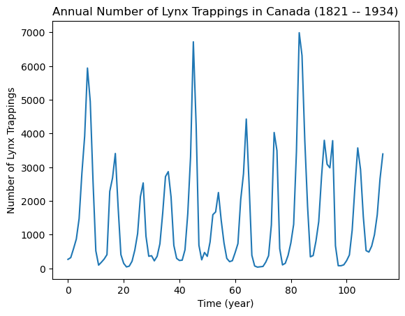
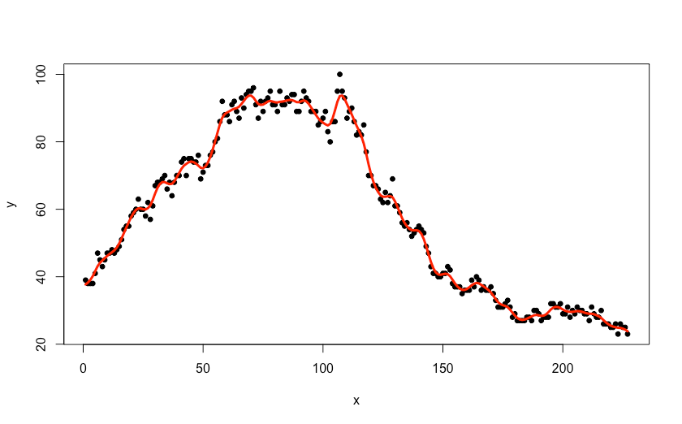
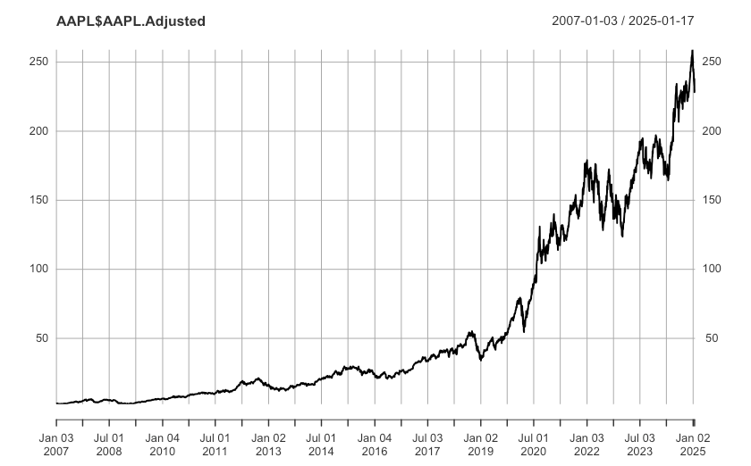
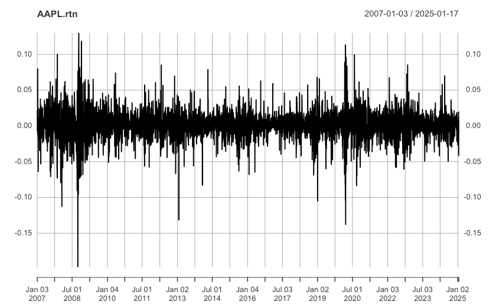

> **Reconstructed by a model.** [`LectureOneSlides153248Spring2025PDF.pdf`](https://github.com/berkeley-stat153/spring-2025/blob/60232ff1b10a6e871e4de968015b36891a606030/LectureOneSlides153248Spring2025PDF.pdf) — berkeley-stat153 · spring-2025, licensed CC BY 4.0. Converted 2026-09-18 from `.pdf`. The original is a PDF with no usable text layer. A model read the pages and wrote this markdown: the prose is a paraphrase in places and **every equation is unverified**. Treat it as a pointer into the original, never as a citable source.

# Lecture One

Split into 2 sections.

1. [Lecture One](01-lecture-one.md)
2. [Sunspot](02-sunspot.md)

## Figures

Extracted from the original PDF. They are listed by the page they came from rather
than placed in the text: the conversion does not record where on the page each one
sat.

---

[Up: contents](../index.md)
