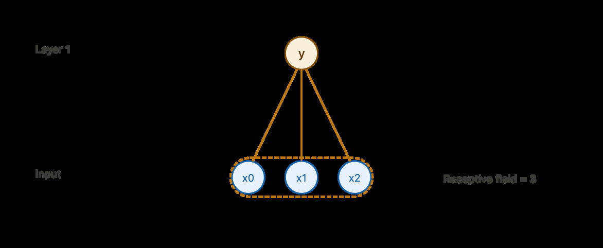
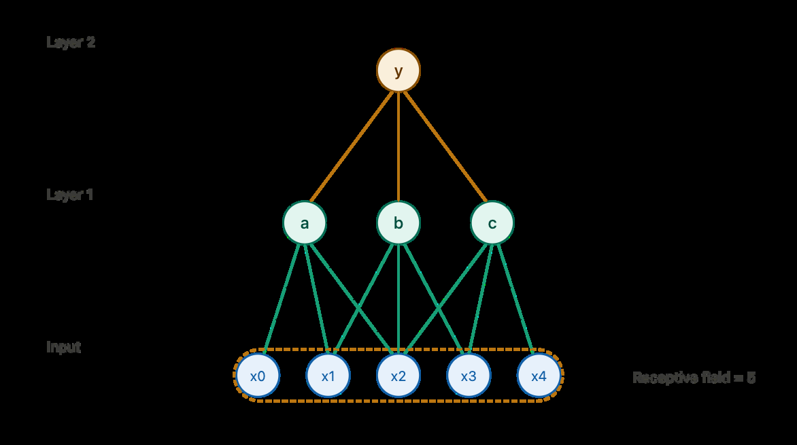
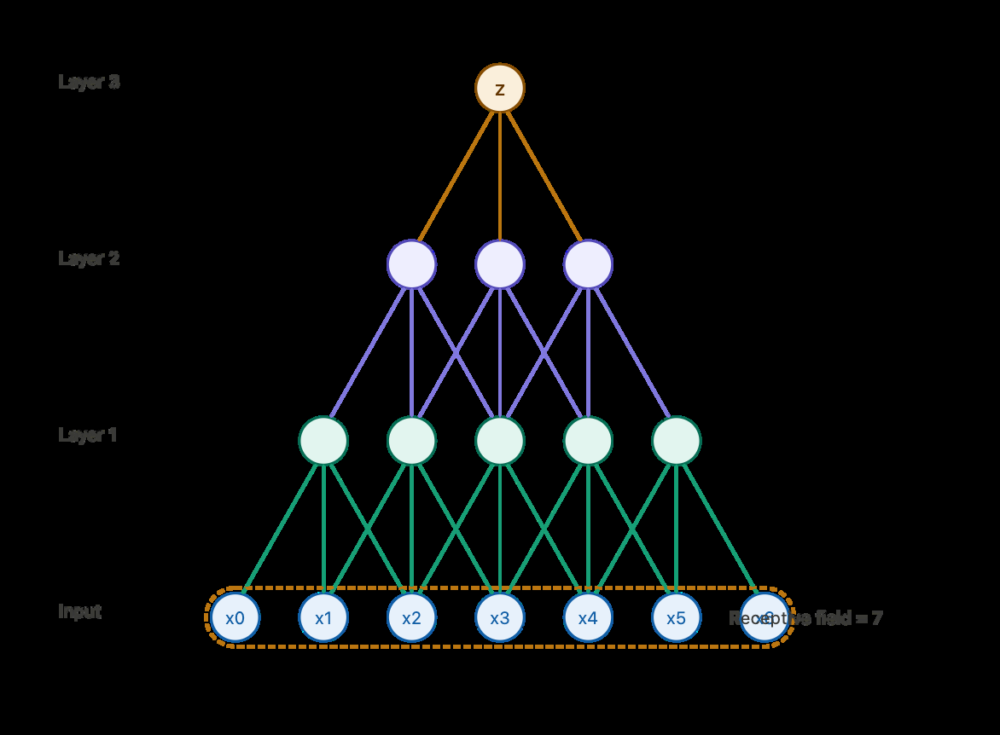
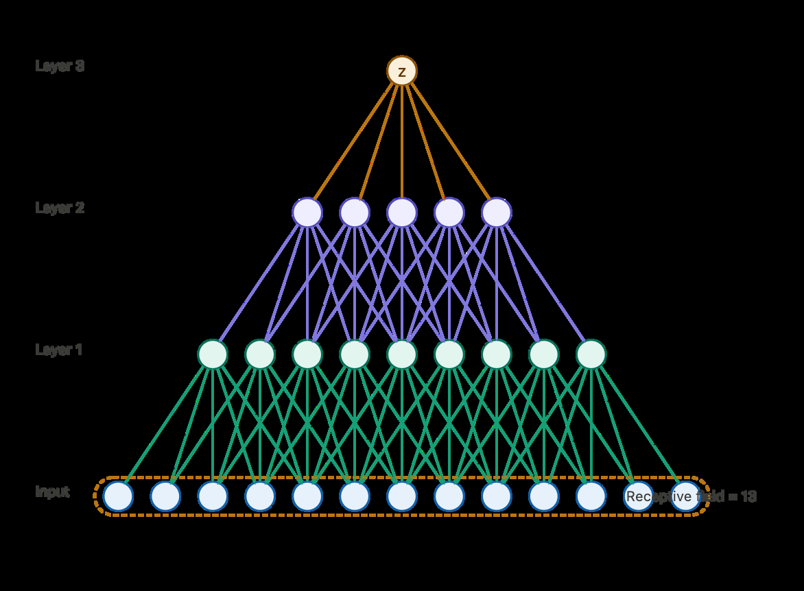

> **Reconstructed by a model.** [`public/homework/Homework5.pdf`](https://github.com/berkeley-stat153/spring-2026/blob/c08dd12c146698bb6ea1d0c6887d1898a8d98c6e/public/homework/Homework5.pdf) — berkeley-stat153 · spring-2026, licensed CC BY 4.0. Converted 2026-09-18 from `.pdf`. The original is a PDF with no usable text layer. A model read the pages and wrote this markdown: the prose is a paraphrase in places and **every equation is unverified**. Treat it as a pointer into the original, never as a citable source.

# Collaborated with

Split into 5 sections.

1. [Collaborated with](01-collaborated-with.md)
2. [Receptive field](02-receptive-field.md)
3. [Part 0: Warm-up](03-part-0-warm-up.md)
4. [Question 7 (5 points): parameter counting](04-question-7-5-points-parameter-counting.md)
5. [Part 4: Recurrent neural networks](05-part-4-recurrent-neural-networks.md)

## Figures

Extracted from the original PDF. They are listed by the page they came from rather
than placed in the text: the conversion does not record where on the page each one
sat.

---

[Up: contents](../../../index.md)
