> **Reconstructed by a model.** [`public/lectures/24_CNNs_Part2.pdf`](https://github.com/berkeley-stat153/spring-2026/blob/c08dd12c146698bb6ea1d0c6887d1898a8d98c6e/public/lectures/24_CNNs_Part2.pdf) — berkeley-stat153 · spring-2026, licensed CC BY 4.0. Converted 2026-09-18 from `.pdf`. The original is a PDF with no usable text layer. A model read the pages and wrote this markdown: the prose is a paraphrase in places and **every equation is unverified**. Treat it as a pointer into the original, never as a citable source.

# Lecture 24: Convolutional neural networks part 2

Liberty Hamilton
April 23, 2026

*h/t to NeuroMatch academy (Alona Fyshe)*

---

## What do you think would happen?

Given an image $A$ and the kernel $K$ below

$$K$$

$$\mathbf{G}_x = \begin{bmatrix} -1 & 0 & +1 \\ -2 & 0 & +2 \\ -1 & 0 & +1 \end{bmatrix} * \mathbf{A} \qquad \mathbf{G}_y = \begin{bmatrix} -1 & -2 & -1 \\ 0 & 0 & 0 \\ +1 & +2 & +1 \end{bmatrix} * \mathbf{A}$$

Image $A$

---

## But how do we get all the edges?

nonlinear combination of Gx and Gy

- We need a nonlinearity!
- In CNNs, this is typically done using a ReLU (rectified linear unit)
  - $\text{ReLU}(x) = \max(0, x)$

---

## STRF and time lagged regression as convolution

- Here we are convolving our 2D STRF filter (the beta weights from time lagged regression) with our feature matrix to produce the predicted neural data (red trace on top)

---

## What are the building blocks of CNNs?

---

## Elements of a CNN

Convolution Neural Network (CNN)

1. Input layer
2. Convolutional layer
3. Activation layer (introduces nonlinearity)
4. Pooling layer
5. Flattening
6. Fully connected (dense) layer
7. Output layer

---

## Example convolution operations (from last time)

Output
$Y \in \mathbb{R}^{3 \times 3}$

Kernel
$K \in \mathbb{R}^{3 \times 3}$

Input $X \in \mathbb{R}^{5 \times 5}$

padding, stride=2

Output
$Y \in \mathbb{R}^{5 \times 5}$

Kernel
$K \in \mathbb{R}^{3 \times 3}$

Input $X \in \mathbb{R}^{5 \times 5}$

"same" padding, stride=1

---

## Combining multiple filters

---

[Up: contents](../../index.md)

## Figures

Extracted from the original PDF. They are listed by the page they came from rather
than placed in the text: the conversion does not record where on the page each one
sat.

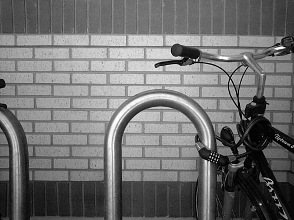

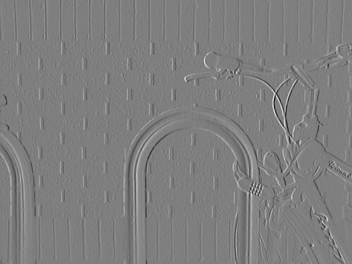

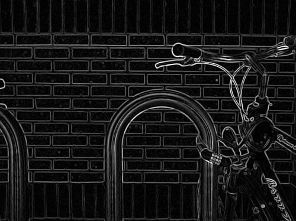

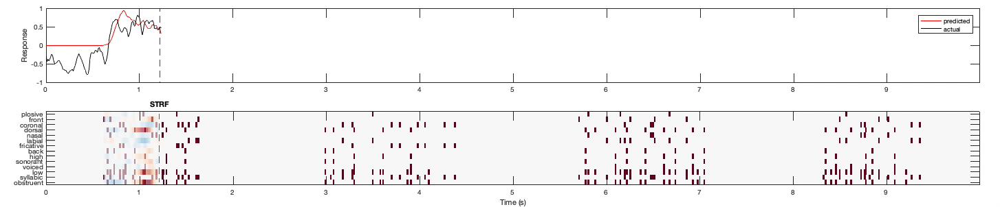

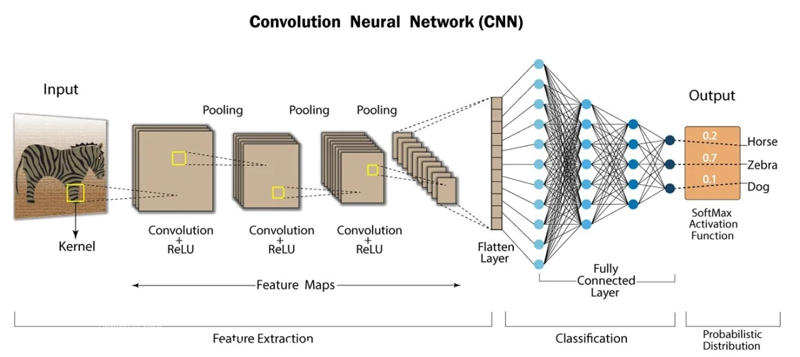

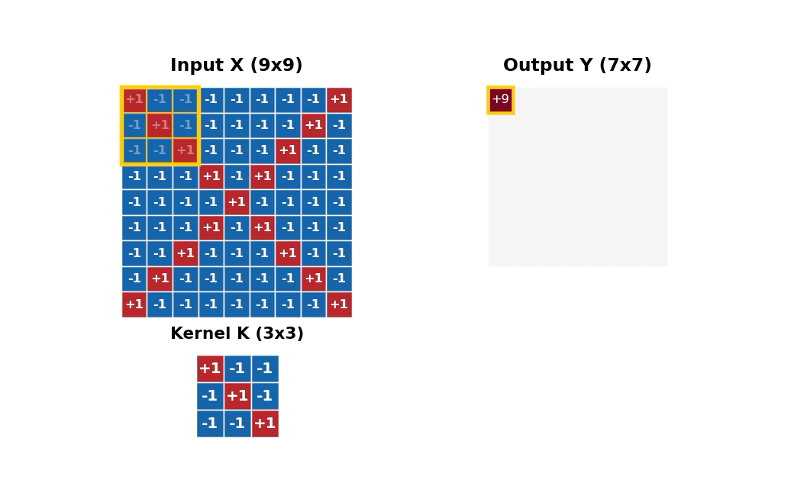

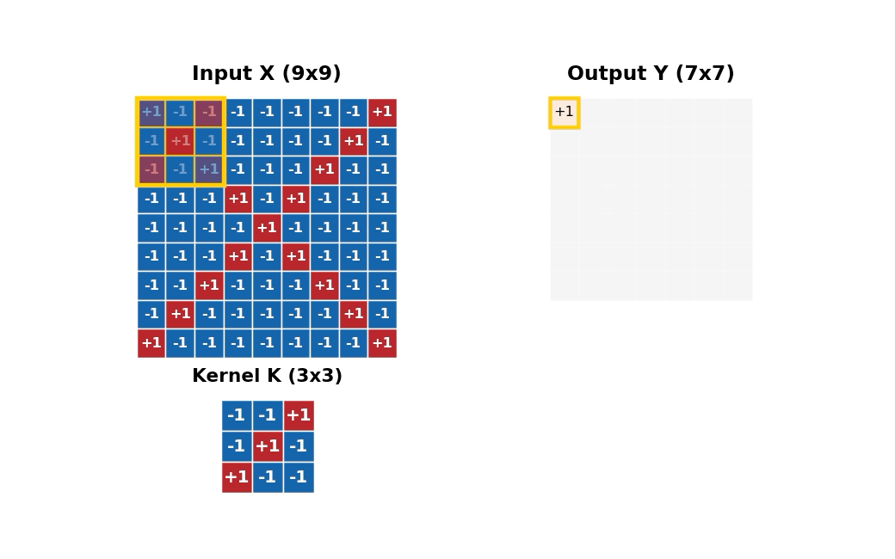

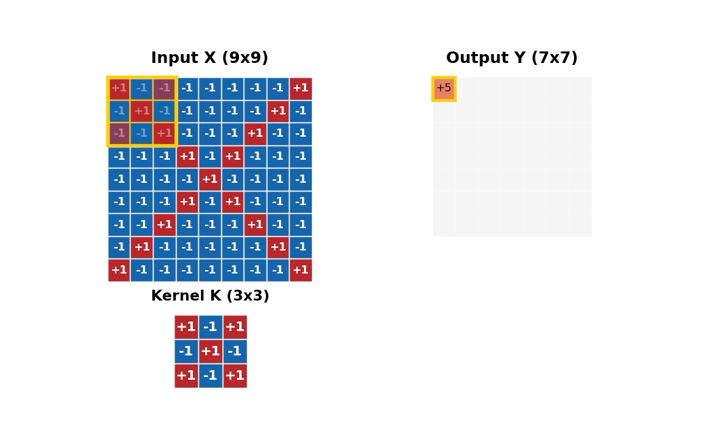

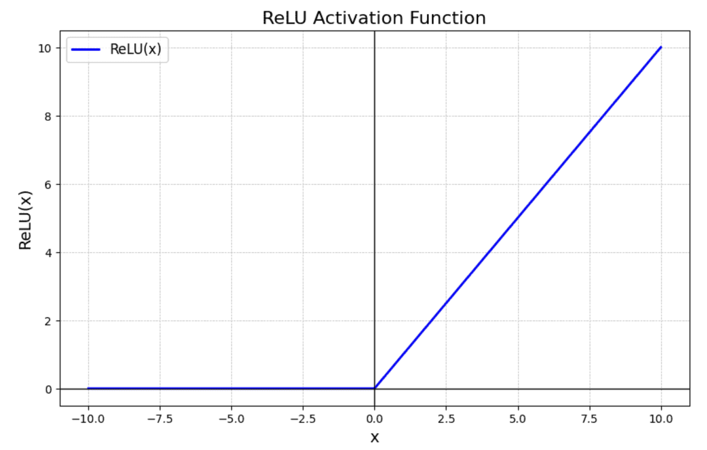

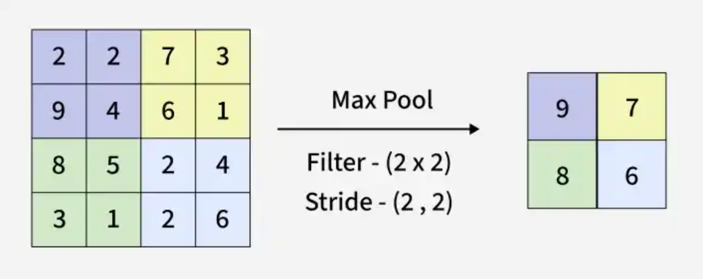

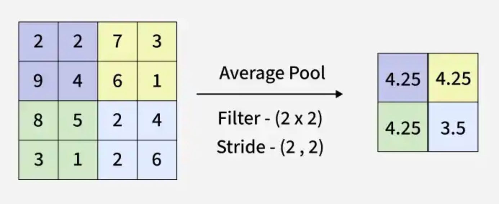

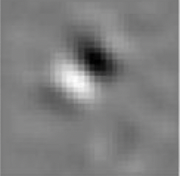

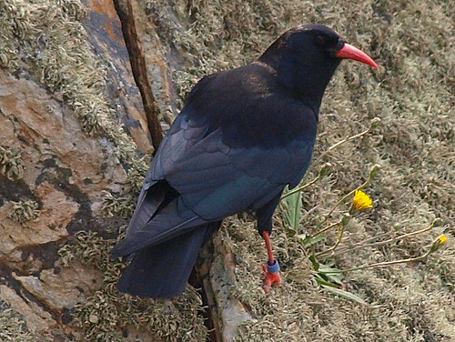

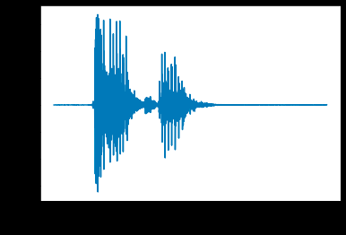

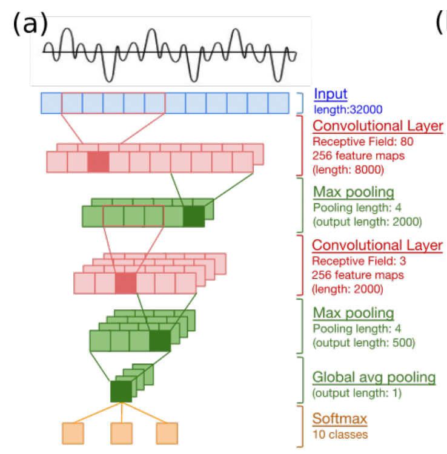

