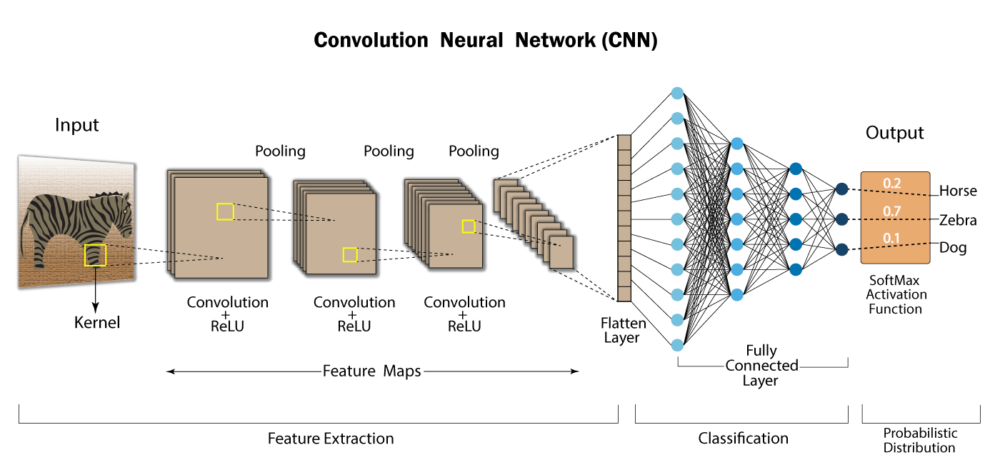
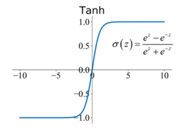
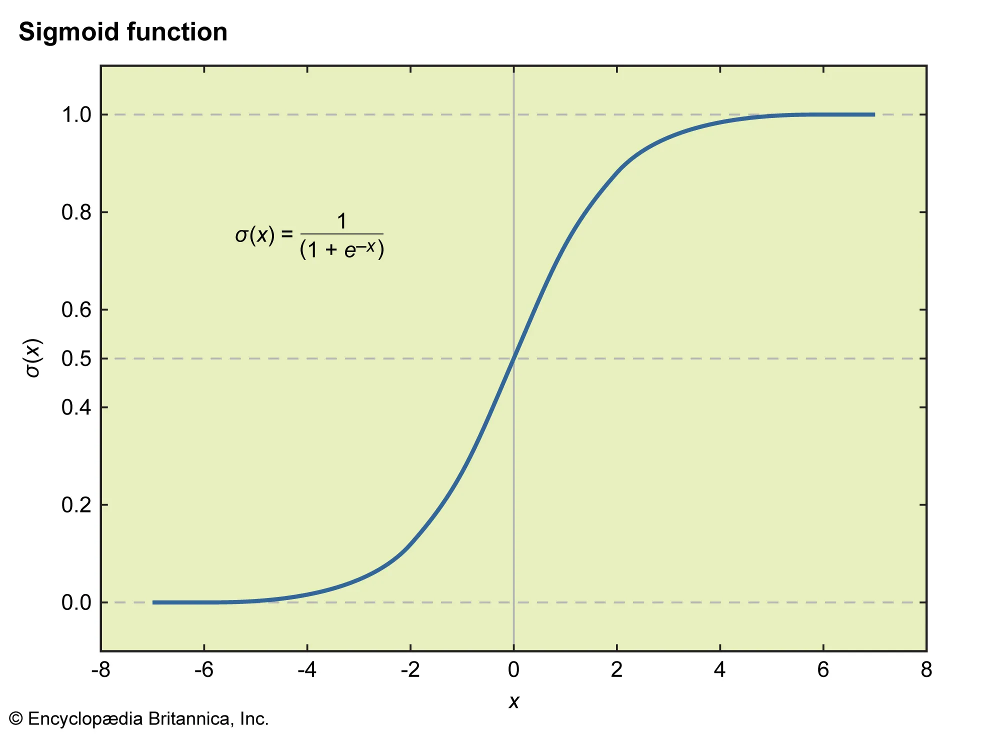

> **Reconstructed by a model.** [`public/lectures/25_RNNs_Part1.pdf`](https://github.com/berkeley-stat153/spring-2026/blob/c08dd12c146698bb6ea1d0c6887d1898a8d98c6e/public/lectures/25_RNNs_Part1.pdf) — berkeley-stat153 · spring-2026, licensed CC BY 4.0. Converted 2026-09-18 from `.pdf`. The original is a PDF with no usable text layer. A model read the pages and wrote this markdown: the prose is a paraphrase in places and **every equation is unverified**. Treat it as a pointer into the original, never as a citable source.

# Lecture 25: Recurrent neural networks

Liberty Hamilton
April 28, 2026

---

## Last time: CNNs

- Deep learning model designed to process structured grid-like data by learning spatial hierarchies of features

image credit: https://developersbreach.com/convolution-neural-network-deep-learning/

---

## Today

- Recurrent neural networks
- How do they work?
- When to use them

---

## Time Series Prediction

- You work at an investment bank, and you want to predict what the price $y$ of a particular stock will be tomorrow, $y_{t+1}$

$y_t$

---

## Time Series Prediction

- You supply the model with **inputs**, $x_t$, that you think will help predict (prices of other stocks, whether it was mentioned in the news, etc).

$$y_t = f(x_t)?$$

---

## Time Series Prediction

- But you are unsure how (or **when**) these inputs affect the stock price.
  - What if some change in another stock yesterday affects $y$ today?
  - What if news from 2 weeks ago combined with news from yesterday affects $y$ today?

$$y_t = f(x_t)?$$

---

## Time Series Prediction

- To factor in uncertainty over time, you could write your model as:
  - $y_t = f(x_t, x_{t-1}, x_{t-2}, \dots)$
- But how can you express this model in a neural network?

---

## Time Series Prediction

$$y_t = f(x_t, x_{t-1}, x_{t-2}, \dots)$$

- If you think there's a fixed time horizon (e.g. you only need to look back 20 days), you could try building a standard feed-forward model
- This would involve stacking 21 $\{x_{t-20}, \dots, x_{t-1}, x_t\}$ vectors together into a single "input" vector
- Explosion of weights! If each $x_t$ is length $n$, you would need 21*n weights in the first layer. If $n$ is big, this is a disaster.

Concatenated input vector length $21n$
$21n \times m$ weights
$m$ weights
$\hat{y}_t$

---

## Time Series Prediction

$$y_t = f(x_t, x_{t-1}, x_{t-2}, \dots)$$

- So building a simple feed-forward model is bad. What about a CNN?
  - Could build a 1D CNN, which would cut down the number of weights by a lot
  - But this forces you to commit to a window size - relevant history might be much longer or more variable!

---

## Recurrence

- One efficient way to tackle this is through **recurrence**

$$y_t = f(h_t)$$
$$h_t = g(x_t, h_{t-1})$$

Output is a function of the hidden state
Hidden state is a function of input and hidden state from last time point

---

## Recurrence

- When considering a recurrent neural network (RNN), we can **unroll** it in time:

---

## Recurrence

- This looks a lot like other networks we've seen (also state space models!)
- But here, weights are shared across layers

---

## Recurrence vs. "feed-forward"

Recurrent neural network (RNN)
Feed-forward (FF) networks
1-layer FF
3-layer FF

---

## Recurrent neural networks (RNNs)

- Only process one input at a time (unlike feed-forward and convolutional networks)
  - This reduces the number of weights by a lot (efficient!)
- But contain **memory** of previous inputs (stored in the hidden state)
  - Allows RNNs to capture dependencies across time

---

## Recurrent neural networks (RNNs)

- The **standard RNN**, **vanilla RNN**, or **Elman network** is given by the following equations:

$$h_t = \tanh(W_h h_{t-1} + W_x x_t + b_h)$$
$$\hat{y}_t = W_y h_t + b_y$$

---

## Recurrent neural networks (RNNs)

- The standard RNN, vanilla RNN, or Elman network is given by the following equations:

$$h_t = \tanh(W_h h_{t-1} + W_x x_t + b_h)$$
$$\hat{y}_t = W_y h_t + b_y$$

- $W_h \in \mathbb{R}^{H \times H}$, $W_x \in \mathbb{R}^{H \times d}$, $W_y \in \mathbb{R}^{k \times H}$, where $H$ is the hidden size, $d$ is the input dimension per timestep, and $k$ is the output dimension

---

## Recurrent neural networks (RNNs)

- The standard RNN, vanilla RNN, or Elman network is given by the following equations:

$$h_t = \tanh(W_h h_{t-1} + W_x x_t + b_h)$$
$$\hat{y}_t = W_y h_t + b_y$$

- This example uses a **tanh** nonlinearity. It could also use a **sigmoid**, but it's rare to use a **ReLU** (like we do with CNNs).

---

## How do we train an RNN?

- Backpropagation through time! (BPTT)
- What is this?!

---

## Backpropagation

- Efficiently compute gradients of a loss with respect to model parameters
- A neural network is a composition of differentiable functions. For a FF network with $L$ layers:
  - $h_\ell = f_\ell(h_{\ell-1}; W_\ell), \quad \mathcal{L} = \text{Loss}(\hat{y}, y)$
- To train by gradient descent we need $\partial \mathcal{L}/\partial W_\ell$ for every layer index $\ell$

---

## Backpropagation: Two passes

- $h_\ell = f_\ell(h_{\ell-1}; W_\ell), \quad \mathcal{L} = \text{Loss}(\hat{y}, y)$
- **Forward pass:**
  - Compute and cache $h_1, h_2, \dots, \hat{y}$, then the loss
- **Backward pass:**
  - Starting from $\partial \mathcal{L}/\partial \hat{y}$, walk backward through the layers. At each layer, we use the chain rule:
    $$\frac{\partial \mathcal{L}}{\partial W_\ell} = \frac{\partial \mathcal{L}}{\partial h_\ell} \cdot \frac{\partial h_\ell}{\partial W_\ell}, \quad \frac{\partial \mathcal{L}}{\partial h_{\ell-1}} = \frac{\partial \mathcal{L}}{\partial h_\ell} \cdot \frac{\partial h_\ell}{\partial h_{\ell-1}}$$
  - The first equation gives the gradient to update $W_\ell$, the second is the upstream gradient passed to the previous layer

---

## Backpropagation through time for RNN Training

- BPTT is *mostly* the same as normal BP

$$\text{Loss}(y_t, \hat{y}_t)$$
$$\frac{\partial \text{Loss}}{\partial \hat{y}_t}$$

---

## Backpropagation through time for RNN Training

- BPTT is *mostly* the same as normal BP

$$\text{Loss}(y_t, \hat{y}_t)$$
$$\frac{\partial \text{Loss}}{\partial \hat{y}_t}$$
$$\frac{\partial \hat{y}_t}{\partial h_t}$$
$$\frac{\partial h_t}{\partial h_{t-1}}, \quad \frac{\partial h_t}{\partial W_{xh}}, \frac{\partial h_t}{\partial b_h}$$

---

## Backpropagation through time for RNN Training

- BPTT is *mostly* the same as normal BP

$$\text{Loss}(y_t, \hat{y}_t)$$
$$\frac{\partial \text{Loss}}{\partial \hat{y}_t}$$
$$\frac{\partial \hat{y}_t}{\partial h_t}$$
$$\frac{\partial h_t}{\partial h_{t-1}}, \quad \frac{\partial h_t}{\partial W_{xh}}, \frac{\partial h_t}{\partial b_h}$$

---

## Backpropagation through time for RNN Training

- BPTT is *mostly* the same as normal BP
- ... but with one caveat

Where do you stop?!?

$$\text{Loss}(y_t, \hat{y}_t)$$
$$\frac{\partial \text{Loss}}{\partial \hat{y}_t}$$
$$\frac{\partial \hat{y}_t}{\partial h_t}$$
$$\frac{\partial h_t}{\partial h_{t-1}}, \quad \frac{\partial h_t}{\partial W_{xh}}, \frac{\partial h_t}{\partial b_h}$$

---

## Backpropagation through time for RNN Training

- Except in some very specific circumstances, most RNNs are trained using **truncated BPTT**:
  - Instead of back-propagating forever, choose some BPTT length, $k$
  - Then only back-propagate for $k$ time steps
- *Truncated BPTT is so common that we don't even usually call it "truncated BPTT", we just call it "BPTT"*

---

## Backpropagation through time (BPTT) for RNNs

- An RNN unrolled over T timesteps is a deep feedforward network with two changes:
  - the same parameters $W_h$ and $W_x$ are reused at every time step
  - Gradients flow backward through the time step chain
  - $$\frac{\partial \mathcal{L}}{\partial W_h} = \sum_{t=1}^T \frac{\partial \mathcal{L}_t}{\partial W_h}$$
  - Each of these terms requires propagating gradients back through all earlier timesteps via repeated multiplication by $\partial h_t/\partial h_{t-1}$

---

## Why RNNs vs. CNNs?

- RNNs allow variable length context
- RNNs assume order matters (different from CNNs, that assume translation invariance in time)
- RNNs process one timestep at a time, can be more natural for online inference

---

## RNN variants

- Stacked RNNs
- Bidirectional RNNs
- Gated RNNs

---

## Stacked RNN

- Suppose there is a relationship between $x_t$ and $y_t$, but *it's complicated*
- How do we make the RNN *more expressive*?

RNN
1-layer FF
3-layer FF

---

## Stacked RNN

$$y_t = f(h_t^2)$$
$$h_t^2 = g(h_t^1, h_{t-1}^2)$$
$$h_t^1 = g(x_t, h_{t-1}^1)$$

---

## Stacked RNN

* Task: part-of-speech Tagging

Pro VB Det NN NN
It was a stray puppy

- Is something wrong?

---

## Stacked RNN

* Task: part-of-speech Tagging

Pro VB Det NN NN
It was a stray puppy

- Is something wrong?

---

## Bidirectional RNN

Backward RNN

Pro VB Det NN NN
It was a stray puppy

---

## Bidirectional RNN

Concatenate!
Pro VB Det JJ NN
It was a stray puppy

Backward RNN

---

## RNN Variants

- **Stacked RNNs**
  - Multiple layers, each one an RNN
- **Bidirectional RNNs**
  - Capture dependence in both directions
- **Gated RNNs (next time)**

---

[Up: contents](../../index.md)

## Figures

Extracted from the original PDF. They are listed by the page they came from rather
than placed in the text: the conversion does not record where on the page each one
sat.

