> **Reconstructed by a model.** [`public/lectures/26_RNNs_Part2.pdf`](https://github.com/berkeley-stat153/spring-2026/blob/c08dd12c146698bb6ea1d0c6887d1898a8d98c6e/public/lectures/26_RNNs_Part2.pdf) — berkeley-stat153 · spring-2026, licensed CC BY 4.0. Converted 2026-09-18 from `.pdf`. The original is a PDF with no usable text layer. A model read the pages and wrote this markdown: the prose is a paraphrase in places and **every equation is unverified**. Treat it as a pointer into the original, never as a citable source.

# Lecture 26: Recurrent neural networks part 2

Liberty Hamilton
April 30, 2026

---

## Announcements

- For Stat248 - Final Project Instructions are on bCourses
- For Stat153 - Final Exam will be May 14 - 7-10pm, in this classroom
- No class next week, but we will have a final review session on Tuesday
- I will have regular office hours (Tuesday after class)
- Homework 5 is now optional/extra credit (3%)
- We will also have a little on pytorch with RNNs + exam review in Lab this week

---

## Recap

- Recurrent neural networks (RNNs)
  - Appropriate for problems where data have sequential dependence
  - Trainable using backpropagation through time (BPTT)
    - This is like "unrolling" the recurrent network into a (very) deep feedforward network, and then applying backpropagation
  - RNNs are great for problems like language, which requires more sequential processing than vision

---

## Today

- Gated RNNs
  - LSTMs
  - GRUs

---

## More reading for today...

- The Unreasonable Effectiveness of Recurrent Neural Networks (Andrej Karpathy)
- Understanding LSTM Networks (Chris Olah)

---

## The trouble with RNNs

- Suppose we want to predict the last word:

  *When she tried to print her tickets, she found that the printer was out of toner. She went to the stationery store to buy more toner. It was very overpriced. After installing the toner into the printer, she finally printed her* ________

---

## The trouble with RNNs

- Suppose we want to predict the last word:

  *When she tried to print her **tickets**, she found that the printer was out of toner. She went to the stationery store to buy more toner. It was very overpriced. After installing the toner into the printer, she finally printed her* ________

  ~37 steps back!

---

## The trouble with RNNs

- RNNs suffer from the problems of **vanishing** and **exploding gradients**
- This problem is worse when backpropagating over a **long sequence**
  - Limits temporal dependence of functions that simple RNNs can learn

---

## The trouble with RNNs

- Simple 1-D example:

$$h_{t+1} = \sigma(wh_t) \qquad \frac{\partial h_{t+1}}{\partial h_t} = w\sigma'(wh_t)$$

nonlinearity (e.g. tanh, sigmoid, maaybe ReLu)

---

## The trouble with RNNs

- Simple 1-D example:

$$h_{t+1} = \sigma(wh_t) \qquad \frac{\partial h_{t+1}}{\partial h_t} = w\sigma'(wh_t)$$

$$\frac{\partial h_{t+2}}{\partial h_t} = w\sigma'(wh_{t+1})w\sigma'(wh_t)$$

---

## The trouble with RNNs

- Simple 1-D example:

$$h_{t+1} = \sigma(wh_t) \qquad \frac{\partial h_{t+1}}{\partial h_t} = w\sigma'(wh_t)$$

$$\frac{\partial h_{t+2}}{\partial h_t} = w\sigma'(wh_{t+1})w\sigma'(wh_t)$$

$$\frac{\partial h_{t+n}}{\partial h_t} = w^n \prod_{j=0}^{n-1} \sigma'(wh_{t+j})$$

---

## The trouble with RNNs

- Simple 1-D example:

$$h_{t+1} = \sigma(wh_t) \qquad \frac{\partial h_{t+1}}{\partial h_t} = w\sigma'(wh_t)$$

$$\frac{\partial h_{t+2}}{\partial h_t} = w\sigma'(wh_{t+1})w\sigma'(wh_t)$$

$$\frac{\partial h_{t+n}}{\partial h_t} = w^n \prod_{j=0}^{n-1} \sigma'(wh_{t+j})$$

$w^n$ : really bad
$\prod_{j=0}^{n-1} \sigma'(wh_{t+j})$ : also bad

---

[Up: contents](../../index.md)

## Figures

Extracted from the original PDF. They are listed by the page they came from rather
than placed in the text: the conversion does not record where on the page each one
sat.

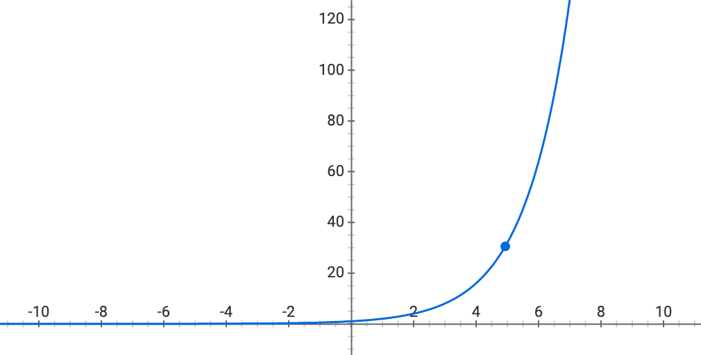

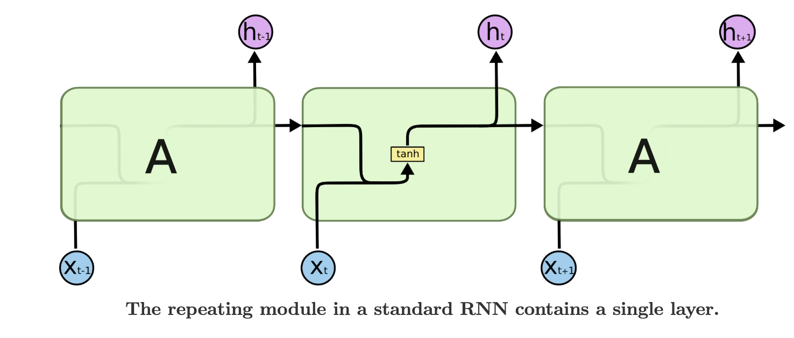

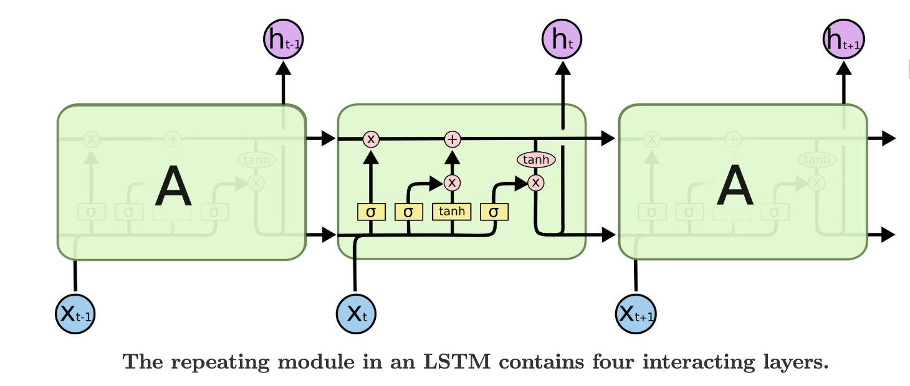

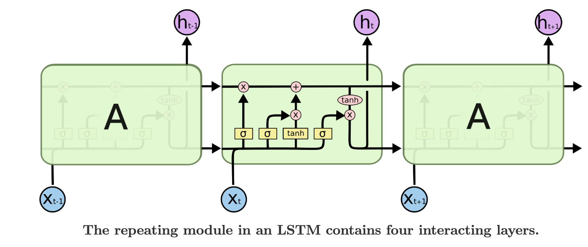

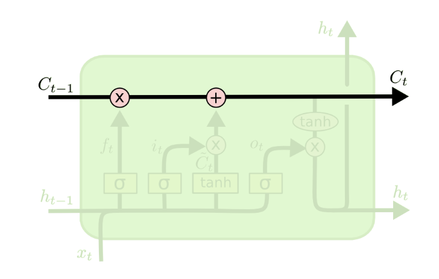

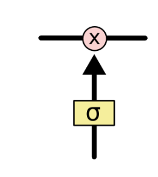

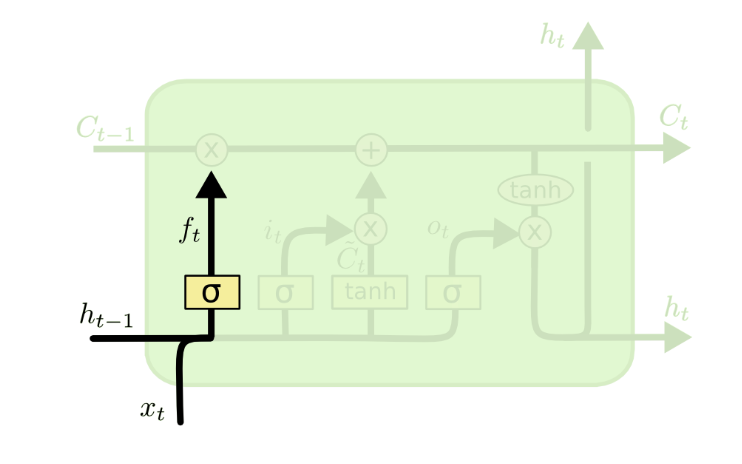

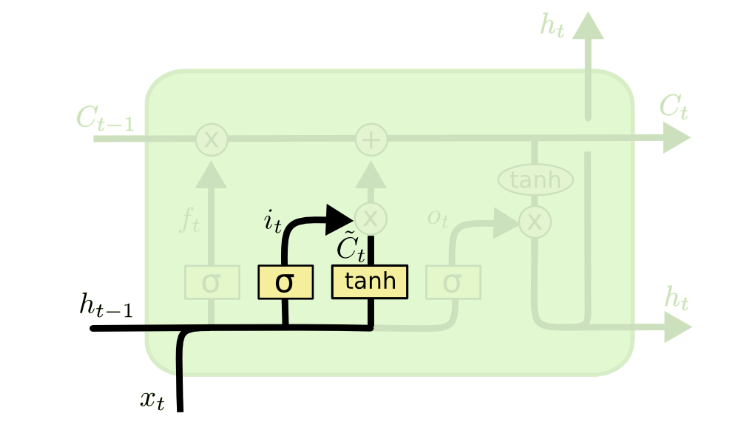

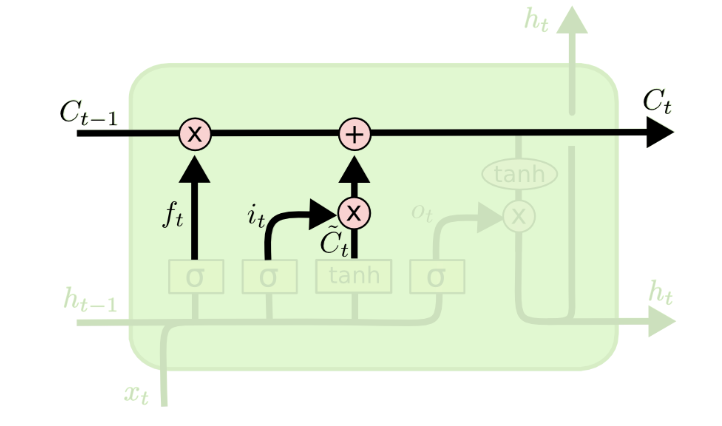

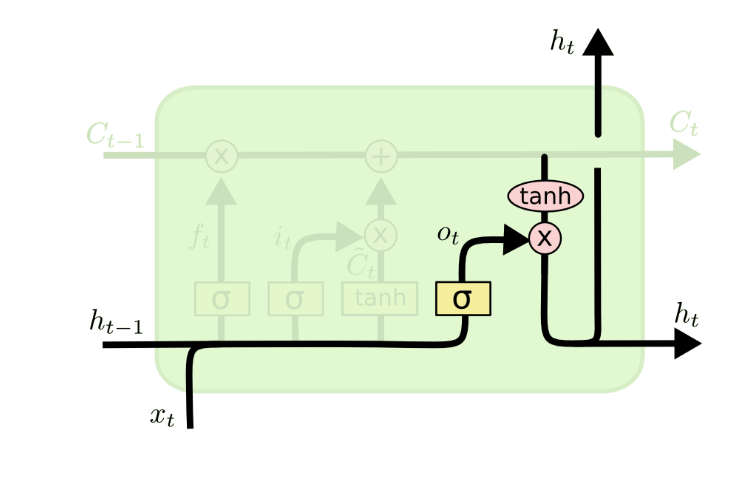

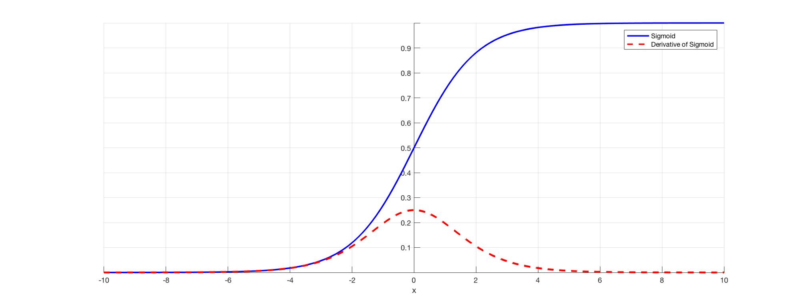

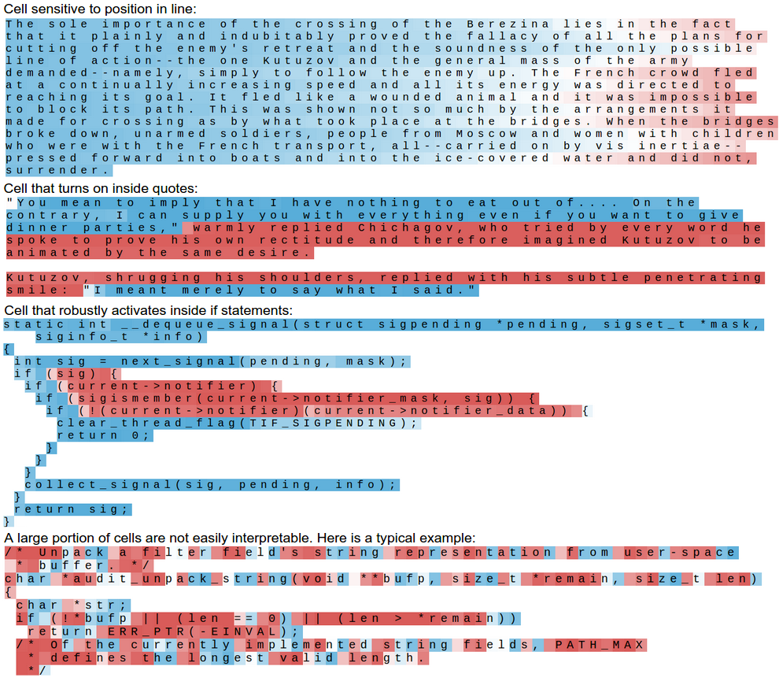

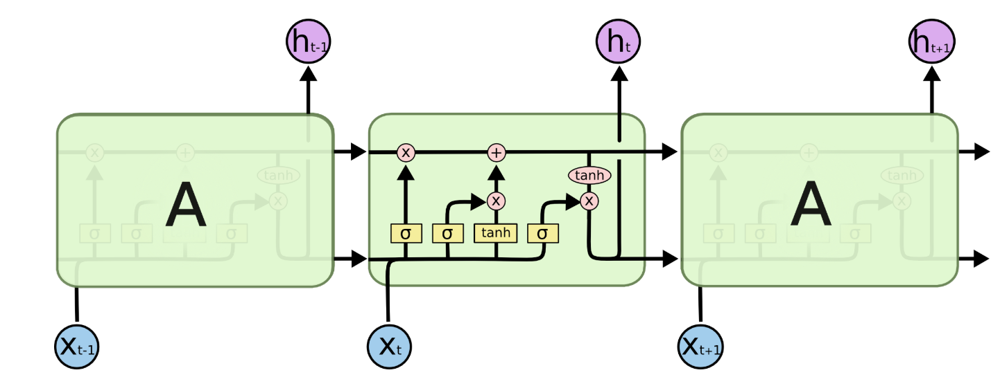

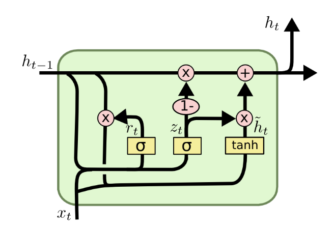

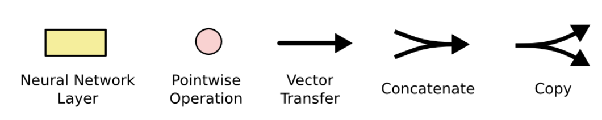

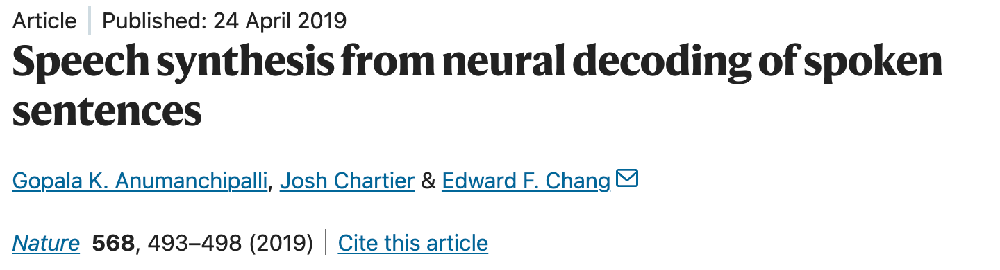

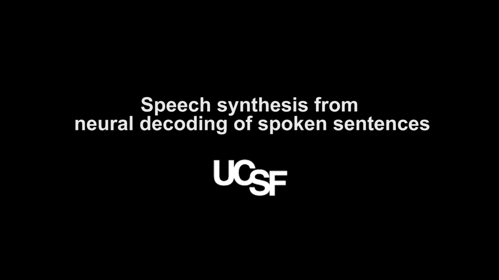

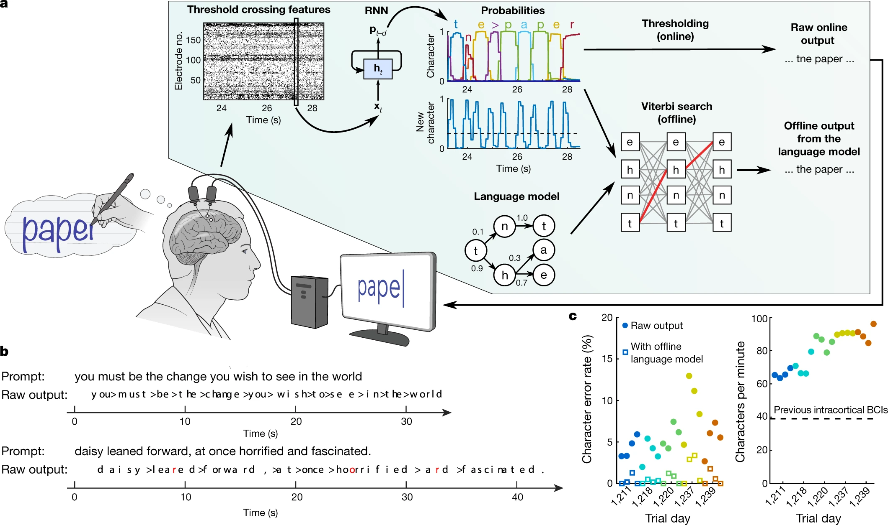

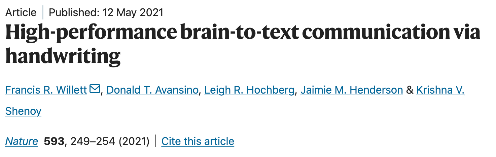

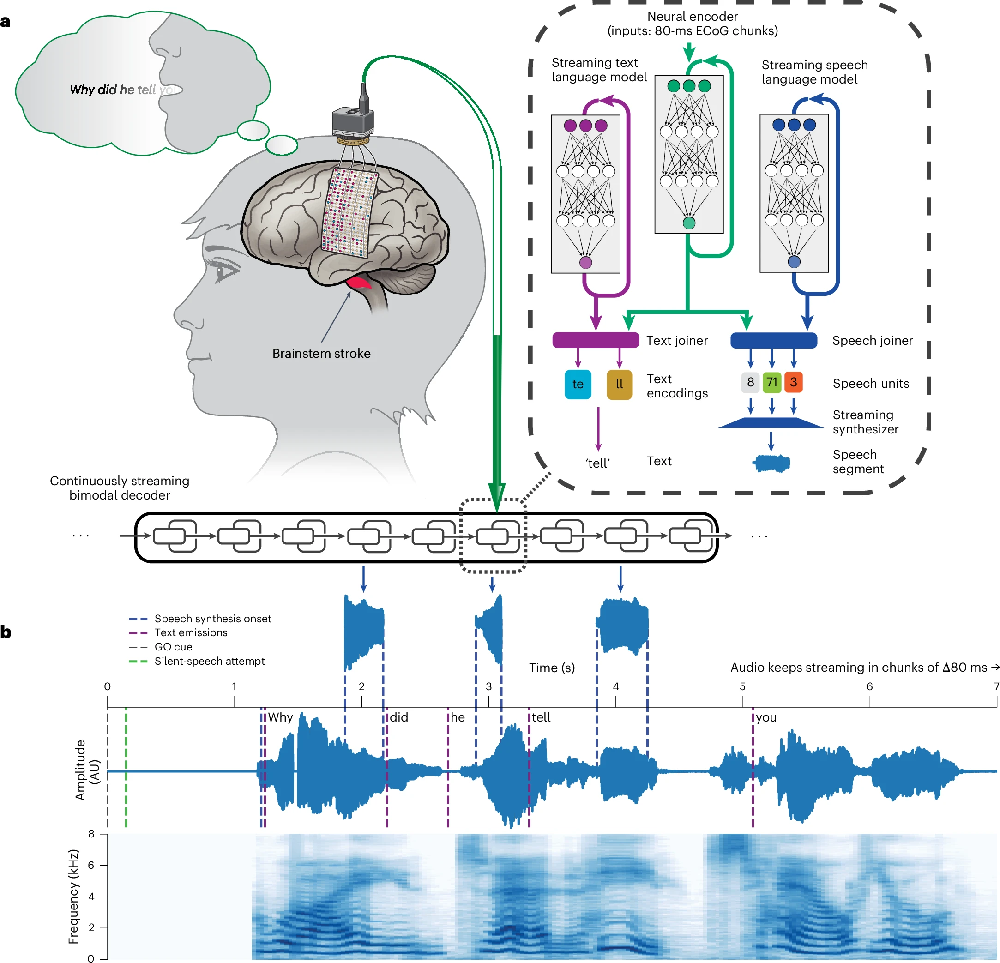

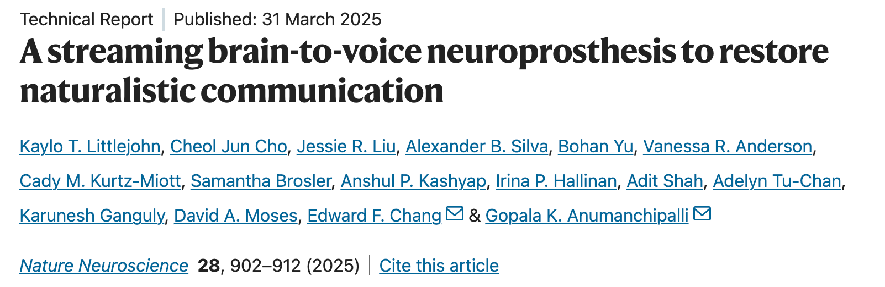

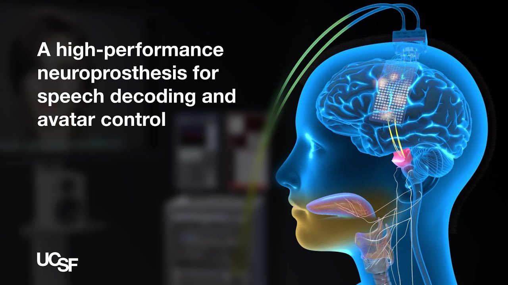

