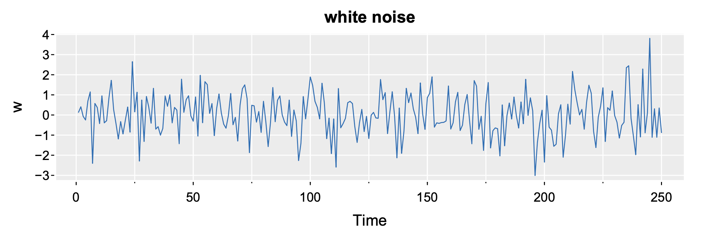
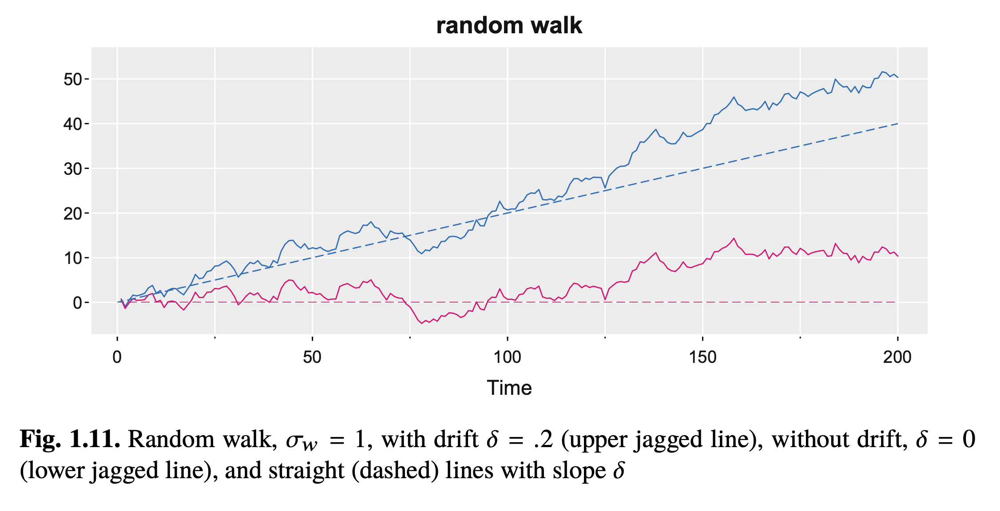
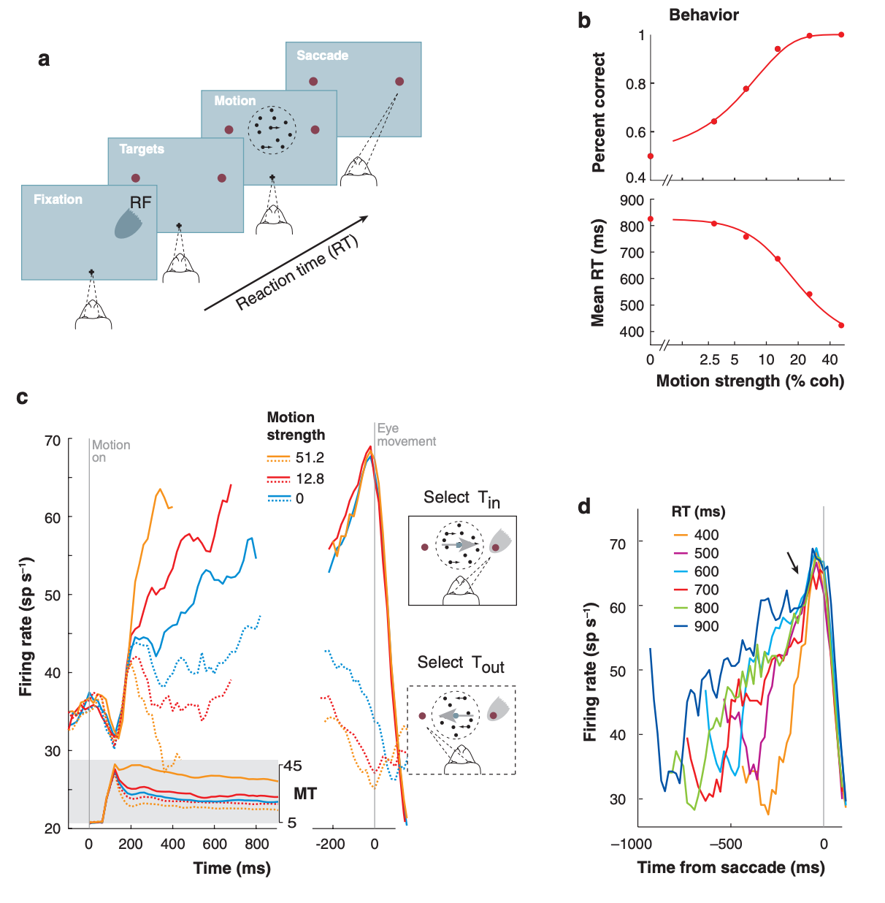

> **Reconstructed by a model.** [`public/lectures/Lec02_Notes.pdf`](https://github.com/berkeley-stat153/spring-2026/blob/c08dd12c146698bb6ea1d0c6887d1898a8d98c6e/public/lectures/Lec02_Notes.pdf) — berkeley-stat153 · spring-2026, licensed CC BY 4.0. Converted 2026-09-18 from `.pdf`. The original is a PDF with no usable text layer. A model read the pages and wrote this markdown: the prose is a paraphrase in places and **every equation is unverified**. Treat it as a pointer into the original, never as a citable source.

# Lecture 2 Notes - Characteristics of Time Series

Split into 2 sections.

1. [Lecture 2 Notes - Characteristics of Time Series](01-lecture-2-notes---characteristics-of-time-series.md)
2. [6 Random Walk](02-6-random-walk.md)

## Figures

Extracted from the original PDF. They are listed by the page they came from rather
than placed in the text: the conversion does not record where on the page each one
sat.

---

[Up: contents](../../../index.md)
