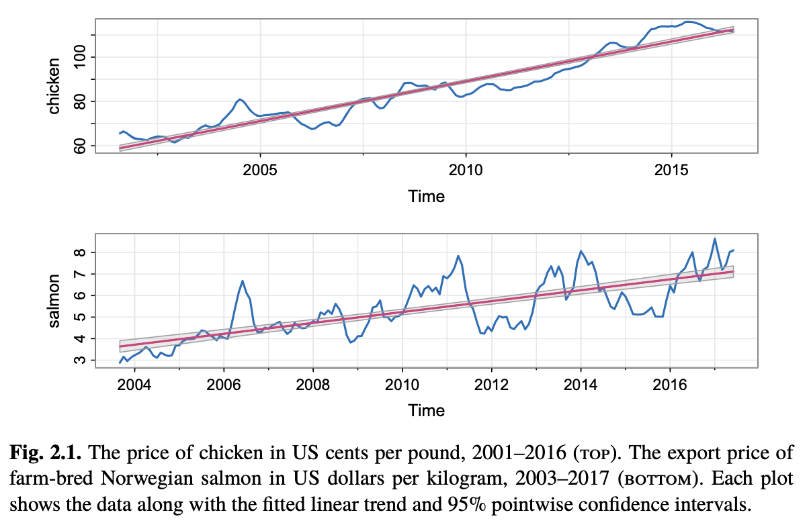

> **Reconstructed by a model.** [`public/lectures/Lec05_Notes.pdf`](https://github.com/berkeley-stat153/spring-2026/blob/c08dd12c146698bb6ea1d0c6887d1898a8d98c6e/public/lectures/Lec05_Notes.pdf) — berkeley-stat153 · spring-2026, licensed CC BY 4.0. Converted 2026-09-18 from `.pdf`. The original is a PDF with no usable text layer. A model read the pages and wrote this markdown: the prose is a paraphrase in places and **every equation is unverified**. Treat it as a pointer into the original, never as a citable source.

# Lec 05 — Notes

Lecture 5 Notes - Simple Linear Regression

Liberty Hamilton

Tuesday $3^{\text{rd}}$ February, 2026

- Reading: Chapter 2 – Shumway and Stoffer

## 1 Review

### 1.1 Notes on covariance

To add to your materials from last week, I've created some visualizations.

## 2 Today

### 2.1 Simple linear regression

Let's say we want to learn the relationship between two variables $y$ and $x$ - the goal is to predict $y$ given $x$. For example, we might want to predict the height of an adult man ($y$) given the height of his father ($x$). $y$ is called the response variable or dependent variable, $x$ i the covariate or independent variable. We will start with the more general scenario and then extend this concept specifically to time series.

In simple linear regression, we are predicting $y$ given one covariate $x$. In the case of multiple $x$, say $\{x_1, \dots, x_p\}$, this is called multiple regression.

For the simple case, we are predicting $y$ from one covariate $x$. For example:
$$y = \beta_0 + \beta_1 x + \epsilon$$

$\beta_0$ and $\beta_1$ are parameters that we will estimate from the data, where $\beta_0$ is the intercept, which corresponds to the value of $y$ when $x = 0$, and $\beta_1$ represents the change in $y$ when $x$ changes by one unit.

We could observe, for example, pairs of data $(x_1, y_1), \dots, (x_n, y_n)$ where each of these samples is a pair of fathers and sons. We then might write:
$$y_i = \beta_0 + \beta_1 x_i + \epsilon_i.$$

We can then estimate our $\hat{\beta}_0$ and $\hat{\beta}_1$ from the data, then use these to predict the value

---

[Up: contents](../../index.md)

## Figures

Extracted from the original PDF. They are listed by the page they came from rather
than placed in the text: the conversion does not record where on the page each one
sat.

