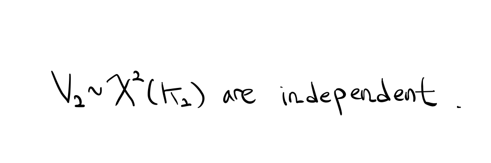

> **Reconstructed by a model.** [`recitation/recitation5.pdf`](https://github.com/berkeley-stat210a/fall-2024/blob/812543bde50398a54db3044bf8ba7120189a4dfa/recitation/recitation5.pdf) — berkeley-stat210a · fall-2024, licensed CC BY 4.0. Converted 2026-09-18 from `.pdf`. The original is a PDF with no usable text layer. A model read the pages and wrote this markdown: the prose is a paraphrase in places and **every equation is unverified**. Treat it as a pointer into the original, never as a citable source.

# VII Chi-Square Distributions

Split into 2 sections.

1. [VII Chi-Square Distributions](01-vii-chi-square-distributions.md)
2. [VII Example](02-vii-example.md)

## Figures

Extracted from the original PDF. They are listed by the page they came from rather
than placed in the text: the conversion does not record where on the page each one
sat.

---

[Up: contents](../../index.md)
