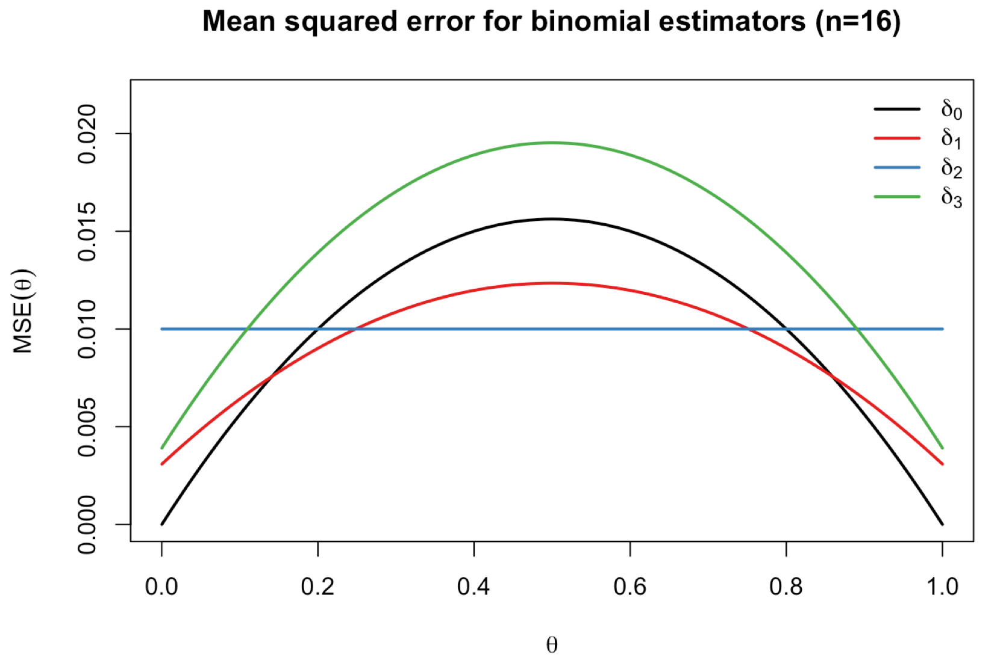

> **Reconstructed by a model.** [`units/handwritten/lecture03-estimation.pdf`](https://github.com/berkeley-stat210a/fall-2025/blob/5eb849a4924c34eb73e098cdfc812ffa8d806501/units/handwritten/lecture03-estimation.pdf) — berkeley-stat210a · fall-2025, licensed CC BY 4.0. Converted 2026-09-18 from `.pdf`. The original is a PDF with no usable text layer. A model read the pages and wrote this markdown: the prose is a paraphrase in places and **every equation is unverified**. Treat it as a pointer into the original, never as a citable source.

# Statistical models and decisions

### Outline

1) Statistical models
2) Estimation
3) Decision theory

---

## Statistical Models

### Probability vs statistics

```
Distribution P  --- Probability --->  Data X
                <--- Statistics ---
```

**Probability**:
- Distribution $P$ fully specified
- What can we say about $X \sim P$?
- **Deductive**

**Statistics**:
- Observe data $X$ from unknown dist. $P$
- What can we conclude about $P$?
- **Inductive**

**Statistical model**: Family $\mathcal{P}$ of candidate probability distributions for data $X$

Assume $X \sim P$ for **some** $P \in \mathcal{P}$ (don't know which)

$X$ yields evidence about which $P$ (hopefully)

---

## Coin flipping

**Recall**: 48 humans tossed coins $n = 350,757$ total times
$X = 178,079$ landed same-side up.

### **Model 1**:
All flips independent, with same probability $\theta \in (0,1)$

$$\implies X \sim P_\theta = \text{Binom}(n, \theta)$$
($n$ known, $\theta$ unknown (varies over model))

Probability mass function $p_\theta(x) = \binom{n}{x} \theta^x (1-\theta)^{n-x}$ for $x = 0, 1, \dots, n$

$$\mathcal{P} = \{P_\theta : \theta \in (0, 1)\}$$

### **Model 2**:
Flippers have different biases

$$\implies X_i \overset{\text{ind.}}{\sim} \text{Binom}(n_i, \theta_i) \quad i = 1, \dots, 48$$
($X_i$: flipper $i$'s same-side flips; $n_i$: $i$'s total flips; $\theta_i$: $i$'s same-side prob.)

Parameter vector $(\theta_1, \dots, \theta_{48}) \in (0, 1)^{48}$

### **Model 3**:
Biases change over time, non-increasing

$$\implies X_{i,t} \overset{\text{ind.}}{\sim} \text{Bernoulli}(\theta_{i,t}) \quad \begin{aligned} i &= 1, \dots, 48 \\ t &= 1, \dots, n_i \end{aligned}$$
($X_{i,t}$: $t^{\text{th}}$ flip by flipper $i$)

Constrain $\theta_{i,1} \ge \theta_{i,2} \ge \dots \ge \theta_{i,n_i}$ ($n$ parameters!)

[Question: Why does the sample space keep changing?]

---

## Parametric vs. Nonparametric

### Parametric model
dists. indexed by parameter $\theta \in \Theta$

$$\mathcal{P} = \{P_\theta : \theta \in \Theta\}$$

Typically $\Theta \subseteq \mathbb{R}^d$, $d$ called **model dimension**

### Nonparametric model
no natural way to index $\mathcal{P}$

Still usually makes assumptions, e.g.
- independence
- shape constraints (e.g. $P$ has $\downarrow$ density on $\mathbb{R}_+$)

**Example** $X_1, \dots, X_n \overset{\text{iid}}{\sim} P$ (independent & ident. distr.)
$P$ any distr. on $\mathbb{R}$

$$\mathcal{P} = \{P^n : P \text{ is a distr. on } \mathbb{R}\} \quad (\text{for } X = (X_1, \dots, X_n))$$

Boundary between parametric & non-parametric models is somewhat shaggy.

We can use "parametric notation" $\mathcal{P} = \{P_\theta : \theta \in \Theta\}$ wlog
(could take $\theta = P$, $\Theta = \mathcal{P}$)

---

## Estimation

Observe $X \sim \text{Binom}(n, \theta)$ $\theta \in (0,1)$ unknown
**Ask**: What is $\theta$?

**Skeptic's answer**: Could be anything
Any $X \in \{0, \dots, n\}$ is possible under any $\theta$

**Bayesian answer**: Assume $\theta$ random with known prior
$\implies$ Conditional (posterior) distribution for $\theta$ given $X$

**Frequentist answer**: Inductive behavior
Find a method for using $X$ to estimate $\theta$, e.g. $\delta_0(x) = \frac{x}{n}$
Show it generally works well for any $\theta$
Doesn't really answer question about **this** $\theta$ and this $\delta(x)$

### General setup
- Model $\mathcal{P} = \{P_\theta : \theta \in \Theta\}$ (or non-par. $\mathcal{P}$)
- **Estimand** $g(\theta)$ (or $g(P)$)

Observe $X$, calculate estimate $\delta(X)$

$\delta(\cdot)$ called **estimator**.

We want to **evaluate** & **compare** estimators

---

## Loss and Risk

**Loss function** $L(\theta, d)$
Disutility of guessing $g(\theta) = d$
Typically non-negative, with $L(\theta, d) = 0$ iff $d = g(\theta)$
[Different for every realization]

**Squared error loss**: $L(\theta, d) = (d - g(\theta))^2$

**Risk function**: expected loss of an estimator

$$R(\theta; \delta(\cdot)) = \mathbb{E}_\theta [L(\theta, \delta(X))]$$
($\theta$ in $\mathbb{E}_\theta$ tells us which parameter value is in effect, **NOT** "what randomness to integrate over")

**Risk for sq. error loss** is mean squared error (MSE)

$$\text{MSE}(\theta; \delta(\cdot)) = \mathbb{E}_\theta [(\delta(X) - g(\theta))^2]$$

---

## Binomial example

What is $\text{MSE}(\theta; \delta_0)$? $(\delta_0(X) = \frac{X}{n})$

$$\mathbb{E}_\theta \left[\frac{X}{n}\right] = \theta \quad \text{(unbiased)}$$

$$\begin{aligned}
\implies \text{MSE}(\theta; \delta_0) &= \mathbb{E}_\theta \left[\left(\frac{X}{n} - \theta\right)^2\right] \\
&= \text{Var}_\theta \left(\frac{X}{n}\right) \\
&= \frac{1}{n} \theta(1-\theta)
\end{aligned}$$

Other possibilities (based on adding "pseudo-flips")
$$\delta_1(X) = \frac{X+1}{n+2} \qquad \delta_2(X) = \frac{X+2}{n+4} \qquad \delta_3(X) = \frac{X+1}{n}$$

**Mean squared error for binomial estimators (n=16)**

*(Plot showing $\text{MSE}(\theta)$ as a function of $\theta \in [0.0, 1.0]$ for $\delta_0$, $\delta_1$, $\delta_2$, $\delta_3$.)*

---

## Comparing estimators

We want to choose $\delta$ to minimize $R$
...but this is generally not possible

An estimator $\delta$ is **inadmissible** if $\exists \delta^*$ with
a) $R(\theta; \delta^*) \le R(\theta, \delta)$ for all $\theta$
b) $R(\theta, \delta^*) < R(\theta, \delta)$ for some $\theta$

We say **$\delta^*$ strictly dominates $\delta$**

$\delta_3$ is inadmissible because $\delta_0$ dominates it

Is there any **uniformly best** estimator (all $\theta$) for the binomial example?

---

## Resolving ambiguity

Main strategies to resolve ambiguity:

1) Summarize risk function by a scalar:

   a) **Average-case risk**
   Minimize $\int_\Theta R(\theta; \delta) \, d\pi(\theta)$
   for some measure $\pi$, called **prior**
   If $\pi$ is probability measure, same as $\mathbb{E}_{\theta \sim \pi}[R(\theta; \delta)]$
   $\leadsto$ Bayes estimator
   **Binomial**: $\delta_1$ is Bayes wrt $\pi = \lambda$ on $[0,1]$
   $\delta_2$ also Bayes wrt $\pi = \text{Beta}(2,2)$

   b)

---

[Up: contents](../../index.md)

## Figures

Extracted from the original PDF. They are listed by the page they came from rather
than placed in the text: the conversion does not record where on the page each one
sat.



